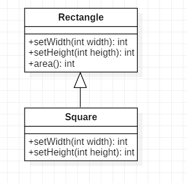
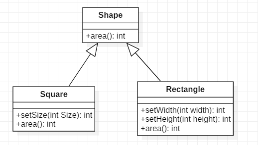

# 3.里式替换原则

## 定义

> Functions that use pointers or references to base classes must be able to use objects of derived classes without knowing it

所有引用 **基类** 的地方必须能透明地使用其子类的对象。

<br>

- 里氏代换原则可以通俗表述为：
  - **在软件中如果能够使用基类对象，那么一定能够使用其子类对象**。
  - 把基类都替换成它的子类，程序将不会产生任何错误和异常，反过来则不成立，如果一个软件实体使用 的是一个子类的话，那么它不一定能够使用基类。**子类可以扩展父类的功能，但不能改变父类原有的功能。**
- 里氏代换原则是实现开闭原则的重要方式之一，由于使用基类对象的地方都可以使用子类对象，因此在程序中尽量使用基类类型来对对象进行定义，而在运行时再确定其子类类型，用子类对象来替换父类对象。

<br>


## 作用

1. 里氏替换原则是实现开闭原则的重要方式之一。
2. 它克服了继承中重写父类造成的可复用性变差的缺点。
3. 它是动作正确性的保证。即类的扩展不会给已有的系统引入新的错误，降低了代码出错的可能性。

<br>


## 举例

**正方形不是长方形**。

```java
//长方形
public class Square extends Rectangle {   
    public void setWidth(int width) {  
        super.setWidth(width);  
        super.setHeight(width);  
    } 
 
 	public void setHeight(int height) {  
    	super.setWidth(height); 
     	super.setHeight(height);   
 	} 
} // 破坏了Rectangle的width-height独立性 
```

```java
public class TestLSP {   
    public static void main(String[] args) {  
        Rectangle rec = new Square();  
        clientOfRectangle(rec); // rec是子类Square的对象  
    } 
 
 	private static void clientOfRectangle(Rectangle rec) {  
    	rec.setWidth(4);  
   	 	rec.setHeight(5);  
   	 	System.out.println(rec.area());   
	} 
} 
```




在clientOfRectangle()中用Square对象替换Rectangle对象后出问题了！因此违反了LSP，有**Fragility脆弱性设计异味** 。

<br>


**重构：**


<br>

**当使用继承时，要遵循Liskov替换原则** 

- 类B继承类A时，除添加新的方法完成新增功能外， **尽量不要重写父类A的方法，也尽量不要重载父类A的方法** 
- 父类中已经实现好的方法，实际上是在设定一系列的规范和契约(contract)，虽然它不强制要求所有的子类必须遵从这些契约，**但是如果子类对这些非抽 象方法任意修改，就会对整个继承体系造成破坏。**
- 继承在给程序设计带来巨大便利的同时，也带来了弊端 。
  - 比如使用继承增加了对象间的耦合性，如果一个类被其他的类所继承，则当这个类需要修改时，必须考虑到所有的子类，并且父类修改后，所有涉及到子类的功能都有可能会产生故障 。

<br>

## 参考

《敏捷软件开发：原则、模式与实践》<br>

[里氏替换原则——面向对象设计原则](http://c.biancheng.net/view/1324.html)<br>


  