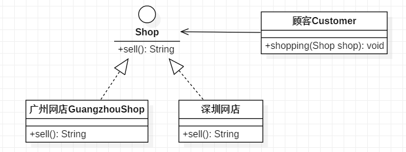

# 5.依赖倒置原则

## 定义

依赖倒置原则的原始定义为：

- 高层模块不应该依赖低层模块，两者都应该依赖其抽象；抽象不应该依赖细节，细节应该依赖抽象。
- **其核心思想是：要面向接口编程，不要面向实现编程。**

依赖倒置原则是实现开闭原则的重要途径之一，它降低了客户与实现模块之间的耦合。

如果开闭原则是面向对象设计的目标的话，那么依赖倒置原则就是面向对象设计的主要手段 。

<br>

## 作用

依赖倒置原则的主要作用如下。

- 依赖倒置原则可以 **降低类间的耦合性。**
- 依赖倒置原则可以 **提高系统的稳定性。**
- 依赖倒置原则可以 **减少并行开发引起的风险。**
- 依赖倒置原则可以 **提高代码的可读性和可维护性。**

<br>


## 举例

**顾客购物程序**：

本程序反映了 “顾客类”与“商店类”的关系。商店类中有 sell() 方法，顾客类通过该方法购物。

以下代码定义了顾客类通过广州网店 GuangzhouShop购物：

```java
class Customer
{
    public void shopping(GuangzhouShop shop)
    {
        //购物
        System.out.println（shop.sell());
    }
}
```

但是，这种设计存在缺点，如果该顾客想从另外一家商店（如深圳网店 ShenzhenShop）购物，就要将该顾客的代码修改如下：

```java
class Customer
{
    public void shopping(ShenzhenShop shop)
    {
        //购物
        System.out.println(shop.sell());
    }
}
```

顾客每更换一家商店，都要修改一次代码，这明显违背了开闭原则。

**存在以上缺点的原因是：顾客类设计时同具体的商店类绑定了，这违背了依赖倒置原则。**

解决方法是：定义“广州网店”和“深圳网店”的共同接口 Shop，顾客类面向该接口编程，其代码修改如下：

```java
class Customer
{
    public void shopping(Shop shop)
    {
        //购物
        System.out.println(shop.sell());
    }
}
```

这样，不管顾客类 Customer 访问什么商店，或者增加新的商店，都不需要修改原有代码了，其类图如图。



<br>


## 参考

《敏捷软件开发：原则、模式与实践》<br>

[依赖倒置原则——面向对象设计原则](http://c.biancheng.net/view/1326.html)<br>


  