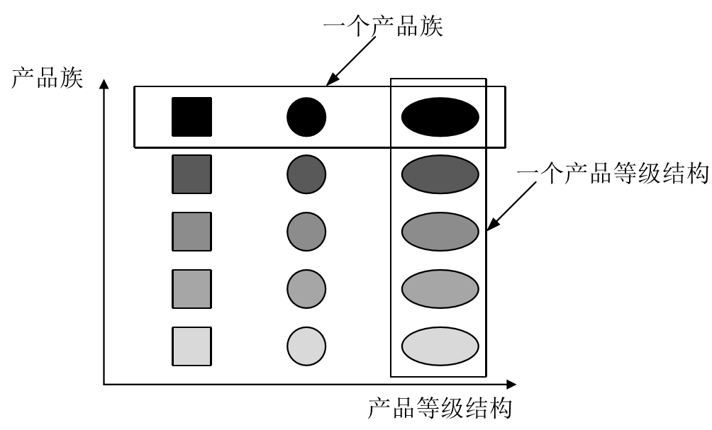

# 工厂模式


## 一、 简介

工厂模式主要是为创建对象提供过渡接口，以便将创建对象的具体过程隐蔽起来，达到提高灵活性的目的。

工厂方法主要分为：

1. **简单工厂模式（Simple Factory）**
2. **工厂方法模式（Factory Method）**
3. **抽象工厂模式（Abstract Factory）**

**三种方法从上到下，逐步抽象，更具一般性。**

也可将简单工厂模式归类为工厂方法模式，是工厂方法模式的一种。

<br>


## 二、 分类

在简单工厂方法**以前**，我们是怎么做的呢？举个例子：

```java
public class benzCar {
    public void dirve() {
        System.out.println("驾驶奔驰车");
    }
}

public class bmwCar {
     public void drive(){  
         System.out.println("驾驶宝马车");  
     } 
}
```

```java
public class Client {
    public static void main(String[] args) {
        benzCar benz=new benzCar();
        bmwCar bmw=new bmwCar();
        benz.dirve();
        bmw.drive();
    }
}
```

客户需要知道怎么去创建一款车,客户和车就紧密耦合在一起了.为了降低耦合,就出现了工厂类,把创建宝马的操作细节都放到了工厂里面去,客户直接使用工厂的创建工厂方法,传入想要的宝马车名就行了,而不必去知道创建的细节。

<br>

**依赖倒置原则：应该依赖抽象类，避免依赖具体类。**

类似 **`benzCar benz=new benzCar();`**  就是违反了依赖倒置原则。

但是如果依赖的类是稳定的，则依赖它也没有任何问题。

如：**new String("wenhuohuo");**  是非常安全的，因为String类不太可能发生变化

<br>

### 1,简单工厂模式

#### 动机

<br>

简单工厂模式又称为静态工厂方法模式，存在的目的就是：**定义一个用于创建对象的接口**。

**组成**：

1. 抽象产品角色：它一般是具体产品继承的父类或者实现的接口。
2. 具体产品类：工厂类所创建的对象就是此角色的实例。
3. 工厂类角色：本模式核心，含有一定的商业逻辑和判断逻辑。

<br>


#### 举例

```java
//抽象产品类
public interface Car {
    public void drive();
}
```

```java
//具体产品类
public class benzCar implements Car {
    @Override
    public void drive() {
        System.out.println("驾驶奔驰车......");
    }

}
```

```java
//具体产品类
public class bmwCar implements Car {
    @Override
    public void drive() {
        System.out.println("驾驶宝马车......");
    }
}
```

```java
//工厂方法类
public class driverFactory {
    //返回类型必须为抽象产品角色
    public static Car dirveCar(String params) throws          Exception{
        //判断逻辑，返回具体的产品角色给Client
        if(params.equals("benzCar")){
            return new benzCar();
        }else if(params.equals("bmwCar")){
            return new bmwCar();
        }else{
            throw new Exception(); 
        }   
    }
}
```

```java
// 客户
public class Client {
    public static void main(String[] args) throws Exception {
        //告诉司机(工厂) 开奔驰车
        Car car=driverFactory.dirveCar("benzCar");
        //下命令开车
        car.drive();
    }
}
```

<br>


#### 优缺点

**优点**：

工厂类定义成了接口,而每新增的车种类型,就增加该车种类型对应工厂类的实现,这样工厂的设计就可以扩展了,而不必去修改原来的代码。一定程度的解耦。

**缺点**：

- 工厂类过于庞大，包含了大量的 if…else…代码，导致维护和测试难度增大 

- 系统扩展不灵活，如果增加新类型的日志记录器， 必须修改静态工厂方法的业务逻辑，违反了**“开闭原则”**  
- 开闭原则倡导，**软件实体应当对扩展开放，对修改关闭。**

<br>


#### 应用

**JDK中的 java.text.DateFormat** 就是使用了简单工厂模式，用于格式化一个本地日期或时间。

```java
public final static DateFormat getDateInstance(); 
public final static DateFormat getDateInstance(int style); 
public final static DateFormat getDateInstance(int style,Locale locale); 
```

**简单工厂模式并不属于 GOF23 中的一种**。

<br>


### 2. 工厂方法模式

#### 动机

工厂方法模式是简单工厂模式的进一步抽象和 推广。

由于使用了面向对象的 **多态性**，**工厂方法模式保持了简单工厂模式的优点，而且克服了它的缺点** 

在工厂方法模式中，**核心的工厂类不再负责所有产 品的创建，而是将具体创建工作交给子类去做。**

这使得工厂方法模式可以允许系统在不修改工厂角色的情 况下引进新产品。 

<br>

**分析**：当系统扩展需要添加新的产品对象时，仅仅需要添加一个 **具体产品对象** 以及一个 **具体工厂对象**，原有工厂对象不需要进行任何修改，也不需要修改客户端，很好地 **符合了“开闭原则”**。

<br>


#### 举例：电视机工厂

为每种品牌的电视机提供一个子工厂，海尔工厂专门负责生产海尔电视机，海信工厂专门负责生产海信电视机;如果需要生产TCL电视机或创维电视机，只需要对应增加一个新的TCL工厂或创维工厂即可，原有的工厂无须做任何修改，使得整个系统具有更加的灵活性和可扩展性。

```java
package factorymethod;
public interface TV {
	public void play();
}
```

```java
package factorymethod;
public interface TVFactory {
	public TV produceTV();
}
```

```java
package factorymethod;
public class HaierTV implements TV {
	public void play() {
		System.out.println("海尔电视机播放中......");
	}
}
```

```java
package factorymethod;
public class HisenseTV implements TV {
	public void play() {
		System.out.println("海信电视机播放中......");
	}
}
```

```java
package factorymethod;
public class HaierTVFactory implements TVFactory {
	public TV produceTV() {
		System.out.println("海尔电视机工厂生产海尔电视机。");
		return new HaierTV();
	}
}
```

```java
package factorymethod;
public class HisenseTVFactory implements TVFactory {
	public TV produceTV() {
		System.out.println("海尔电视机工厂生产海尔电视机。");
		return new HisenseTV();
	}
}
```

```java
package factorymethod;
public class Client {
	public static void main(String args[]) {
		try {
			TV tv;
			TVFactory factory;
			factory = new HaierTVFactory();
			tv = factory.produceTV();
			tv.play();
		} catch (Exception e) {
			System.out.println(e.getMessage());
		}
	}
}
```

<br>

#### 优缺点

**缺点**：

添加新产品时，需要编写新的具体产品类以及对应的具体工厂类，类个数太多，系统复杂度增加，编译运行会有额外开销。

**优点**：

符合开闭原则，解决简单工厂的问题，原先代码不需要做改动。

<br>

#### 应用

java集合框架：

- **java.util.Collection接口中的iterator()方法**
  - 一个具体的Java集合对象会通过这个iterator()方法返回 一个具体的Iterator对象，这个iterator()就是工厂方法 
- **List接口中的iterator()方法、listIterator()方法** 
  - Iterator()、listIterator()是List的两个工厂方法 

<br>


### 3. 抽象工厂模式

#### 动机

在工厂方法模式中具体工厂负责生产具体的产 品，每一个具体工厂对应一种具体产品，工厂方法也具有唯一性，一般情况下，一个具体工 厂中只有一个工厂方法或者一组重载的工厂方法 。

**有时候我们需要一个工厂可以提供多个产品对象，而不是单一的产品对象。** 

<br>

为了更好的理解抽象工厂模式，引入两个概念：

1. **产品等级结构：即产品的继承结构。** 如：抽象类是电视机，子类是海尔电视机，TCL电视机。抽象类与具体品牌构成产品等级结构。
2. **产品族：在抽象工厂模式中，产品族是指由同一个 工厂生产的，位于不同产品等级结构中的一组产品**。 如：海尔电器工厂生产的海尔电视机、海尔电冰箱， 海尔电视机位于电视机产品等级结构中，海尔电冰箱位于电冰箱产品等级结构中。

<br>



<br>

#### 举例

一个电器工厂可以产生多种类型的电器，如海尔工 厂可以生产海尔电视机、海尔空调等，TCL工厂可以生产TCL电视机、TCL空调等，相同品牌的电器构成一个产品族，而相同类型的电器构成了一个产品等级结构。<br>

```java
package abstractfactory;

public interface EFactory {
	//生产电视
	public Television produceTelevision();
	//生产空调
	public AirConditioner produceAirConditioner();
}
```

```java
package abstractfactory;

public interface Television {
	public void play();
}
```

```java
package abstractfactory;

public interface AirConditioner {
	public void changeTemperature();
}
```

```java
package abstractfactory;

//海尔工厂
public class HaierFactory implements EFactory {
	//生产海尔牌电视
	public Television produceTelevision() {
		return new HaierTelevision();
	}
	//生产海尔牌空调
	public AirConditioner produceAirConditioner() {
		return new HairAirConditioner();
	}
}
```

```java
package abstractfactory;

public class HaierTelevision implements Television {
	public void play() {
		System.out.println("海尔电视机播放中......");
	}
}
```

```java
package abstractfactory;

public class HairAirConditioner implements AirConditioner {
	public void changeTemperature() {
		System.out.println("海尔空调温度改变中......");
	}
}
```

```java
package abstractfactory;

public class TCLFactory implements EFactory {
	public Television produceTelevision() {
		return new TCLTelevision();
	}

	public AirConditioner produceAirConditioner() {
		return new TCLAirConditioner();
	}
}
```

```java
package abstractfactory;

public class TCLTelevision implements Television {
	public void play() {
		System.out.println("TCL电视机播放中......");
	}
}
```

```java
package abstractfactory;

public class TCLAirConditioner implements AirConditioner {
	public void changeTemperature() {
		System.out.println("TCL空调温度改变中......");
	}
}
```

```java
package abstractfactory;

public class Client {
	public static void main(String args[]) {
		try {
			EFactory factory;

			Television tv;
			AirConditioner ac;

			factory = new TCLFactory();

			tv = factory.produceTelevision();
			tv.play();

			ac = factory.produceAirConditioner();
			ac.changeTemperature();
		} catch (Exception e) {
			System.out.println(e.getMessage());
		}
	}
}

```

<br>


#### 优缺点

**优点**：

- 抽象工厂模式 **隔离了具体类的生成**，使得客户并不知道什么被创建。由于这种隔离，使得更换一个具体工厂变得容易。所有的具体工厂都实现了抽象工厂中定义的公共接口。因此，只要改变具体工厂的实例，可以某种程度改变整个软件系统的行为。可以实现 **高内聚，低耦合的设计目的。**

- **增加新的具体工厂和产品族很方便，无须修改已有系 统，符合“开闭原则”** 

**缺点**：

- 在添加新的产品对象时，难以扩展抽象工厂来生产新种类的产品。这是因为在抽象工厂角色中规定了所有可能被创建的产品集合，要支持新种类的产品 就意味着要对该接口进行扩展，而这将涉及到对抽象工厂角色及其所有子类的修改，显然会带来较大的不便 
- 开闭原则的倾斜性**（增加新的工厂和产品族容易， 增加新的产品等级结构麻烦）** 

<br>


#### 应用

-  **Java SE AWT（抽象窗口工具包）**
  - 在Java语言的AWT（抽象窗口工具包）中就使用了抽象工 厂模式，它使用抽象工厂模式来实现在不同的操作系统中 应用程序呈现与所在操作系统一致的外观界面。 
- **Calendar类的getInstance()方法** 
  -  Calendar（相当于抽象工厂）根据Client传入的不同参数实 例化不同的类（即得到不同的产品） 

<br>


<br>

## 参考

《系统分析与设计》

[Java设计模式（三—四）----工厂模式](https://yq.aliyun.com/articles/11335)<br>

[初探Java设计模式1：创建型模式（工厂，单例等）.md](https://github.com/h2pl/Java-Tutorial/blob/master/docs/java/design-parttern/%E5%88%9D%E6%8E%A2Java%E8%AE%BE%E8%AE%A1%E6%A8%A1%E5%BC%8F1%EF%BC%9A%E5%88%9B%E5%BB%BA%E5%9E%8B%E6%A8%A1%E5%BC%8F%EF%BC%88%E5%B7%A5%E5%8E%82%EF%BC%8C%E5%8D%95%E4%BE%8B%E7%AD%89%EF%BC%89.md)<br>

