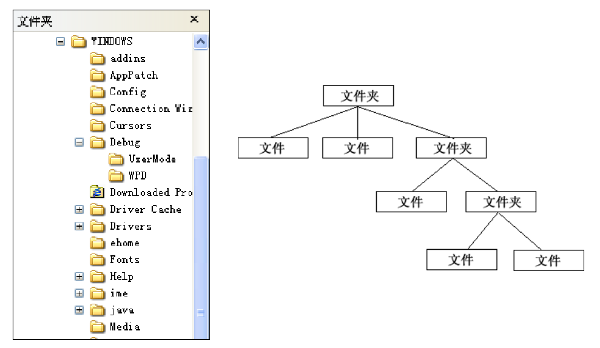
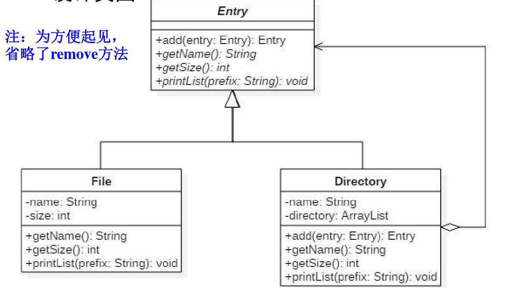

# 组合模式


组合模式属于对象的结构模式，有时又叫做 “**部分—整体**”模式。

组合模式将对象组织到 **树** 结构中，可以用来描述整体与部分的关系。

组合模式使客户对单个对象（即 叶子对象）和组合对象（即容器对象）的使用 具有一致性 
 <br>

### 举例

- 计算机文件系统中的目录（文件夹）和文件，目录里有文件或者子目录，子目录有其他文件或子目录。
- 虽然目录和文件是不同的东西，但是都可以放在目录里面。



<br>

**设计类图**：



<br>

**代码**：

```java
package composite;

/*条目类，对File和Directory一视同仁*/
public abstract class Entry {
    public abstract String getName();   //取得条目名
    public abstract int getSize();      //取得条目大小
    protected abstract void printList(String prefix); // 打印条目信息

    //新增条目：当前条目为文件时，不能增加条目，为目录时，才可以（重写add方法)
    public Entry add(Entry entry) throws FileTreatmentException{
        throw new FileTreatmentException(); //默认抛出自定义异常
    }
    public String toString(){
        return getName() + "(" + getSize() + ")";
    }
}
```

```java
package composite;

//文件类
public class File extends Entry{
    private String name;
    private int size;
    public File(String name, int size){
        this.name = name;
        this.size = size;
    }
    @Override
    public String getName() {
        return name;
    }
    @Override
    public int getSize() {
        return size;
    }
    protected void printList(String prefix) {
        System.out.println(prefix + "/" + this);
    }
}
```

```java
package composite;

import java.util.ArrayList;
import java.util.Iterator;

//目录类
public class Directory extends Entry{
    private String name; // 目录名称
    // ArrayList用于存放条目
    private ArrayList<Entry> directory = new ArrayList<Entry>();

    public Directory(String name) {
        this.name = name;
    }
    public String getName() {
        return name;
    }

    /** 递归计算目录的大小 */
    public int getSize() {
        int size = 0;
        Iterator<Entry> it = directory.iterator();
        while (it.hasNext()) {
            Entry entry = it.next();
            size += entry.getSize();
        }
        return size;
    }
    /** 重写父类的add()方法 */
    public Entry add(Entry entry) {
        directory.add(entry);
        return this;
    }
    /** 递归打印目录信息 */
    protected void printList(String prefix) {
        System.out.println(prefix + "/" + this);
        Iterator<Entry> it = directory.iterator();
        while (it.hasNext()) {
            Entry entry = it.next();
            entry.printList(prefix + "/" + name);
        }
    }
}

```

```java
package composite;

//自定义文件异常类
public class FileTreatmentException extends RuntimeException{
    public FileTreatmentException(){}
    public FileTreatmentException(String msg){
        super(msg);
    }
}
```

```java
package composite;

public class Test {
    public static void main(String[] args) {
        try {
            System.out.println("Making root entries...");
            Directory rootdir = new Directory("root");
            Directory usrdir = new Directory("usr");
            rootdir.add(usrdir);
            rootdir.printList("");

            System.out.println();

            System.out.println("Making user entries...");
            Directory zs = new Directory("ZhangShan");
            Directory ls = new Directory("LiSi");
            usrdir.add(zs);
            usrdir.add(ls);
            zs.add(new File("diary.html", 100));
            zs.add(new File("Composite.javan", 200));
            ls.add(new File("memo.tex", 300));
            rootdir.printList("");
        } catch (FileTreatmentException e) {
            e.printStackTrace();
        }
    }
}
```

**结果**：

```java
Making root entries...
/root(0)
/root/usr(0)

Making user entries...
/root(600)
/root/usr(600)
/root/usr/ZhangShan(300)
/root/usr/ZhangShan/diary.html(100)
/root/usr/ZhangShan/Composite.javan(200)
/root/usr/LiSi(300)
/root/usr/LiSi/memo.tex(300)
```

<br>

### 优缺点

**优点**：

- 可以清楚地定义**分层次**的复杂对象，表示对象的全部或部分层次，使得增加新构件也更容易 
- 客户调用简单，客户可以一致地使用组合结构或其中单个对象 
- 定义了包含叶子对象和容器对象的类层次结构，叶子对象可以被组合成更复杂的容器对象，而这个容器对象又可以被组合，这样不断递归下去，可以形成复杂的树形结构 

- 更容易在组合体内加入对象构件，客户不必因为加 入了新的对象构件而更改原有代码 

<br>

**缺点**：

- 使设计变得更加抽象，对象的业务规则如果很复杂， 则实现组合模式具有很大挑战性，而且不是所有的 方法都与叶子对象子类有关联 

- 增加新构件时可能会产生一些问题，很难对容器中的构件类型进行限制 


<br>

### 应用

**Java JDK里的组合模式**

-  **java.awt.Container** 
  - add(Component) 
- **java.util.Map**
  - putAll(Map) 
- **java.util.Set**
  - addAll(Collection) 

<br>


## 参考

《系统分析与设计》<br>

[Java描述设计模式(10)：组合模式](https://yq.aliyun.com/articles/718631?spm=a2c4e.11163080.searchblog.23.241d2ec1uPU84P)<br>

