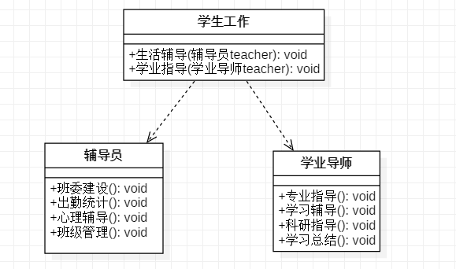

# 1. 单一职责原则

面向对象设计原则：

| 设计原则名称                                             | 设计原则简介                                                 |
| -------------------------------------------------------- | ------------------------------------------------------------ |
| **单一职责原则**（Single Responsibility Principle，SRP） | 类的职责要单一，不能将太多的职责放在一个类中                 |
| **开闭原则**（Open-Closed Principle，LSP）               | 软件实体对扩展是开放的，但对修改是关闭的                     |
| **里式替换原则**（Liskov Substitution Principle，LSP）   | 在软件系统中，一个可以接受基类对象的地方必然可以接受一个子类对象 |
| **接口隔离原则**（Interface Segregation Principle，ISP） | 使用多个专门的接口来取代一个统一的接口                       |
| **依赖倒置原则**（Dependency Reuse Principle，DIP）      | 要针对抽象层编程，而不要针对具体类编程                       |
| **合成复用原则**（Composite Reuse Principle，CRP）       | 尽量多使用组合和聚合关联关系，尽量少使用甚至不使用继承关系   |
| **Demeter法则**（Law of Demeter，LoD）                   | 一个软件实体对其他实体的引用越少越好                         |

 

## 定义

单一职责原则规定：一个类应该 **有且仅有一个引起它变化的原因**，否则类应该**被拆分**

该原则提出对象不应该承担太多职责，如果一个对象承担了太多的职责，至少存在以下两个缺点：

1. **一个职责的变化可能会削弱或者抑制这个类实现其他职责的能力；**
2. **当客户端需要该对象的某一个职责时，不得不将其他不需要的职责全都包含进来，从而造成冗余代码或代码的浪费。**

 

## 优点

单一职责原则的核心就是控制 **类的粒度大小**、**将对象解耦**、**提高其内聚性**。如果遵循单一职责原则将有以下优点。

- 降低类的复杂度。一个类只负责一项职责，其逻辑肯定要比负责多项职责简单得多。
- 提高类的可读性。复杂性降低，自然其可读性会提高。
- 提高系统的可维护性。可读性提高，那自然更容易维护了。
- 变更引起的风险降低。变更是必然的，如果单一职责原则遵守得好，当修改一个功能时，可以显著降低对其他功能的影响。

 

## 举例

大学生学生工作主要包括 **学生生活辅导** 和 **学生就业辅导** 两方面工作。显然将两方面的工作交给一个辅导员是不合理的，应该有生活辅导的辅导员 和 学生就业的指导员。

 

## 参考

《敏捷软件开发：原则、模式与实践》 

[单一职责原则——面向对象设计原则](http://c.biancheng.net/view/1327.html) 

