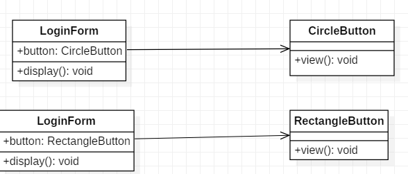
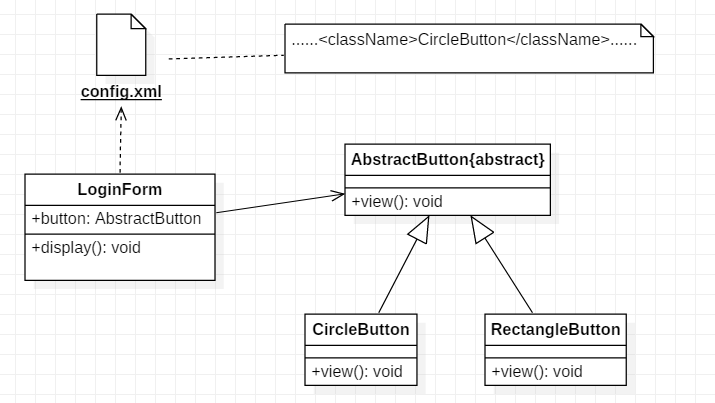

# 2.开闭原则

## 定义

一个 **软件实体**应该 **对扩展开放， 对修改关闭** 。也就是说在设计一个模块的时候，应当使这个模块可以 在不被修改的前提下被扩展 。

**这里的软件实体包括**：

- 项目中划分出的模块
- 类与接口
- 方法

 

## 作用

开闭原则是面向对象程序设计的中级目标，它使软件实体拥有一定的适应性和灵活性的同时具备稳定性和延续性。

作用如下：

1. **对软件测试的影响**

软件遵守开闭原则的话，软件测试时只需要对扩展的代码进行测试就可以了，因为原有的代码仍然能正常运行

2. **可以提高代码的可复用性**

粒度越小，被复用的可能性越大；在面向对象程序设计中，根据原子和抽象编程可以提高代码的可复用性。

3. **可以提高软件的可维护性**

遵守开闭原则的软件，其稳定性高和延续性强，从而易于扩展和维护。

 

## 举例

某图形界面系统提供了各种不同形状的按钮，客户代码可针对这些按钮进行编程，用户可能会改变需求要求使用不同的按钮。

**初始设计方案：**

 
**重构**：

 

## 参考

《敏捷软件开发：原则、模式与实践》 

[开闭原则——面向对象设计原则](http://c.biancheng.net/view/1322.html) 

  

