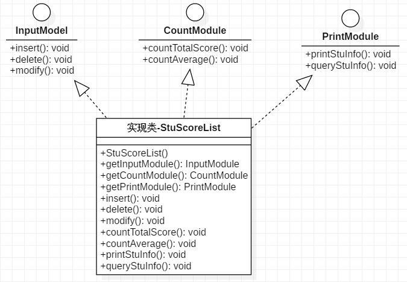

# 4.接口隔离原则

## 定义

**接口隔离原则是指：**

使用多个专门的接口，而不使用单一的总接口。每一个接口应该承担一种相对独立的角色，不多不少，不干不该干的事，该干的事都要干。

要求程序员尽量将臃肿庞大的接口拆分成更小的和更具体的接口，让接口中只包含客户感兴趣的方法。

 

- 使用接口隔离原则拆分接口时，首先**必须满足单一职责原则**，将一组相关的操作定义在一个接口中，**且在满足高内聚的前提下，接口中的方法越少越好。**
- 可以在进行系统设计时采用定制服务的方式，即为不同的客户程序提供宽窄不同的接口，只提供用户需要的行为，而隐藏用户不需要的行为。

 

**接口隔离原则和单一职责原则的区别**：

接口隔离原则和单一职责都是为了提高类的内聚性、降低它们之间的耦合性，体现了封装的思想，但两者是不同的：

- **单一职责原则注重的是职责，而接口隔离原则注重的是对接口依赖的隔离。**
- **单一职责原则主要是约束类，它针对的是程序中的实现和细节；接口隔离原则主要约束接口，主要针对抽象和程序整体框架的构建。**

 

## 接口隔离原则的优点

接口隔离原则是为了约束接口、降低类对接口的依赖性，遵循接口隔离原则有以下 5 个优点。

1. 将臃肿庞大的接口分解为多个粒度小的接口，可以预防外来变更的扩散，提高系统的灵活性和可维护性。
2. 接口隔离提高了系统的内聚性，减少了对外交互，降低了系统的耦合性。
3. 如果接口的粒度大小定义合理，能够保证系统的稳定性；但是，如果定义过小，则会造成接口数量过多，使设计复杂化；如果定义太大，灵活性降低，无法提供定制服务，给整体项目带来无法预料的风险。
4. 使用多个专门的接口还能够体现对象的层次，因为可以通过接口的继承，实现对总接口的定义。
5. 能减少项目工程中的代码冗余。过大的大接口里面通常放置许多不用的方法，当实现这个接口的时候，被迫设计冗余的代码。

 

## 举例

学生成绩管理程序一般包含插入成绩、删除成绩、修改成绩、计算总分、计算均分、打印成绩信息、査询成绩信息等功能，如果将这些功能全部放到一个接口中显然不太合理，正确的做法是将它们分别放在输入模块、统计模块和打印模块等 3 个模块中。

 

 

## 参考

《敏捷软件开发：原则、模式与实践》 

[接口隔离原则——面向对象设计原则](http://c.biancheng.net/view/1330.html) 

  