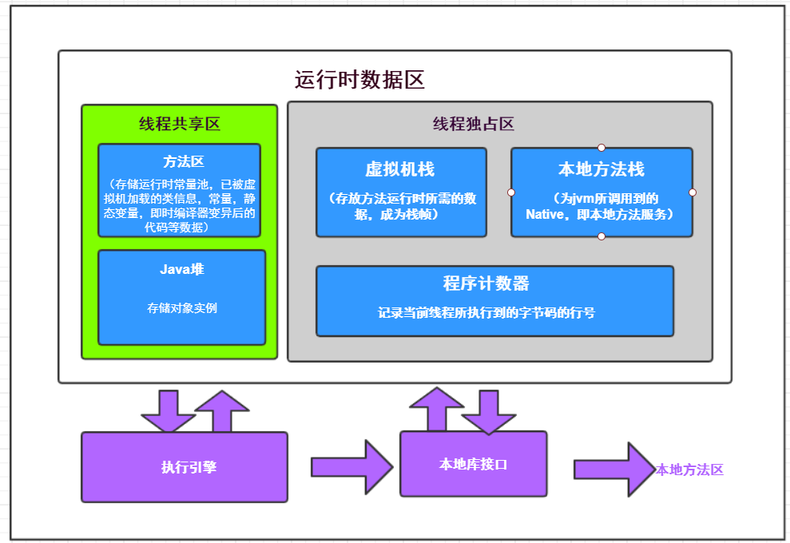
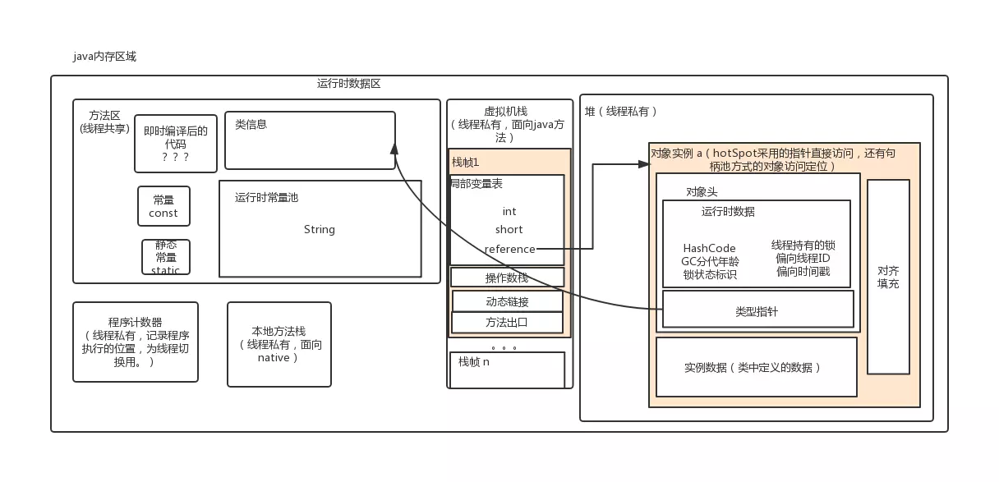
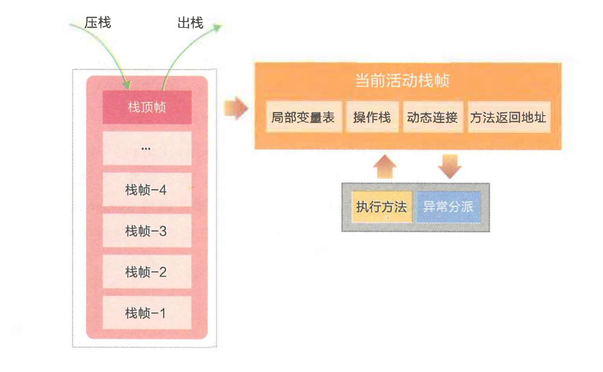

# Java运行时数据区域


**Java虚拟机在执行Java程序的过程中会把它所管理的内存划分成若干个不同的数据区域。**

这个区域各有各自的用途，以及创建和销毁的时间，有点区域随着虚拟机进程的启动而存在，有些区域则依赖用户线程的启动和结束而建立和销毁。

<br>



<br>



<br>


## 一、 程序计数器（线程独占）

程序计数器（Program Counter Register）是一块较小的内存空间，它可以看做是**当前线程所执行的字节码的行号指示器。**

在虚拟机的概念模型中，字节码解释器工作时就是通过改变这个计数器的值来选取下一条需要执行的的字节码指令。分支、循环、跳转、异常处理、线程恢复等功能都依赖这个计数器。

<br>

每条线程都有一个**独立的程序计数器**，计数器之间互不影响，独立存储。所以这类内存区域为 **“线程私有”** 区域。

<br>

如果正在执行的是**Native**方法，这个计数器值则为**空（Undefined）。**

如果正在执行的是Native方法，这个计数器值则为空（Undefined）。

**这个内存区域是唯一一个在虚拟机中没有规定任何 OutOfMemoryError 情况的区域。**

<br>


## 二、 Java虚拟机栈（线程独占）

与程序计数器一样，Java 虚拟机栈（Java Virtual Machine Stacks）也是 **线程私有** 的，它的 **生命周期与线程相同。**

虚拟机栈描述的是 Java  **方法** 执行的内存模型：

每个方法在执行的同时都会创建一个 **栈帧** （Stack Frame，是方法运行时的基础数据结构）,

用于存储 **局部变量表、操作数栈、动态链接、方法出口** 等信息。

每一个方法**从调用直至执行完成**的过程，就对应着**一个栈帧在虚拟机栈中入栈到出栈**的过程。

<br>



<br>

Java虚拟机规范中，对这个区域规定了两种异常情况：

1. 如果线程请求的深度大于虚拟机所允许的深度，抛出 StackOverflowError 异常；
2. 如果虚拟机可以动态扩展（大部分都可以），但扩展时无法申请足够内存，抛出 OutOfMemoryError 异常。

<br>


### 2. 1 局部变量表

局部变量表是存放 **方法参数和局部变量** 的区域。 (基本类型、对象引用、returnAddress类型（指向一条字节码指令地址）)

局部变量没有准备阶段， 必须显式初始化。如果是非静态方法，**则在 index[0] 位置上存储的是方法所属对象的实**

**例引用**，一个引用变量占 4 个字节，随后存储的是参数和局部变量。字节码指令中的 STORE 指令就是将操作

栈中计算完成的局部变呈写回局部变量表的存储空间内。

<br>


### 2.2 操作栈

操作栈是个**初始状态为空的桶式结构栈**。在方法执行过程中， 会有各种指令往栈中写入和提取信息。**JVM 的执行**

**引擎是基于栈的执行引擎， 其中的栈指的就是操作栈。**字节码指令集的定义都是基于栈类型的，栈的深度在方法

元信息的 stack 属性中。

<br>

**i++ 和 ++i 的区别：**

1. i++：从局部变量表取出 i 并压入操作栈，然后对局部变量表中的 i 自增 1，将操作栈栈顶值取出使用，最后，使用栈顶值更新局部变量表，如此线程从操作栈读到的是自增之前的值。
2. ++i：先对局部变量表的 i 自增 1，然后取出并压入操作栈，再将操作栈栈顶值取出使用，最后，使用栈顶值更新局部变量表，线程从操作栈读到的是自增之后的值。


之所以说 i++ 不是原子操作，即使使用 volatile 修饰也不是线程安全，就是因为，可能 i 被从局部变量表（内存）取出，压入操作栈（寄存器），操作栈中自增，使用栈顶值更新局部变量表（寄存器更新写入内存），其中分为 3 步，volatile 保证可见性，保证每次从局部变量表读取的都是最新的值，但可能这 3 步可能被另一个线程的 3 步打断，产生数据互相覆盖问题，从而导致 i 的值比预期的小。

<br>

### 2.3 动态链接

每个栈帧中包含一个在常量池中对当前方法的引用， 目的是支持方法调用过程的动态连接。

<br>

### 2.4 方法返回地址(出口)

方法执行时有两种退出情况：

1. 正常退出，即正常执行到任何方法的返回字节码指令，如 RETURN、IRETURN、ARETURN 等；
2. 异常退出。

无论何种退出情况，都将返回至方法当前被调用的位置。方法退出的过程相当于弹出当前栈帧，退出可能有三种方式：

1. 返回值压入上层调用栈帧。
2. 异常信息抛给能够处理的栈帧。
3. PC计数器指向方法调用后的下一条指令。

<br>


## 三、 本地方法栈（线程独占）

本地方法栈（Native Method Stack）与虚拟机栈所发挥的作用是非常相似的，它们之间的区别不过是虚拟机栈为虚拟机执行 Java 方法（也就是字节码）服务，而本地方法栈则为虚拟机使用到的 Native 方法服务。

本地方法栈区域也会抛出 StackOverflowError 和 OutOfMemoryError 异常。

<br>

线程开始调用本地方法时，会进入 个不再受 JVM 约束的世界。本地方法可以通过 JNI(Java Native Interface)来访问虚拟机运行时的数据区，甚至可以调用寄存器，具有和 JVM 相同的能力和权限。 当大量本地方法出现时，势必会削弱 JVM 对系统的控制力，因为它的出错信息都比较黑盒。对内存不足的情况，本地方法栈还是会抛出 nativeheapOutOfMemory。

JNI 类本地方法最著名的应该是 **`System.currentTimeMillis()`** ，JNI使 Java 深度使用操作系统的特性功能，复用非 Java 代码。 但是在项目过程中， 如果大量使用其他语言来实现 JNI , 就会丧失跨平台特性。

<br>


## 四、 Java堆（线程共享）


对于大多数应用来说，Java 堆（Java Heap）是 Java 虚拟机所管理的内存中最大的一块。Java 堆是被所有线程共享的一块内存区域，在虚拟机启动时创建。此内存区域的唯一目的就是存放对象实例，几乎所有的对象实例都在这里分配内存。

堆是垃圾收集器管理的主要区域，因此很多时候也被称做“GC堆”（Garbage Collected Heap）。从内存回收的角度来看，由于现在收集器基本都采用分代收集算法，所以 Java 堆中还可以细分为：新生代和老年代；再细致一点的有 Eden 空间、From Survivor 空间、To Survivor 空间等。从内存分配的角度来看，线程共享的 Java 堆中可能划分出多个线程私有的分配缓冲区（Thread Local Allocation Buffer,TLAB）。

Java 堆可以处于物理上不连续的内存空间中，只要逻辑上是连续的即可，当前主流的虚拟机都是按照可扩展来实现的（通过 -Xmx 和 -Xms 控制）。如果在堆中没有内存完成实例分配，并且堆也无法再扩展时，将会抛出 OutOfMemoryError 异常。

<br>


## 五、 方法区（线程共享）

方法区（Method Area）与 Java 堆一样，是各个线程共享的内存区域，它用于存储已被虚拟机加载的 **类信息、常量、静态变量、即时编译器编译后的代码等数据**。

方法区在JDK1.7版本及以前被称为永久代，从JDK1.8永久代被移除。

<br>


### 5.1 运行时常量池

**运行时常量池（Runtime Constant Pool）是方法区的一部分**。

Class 文件中除了有类的版本、字段、方法、接口等描述信息外，还有一项信息是常量池（Constant Pool Table），用于存放编译期生成的各种字面量和符号引用，这部分内容将在类加载后进入方法区的运行时常量池中存放。

<br>

一般来说，除了保存 Class 文件中描述的符号引用外，还会把翻译出来的直接引用也存储在运行时常量池中。

运行时常量池相对于 Class 文件常量池的另外一个重要特征是具备**动态性**，Java 语言并不要求常量一定只有编译期才能产生，也就是并非预置入 Class 文件中常量池的内容才能进入方法区运行时常量池，**运行期间也可能将新的常量放入池中**，这种特性被开发人员利用得比较多的便是 **String 类的 intern() 方法。**

```java
public static void main(String[] args){
    String s1 = "abc";
    String s2 = "abc";
    System.out.println(s1==s2);
    String s3 = new String("abc");
    System.out.println(s1==s3);
    System.out.println(s1==s3.intern());	//将s3放入常量池。
}

结果：
True
False
True
```

<br>


## 六、 直接内存

**直接内存（Direct Memory）并不是虚拟机运行时数据区的一部分，也不是 Java 虚拟机规范中定义的内存区域。**

<br>

在 JDK 1.4 中新加入了 NIO，引入了一种基于通道（Channel）与缓冲区（Buffer）的 I/O 方式，它可以使用 Native 函数库直接分配堆外内存，然后**通过一个存储在 Java 堆中的 DirectByteBuffer 对象作为这块内存的引用进行操作**。这样能在一些场景中显著提高性能，因为避免了在 Java 堆和 Native 堆中来回复制数据。

<br>

显然，本机直接内存的分配不会受到 Java 堆大小的限制，但是，既然是内存，肯定还是会受到本机总内存（包括 RAM 以及 SWAP 区或者分页文件）大小以及处理器寻址空间的限制。服务器管理员在配置虚拟机参数时，会根据实际内存设置 -Xmx 等参数信息，但经常忽略直接内存，使得各个内存区域总和大于物理内存限制（包括物理的和操作系统级的限制），从而导致动态扩展时出现 OutOfMemoryError 异常。

<br>


## 七、 运行时数据区 和 java内存模型

**Java内存区域（运行时数据区域） 和 内存模型 是不一样的东西，**

**内存区域是指Jvm运行时将数据分区域存储，强调对内存空间的划分。**

**而内存模型（JMM）是定义了线程和主内存之间的抽象关系，即JMM定义了JVM在计算机内存（RAM）中的工作方式。**

<br>

具体可以参考这篇文章：[《Java内存模型以及happens-before.md》](https://github.com/wenhuohuo/Java-concurrency/blob/master/03.java%E5%86%85%E5%AD%98%E6%A8%A1%E5%9E%8B%E4%BB%A5%E5%8F%8Ahappens-before%E8%A7%84%E5%88%99/Java%E5%86%85%E5%AD%98%E6%A8%A1%E5%9E%8B%E4%BB%A5%E5%8F%8Ahappens-before.md)

<br>


# 参考

《深入理解Java虚拟机》第二版<br>

[Java内存区域（运行时数据区域）和内存模型（JMM）](https://www.cnblogs.com/czwbig/p/11127124.html)<br>

