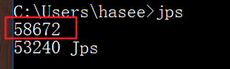
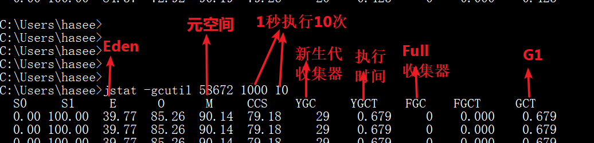
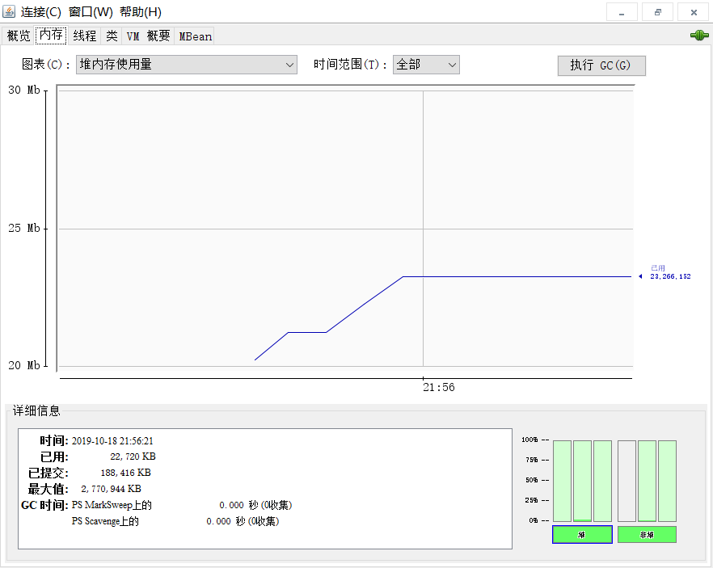

# 虚拟机调优工具

**JDK 的命令行工具有：**

- jps：虚拟机进程状况工具
- jstat：虚拟机统计信息监视工具
- jinfo：Java配置信息工具
- jmap：Java内存映像工具
- jhat：虚拟机堆转储快照工具
- jstack：java堆栈跟踪工具
- hsdis：jit生成代码反汇编

**JDK的可视化工具有：**

- Jconsole：Java监视与管理控制台
- visualvm：多合一故障处理工具

<br>

|        | 主要作用                                                     |
| ------ | :----------------------------------------------------------- |
| jps    | 显示指定系统内所有的HotSpot 虚拟机进程                       |
| jstat  | 用于收集HotSpot虚拟机各方面的运行数据                        |
| jinfo  | 显示虚拟机配置信息                                           |
| jmap   | 生成虚拟机的内存转储快照（heapdump）文件                     |
| jhat   | 用于分析heapdump文件，会建立一个HTTP/HTML服务器，让用户可以在浏览器上查看分析结果 |
| jstack | 显示虚拟机的线程快照                                         |

<br>

## 一、 jps

 

在cmd中输入“jps”，查看自己进程id

 

53240 Jps 是jps自己的进程id

58672是eclipse的进程id**（lvmid：local virtual machine id，本地虚拟机唯一id）**

<br>

**jps工具主要选项options：**

| 选项 | 作用                                               |
| ---- | -------------------------------------------------- |
| -q   | 只输出LVMID,省略主类的名称                         |
| -m   | 输出虚拟机进程启动时传递给主类main()函数的参数     |
| -l   | 输出主类的全名，如果进程执行的是Jar包，输出jar路径 |
| -v   | 输出虚拟机进程启动时JVM参数                        |


具体看：[《虚拟机工具-jps》](https://blog.csdn.net/yuchao2015/article/details/80318800)

<br>

## 二、 jstat

jstat官网地址： https://docs.oracle.com/javase/8/docs/technotes/tools/unix/jstat.html>

<br>

jstat工具主要监视以下内容：

- 类装载 
- 内存
- 垃圾收集
-  jit编译的信息



<br>

更多参考[《jstat命令详解》](https://blog.csdn.net/zhaozheng7758/article/details/8623549)

<br>

## 三、 jinfo  

- 命令：jinfo pid
  描述：输出当前 jvm 进程的全部参数和系统属性

- 命令：jinfo -flag name pid
  描述：输出对应名称的参数。

  使用该命令，可以查看指定的 jvm 参数的值。如：查看当前 jvm 进程是否开启打印 GC 日志

- 命令：jinfo -flag [+|-]name pid
  描述：开启或者关闭对应名称的参数

  使用 jinfo 可以在不重启虚拟机的情况下，可以动态的修改 jvm 的参数。尤其在线上的环境特别有用。

- 命令：jinfo -flag name=value pid
  描述：修改指定参数的值。

  同示例三，但示例三主要是针对 boolean 值的参数设置的。
  如果是设置 value值，则需要使用 name=value 的形式。

- 命令：jinfo -flags pid
  描述：输出全部的参数

- 命令：jinfo -sysprops pid
  描述：输出当前 jvm 进行的全部的系统属性	

<br>

## 四 、jmap

1. jmap -histo[:live] 

通过histo选项，打印当前java堆中各个对象的数量、大小。
如果添加了live，只会打印活跃的对象。 

2. jmap -dump:[live,]format=b,file=<filename> <pid>

通过-dump选项，把java堆中的对象dump到本地文件，然后使用MAT进行分析。
如果添加了live，只会dump活跃的对象。

3. jmap -heap 

通过-heap选项，打印java堆的配置情况和使用情况，还有使用的GC算法。

3. jmap -finalizerinfo 

通过-finalizerinfo选项，打印那些正在等待执行finalize方法的对象。

4. jmap -permstat 

通过-permstat选项，打印java堆永久代的信息，包括class loader相关的信息,和interned Strings的信息。

5. jmap-dump:format=b,file=C:\hasee\Desktop\a.bin

将文件导入到a.bin中。

<br>

## 五、 jhat

jhat命令与jmap搭配使用，来分析jmap生成的转储快照。jhat内置了一个微型的HTTP/HTML服务器，生成dump文件的分析结果后，可以在浏览器查看。不过一般不这么做，可以用其他更专业的分析工具，如 Eclipse Memory Analyzer。

<br>

## 六、 jstack

用于生成虚拟机当前的线程快照（一般称为 threadddump或javacore文件）。

线程快照就是当前虚拟机内每一条线程正在执行的方法堆栈的集合。

生成快照的主要目的是定位线程出现长时间停顿的原因，如线程死锁、死循环、请求外部资源导致的长时间等待等都是导致线程长时间停顿的原因。停顿后，用jstack查看各个线程的调用堆栈，就知道响应的线程在后台做什么，或者等什么资源。

<br>

命令格式：

jstack [option] vmid

| 选项 | 作用                                        |
| ---- | ------------------------------------------- |
| - F  | 正常输出的请求不被响应时，强制输出线程堆栈  |
| - l  | 除堆栈外，显示关于锁的附加信息              |
| - m  | 如果调用到本地方法的话，可以显示C/C++的堆栈 |

<br>

## 七、 jconsole

```java
package jvm;

/**
 * @program: Multi_002
 * @description:
 * @author: wenyan
 * @create: 2019-10-18 21:53
 **/


public class JconsoleTest implements Runnable{
    private Object obj1;
    private Object obj2;
    public JconsoleTest(Object obj1, Object obj2) {
        super();
        this.obj1 = obj1;
        this.obj2 = obj2;
    }
    @Override
    public void run() {
        synchronized (obj1) {
            try {
                Thread.sleep(100);
            } catch (InterruptedException e) {
                e.printStackTrace();
            }
            synchronized (obj2) {
                System.out.println("hello");
            }
        }
    }


    public static void main(String[] args) {
        Object obj1 = new Object();
        Object obj2 = new Object();
        new Thread(new JconsoleTest(obj1, obj2)).start();
        new Thread(new JconsoleTest(obj2, obj1)).start();
    }

}

```

写个死锁看一下情况：



<br>


