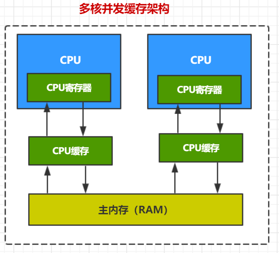
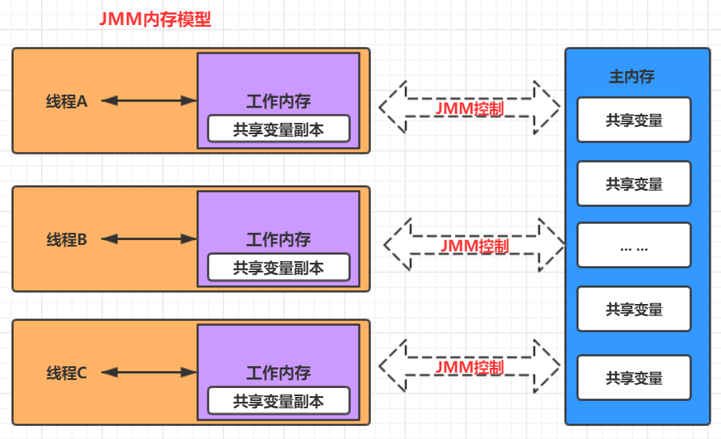
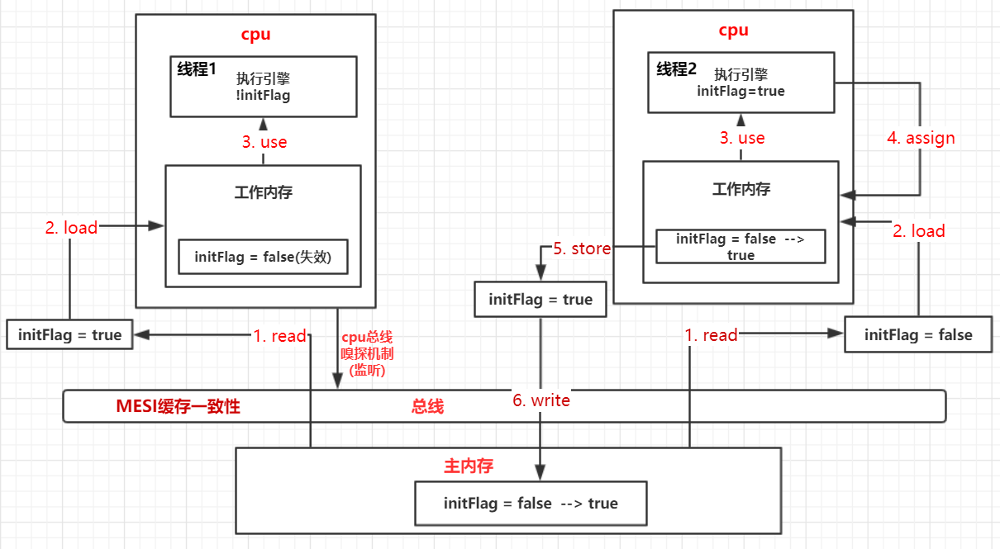

# JMM内存模型和 volatile缓存一致性

## 一、 JMM内存模型


Java线程内存模型与CPU缓存模型类型，是基于CPU缓存模型来建立的，Java线程内存模型是标准化的，屏蔽了底层不同计算机的区别。

**CPU缓存模型**：



<br>

**JMM内存模型**：



<br>

**当多个线程共享一个变量时，会从主内存拷贝一份副本到自己线程的工作内存中。**

<br>

**假如线程A和线程B进行通信**：

1. 线程A从主内存中将共享变量读入线程A的工作内存后并进行操作，之后将数据重新写回到主内存中；
2. 线程B从主存中读取最新的共享变量

从横向去看看，线程A和线程B就好像通过共享变量在进行隐式通信。这其中有很有意思的问题，如果线程A更新后数据并没有及时写回到主存，而此时线程B读到的是过期的数据，这就出现了“脏读”现象。可以通过同步机制（控制不同线程间操作发生的相对顺序）来解决或者通过volatile关键字使得每次volatile变量都能够强制刷新到主存，从而对每个线程都是可见的。

**事实上，不同线程无法直接访问对方工作内存中的变量，线程间变量值的传递需要通过主内存。**

<br>


## 二、 volatile关键字

synchronized是阻塞式同步，在线程竞争激烈的情况下会升级为重量级锁。

而volatile就可以说是java虚拟机提供的最轻量级的同步机制.

<br>

volatile语义有如下两个作用：

- **可见性**：保证被volatile修饰的共享变量对所有线程总数可见的，也就是当一个线程修改了被volatile修饰的共享变量的值，新值总是可以被其他线程立即得知。
- **有序性**：禁止指令重排序优化。

<br>

**volatile 缓存可见性实现原理**

- **JMM内存交互层面**：volatile修饰的变量的read、load、use操作和assign、store、write必须是连续的，即修改后必须立即同步回主内存，使用时必须从主内存刷新，由此保证volatile的 **可见性**。
- **底层实现**：通过 **汇编lock前缀指令** ，它会锁定 **变量缓存区域** 并写回主内存，这个操作称为“**缓存锁定**”，缓存一致性机制会阻止同时修改两个以上处理器缓存的内存区域数据。一个处理器的缓存回写到内存会导致其他处理器的缓存 **失效**。

<br>

**汇编代码查看volatile底层实现**：

```
-XX:+UnlockDianosticVMOptions -XX:+PrintAssembly -Xcomp
```


<br>

**通过代码来分析加了volatile关键字底层发生了什么**：

```java
public class VolatileTest {
    private static boolean initFlag = false;

    public static void main(String[] args) throws InterruptedException {
        new Thread(new Runnable() {
            @Override
            public void run() {
                System.out.println("waiting data...");
                while (!initFlag){

                }
                System.out.println("=============success");
            }
        }).start();
        Thread.sleep(2000);

        new Thread(new Runnable() {
            @Override
            public void run() {
                prepareData();
            }
        }).start();
    }
    public static void prepareData(){
        System.out.println("preparing data...");
        initFlag = true;
        System.out.println("prepare data end...");
    }
}

```

<br>

**输出结果：**

```java
waiting data...
preparing data...
prepare data end...
```

<br>

通过运行程序和分析结果，可以看出，一直卡在while循环处，也就是 **initFlag** 在第二个线程 prepareData() 中被置为 **true**，**并不能改变第一个线程中initFlag的值**。所以，才一直卡在while处，也没有输出 “ success”。

<br>

**修改代码**：

用volatile修饰initFlag。

```java
private static volatile boolean initFlag = false;
```

<br>

**输出结果**：

```java
waiting data...
preparing data...
prepare data end...
=============success
```

<br>

可以发现，第一个线程的initFlag能被置为true了，才能输出“success”。这是为什么呢？

<br>

**分析**：

### 1. 先来看 JMM 中数据的8个原子操作

JMM数据原子操作：

- **lock（锁定）：** **作用于主内存**， 将主内存变量 **加锁**，标识为线程独占状态

- **read（读取）：** **作用于主内存**，从主内存读取变量值传送到线程工作内存中
- **load（载入）：** 作用于工作内存， 将read到的数据放入工作内存中的 **变量副本** 中
- **use（使用）：** 作用于工作内存，将工作内存中的值传递给 **执行引擎**（计算），每当虚拟机遇到一个需要使用这个变量的指令时，将会执行这个动作
- **assign（赋值）：** 作用于工作内存，将计算好的值重新赋值到工作内存中，每当虚拟机遇到一个需要使用这个变量的指令时，将会执行这个动作
- **store（存储）：** 作用于工作内存 ，将工作内存数据传送给主内存中，以备随后的write操作使用
- **write（写入）：** **作用于主内存**， 将store传递值赋值给主内存中的变量
- **unlock（解锁）：** **作用于主内存** ，将主内存变量解锁，解锁后其他线程可以锁定该变量，被其他线程锁定。

<br>

### 2. MESI缓存一致性协议

多个CPU从主内存读取同一个数据到各自的高速缓存，当其中某个cpu修改了缓存里的数据，该数据会 **马上同步回主内存（即使方法还没执行完）** ，其他cpu通过 **总线嗅探机制** 可以感知到数据的变化从而 **将自己缓存里的数据失效**。

<br>

### 3. 结合8个原子操作和缓存一致性分析代码的volatile

**画图分析**：**（volatile会开启缓存一致性协议）**



<br>

**分析**：

1. 首先，主内存中，**initFlag=false。**
2. 线程1经过 **read、load**，工作内存处，initFlag = false，**use** 之后， 执行引擎处 !initFlag = true，此时，卡在while处。
3. 线程2同理，经过 **read、load** 之后，此时工作内存处，initFlag=false，经过 **use** (initFlag=true)、**assign**后，initFlag=true。
4. 因为线程2处的cpu修改了 initFlag 的值，会 **马上回写** 到主内存中（经过 **store**、**write**两步）。
5. 线程1处的cpu 通过 **总线嗅探机制** 嗅探到变化，会将工作内存中的数据 **失效**（initFlag=false失效）
6. 线程1会 **重新** 去主内存 read 最新的数据（此时，主内存中的数据 initFlag=true）。
7. 那么，线程1在读取最新的数据时，执行引擎处，!initFlag = false，结束循环，输出 “success”。

<br>

而在早期是通过 **总线加锁** 的方式去解决的。

cpu从主内存读取数据到高速缓存，会在总线对这个数据加锁，这样其他cpu没法去读或写这个数据，知道这个cpu使用完数据释放锁之后其它cpu才能读取该数据。

<br>

### 4. 8个原子操作有的约束

1. 不允许read和load、store和write操作之一单独出现（即不允许一个变量从主存读取了但是工作内存不接受，或者从工作内存发起会写了但是主存不接受的情况），以上两个操作必须按顺序执行，但没有保证必须连续执行，也就是说，read与load之间、store与write之间是可插入其他指令的。
2. 不允许一个线程丢弃它的最近的assign操作，即变量在工作内存中改变了之后必须把该变化同步回主内存。
3. 不允许一个线程无原因地（没有发生过任何assign操作）把数据从线程的工作内存同步回主内存中。
4. 一个新的变量只能从主内存中“诞生”，不允许在工作内存中直接使用一个未被初始化（load或assign）的变量，换句话说就是对一个变量实施use和store操作之前，必须先执行过了assign和load操作。
5. 一个变量在同一个时刻只允许一条线程对其执行lock操作，但lock操作可以被同一个条线程重复执行多次，多次执行lock后，只有执行相同次数的unlock操作，变量才会被解锁。
6. 如果对一个变量执行lock操作，将会清空工作内存中此变量的值，在执行引擎使用这个变量前，需要重新执行load或assign操作初始化变量的值。
7. 如果一个变量实现没有被lock操作锁定，则不允许对它执行unlock操作，也不允许去unlock一个被其他线程锁定的变量。
8. 对一个变量执行unlock操作之前，必须先把此变量同步回主内存（执行store和write操作）。

<br>


<br>

# 参考

[Java内存模型以及happens-before.md](https://github.com/wenhuohuo/Java-concurrency/blob/master/03.java%E5%86%85%E5%AD%98%E6%A8%A1%E5%9E%8B%E4%BB%A5%E5%8F%8Ahappens-before%E8%A7%84%E5%88%99/Java%E5%86%85%E5%AD%98%E6%A8%A1%E5%9E%8B%E4%BB%A5%E5%8F%8Ahappens-before.md)<br>

[java并发内存模型以及内存操作规则（八种原子操作）](https://blog.csdn.net/l1394049664/article/details/81475380)<br>

《深入理解java虚拟机》第二版<br>


