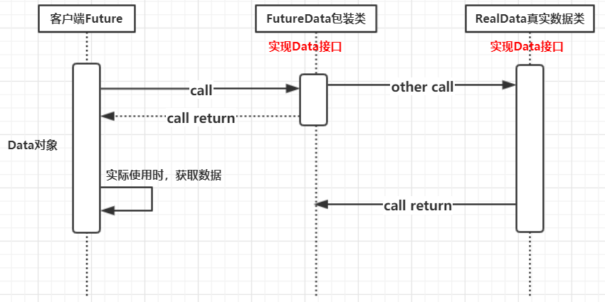

# Future模式

## 简介

Future模式有点类似于商品订单。比如在网购时，当看中某一件商品时，就可以提交订单，当订单处理完成后，在家里等待商品送货上门即可。或者说更形象的我们发送ajax请求的时候，页面是异步的进行后台处理，用户无须一直等待请求的结果，可以继续浏览或操作其他内容。

<br>


## Future模式时序图



<br>

## 案例

```java
package future;

public class Main {

    public static void main(String[] args) throws InterruptedException {

        FutureClient fc = new FutureClient();
        Data data = fc.request("这是请求参数");
        System.out.println("请求发送成功!");
        System.out.println("这时用户可以做其他的事情...");

        String result = data.getRequest();
        System.out.println(result);

    }
}
```

```java
package future;

//数据接口
public interface Data {
    String getRequest();
}
```

```java
package future;

//返回Data对象，立即返回虚假数据(FutureData)，并开启另一个线程去加载真实的数据(RealData)
public class FutureClient {

    public Data request(final String queryStr){
        //1 我想要一个代理对象（Data接口的实现类）先返回给发送请求的客户端，告诉他请求已经接收到，可以做其他的事情
        final FutureData futureData = new FutureData();
        //2 启动一个新的线程，去加载真实的数据，传递给这个代理对象
        new Thread(new Runnable() {
            @Override
            public void run() {
                //3 这个新的线程可以去慢慢的加载真实对象，然后传递给代理对象
                RealData realData = new RealData(queryStr);
                futureData.setRealData(realData);
            }
        }).start();

        return futureData;
    }

}
```

```java
package future;

//虚假的数据，需要装配RealData.
public class FutureData implements Data{

    private RealData realData ;
    private boolean isReady = false;

    public synchronized void setRealData(RealData realData) {
        //如果已经装载完毕了，就直接返回
        if(isReady){
            return;
        }
        //如果没装载，进行装载真实对象
        this.realData = realData;
        isReady = true;
        //进行通知
        notify();
    }

    @Override
    public synchronized String getRequest() {
        //如果没装载好 程序就一直处于阻塞状态
        while(!isReady){
            try {
                wait();
            } catch (InterruptedException e) {
                e.printStackTrace();
            }
        }
        //装载好直接获取数据即可
        return this.realData.getRequest();
    }
}
```

```java
package future;

//真实的数据
public class RealData implements Data{

    private String result ;
    //在构造方法中处理具体的业务逻辑，这是一个耗时的过程
    public RealData (String queryStr){
        System.out.println("根据" + queryStr + "进行查询，这是一个很耗时的操作..这里暂停5秒模拟");
        try {
            Thread.sleep(5000);
        } catch (InterruptedException e) {
            e.printStackTrace();
        }
        System.out.println("操作完毕，获取结果");
        result = "这是查询结果";
    }

    @Override
    public String getRequest() {
        return result;
    }

}

```

**结果：**

```java
请求发送成功!
这时用户可以做其他的事情...
根据这是请求参数进行查询，这是一个很耗时的操作..这里暂停5秒模拟
操作完毕，获取结果
这是查询结果
```

<br>

