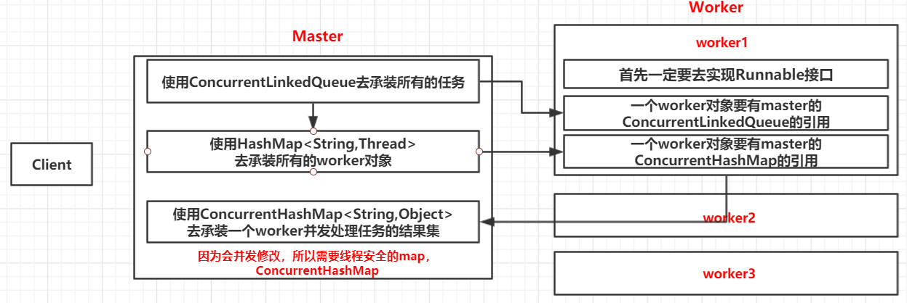

# Master-Worker模式

## 简介

Master-Worker模式是常见的并行计算模式。

它的核心思想是系统由两类进程协作工作：Master进程和Worker进程。

- Master负责接收和分配任务，Worker负责处理子任务。
- 当每个Worker子进程处理完成后，会将结果返回给Master，由Master做归纳和总结。

其好处是能将一个大任务分解成若干个小任务，并行计算，从而提高系统的吞吐量。

<br>

## master-worker分析图



<br>

## 举例

```java
package master_worker;

//具体的任务类
public class Task {

	private int id;
	private int price ;
	public int getId() {
		return id;
	}
	public void setId(int id) {
		this.id = id;
	}
	public int getPrice() {
		return price;
	}
	public void setPrice(int price) {
		this.price = price;
	} 
	
}
```

```java
package master_worker;

import java.util.HashMap;
import java.util.Map;
import java.util.concurrent.ConcurrentHashMap;
import java.util.concurrent.ConcurrentLinkedQueue;

public class Master {
	//1 有一个盛放任务的容器
	private ConcurrentLinkedQueue<Task> workQueue = new ConcurrentLinkedQueue<Task>();
	//2 需要有一个盛放worker的集合
	private HashMap<String, Thread> workers = new HashMap<String, Thread>();
	//3 需要有一个盛放每一个worker执行任务的结果集合
	private ConcurrentHashMap<String, Object> resultMap = new ConcurrentHashMap<String, Object>();
	//4 构造方法
	public Master(Worker worker , int workerCount){
		worker.setWorkQueue(this.workQueue);
		worker.setResultMap(this.resultMap);
		
		for(int i = 0; i < workerCount; i ++){
			this.workers.put(Integer.toString(i), new Thread(worker));
		}
		
	}
	//5 需要一个提交任务的方法
	public void submit(Task task){
		this.workQueue.add(task);
	}	
	//6 需要有一个执行的方法，启动所有的worker方法去执行任务
	public void execute(){
		for(Map.Entry<String, Thread> me : workers.entrySet()){
			me.getValue().start();
		}
	}
	//7 判断是否运行结束的方法
	public boolean isComplete() {
		for(Map.Entry<String, Thread> me : workers.entrySet()){
			if(me.getValue().getState() != Thread.State.TERMINATED){
				return false;
			}
		}		
		return true;
	}
	//8 计算结果方法
	public int getResult() {
		int priceResult = 0;
		for(Map.Entry<String, Object> me : resultMap.entrySet()){
			priceResult += (Integer)me.getValue();
		}
		return priceResult;
	}
}

```

```java
package master_worker;

import java.util.concurrent.ConcurrentHashMap;
import java.util.concurrent.ConcurrentLinkedQueue;

public class Worker implements Runnable {

	//worker要有master的ConcurrentLinkedQueue的引用
	private ConcurrentLinkedQueue<Task> workQueue;
	//worker要有master的ConcurrentHashMap的引用
	private ConcurrentHashMap<String, Object> resultMap;
	
	public void setWorkQueue(ConcurrentLinkedQueue<Task> workQueue) {
		this.workQueue = workQueue;
	}

	public void setResultMap(ConcurrentHashMap<String, Object> resultMap) {
		this.resultMap = resultMap;
	}
	
	@Override
	public void run() {
		while(true){
			Task input = this.workQueue.poll();
			if(input == null) break;
			Object output = handle(input);
			this.resultMap.put(Integer.toString(input.getId()), output);
		}
	}
	private Object handle(Task input) {
		Object output = null;
		try {
			//处理任务的耗时。。 比如说进行操作数据库。。。
			Thread.sleep(500);
			output = input.getPrice();
		} catch (InterruptedException e) {
			e.printStackTrace();
		}
		return output;
	}
}

```

```java
package master_worker;

import java.util.Random;

public class Main {

	public static void main(String[] args) {
		
		Master master = new Master(new Worker(), 20);
		
		Random r = new Random();
		for(int i = 1; i <= 100; i++){
			Task t = new Task();
			t.setId(i);
			t.setPrice(r.nextInt(1000));
			master.submit(t);
		}
		//执行任务
		master.execute();
		long start = System.currentTimeMillis();
		
		while(true){
			//任务是否已经执行完毕
			if(master.isComplete()){
				System.out.println("对随机0-1000的数进行累积100次叠加。");
				long end = System.currentTimeMillis() - start;
				int priceResult = master.getResult();
				System.out.println("最终结果：" + priceResult + ", 执行时间：" + end);
				break;
			}
		}
		
	}
}

```

```java
对随机0-1000的数进行累积100次叠加。
最终结果：50179, 执行时间：2565
```

<br>


