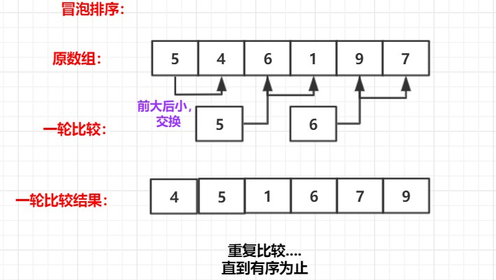

# 三、 冒泡排序


**时间复杂度O(N^2)，额外空间复杂度O(1)**

 

**原理：**

- 
  比较相邻的元素。如果第一个比第二个大，就交换他们两个。

- 对每一对相邻元素做同样的工作，从开始第一对到结尾的最后一对。在这一点，**最后的元素应该会是最大的**

  **数。 **   **(一轮结束)**

- 针对所有的元素重复以上的步骤，**除了最后一个。**

- 持续每次对越来越少的元素重复上面的步骤，直到没有任何一对数字需要比较

<br>



<br>


```java
package sort;

/**
 * @program: Multi_002
 * @description: 冒泡排序
 * @author: wenyan
 * @create: 2019-10-13 15:08
 **/

public class BubbleSort {

    public static void BubbleSort(int[] arr){
        if(arr == null || arr.length < 2){
            return; //边界检查
        }
        for(int e = arr.length - 1; e > 0; e--){
            for(int i = 0; i<e; i++){
                if(arr[i] > arr[i+1]){
                    swap(arr, i, i+1);
                }
            }
        }
    }
    public static void swap(int[] arr, int i, int j) {
        int tmp = arr[i];
        arr[i] = arr[j];
        arr[j] = tmp;
    }
    //输出数组
    public static void printArray(int[] arr){
        if(arr == null){
            return;
        }
        for(int i = 0; i<arr.length; i++){
            System.out.print(arr[i] + "  ");
        }
        System.out.println();
    }

    public static void main(String[] args) {
        int arr[] = {4 , 3 , 9 , 1 , 7 , 2 , 8 , 0};
        bubbleSort(arr);
        printArray(arr);
    }
}

```

<br>

**结果**：

```
0  1  2  3  4  7  8  9  
```

<br>


<br>

