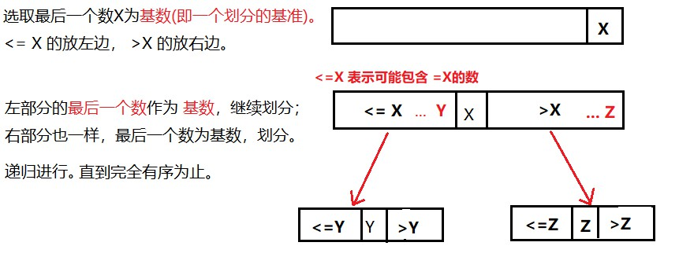
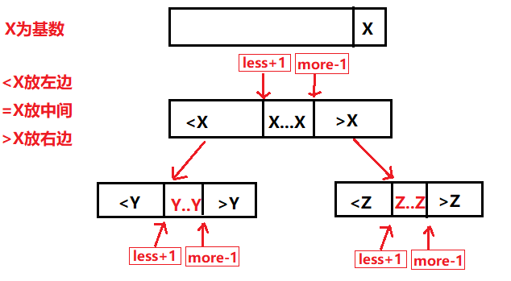

# 九、 快速排序

快速排序是冒泡排序的改进。

**基本思想**：通过一趟排序将要排序的数据分割成独立的两个部分，**其中一部分的所有数据都比另外一部分的所有数据都要小**，然后再按此方法对这两部分分别进行快速排序，整个过程可以使用**递归**进行。[1]

**时间复杂度：****O(N * logN)**

**额外空间复杂度:** **O(logN)**  **(随机快排)**

<br>

## 一、 经典快排

**思路：**




<br>

在上面的经典快排中，存在不足。比如，划分的时候，是将**`<=X`** 的数放在左边，而下一次划分的时候，又是以最右边的数为基数。每一次的划分中，**`=X`** 的数**有可能还需要再进行划分。**

<br>


## 二、 改进的经典快排

改进快排，类似于荷兰国旗问题，在第八讲《荷兰国旗问题》中有提到，将一个数组，**以num为基数，<num 的放左边， =num 的放中间， >num  的放右边。**

类似的，我们可以在快排中，以最右边的数为基数**(比如设为：X）**， 然后，**<X 的放左边， =X 的放中间，X 的放右边。**

这样一来，每次划分时， 等于基数的元素就不需要再进行划分了。我们只需要得到 **等于基数段的左右边界(下面图示的 less+1, more-1。 集体在代码中有体现) ** 就可以不让等于基数的数再参与划分。

<br>

**图示**：



<br>

**代码：**

```java
package sort;

/**
 * @program: Multi_002
 * @description:
 * @author: wenyan
 * @create: 2019-10-15 19:55
 **/


public class QuickSort {
    public static void quickSort(int arr[]) {
        if (arr == null || arr.length < 2) {
            return;
        }
        quickSort(arr, 0, arr.length - 1);
    }
    public static void quickSort(int[] arr, int L, int R) {
        if(L < R){  // L<R 情况才成立
            int [] p = partition(arr, L, R);    //排序（p数组存储与基数相等的数据段的边界下标）
            quickSort(arr, L, p[0] - 1);     //左边排序
            quickSort(arr, p[1] + 1, R);     //右边排序
        }
    }
    public static void swap(int[] arr, int i, int j) {
        int tmp = arr[i];
        arr[i] = arr[j];
        arr[j] = tmp;
    }
    public static int[] partition(int[] arr, int L, int R) {
        int less = L - 1;
        int more = R + 1;
        int current = L;
        while (current < more){
            if(arr[current] < arr[R]){
                swap(arr, less+1, current);
                less++;
                current++;
                // 等价于
                // swap(arr, ++less, current++);
            }else if(arr[current] > arr[R]){
                swap(arr, more-1, current);
                more--;
                // 等价于
                // swap(arr, --more, current);
            }else{
                current++;
            }
        }
        //swap(arr, more, R);
        return new int[]{less+1, more-1};
    }

    //输出数组
    public static void printArray(int[] arr){
        if(arr == null){
            return;
        }
        for(int i = 0; i<arr.length; i++){
            System.out.print(arr[i] + "  ");
        }
        System.out.println();
    }
    public static void main(String[] args) {
        int arr[] = {3, 0, 4, 4, 4, 3, 2, 6, 1, 8, 9, 7};
        System.out.println("原数组为:");
        printArray(arr);
        System.out.println("排序后的数组为：");
        quickSort(arr);
        printArray(arr);
    }
}
```

<br>

**结果：**

```java
原数组为:
3  0  4  4  4  3  2  6  1  8  9  7  
排序后的数组为：
0  1  2  3  3  4  4  4  6  7  8  9  
```

<br>

在这里，原本的数组在排序后变成了很多个零，原来是交换方法有问题。**异或**虽然可以用来交换两个数，但是两个相等的数交换之后会变成0。相当于一个数异或自己本身3次，结果就是零。这个只能说是基础不扎实了。。。

具体可以参考这篇：[《用异或进行两个数交换的陷阱》](https://blog.csdn.net/u010141928/article/details/76140165)

<br>

## 三、 随机快排

经典快排还是有一定的局限性，比如：

数组是 [10000000, ..., 3, 2, 1]， 这种类似的极端情况，经典快排，比如让 1 作为基数，那么只有 **大于和等于** 的区域，没有小于的区域，排序时，每次只能搞定一个数，这样算法的复杂度为 **O(N^2) **。 

能让基数左右两边的规模接近，是比较好的状态，时间复杂度为 **O(N * logN)**。

<br>

随机快排，就是在序列中**随机选一个数** 与 **数组最后一个数交换**，作为划分的基数。每次递归都是如此，这样，划分的规模也是随机的。时间复杂度是 **O(N * logN)** 。

<br>

我们可以用下面代码产生随机数。

 **`swap(arr, L+(int)(Math.random()*(R-L+1)),R);`**

意思是在 **R-L** 范围内算一个随机数和 **R** 位置交换，非常简单。

```java
public static void quickSort(int[] arr, int L, int R) {
        if(L < R){  // L<R 情况才成立
            swap(arr, L+(int)(Math.random()*(R-L+1)),R);
            int [] p = partition(arr, L, R);    //排序（p数组存储与基数相等的数据段的边界下标）
            quickSort(arr, L, p[0] - 1);     //左边排序
            quickSort(arr, p[1] + 1, R);     //右边排序
        }
    }
```

<br>


# 参考

[1] 百度百科：[快速排序](https://baike.baidu.com/item/%E5%BF%AB%E9%80%9F%E6%8E%92%E5%BA%8F%E7%AE%97%E6%B3%95/369842?fromtitle=%E5%BF%AB%E9%80%9F%E6%8E%92%E5%BA%8F&fromid=2084344&fr=aladdin)<br>

