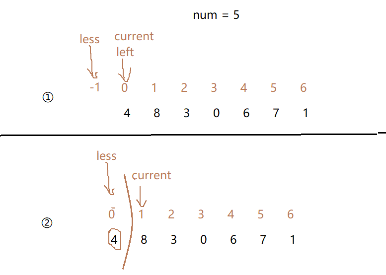
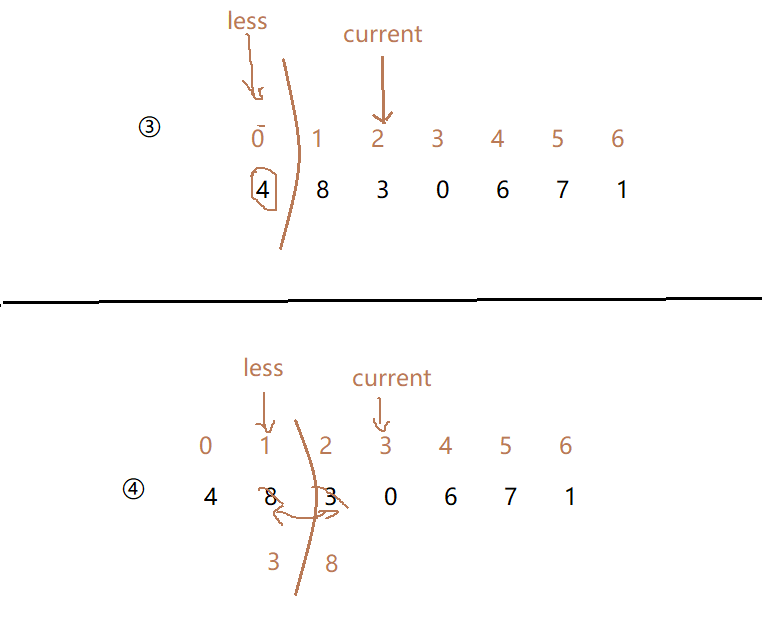
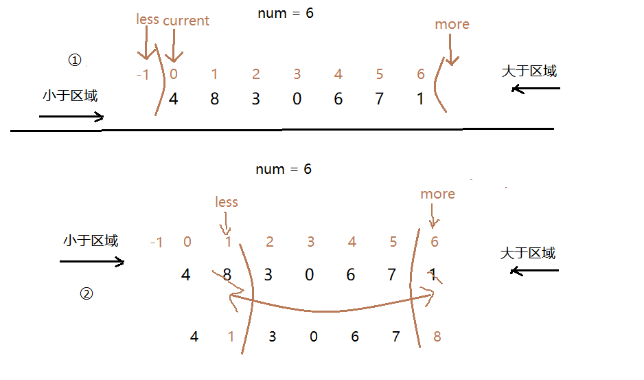

# 八、荷兰国旗问题

## 一、 荷兰国旗问题引申

给定一个数组arr，和一个数num，

请把小于等于num的数放在数组的左边，

大于num的数放在数组的右边。

要求**额外空间复杂度O(1)，时间复杂度O(N)**


<br>

**思路**：

- 定义一个小于num的区域。
- 定义less指针，less所指的左部分为**小于num的区域**。less初始值为**-1（Left-1）**
- 定义current指针，**current所指的是当前要和num比较的数**。**current初始值为Left**
- ① 当**arr[current] <num**,将**arr[current]** 与 **小于区域的下一个数** **arr[less+1]** 交换，**less+1，current+1。**如果**大于num，则current+1，less不动**。
- ② 结束条件是**current == R**

<br>

**图示：**





<br>


## 二、 荷兰国旗问题

**问题**：

给定一个数组arr，和一个数num，请把

**小于**num的数放在数组的左边，

**等于**num的数放在数组的中间，

**大于**num的数放在数组的右边。

 <br>


**思路**：

荷兰国旗问题在前面的基础上，分为三个区域，分别是 **<num ,  ==num,  >num 。**

① 小于区域还是和之前一样，再增加一个**`more`**指针，从大于区域开始。

② 如果**current**所在位置 **大于num**，则将 **`arr[current]`** 和 **大于区域的前一个**位置 arr[more-1] 交换，

**more-1。此时current不变。再判断arr[more-1] 与num的关系**，小于num，则和小于区域的**下一个**位置**arr[less+1]** 交换，**less+1，current+1**，继续。

③ 如果arr[current] == num，则**其他不变，current+1**。

④ 结束条件是**current == more**（前后指针相遇，结束）

<br>



<br>


**代码**：

```java
package sort;

/**
 * @program: Multi_002
 * @description: 荷兰国旗问题
 * @author: wenyan
 * @create: 2019-10-15 16:33
 **/


public class NetherLandsFlag {
    public static int[] partition(int arr[], int L, int R, int num){ //L：左边界，R：有边界
        int less = L - 1;
        int current = L;
        int more = R + 1;
        while (current < more){ //current == more 的时候，说明已经分好了。
            if(arr[current] < num){
                swap(arr, less+1, current);
                less++;
                current++;
            }else if(arr[current] > num){
                swap(arr, more-1, current);
                more--;
            }else{
                current++;
            }
        }
        return new int[] {less + 1, more - 1};
    }
    public static void swap(int[] arr, int i, int j) {
        int tmp = arr[i];
        arr[i] = arr[j];
        arr[j] = tmp;
    }
    //输出数组
    public static void printArray(int[] arr){
        if(arr == null){
            return;
        }
        for(int i = 0; i<arr.length; i++){
            System.out.print(arr[i] + "  ");
        }
        System.out.println();
    }
    public static void main(String[] args) {
        int arr[] = {3, 0, 4, 4, 4, 3, 2, 6, 1, 8, 9, 7};
        System.out.println("原数组为:");
        printArray(arr);
        System.out.println("排序后的数组为：");
        int res[] = partition(arr, 0, arr.length-1, 4); //指定num = 4.
        printArray(arr);
        System.out.println("指定数字的数组的最左和最右下标为：");
        System.out.println("最左-res[0]:" + res[0] + "，最右-res[1]:" + res[1]);
    }
}
```

<br>

**结果：**

```java
原数组为:
3  0  4  4  4  3  2  6  1  8  9  7  
排序后的数组为：
0  0  3  2  1  4  4  4  8  9  7  6  
指定数字的数组的最左和最右下标为：
最左-res[0]:5，最右-res[1]:7
```

<br>

**补充**：

最后的 **`new int[] res = {less+1, more-1};`** 这是得到指定num值的数据段的最左和最右的想个下标组成的数组。通过这两个下标， **就可以快速找到 < num 的所有数 和 >num 的所有数。**

<br>

<br>

