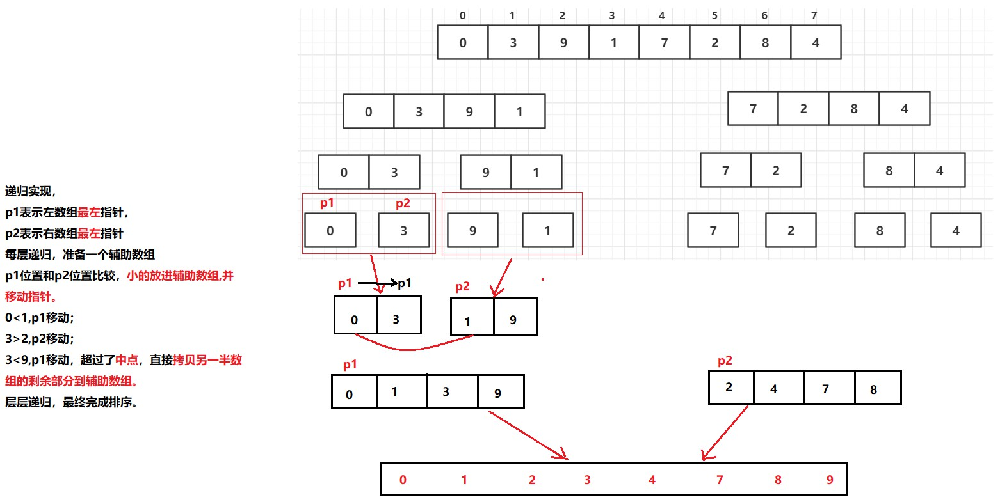

# 六、 归并排序


## 一、 简介

归并排序（Merge-Sort）是建立在归并操作上的一种有效的排序算法，该算法是采用**分治法**（Divide and Conquer）的一个非常典型的应用。

将已有的子序列合并，得到完全有序的序列；即：**先使每个子序列有序，再使自学段间有序。**若将两个有序表合并成一个有序表，称为**二路归并。**

<br>

## 二、 性质

**稳定性：稳定排序。**

**时间复杂度**：**O(*n* log *n*)** 

**额外空间复杂度：O(n)**

<br>

## 三、 例子

**对数组排序**：

**思路**：

- **左边排好序，右边排好序，再左右排好序。**
- 利用**辅助数组help，和p1,p2两个指针**，p1从**左边数组 `L` **位置开始，p2从**右边数组`(mid+1)`**位置开始。
- **`arr[p1] < arr[p2]`**，将 **`arr[p1]` 拷贝进 `help` 数组, `p1 `向右移动，`p2` 不动**。同理，右边也一样。直到有一边排好序，**直接拷贝另一边剩下的进help数组**。整个排序结束。

<br>



<br>

**代码**：

```java
package sort;

/**
 * @program: Multi_002
 * @description: 归并排序
 * @author: wenyan
 * @create: 2019-10-14 14:44
 **/


public class MergeSort {
    public static void mergeSort(int arr[]){
        if(arr == null || arr.length < 2){
            return;
        }
        mergeSort(arr, 0, arr.length-1);    //在 0 到 (arr.length-1)范围内对数组排序。
    }

    private static void mergeSort(int[] arr, int L, int R) {
        if(L == R){//L==R, 说明只有一个数了
            return;
        }
        int mid = L + ((R-L)>>1);   //求中点位置，等价于 (L+R)/2.
        mergeSort(arr, 0, mid);  //在 0到mid 之间排好序
        mergeSort(arr, mid+1, R);//在 mid+1到R 之间排好序
        merge(arr, L, mid, R);      //具体的排序过程
    }

    private static void merge(int[] arr, int L, int mid, int R) {
        int [] help = new int[R-L+1];   //辅助数组，大小为 L到R 上的个数。
        int i = 0;
        int p1 = L;
        int p2 = mid + 1;
        //具体的排序方法
        while(p1<=mid && p2<=R){ //p1和p2均不越界的情况下。
            // 谁小，就把谁拷贝到辅助数组对应位置，指针向右移动。
            help[i++] = arr[p1] < arr[p2] ? arr[p1++] : arr[p2++];
        }

        //下面两个while条件只有一个会执行。（不是p1越界就是p2越界）
        //p1<mid，说明p2已经越界。直接拷贝p1剩下的到辅助数组
        while (p1<=mid){
            help[i++] = arr[p1++];
        }
        //p2<R，说明p1已经越界。直接拷贝p2剩下的到辅助数组
        while (p2<=R){
            help[i++] = arr[p2++];
        }

        //全部排完序，拷贝会原数组
        for(i = 0;i<help.length;i++){
            arr[L+i] = help[i];
        }

    }
    //输出数组
    public static void printArray(int[] arr){
        if(arr == null){
            return;
        }
        for(int i = 0; i<arr.length; i++){
            System.out.print(arr[i] + "  ");
        }
        System.out.println();
    }

    public static void main(String[] args) {
        int arr[] = {4,3,9,1,7,2,8,0};
        mergeSort(arr);
        printArray(arr);
    }
}

```

<br>
**结果**：

```java
0  1  2  3  4  7  8  9  
```

<br>


<br>

# 参考

百度百科：[归并排序](https://baike.baidu.com/item/%E5%BD%92%E5%B9%B6%E6%8E%92%E5%BA%8F)<br>

