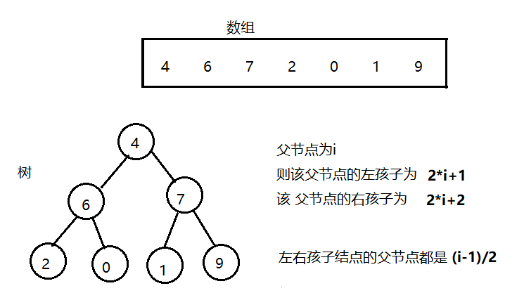
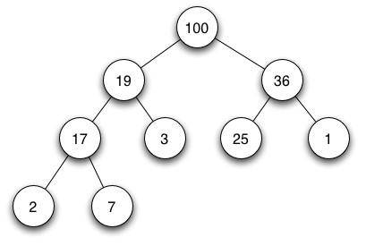
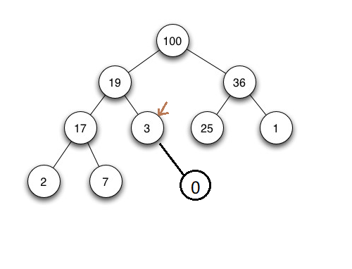
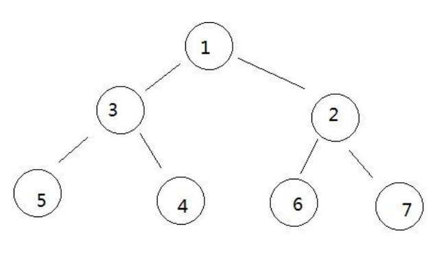
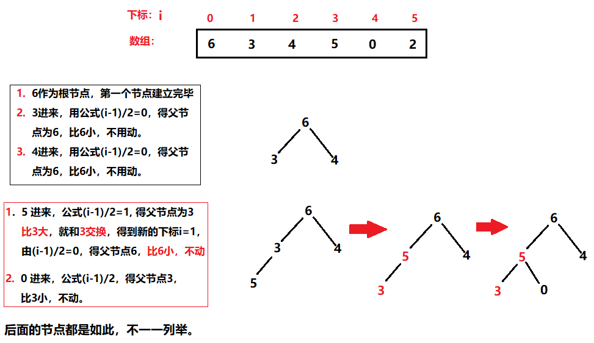
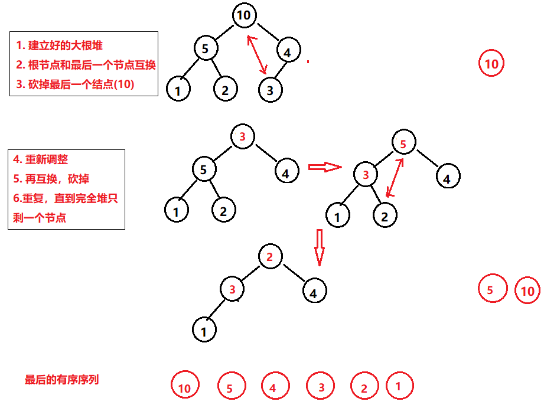
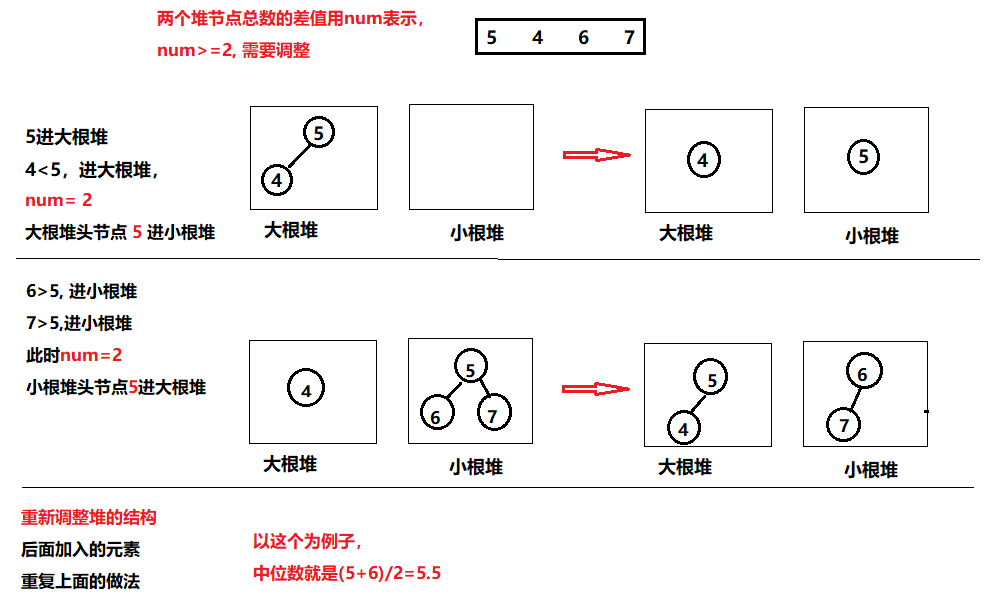

# 十、 堆排序

## 一、 堆

​	**堆（heap)**：是计算机科学中一类特殊的数据结构的统称。堆通常是一个可以被看做一棵树的**数组对象。**



<br>

**堆排序的细节和复杂度分析**

**时间复杂度 :O(N*logN)**

**额外空间复杂度 : O(1)**

<br>

**堆结构非常重要**

- 堆结构的 **heapInsert (新加入元素的插入如果大于父节点，网上调整的过程) **与 **heapify (假如某个节点变小，往下沉的过程)**
- 堆结构的**增大和减少**
- 如果只是建立堆的过程，时间复杂度为**O(N)**
- **优先级队列**结构，就是堆结构

<br>

## 二、 二叉树

### 完全二叉树

**堆就是经过排序的完全二叉树。**



<br>

### 非完全二叉树



<br>


## 三、 大根堆和小根堆

### 大根堆

在完全二叉树中，每一个**字树**中，**树的根结点最大，**就是大根堆。


<br>

### 小根堆

与大根堆相反。在完全二叉树中，每一个**字树**中，**树的根结点最小**，就是小根堆



<br>

## 四、 数组变大根堆(heapInsert)

**时间复杂度：O（N）**

我们知道堆其实可以由数组转换而来，并且存在上面提到的公式。我们可以分析数组怎么变大根堆。小根堆同理，只列举大根堆。

**思路**：

- 元素加入树中，比较和父节点的大小关系
- 小于父节点，不用动；
- 大于父节点，就和父节点互换，游标来到父节点位置，在新位置继续和父节点比较，直到没有大于父节点为止。

<br>

**建成的大根堆并不一定是有序的。**



<br>

**代码**：

```java
package sort;
/**
 * @program: Multi_002
 * @description: 堆排序
 * @author: wenyan
 * @create: 2019-10-16 01:08
 **/
public class HeapSort {

    public static void heapSort(int arr[]){
        if(arr == null || arr.length < 2){
            return;
        }
        for(int i = 0; i<arr.length;i++){
            heapInsert(arr, i); //将数组每个元素插入到大根堆中。
        }
    }
    private static void heapInsert(int[] arr, int index) {
        while (arr[index] > arr[(index-1)]/2){  //比较和父节点的大小关系。大则互换。
            swap(arr, index, (index-1)/2);  //互换
            index = (index-1)/2;            //游标来到父节点位置。
        }
    }
    public static void swap(int arr[], int i, int j){
        int tmp = arr[i];
        arr[i] = arr[j];
        arr[j] = tmp;
    }
    public static void main(String[] args) {
    }
}

```

<br>

## 五、 堆排序（heapify）

- ①将一个完全无序的数组建成堆
- ②建成的堆的**根结点就是所有结点中最大值**，将其与**最后一个结点交换**
- ③砍断最后一个结点，即得到了这个数组中的最大值
- ④重新从新的第一个结点开始堆化
- 重复以上步骤，直到堆中只剩一个结点

（简单讲，就是把头结点和最后结点互换，得到最大值，然后调整，再互换，就这样从大到小一个一个抽出来）

<br>



<br>

**代码**：

```java
package sort;

/**
 * @program: Multi_002
 * @description: 堆排序
 * @author: wenyan
 * @create: 2019-10-16 01:08
 **/


public class HeapSort {

    public static void heapSort(int arr[]){
        if(arr == null || arr.length < 2){
            return;
        }
        for(int i = 0; i<arr.length;i++){
            heapInsert(arr, i); //将数组每个元素插入到大根堆中。
        }

        // 到了这里堆已经建立完毕。
        //交换根节点和最后一个节点的元素，并对堆进行调整。
        int heapSize = arr.length;     // 要排序的堆的长度。
        swap(arr, 0, --heapSize);   // 头结点和最后的节点交换。
        while (heapSize > 0){         // 只要堆中还有节点，就一直下沉。
            heapify(arr, 0, heapSize);//交换后下沉过程
            swap(arr, 0, --heapSize);//一轮结束重复交换
        }
    }

    //具体的下沉节点过程
    private static void heapify(int[] arr, int index, int heapSize) {//index为交换后父节点。
        int left = index*2+1;       //左孩子
        while (left < heapSize){    //当一个节点的左孩子没有越界
            // left+1 表示右孩子。这里先找到左右孩子的最大值，最大的下标赋值给largest。
            int largest = (left+1) < heapSize && arr[left+1] > arr[left] ? (left+1): left;

            // 再将largest所在节点和父节点比较，确定是否需要交换。
            largest = arr[largest] > arr[index] ? largest : index;

            if(largest == index){//此时，父节点比左右孩子都大，那么不用下沉了。
                break;
            }

            //否则，继续下沉和交换
            swap(arr, largest, index);  //交换下沉节点和孩子节点
            index = largest;    //游标来到孩子节点的位置
            left = index*2+1;   //重新得到左孩子下标。
        }
    }

    private static void heapInsert(int[] arr, int index) {
        while (arr[index] > arr[(index-1)/2]){  //比较和父节点的大小关系。大则互换。
            swap(arr, index, (index-1)/2);  //互换
            index = (index-1)/2;            //游标来到父节点位置。
        }
    }
    public static void swap(int arr[], int i, int j){
        int tmp = arr[i];
        arr[i] = arr[j];
        arr[j] = tmp;
    }
    //输出数组
    public static void printArray(int[] arr){
        if(arr == null){
            return;
        }
        for(int i = 0; i<arr.length; i++){
            System.out.print(arr[i] + "  ");
        }
        System.out.println();
    }

    public static void main(String[] args) {
        int arr[] = {4,4,4,3,9,1,7,2,8,0};
        System.out.println("排序前的数组为:");
        printArray(arr);
        System.out.println();
        heapSort(arr);
        System.out.println("排序后的数组为:");
        printArray(arr);
    }
}
```

<br>

**结果**：

```java
排序前的数组为:
4  4  4  3  9  1  7  2  8  0  

排序后的数组为:
0  1  2  3  4  4  4  7  8  9 
```

<br>

## 六、 堆结构求解中位数

### **· 堆排序题目**

**在一串数字流中，一直往外吐出数字，要求实时的给出已吐出序列的中位数。**

**思路：**

- 建立一个**大根堆**和一个**小根堆**

- 吐出的数，先放到大根堆中，接下来的吐出的数，

  如果**小于大根堆头节点**，放到**大根堆**；

  **大于小根堆头节点**，放到**小根堆**

- 大根堆和小跟堆**节点数相差2及以上**，节点多的堆**吐出头节点到另一个堆中**，两个堆中心调整

- **中位数**就是大小根堆的头节点 **和的一半 （和/2）**

<br>



<br>


# 参考

[[排序算法] 堆排序之堆的构建以及怎样通过heapify操作完成堆排序](https://blog.csdn.net/gaga_yu/article/details/89577257)<br>


  


