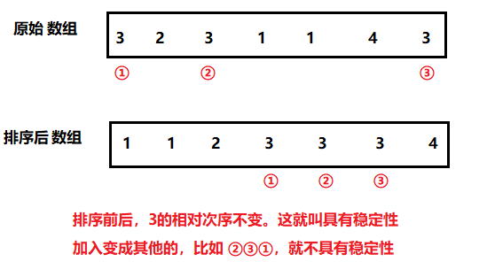

# 十一、 算法稳定性和比较器

## 一、 算法稳定性


**算法稳定性是指：在待排序记录序列中，排序的前后，记录的相对次序不变。**

<br>

**图示**：


<br>


能实现稳定性的算法有：

- ① 冒泡排序
- ② 插入排序
- ③ 归并排序

<br>

不能实现稳定性的算法：

- ① 快速排序
- ② 堆排序

<br>

> ① 在普通数据类型排序时，可以不考虑算法稳定性，因为只是普通的数字而已，相对次序先后没有特别的意义。

> ② 而复杂类型排序时，根据需要，考虑算法稳定性。比如一个学生类中的属性有：id，name，age，score等。当需要按id排序时，再按socre排序。如果采用快排和堆排，就达不到稳定性。

 <br>


## 二、 比较器


**代码**：

```java
package sort;

import java.util.Arrays;
import java.util.Comparator;

public class MyComparator {

    public static class Student {
        public String name;
        public int id;
        public int age;

        public Student(String name, int id, int age) {
            this.name = name;
            this.id = id;
            this.age = age;
        }
    }

    public static class IdAscendingComparator implements Comparator<Student> {

        public int compare(Student o1, Student o2) {
            return o1.id - o2.id;
        }

    }

    public static class IdDescendingComparator implements Comparator<Student> {

        public int compare(Student o1, Student o2) {
            return o2.id - o1.id;
        }

    }

    public static class AgeAscendingComparator implements Comparator<Student> {

        public int compare(Student o1, Student o2) {
            return o1.age - o2.age;
        }

    }

    public static class AgeDescendingComparator implements Comparator<Student> {

        public int compare(Student o1, Student o2) {
            return o2.age - o1.age;
        }

    }

    public static void printStudents(Student[] students) {
        for (Student student : students) {
            System.out.println("Name : " + student.name + ", Id : " + student.id + ", Age : " + student.age);
        }
        System.out.println("===========================");
    }

    public static void main(String[] args) {
        Student student1 = new Student("A", 1, 23);
        Student student2 = new Student("B", 2, 21);
        Student student3 = new Student("C", 3, 22);

        Student[] students = new Student[] { student3, student2, student1 };
        printStudents(students);

        Arrays.sort(students, new IdAscendingComparator());
        printStudents(students);

        Arrays.sort(students, new IdDescendingComparator());
        printStudents(students);

        Arrays.sort(students, new AgeAscendingComparator());
        printStudents(students);

        Arrays.sort(students, new AgeDescendingComparator());
        printStudents(students);

    }

}
```

<br>

**结果**：

```java
Name : C, Id : 3, Age : 22
Name : B, Id : 2, Age : 21
Name : A, Id : 1, Age : 23
===========================
Name : A, Id : 1, Age : 23
Name : B, Id : 2, Age : 21
Name : C, Id : 3, Age : 22
===========================
Name : C, Id : 3, Age : 22
Name : B, Id : 2, Age : 21
Name : A, Id : 1, Age : 23
===========================
Name : B, Id : 2, Age : 21
Name : C, Id : 3, Age : 22
Name : A, Id : 1, Age : 23
===========================
Name : A, Id : 1, Age : 23
Name : C, Id : 3, Age : 22
Name : B, Id : 2, Age : 21
===========================
```

<br>


