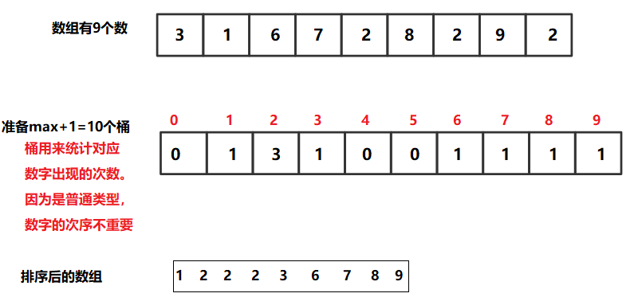
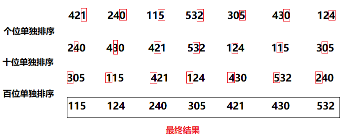

# 十二、 桶排序

将要排序的数据分到几个有序的桶里，每个桶里的数据再单独进行排序。

桶内排完序之后，再把每个桶里的数据按照顺序依次取出，组成的序列就是有序的了。


桶排序比较适合用在**外部排序**中。所谓的外部排序就是数据存储在外部磁盘中，数据量比较大，内存有限，无法将数据全部加载到内存中。

<br>


## 一、 计数排序

桶排序的一种特殊情况。


**非基于比较的排序**，与被排序的样本的实际数据状况很有关系，所以实际中并不经常使用。

**时间复杂度O(N)，**

**额外空间复杂度O(N)**

**稳定性：稳定的排序**。

 <br>


**比如下面一个道题：**

有一个数组， 要求不用比较的方式对数组进行排序**。**

**arr = [3, 3, 1, 1, 6, 7, 2, 8, 2, 9, 2]**

<br>


**原理：**

- 求出待排数组 arr[] 的最大值 max
- 准备一个长度为 max+1 的数组 bucket[]
- 遍历 arr[]，让 arr 中每个相同数字 num 的次数 **i** 填到对应下标为 num 的 bucket 数组中
- 从 0 遍历 bucket 数组，将 bucket 数组下标（bucket[i]不为0) 填到 arr 数组中, bucket[i] 是几，就填多少个 i。得到的新 arr[] 即为已排好的数组

<br>



<br>

**代码**：

```java
package sort;

/**
 * @program: Multi_002
 * @description: 计数排序
 * @author: wenyan
 * @create: 2019-10-16 14:51
 **/


public class BucketSort1 {

    public static void bucketSort(int arr[]){
        if(arr == null || arr.length<2){
            return;
        }
        int max = Integer.MIN_VALUE;
        for(int i = 0;i <arr.length; i++){  //找到数组最大值
            max = Math.max(max, arr[i]);
        }
        int [] bucket = new int[max+1]; //生成max+1个桶
        for(int i = 0;i<arr.length; i++){
            bucket[arr[i]]++;   //对应位置 词频++
        }
        int i = 0;
        for(int j = 0; j<bucket.length; j++){
            while (bucket[j]-- > 0){    //bucket[j] > 0,即词频大于0就执行，并且词频数 -1.
                arr[i++] = j;
            }
        }
    }
    //输出数组
    public static void printArray(int[] arr){
        if(arr == null){
            return;
        }
        for(int i = 0; i<arr.length; i++){
            System.out.print(arr[i] + "  ");
        }
        System.out.println();
    }

    public static void main(String[] args) {
        int arr[] = {3, 1, 6, 7, 2, 8, 2, 9, 2};
        System.out.println("排序前的数组为:");
        printArray(arr);
        System.out.println();
        bucketSort(arr);
        System.out.println("排序后的数组为:");
        printArray(arr);
    }
}

```

**结果**：

```java
排序前的数组为:
3  1  6  7  2  8  2  9  2  

排序后的数组为:
1  2  2  2  3  6  7  8  9  
```

<br>


## 二、 基数排序

实现原理主要是通过独立出“位”，进行排序。

比如在10万个电话号码中，从小到大排序。就可以“单独拎出个位进行排序，再排十位、百位、等等”，一直排完就有序。

<br>

例如：

**【题目】**

将数组 [421,  240,  115,  532,  305,  430,  124] 进行从小到大排序。

<br>



<br>

**代码**：

```java
package sort;

import java.util.Arrays;

/**
 * @program: Multi_002
 * @description: 基数排序
 * @author: wenyan
 * @create: 2019-10-17 00:09
 **/


public class RadixSort {
    public static void radixSort(int arr[]){
        if(arr == null || arr.length < 2){
            return;
        }
        radixSort(arr, 0, arr.length-1, maxbits(arr));  //maxbits求数组中数的最大位数。
    }

    private static void radixSort(int[] arr, int start, int end, int maxbits) {
        int radix = 10;
        int bucket[] = new int[end-start+1];  //桶的长度为数组长度。
        int count[] = new int[radix];   //count就是记录每个位的词频。
        int i, j = 0;
        for(i=0; i<maxbits; i++){
            int division = (int)Math.pow(10, i);
            for(j=0; j<arr.length;j++){
                int num = arr[j]/division%10;//求各个位的余数
                count[num]++;   //词频加加。
            }

            //做累加数组
            for(int n=1;n<count.length;n++){
                count[n] = count[n] + count[n-1];
            }
            for(int m = arr.length-1;m>=0;m--){
                int num = arr[m]/division%10;
                bucket[--count[num]] = arr[m];
            }
            //拷贝回原数组
           System.arraycopy(bucket,0,arr,0,arr.length);
            Arrays.fill(count,0);
        }
    }

    private static int maxbits(int[] arr) {
        int max = Integer.MIN_VALUE;
        for(int i = 0;i<arr.length;i++){
            max = Math.max(max, arr[i]);//找到数组的最大数。最大数拥有最大位数
        }
        int res = 0;
        while (max !=0){
            res++;  //位数加加。
            max/=10;
        }
        return res;
    }
    //输出数组
    public static void printArray(int[] arr){
        if(arr == null){
            return;
        }
        for(int i = 0; i<arr.length; i++){
            System.out.print(arr[i] + "  ");
        }
        System.out.println();
    }
    public static void main(String[] args) {
            int arr[] = {421,  240,  115,  532,  305,  430,  124};
            System.out.println("原数组为:");
            printArray(arr);
            System.out.println("排序后的数组为：");
            radixSort(arr);
            printArray(arr);
    }
}

```

**结果：**

```java
原数组为:
421  240  115  532  305  430  124  
排序后的数组为：
115  124  240  305  421  430  532  
```

<br>

**或者是：**

```java
package sort;

import java.util.Arrays;

/**
 * @program: Multi_002
 * @description: 基数排序
 * @author: wenyan
 * @create: 2019-10-17 00:09
 **/


public class RadixSort {
    public static void radixSort(int[] arr) {
        if (arr == null || arr.length < 2) {
            return;
        }
        radixSort(arr, 0, arr.length - 1, maxbits(arr));
    }

    public static int maxbits(int[] arr) {
        int max = Integer.MIN_VALUE;
        for (int i = 0; i < arr.length; i++) {
            max = Math.max(max, arr[i]);
        }
        int res = 0;
        while (max != 0) {
            res++;
            max /= 10;
        }
        return res;
    }

    public static void radixSort(int[] arr, int begin, int end, int digit) {
        final int radix = 10;
        int i = 0, j = 0;
        int[] count = new int[radix];
        int[] bucket = new int[end - begin + 1];
        for (int d = 1; d <= digit; d++) {
            for (i = 0; i < radix; i++) {
                count[i] = 0;
            }
            for (i = begin; i <= end; i++) {
                j = getDigit(arr[i], d);
                count[j]++;
            }
            for (i = 1; i < radix; i++) {
                count[i] = count[i] + count[i - 1];
            }
            for (i = end; i >= begin; i--) {
                j = getDigit(arr[i], d);
                bucket[count[j] - 1] = arr[i];
                count[j]--;
            }
            for (i = begin, j = 0; i <= end; i++, j++) {
                arr[i] = bucket[j];
            }
        }
    }

    public static int getDigit(int x, int d) {
        return ((x / ((int) Math.pow(10, d - 1))) % 10);
    }
    //输出数组
    public static void printArray(int[] arr){
        if(arr == null){
            return;
        }
        for(int i = 0; i<arr.length; i++){
            System.out.print(arr[i] + "  ");
        }
        System.out.println();
    }
    public static void main(String[] args) {
            int arr[] = {421,  240,  115,  532,  305,  430,  124};
            System.out.println("原数组为:");
            printArray(arr);
            System.out.println("排序后的数组为：");
            radixSort(arr);
            printArray(arr);
    }
}

```


<br>


