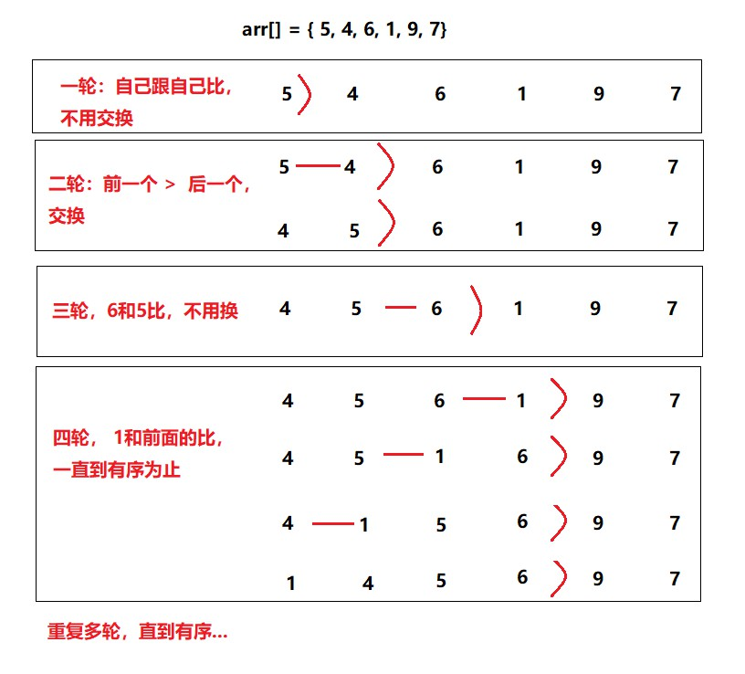

# 四、 插入排序


**时间复杂度O(N^2)**

**额外空间复杂度O(1)**

<br>

插入排序：可以这么理解，就像抽卡，每抽一张，排序一张。

**原理图**：



<br>

**代码**：

```java
package sort;

/**
 * @program: Multi_002
 * @description: 插入排序
 * @author: wenyan
 * @create: 2019-10-13 18:09
 **/

public class InsertSort {

    public static void insertSort(int arr[]){
        if(arr == null || arr.length < 2){
            return;
        }
        for(int i = 1; i<arr.length; i++){
            for(int j = i; j>0; j--){
                if(arr[j] < arr[j-1]){
                    swap(arr, j, j-1);
                }
            }

        }
        //等价于下面代码：
//        for(int i = 1; i<arr.length; i++) {
//          for(int j = 1; j>0 && arr[j] < arr[j-1]; j--){
//               swap(arr,j,j-1);
//           }
//        }

    }
    public static void swap(int[] arr, int i, int j) {
        int tmp = arr[i];
        arr[i] = arr[j];
        arr[j] = tmp;
    }
    //输出数组
    public static void printArray(int[] arr){
        if(arr == null){
            return;
        }
        for(int i = 0; i<arr.length; i++){
            System.out.print(arr[i] + "  ");
        }
        System.out.println();
    }
    public static void main(String[] args) {
        int arr[] = {5, 4, 6, 1, 9, 7};
        insertSort(arr);
        printArray(arr);
    }
}
```

结果：

```
1  4  5  6  7  9  
```

<br>

**插入排序时间复杂度**：

时间复杂度跟**数据状况**有关。

例如，一个很长的数组需要排序，

1. 从  **0,1,2,3,4，.... , 1000000000...**  那么这种情况，插入排序在排序过程中，都不用排序，时间复杂为 **O(N)**
2. 从  10000000..., 4, 3,2,1,0  那么这种情况，排序过程中，分别需要比较**N-i**次，时间复杂度为 **O(N^2)**

所以我们可以看到插入排序时间复杂度和数据状况有关。

<br>


