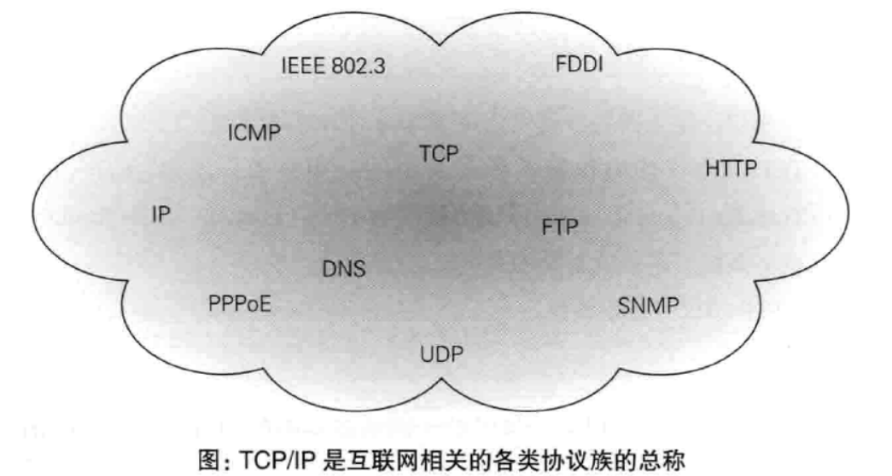
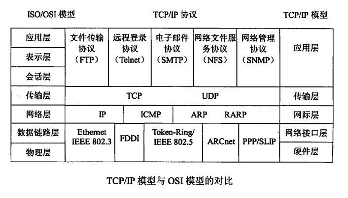
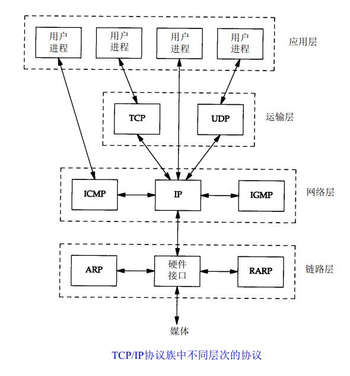
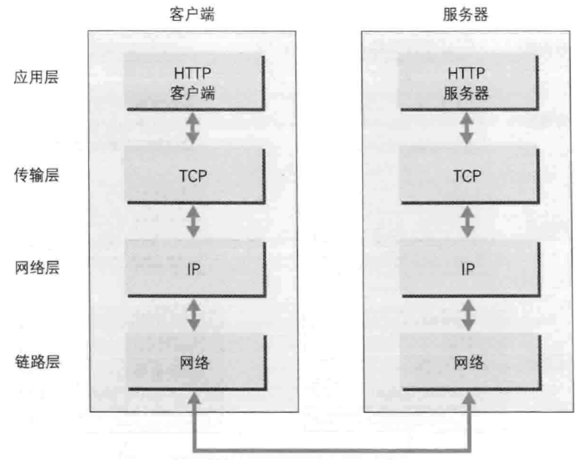
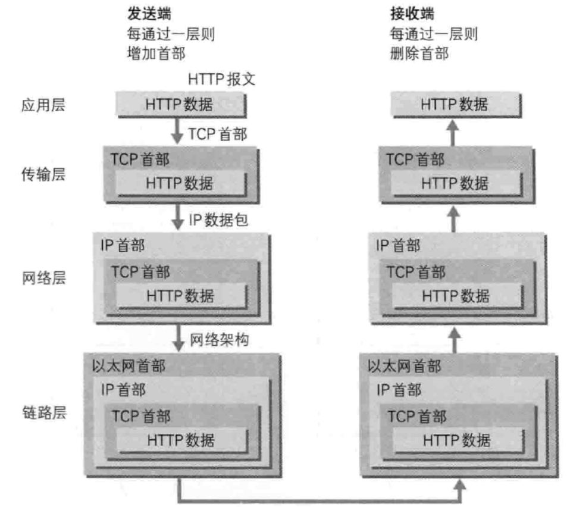
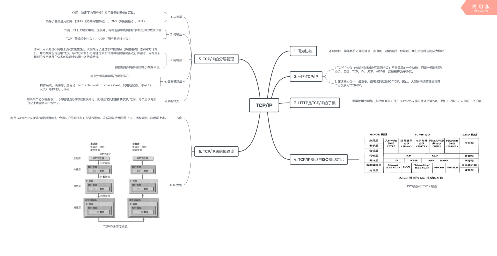

# TCP和IP

## 何为TCP/IP

>**TCP/IP协议（传输控制协议/互联网协议）不是简单的一个协议，而是一组特别的协议，包括：TCP，IP，UDP，ARP等，这些被称为子协议。在这些协议中，最重要、最著名的就是TCP和IP。因此，大部分网络管理员称整个协议族为“TCP/IP”.**
 

## HTTP是TCP/IP的子集
>**通常使用的网络（包括互联网）是在TCP/IP协议簇的基础上运作的。而HTTP属于它内部的一个子集**
 

## 何为协议
>计算机和网络设备之间要进行相互通信，双方必须基于同样的方法。比如 ** **如何探测到通信目标、由哪一边先发起通信、使用哪种语言进行通信、怎样结束通信等** 规则都需要实现确定。不同硬件、操作系统之间的通信，所有的一起都需要一种规则。我们把这种规则成为协议

 

 

## TCP/IP 模型与ISO模型对比

 

## TCP/IP 的分层管理

TCP/IP 协议族里重要的一点就是分层。

TCP/IP 协议族按层次分为：

- 应用层、
- 传输层、
- 网络层
- 和数链路层。

 

**应用层：**

**决定了向用户提供应用服务时通信的活动。**
TCP/IP 协议族内预存了各类通用的应用服务。比如，**FTP（文件传输协议） 和DNS（域名服务）**服务就是其中两类。
**HTTP协议也处于该层。**

 

**传输层：**

**对于上层应用层，提供处于网络连接中的两台计算机之间的数据传输**
**TCP（传输控制协议）、UDP（用户数据报协议）** 位于该层。

 

**网络层（网络互联层）**

**用来处理在网络上流动的数据包。该层规定了通过怎样的路径（传输路线）达到对方计算机，并把数据包传送给对方。**
**数据包是网络传输的最小数据单位。**
**与对方计算机之间通过多态计算机或网络设备进行传输时，网络层所起到的作用就是在众多的选项中选择一条传输路线。**

 

**数据链路层（网络接口层）：**

用来处理连接网络的硬件部分。包括控制 **操作系统、硬件的设备驱动、NIC （Network Interface Card，网络适配器，即网卡），及光纤等物理可见部分（还包括连接器等一切传输媒介）**。硬件上的范畴均在 **链路层** 的作用范围之内。

 

**分层的好处：**

如果某个协议需要设计，只需要把变动的层替换即可。把各层之间的接口规划好之后，每个层次内部的设计就能够自由设计了。

 

## TCP/IP 通信传输流
**利用TCP/IP 协议族进行网络通信时，会通过分层顺序与对方进行通信。发送端从应用层往下走，接收端则往应用层上走。**
**以下以HTTP为例，发送端的客户端发出一个想看某个web页面的HTTP请求。**

 

**发送端在层与层之间传输数据时，每经过一层时必定会被打上一个该层所属的首部信息。反之，接收端在层与层之间传输数据时，每经过一层会把对应的首部消去。**
**这种把数据信息包装起来的做法成为封装。**

 

## 参考：

1. [https://blog.csdn.net/aaa_aa000/article/details/46647303](https://blog.csdn.net/aaa_aa000/article/details/46647303) 
2. **《图解HTTP》**

 

思维导图：

 