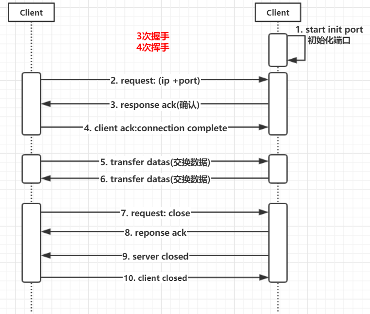
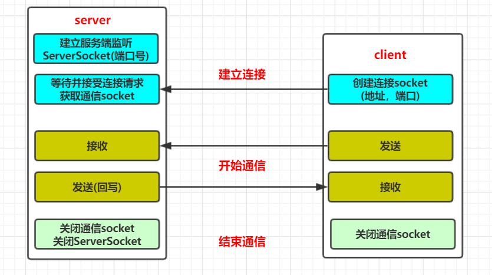

# socket编程

[TOC]

<br>

## 网络编程(Socket)概念

Socket并不是Java中独有的概念，而是一个语言无关标准，任何可以实现网络编程的编程语言都有Socket。

### 什么是Socket

**网络上的两个程序通过一个双向的通信连接实现数据的交换，这个连接的一端称为一个socket。**

建立网络通信连接至少要 **一对端口号(socket)**。socket本质是**编程接口(API)**，**对TCP/IP的封装**，TCP/IP也要提供可供程序员做网络开发所用的接口，这就是Socket编程接口；

Http是轿车，提供了封装或者显示数据的具体形式；

Socket是发动机，提供了网络通信的能力。

<br>

## Socket连接步骤

根据连接启动的方式以及本地套接字要连接的目标，套接字之间的连接过程可以分为三个步骤：

- 服务器监听
- 客户端请求
- 连接确认

值得注意的是：如果包含 **数据交互 + 断开连接**， 那么一共是5个步骤。

<br>

1. 服务器监听：服务器套接字并不定位具体的客户端套接字，而是处于等待连接的状态，实时监控网络状态。
2. 客户端请求：是指由客户端的套接字提出连接请求，要连接的目标是服务器端的套接字。为此，客户端的套接字必须首先描述它要连接的服务器的套接字，指出服务器端套接字的 **地址和端口号**，然后就向服务器端提出连接请求
3. 连接确认：是指当服务器端监听到或者说接收到客户端套接字的连接请求，他就响应客户端套接字的请求，建立一个新的线程，把服务器端的描述发给客户端，一旦客户端确认了此描述，连接就建立好了。而服务器端套接字继续处于监听状态，继续接受其他客户端套接字的连接请求。

<br>

### 图示客户端和服务器的三次握手四次挥手



<br>

### java中的socket

在java.net 包是网络编程的基础类库。其中 ServerSocket和Socket是网络编程的基础类型。

ServerSocket是**服务端应用类型**。Socket是**建立连接类型**。

当连接建立成功后，服务器和客户端都会有一个Socket对象实例，可以通过这个Socket对象实例，完成会话的所有操作。

对于一个完整的网络连接来说，Socket是平等的，没有服务器客户端分级的情况。也就是说，服务器端和客户端的socket是平等。

<br>

**socket通信模型**


- 服务器需要先启动，等待客户端连接
- 客户端主动连接服务器，连接成功才能通信

<br>

## socket编程

### 字节流版本

**Server:**

````java
package com.cwy.socket.socket1;

import java.io.IOException;
import java.io.InputStream;
import java.io.OutputStream;
import java.net.ServerSocket;
import java.net.Socket;

/**
 * @description: 字节流版本的服务端
 */
public class Server {
    public static void main(String[] args) {
        try {
            ServerSocket serverSocket = new ServerSocket(8888);//指定端口
            System.out.println("服务端已建立连接，等待客户端连接");
            //获取建立连接类型的socket
            //accept()阻塞着等待连接
            Socket s = serverSocket.accept();
            InputStream is = s.getInputStream();//获取字节流
            OutputStream os = s.getOutputStream();
            byte[] b = new byte[1024];

            //接收客户端的请求
            int len = is.read(b);
            String str = new String(b, 0, len);
            System.out.println("客户端：" + str);

            //回写客户端
            os.write("这是A资源，给你了".getBytes());

            //关闭资源
            is.close();
            os.close();
            s.close();
            serverSocket.close();
            System.out.println("服务器端已关闭");
        } catch (IOException e) {
            e.printStackTrace();
        }
    }
}

````

<br>

**Client:**

```java
package com.cwy.socket.socket1;

import java.io.IOException;
import java.io.InputStream;
import java.io.OutputStream;
import java.net.InetAddress;
import java.net.Socket;
import java.net.UnknownHostException;

/**
 * @description: 字节流版本的客户端
 */

public class Client {
    public static void main(String[] args) {
        try {
            //指定服务器的地址和端口
            //Socket s = new Socket(InetAddress.getLocalHost(), 8888);
            Socket s = new Socket("127.0.0.1", 8888);
            InputStream is = s.getInputStream();
            OutputStream os = s.getOutputStream();

            //发送请求数据
            os.write("你好，服务器，我要A资源".getBytes());
            byte[] b = new byte[1024];
            int len = -1;
            //接收回写数据
            while ((len = is.read(b)) > 0){
                String str = new String(b,0,len);
                System.out.println("服务端的回复:" + str);
            }
            is.close();
            os.close();

            //关闭通信
            s.close();
            System.out.println("客户端已关闭");
        }catch (UnknownHostException e){
            e.printStackTrace();
        }catch (IOException e) {
            e.printStackTrace();
        }
    }
}

```

<br>

```java
server输出:
服务端已建立连接，等待客户端连接
客户端：你好，服务器，我要A资源
服务器端已关闭

client输出：
服务端的回复:这是A资源，给你了
客户端已关闭
```

<br>


### 字符流版本

**Server:**

```java
package com.cwy.socket.socket2;

import java.io.*;
import java.net.ServerSocket;
import java.net.Socket;

//字符流版本的server
public class Server {
    public static void main(String[] args) {
        try{
            //建立通信
            ServerSocket serverSocket = new ServerSocket(9999);
            System.out.println("服务器已经建立连接");
            Socket s = serverSocket.accept();

            InputStream is = s.getInputStream();
            InputStreamReader isr = new InputStreamReader(is);
            BufferedReader br = new BufferedReader(isr);
            OutputStream os = s.getOutputStream();
            PrintWriter pw = new PrintWriter(os);

            //获取服务端请求
            String str = br.readLine();
            System.out.println("客户端：" + str);

            //回写数据
            pw.print("你好，我是服务器，给你A资源");
            pw.flush();

            //关闭资源
            br.close();
            isr.close();
            is.close();
            pw.close();
            os.close();
            s.close();
            serverSocket.close();
        } catch (IOException e) {
            e.printStackTrace();
        }
    }
}

```

<br>
**Client:**

```java
package com.cwy.socket.socket2;

import java.io.*;
import java.net.InetAddress;
import java.net.Socket;
import java.net.UnknownHostException;

//字符流的客户端
public class Client {
    public static void main(String[] args) {
        Socket s;
        try {
            //建立连接
            s = new Socket(InetAddress.getLocalHost(), 9999);

            OutputStream os = s.getOutputStream();
            PrintWriter pw = new PrintWriter(os);
            InputStream is = s.getInputStream();
            InputStreamReader isr = new InputStreamReader(is);
            BufferedReader br = new BufferedReader(isr);

            //发送请求
            pw.println("你好，我是客户端，我要A资源");
            pw.flush();

            //接收数据
            String str = br.readLine();
            System.out.println("服务端:" + str);

            //关闭资源
            br.close();
            isr.close();
            is.close();
            pw.close();
            os.close();
            s.close();
        }catch (UnknownHostException e){
            e.printStackTrace();
        }catch (IOException e) {
            e.printStackTrace();
        }
    }
}

```

<br>

```
Server:
服务器已经建立连接
客户端：你好，我是客户端，我要A资源

Client:
服务端:你好，我是服务器，给你A资源
```

<br>


### socket发送文件

**Server：**

```java
package com.cwy.socket.socket3;

import java.io.*;
import java.net.ServerSocket;
import java.net.Socket;

// socket发送文件的服务端
public class Server {
    public static void main(String[] args) {
        try {
            //建立连接
            ServerSocket serverSocket = new ServerSocket(8888);
            System.out.println("服务端已建立，等待客户端连接...");
            Socket s = serverSocket.accept();

            //输入流
            InputStream is = s.getInputStream();
            InputStreamReader isr = new InputStreamReader(is);
            BufferedReader br = new BufferedReader(isr);

            //读文件名
            String fileName = br.readLine();
            System.out.println(fileName);
            //修改文件名为2.png
            fileName = "2.png";
            FileOutputStream fos = new FileOutputStream(fileName);

            //读取文件
            byte[] b = new byte[1024];
            int len = -1;
            while (true){
                len = is.read(b);
                if(len == -1){
                    break;
                }
                //将读取客户端的文件读到磁盘中
                fos.write(b,0,len);
            }

            //关闭资源
            fos.close();
            is.close();
            s.close();
            serverSocket.close();
        } catch (IOException e) {
            e.printStackTrace();
        }finally {
            System.out.println("服务端已关闭");
        }
    }
}

```

<br>

**Client:**

```java
package com.cwy.socket.socket3;

import java.io.*;
import java.net.InetAddress;
import java.net.Socket;
import java.net.UnknownHostException;

//socket发送文件(带文件名)的客户端
public class Client {
    public static void main(String[] args) {
        try{
            //建立连接
            Socket s = new Socket(InetAddress.getLocalHost(), 8888);

            //输出流
            OutputStream os = s.getOutputStream();
            PrintWriter pw = new PrintWriter(os,true);

            //文件读入
            String fileName = "src/com/cwy/socket/socket3/1.png";
            File f = new File(fileName);
            System.out.println("发送文件，名为:" + fileName);
            FileInputStream fis = new FileInputStream(f);

            //写文件名
            pw.println(f.getName());

            //文件内容发送
            byte[] b = new byte[1024];
            int len = -1;
            while ((len = fis.read(b)) > 0){
                os.write(b,0,len);
            }

            //关闭资源
            pw.close();
            fis.close();
            os.close();
            s.close();
        }catch (UnknownHostException e){
            e.printStackTrace();
        }catch (IOException e){
            e.printStackTrace();
        }finally {
            System.out.println("客户端已关闭");
        }
    }
}

```

<br>

```
Server:
服务端已建立，等待客户端连接...
1.png
服务端已关闭

Client:
发送文件，名为:src/com/cwy/socket/socket3/1.png
客户端已关闭
```

<br>

将 **src/com/cwy/socket/socket3/** 路径下的1.png 图片发送给服务端，服务端改名为2.png，并写入到磁盘中，位于src 目录下。

<br>


## 参考

[Java基础教程——Socket编程](https://www.cnblogs.com/tigerlion/p/11182815.html)<br>

