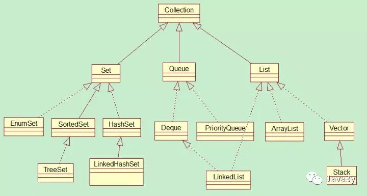

# java集合概述

**版本： JDK 1.8**

## 一、 java 集合思维导图

## 二、Collection总览

## 三、 数组与集合的区别

### 1. 长度区别

- 数组长度固定
- 集合长度可变

### 2. 内容不容

- 数组存储的是同一种类型的元素
- 集合可以存储不同类型的元素（一般不这么做）

### 3. 元素的数据类型

- 数组可以存储基本数据类型，也可以存储引用数据类型
- **集合只能存储引用数据类型（存储int，会自动装箱为Integer，类推）**

## 四、 常见的Collection集合类

### 4.1 List

**List 集合常用的子类有：**

1. ArrayList

   底层数据结构是数组，线程不安全

2. LinkedList

   底层数据结构是链表，线程不安全

3. Vector

   底层数据结构是数组，线程不安全

### 4.2 Set

1. HashSet

   底层数据结构是哈希表（是一个元素为链表的数组）

2. TreeSet

   底层数据结构是红黑树（是一个自平衡的二叉树）

3. LinkedHashSet

   底层数据结构由哈希表和链表组成

## 五、Map 与 集合的区别

### 5.1 Map 的特点

将键映射到值的对象，一个映射不能包含重复的键，每个键最多只能映射一个值

### 5.2 Map 和 Collection集合的区别

1. Map集合存储元素是成对出现的，Map的键是唯一的，值是可以重复的
2. Collection集合存储的元素是单独出现的，Collection中**Set类**是惟一的，**List** 是可重复的

### 5.3 要点

1. Map集合的数据结构针对键有效，跟值无关
2. Collection集合的数据结构针对元素有效

## 六、 常见的Map集合类

1. HashMap

   底层数据结构是：**数组+链表+红黑树 **

2. TreeMap

   底层数据结构是：**红黑树**

## 参考：

[collection总览](https://mp.weixin.qq.com/s?__biz=MzI4Njg5MDA5NA==&mid=2247484122&idx=1&sn=c3bd6436b3e661ae15cb9d7154d82b89&chksm=ebd743dbdca0cacdcb272576f4be48c466bd73160a87227314e8fb21d5e4f9156c23902198ab#rd)

[Map集合、散列表、红黑树介绍](<https://mp.weixin.qq.com/s?__biz=MzI4Njg5MDA5NA==&mid=2247484135&idx=1&sn=be2221572ffc82f5792dd4ef1ea8e309&chksm=ebd743e6dca0caf00f188cabafc73665b875bf1cbe92cf3626cedb4f80313bb20a7429b8ec3f#rd>)

