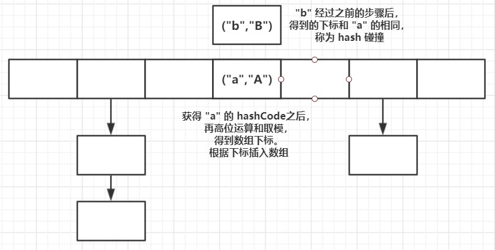
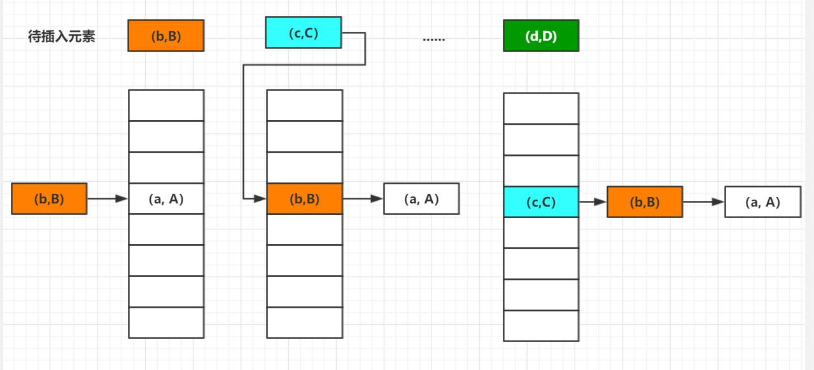
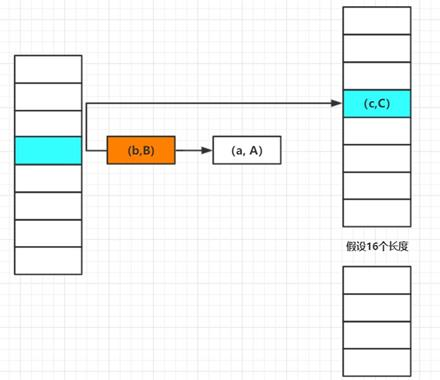
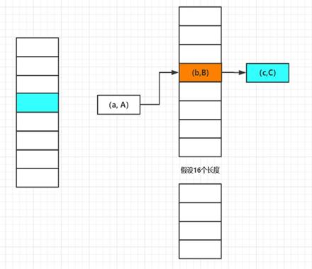
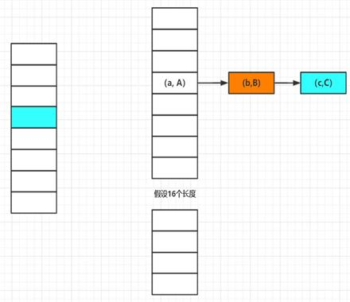
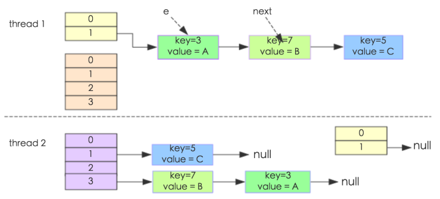
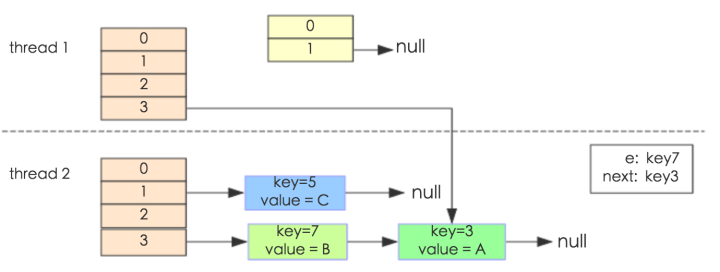
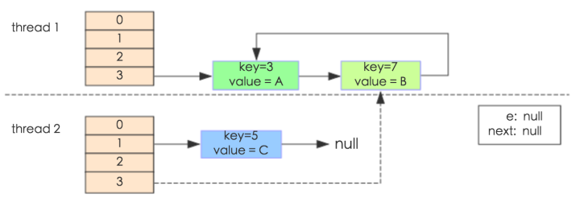

# 五、HashMap源码分析

<br>

**版本：JDK1.8**

<br>

## 一、 简介

### 1. 1 HashMap 继承关系


<br>

### 1.2 HashMap简介

(1) HashMap：它根据 **键的hashCode值** 存储数据，大多数情况下可以直接定位到它的值，因而具有很快的访问

速度，但遍历顺序却是不确定的。 HashMap**最多只允许一条记录的键为null**，**允许多条记录的值为null。**

HashMap**非线程安全**，即任一时刻可以有多个线程同时写HashMap，可能会导致数据的不一致。如果需要满足线

程安全，可以用 Collections的**synchronizedMap**方法使HashMap具有线程安全的能力，或者使用**ConcurrentHashMap**。


### 1.3 HashMap 的结构

**Has和Map 的底层结构:**

**JDK 1.7:**   **数组 + 链表  **     **(数组的每一项都是链表)**

**JDK 1.8**:  **数组 + 链表 + 红黑树**

<br>

**图示**：


<br>


## 二、 HashMap源码分析

### 2. 1 定义

```java
public class HashMap<K,V> extends AbstractMap<K,V>
    implements Map<K,V>, Cloneable, Serializable {
```

<br>

### 2.2 属性

```java

private static final long serialVersionUID = 362498820763181265L;

// 默认初始化哈希桶数组容量为 16(左移4位)
static final int DEFAULT_INITIAL_CAPACITY = 1 << 4; // aka 16

// 最大的容量
static final int MAXIMUM_CAPACITY = 1 << 30;

// 默认的负载因子(0.75是对 空间和时间效率 的一个平衡选择，建议不要修改)
static final float DEFAULT_LOAD_FACTOR = 0.75f;

//链表转成红黑树的阈值。即在哈希表扩容时，当链表的长度(桶中元素个数)超过这个值的时候，进行链表到红黑树的转变
static final int TREEIFY_THRESHOLD = 8;

//红黑树转为链表的阈值。即在哈希表扩容时，如果发现链表长度(桶中元素个数)小于 6，则会由红黑树重新退化为链表
static final int UNTREEIFY_THRESHOLD = 6;

/**
 * HashMap 的最小树形化容量。这个值的意义是：位桶（bin）处的数据要采用红黑树结构进行存储时，整个Table的  		最小容量（存储方式由链表转成红黑树的容量的最小阈值）
 * 当哈希表中的容量大于这个值时，表中的桶才能进行树形化，否则桶内元素太多时会扩容，而不是树形化
 * 为了避免进行扩容、树形化选择的冲突，这个值不能小于 4 * TREEIFY_THRESHOLD
 */
static final int MIN_TREEIFY_CAPACITY = 64;

// 哈希桶数组，分配的时候，table的长度总是2的幂
transient Node<K,V>[] table;


transient Set<Map.Entry<K,V>> entrySet;

// 整个HashMap实际存储的 key-value 键值对数量
transient int size;

// HashMap 内部结构发生变化的次数
transient int modCount;

//HashMap所能容纳的最大数据量的Node(key-value 键值对)个数。threshold = length * Loadfactor
int threshold;

// 负载因子
final float loadFactor;
```

<br>

### 2.3 HashMap 构造函数


#### 2.3.1 无参构造函数（默认容量16、默认负载因子0.75f）

```java
public HashMap() {
    // 默认负载因子是 0.75f
    this.loadFactor = DEFAULT_LOAD_FACTOR; // all other fields defaulted
}
```

<br>

#### 2.3.2 指定初始化容量的构造函数（默认负载因子0.75f）

```java
public HashMap(int initialCapacity) {
    // 负载因子为默认的0.75f
    this(initialCapacity, DEFAULT_LOAD_FACTOR);
}
```

<br>

#### 2.3.3 指定初始化容量 和 负载因子的构造函数

```java
public HashMap(int initialCapacity, float loadFactor) {
    // 初始容量 < 0 ，抛出异常
    if (initialCapacity < 0)
        throw new IllegalArgumentException("Illegal initial capacity: " +
                                           initialCapacity);
    // 初始化容量 > 系统能提供的最大容量， 提供最大容量为初始化容量，不能再多了
    if (initialCapacity > MAXIMUM_CAPACITY)
        initialCapacity = MAXIMUM_CAPACITY;
    // 负载因子 <=0 或者 负载因子为空，抛出异常
    if (loadFactor <= 0 || Float.isNaN(loadFactor))
        throw new IllegalArgumentException("Illegal load factor: " +
                                           loadFactor);
    this.loadFactor = loadFactor;
    this.threshold = tableSizeFor(initialCapacity);
}
```

<br>

#### 2.3.4

```java
public HashMap(Map<? extends K, ? extends V> m) {
    this.loadFactor = DEFAULT_LOAD_FACTOR;
    putMapEntries(m, false);
}
```

<br>


### 2.4 节点的定义

#### 2.4.1 Node节点 （链表节点）


**Node是 HashMap 的静态内部类**

实现了 **`Map.Entry`** 接口，本质是就是一个映射(键值对)。上图中的 **每个黑色圆点** 就是一个Node对象。

```java
static class Node<K,V> implements Map.Entry<K,V> {
    final int hash;	// hash值
    final K key;	//键
    V value;		//值
    Node<K,V> next;	//链表的下一个节点

    Node(int hash, K key, V value, Node<K,V> next) {
        this.hash = hash;
        this.key = key;
        this.value = value;
        this.next = next;
    }

    public final K getKey()        { return key; }
    public final V getValue()      { return value; }
    public final String toString() { return key + "=" + value; }

    public final int hashCode() {
        return Objects.hashCode(key) ^ Objects.hashCode(value);
    }

    public final V setValue(V newValue) {
        V oldValue = value;
        value = newValue;
        return oldValue;
    }

    public final boolean equals(Object o) {
        if (o == this)
            return true;
        if (o instanceof Map.Entry) {
            Map.Entry<?,?> e = (Map.Entry<?,?>)o;
            if (Objects.equals(key, e.getKey()) &&
                Objects.equals(value, e.getValue()))
                return true;
        }
        return false;
    }
}
```


<br>

#### 2.4.2 TreeNode 节点 （红黑树节点）


```java
static final class TreeNode<K,V> extends LinkedHashMap.Entry<K,V> {
    TreeNode<K,V> parent;  // 父节点
    TreeNode<K,V> left;	   //左孩子节点
    TreeNode<K,V> right;   //右孩子节点
    TreeNode<K,V> prev;    // needed to unlink next upon deletion
    boolean red;
    TreeNode(int hash, K key, V val, Node<K,V> next) {
        super(hash, key, val, next);
    }

    /**
     * Returns root of tree containing this node.
     */
    final TreeNode<K,V> root() {
        for (TreeNode<K,V> r = this, p;;) {
            if ((p = r.parent) == null)
                return r;
            r = p;
        }
    }
```


<br>

### 2.5 确定下标的过程

在增删改查之前，我们先了解hash的过程

#### 2.5.1 为什么要先确定下标

先根据 key 确定 哈希桶数组下标位置，好处在于 **不用遍历链表***， 大大优化了查询的效率。

HashMap就是使用 **哈希表** 来存储的。哈希表为解决冲突，可以采用 **开放地址法** 和 **链地址法** 等来解决问题，Java

中HashMap采用了 **链地址法** 。链地址法，简单来说，就是 **数组加链表的结合** 。**在每个数组元素上都一个链**

**表结构，当数据被Hash后，得到数组下标，把数据放在对应下标元素的链表上。** 例如程序执行下面代码：

```java
map.put("a", "A");
```

系统将调用 “**a**” 这个 key 的 **hashCode** 值，再通过Hash算法的后两步运算（**高位运算和取模运算**，下文有介

绍）来定位该键值对的存储位置，有时两个key会定位到**相同的位置**，表示发生了**Hash碰撞**。当然Hash算法**计算**

**结果越分散均匀，Hash碰撞的概率就越小，map的存取效率就会越高。**

<br>

**图示**：



<br>

如果 **哈希桶数组(就是上面提到的数组表)** 很大，即使较差的Hash算法也会比较分散，如果哈希桶数组数组很小，

即使好的Hash算法也会出现较多碰撞，所以就需要在**空间成本**和**时间成本**之间权衡，**其实就是在根据实际情况确**

**定哈希桶数组的大小，并在此基础上设计好的hash算法减少Hash碰撞**。那么通过什么方式来控制map使得Hash

碰撞的概率又小，哈希桶数组（Node[] table）占用空间又少呢？答案就是好的**Hash算法**和**扩容机制**。

<br>


#### 2.5.2 确定哈希桶数组下标位置


hash的方法，下面分别是**1. 7 和 1.8 版本**的， **实现原理是一样的**：

<br>

比如在 新增元素的时候，为什么要先确定哈希桶数组

**JDK 1.7**

在put方法中， 先算出hash值，

**`int hash = hash(key);`**

在根据hash值，通过 **&** 运算，得到 **哈希桶数组下标**。

**`int i = indexFor(hash, table.length);`**

**i** 就是 下标。

```java
static int indexFor(int h, int length) {  
     return h & (length-1); // 取模运算
}
```

<br>


**JDK 1.8:**

**hash() 方法**：

```java
static final int hash(Object key) {
    int h;
    //1.h = key.hashCode()  第一步，取hashCode 值
    //2.h^(h>>>16) 			第二步，高位参与运算
    return (key == null) ? 0 : (h = key.hashCode()) ^ (h >>> 16);
}
```


**hashCode() 方法**：获得 key 的hash 值

```java
public native int hashCode();
```

**这是一个native方法**

<br>

#### 2.5.3 **原理讲解**：


在 JDK 1.7 中，**`int hash = hash(key);`**，假如得到的

 **hash值**为    **`0101 0101`** , 

**`length`** 为   **`0001 0000`**, 那么

 **`length-1`** 为：**`0000 1111`**。**(16 - 1)**

那我们将 **hash值** 与 **15**  的 **二进制数** **相与**，得到数组下标：即

**h:   `0101  0101`**

**15: `0000  1111`**

**& :  `0000  0101`**

<br>

可以发现 **hash值**与**length-1** 相与之后，得到的下标就是 hash值的**后四位**。而四位二进制的范围是 **0000-1111**，即 **0 - 15**。刚好 16 个数，刚好等于 哈希桶数组的长度。二就是说经过相与之后，下标总是在 范围之内。这种算法非常巧妙。但是 **模运算（%）** 也可以做到这一点，**(h&(length-1)=h%length)** ，为什么不直接用 模运算呢。原因在于 **% 运算比 & 运算慢。**

<br>

我们可以引申出另一个问题，

**哈希桶数组容量为什么是2的幂呢**：

① length为2的幂，可以表示为 **1000...00** 的形式（至少一个0），那么length-1就是 **011....111**。

对于任意**小于** length 的hash值来说，与011....111相与就是 **hash值本身**

对于任意**等于**length 的hash值，相与 **=0** 

对于任意**大于**length 的hash值，相与就是 **h-j*length**, 也就是**hash%length**。

为了优化，&运算，效率高。

② length 为2的幂，是**偶数**，length -1 就是**奇数**。二进制最后一位数就是**1**， 这样和 hash值 & 之后，既有偶数，

又有奇数。可以保证**散列的均匀性**。反之，length不为2的幂，length-1 是偶数，会浪费近一半的空间。**哈希碰撞**

**概率大，空间利用率小。**

<br>

**那为什么高位还要参与运算呢。**

原因在于如果一类hash，特点是低位都是 0 ，高位才有变化。那么计算出来的结果会导致很多哈希冲突。

想一想，如果这样的话，哈希桶数组中某一个节点的链表就会很长，那么查询时，效率会贬低。

所以高位要参与运算。

<br>

在JDK1.8的实现中，优化了高位运算的算法，通过hashCode()的高16位异或低16位实现的：

(**`h = k.hashCode()) ^ (h >>> 16`**)，主要是从**速度、功效、质量**来考虑的，这么做可以在数组table的length

比较小的时候，也能保证考虑到高低Bit都参与到Hash的计算中，同时不会有太大的开销。


<br>


### 2.6 添加元素  put(K key, V value)

#### 2.6.1 put方法


**首先，先看put方法 的流程图**：


<br>

**代码**：

```java
public V put(K key, V value) {
    return putVal(hash(key), key, value, false, true);
}
```

<br>


**putVal() 方法**：

```java
final V putVal(int hash, K key, V value, boolean onlyIfAbsent,
               boolean evict) {
    Node<K,V>[] tab; Node<K,V> p; int n, i;
    
    //1. 节点类型的 tab数组如果为空，就创建一个
    //其中，resize() 方法为扩容方法，将在下面讲解
    // n 为数组的长度
    if ((tab = table) == null || (n = tab.length) == 0)
        n = (tab = resize()).length;
    
    //2. 计算index，并对index做null处理。table[i] =null
    //(n-1)&hash 与Java7中indexFor方法的实现相同。
    //若i位置上的值为空，则新建一个Node，table[i]指向该Node。
    if ((p = tab[i = (n - 1) & hash]) == null)
        tab[i] = newNode(hash, key, value, null);//直接在哈希桶数组中插入节点
    else { //3. i位置不为空
        //判断当前i位置的节点 Node p 是否与要插入的元素的 hash和key值 相同
        Node<K,V> e; K k;
        //相同，说明已经存在一个值，覆盖原 value
        if (p.hash == hash &&
            ((k = p.key) == key || (key != null && key.equals(k))))
            e = p;
        //4. 判断i位置table[i] 新增的Node节点p 是不是 红黑树类型 
        else if (p instanceof TreeNode)
            // 是，直接在红黑树插入键值对。用红黑树的 putTreeval() 方法
            e = ((TreeNode<K,V>)p).putTreeVal(this, tab, hash, key, value);
        else {
            //只剩在链表中插入元素的情况了。
            //5. 在i位置的链表中，向下遍历，找到p.next=null的位置，binCount是当前链表的长度，判断如果新增了节点，长度超过了 tree化的阈值，就将链表转为 tree
            for (int binCount = 0; ; ++binCount) {
                if ((e = p.next) == null) {
                    p.next = newNode(hash, key, value, null);
                    //长度大于tree化阈值
                    if (binCount >= TREEIFY_THRESHOLD - 1) // -1 for 1st
                        //tree化
                        treeifyBin(tab, hash);
                    break;
                }
                //遍历链表中，发现key已经存在，直接覆盖旧value
                if (e.hash == hash &&
                    ((k = e.key) == key || (key != null && key.equals(k))))
                    break;
                p = e;
            }
        }
        // 已经存在该key的情况时，将对应的节点的value设置为新的value
        if (e != null) { // existing mapping for key
            V oldValue = e.value;
            if (!onlyIfAbsent || oldValue == null)
                e.value = value;
            afterNodeAccess(e);
            return oldValue;
        }
    }
    ++modCount;
    //6. 插入成功后，判断实际存在的键值对数量 size 是否超多了最大容量 threshold，如果超过，进行扩容
    if (++size > threshold)
        resize();
    afterNodeInsertion(evict);
    return null;
}
```

<br>


#### 2.6.2 扩容

##### 1.  JDK 1.7 版本


在JDK1.7 中，扩容的方法如下：**(其中，Entry[] 数组相当于 JDK1.8 中的 Node[] )**

```java
//用新的容量来给table扩容
void resize(int newCapacity) {
	Entry[] oldTable = table; 	//保存old table
	int oldCapacity = oldTable.length; //保存old capacity
	// 如果旧的容量已经是系统默认最大容量了，那么将阈值设置成整型的最大值（2^30）
	if (oldCapacity == MAXIMUM_CAPACITY) {
		threshold = Integer.MAX_VALUE;
		return;
	}
 
	//根据新的容量新建一个table
	Entry[] newTable = new Entry[newCapacity];
	//将table转换成newTable
	transfer(newTable, initHashSeedAsNeeded(newCapacity));
	table = newTable;
	//设置阈值
	threshold = (int)Math.min(newCapacity * loadFactor, MAXIMUM_CAPACITY + 1);
}
```

<br>

**transfer函数：将原数组转移到新数组的过程**:

```java
 1 void transfer(Entry[] newTable) {
 2     Entry[] src = table;                   //src引用了旧的Entry数组
 3     int newCapacity = newTable.length;
 4     for (int j = 0; j < src.length; j++) { //遍历旧的Entry数组
 5         Entry<K,V> e = src[j];             //取得旧Entry数组的每个元素
 6         if (e != null) {
 7             src[j] = null;//释放旧Entry数组的对象引用（for循环后，旧的Entry数组不再引用任何对象）
 8             do {
 9                 Entry<K,V> next = e.next;
10                 int i = indexFor(e.hash, newCapacity); //！！重新计算每个元素在数组中的位置
11                 e.next = newTable[i]; //标记[1]
12                 newTable[i] = e;      //将元素放在数组上
13                 e = next;             //访问下一个Entry链上的元素
14             } while (e != null);
15         }
16     }
17 }

```

<br>

**首先，先来了解 JDK 1.7中，添加元素的过程：**

**图示**：



<br>

从图中，我们可以看出，JDK1.7版本的 HashMap，插入元素是在**头部插入元素。**

接着看扩容过程：

**图示**：

| 1                                               | 2                                               |
| ----------------------------------------------- | ----------------------------------------------- |
|  |  |
| 3                                               | 4                                               |
|  |  |

<br>

可以看出库容过程是：

- 把哈希桶数组长度扩大
- 把Entry链 从头节点到尾 依次复制到新的哈希桶数组中。

但是这样做，带来新的问题：

- 元素节点的顺序与原来的**颠倒**了
- 可能会出现**环形链表**的情况(多线程情况下)
- 在旧数组中同一条Entry链上的元素，通过重新计算索引位置后，有可能被放到了**新数组的不同位置上**。

**图示**：


<br>

<br>

##### 2. JDK 1.8版本（来源：[Java 8系列之重新认识HashMap](<https://zhuanlan.zhihu.com/p/21673805>)）

**接着，了解一下JDK1.8的扩容机制：**

经过观测可以发现，我们使用的是2次幂的扩展(指长度扩为原来2倍)，所以，元素的位置要么是在原位置，要么是

在原位置再移动2次幂的位置。看下图可以明白这句话的意思，n为table的长度，图（a）表示扩容前的key1和

key2两种key确定索引位置的示例，图（b）表示扩容后key1和key2两种key确定索引位置的示例，其中hash1是

key1对应的哈希与高位运算结果。


元素在重新计算hash之后，因为n变为2倍，那么n-1的mask范围在高位多1bit(红色)，因此新的index就会发生这样的变化：


因此，我们在扩充HashMap的时候，不需要像JDK1.7的实现那样重新计算hash，只需要看看原来的hash值新增的那个bit是1还是0就好了，是0的话索引没变，是1的话索引变成“原索引+oldCap”，可以看看下图为16扩充为32的resize示意图：


**巧妙之处**：

- 省去了重新计算hash值的时间

- 同时，由于新增的1bit是0还是1可以认为是随机的，因此resize的过程，均匀的把之前的冲突的节点分散到新

  的bucket了。

这一块就是JDK1.8新增的优化点。有一点注意区别，JDK1.7中rehash的时候，旧链表迁移新链表的时候，如果在

新表的数组索引位置相同，则**链表元素会倒置**，但是从上图可以看出，**JDK1.8不会倒置**。

<br>

**JDK 1.8 resize() 方法源码**：

```java
final Node<K,V>[] resize() {
 2     Node<K,V>[] oldTab = table;
 3     int oldCap = (oldTab == null) ? 0 : oldTab.length;
 4     int oldThr = threshold;
 5     int newCap, newThr = 0;
 6     if (oldCap > 0) {
 7         // 超过最大值就不再扩充了，就只好随你碰撞去吧
 8         if (oldCap >= MAXIMUM_CAPACITY) {
 9             threshold = Integer.MAX_VALUE;
10             return oldTab;
11         }
12         // 没超过最大值，就扩充为原来的2倍
13         else if ((newCap = oldCap << 1) < MAXIMUM_CAPACITY &&
14                  oldCap >= DEFAULT_INITIAL_CAPACITY)
15             newThr = oldThr << 1; // double threshold
16     }
17     else if (oldThr > 0) // initial capacity was placed in threshold
18         newCap = oldThr;
19     else {               // zero initial threshold signifies using defaults
20         newCap = DEFAULT_INITIAL_CAPACITY;
21         newThr = (int)(DEFAULT_LOAD_FACTOR * DEFAULT_INITIAL_CAPACITY);
22     }
23     // 计算新的resize上限
24     if (newThr == 0) {
25 
26         float ft = (float)newCap * loadFactor;
27         newThr = (newCap < MAXIMUM_CAPACITY && ft < (float)MAXIMUM_CAPACITY ?
28                   (int)ft : Integer.MAX_VALUE);
29     }
30     threshold = newThr;
31     @SuppressWarnings({"rawtypes"，"unchecked"})
32         Node<K,V>[] newTab = (Node<K,V>[])new Node[newCap];
33     table = newTab;
34     if (oldTab != null) {
35         // 把每个bucket都移动到新的buckets中
36         for (int j = 0; j < oldCap; ++j) {
37             Node<K,V> e;
38             if ((e = oldTab[j]) != null) {
39                 oldTab[j] = null;
40                 if (e.next == null)
41                     newTab[e.hash & (newCap - 1)] = e;
42                 else if (e instanceof TreeNode)
43                     ((TreeNode<K,V>)e).split(this, newTab, j, oldCap);
44                 else { // 链表优化重hash的代码块
45                     Node<K,V> loHead = null, loTail = null;
46                     Node<K,V> hiHead = null, hiTail = null;
47                     Node<K,V> next;
48                     do {
49                         next = e.next;
50                         // 原索引
51                         if ((e.hash & oldCap) == 0) {
52                             if (loTail == null)
53                                 loHead = e;
54                             else
55                                 loTail.next = e;
56                             loTail = e;
57                         }
58                         // 原索引+oldCap
59                         else {
60                             if (hiTail == null)
61                                 hiHead = e;
62                             else
63                                 hiTail.next = e;
64                             hiTail = e;
65                         }
66                     } while ((e = next) != null);
67                     // 原索引放到bucket里
68                     if (loTail != null) {
69                         loTail.next = null;
70                         newTab[j] = loHead;
71                     }
72                     // 原索引+oldCap放到bucket里
73                     if (hiTail != null) {
74                         hiTail.next = null;
75                         newTab[j + oldCap] = hiHead;
76                     }
77                 }
78             }
79         }
80     }
81     return newTab;
82 }
```


#### 2.6.3 环形链表（来源：[Java 8系列之重新认识HashMap](<https://zhuanlan.zhihu.com/p/21673805>)）

在多线程使用场景中，应该尽量避免使用线程不安全的HashMap，而使用线程安全的ConcurrentHashMap。那

么为什么说HashMap是线程不安全的，下面举例子说明在并发的**多线程**使用场景中使用HashMap可能造成死循

环。代码例子如下(便于理解，仍然使用JDK1.7的环境)：

```java
public class HashMapInfiniteLoop {  

    private static HashMap<Integer,String> map = new HashMap<Integer,String>(2，0.75f);  
    public static void main(String[] args) {  
        map.put(5， "C");  

        new Thread("Thread1") {  
            public void run() {  
                map.put(7, "B");  
                System.out.println(map);  
            };  
        }.start();  
        new Thread("Thread2") {  
            public void run() {  
                map.put(3, "A);  
                System.out.println(map);  
            };  
        }.start();        
    }  
}
```

  其中，map初始化为一个长度为2的数组，loadFactor=0.75，threshold=2*0.75=1，也就是说当put第二个key

的时候，map就需要进行resize。

通过设置断点让线程1和线程2同时debug到transfer方法(3.3小节代码块)的首行。注意此时两个线程已经成功添加

数据。放开thread1的断点至transfer方法的“Entry next = e.next;” 这一行；然后放开线程2的的断点，让线程2进

行resize。结果如下图。



注意，Thread1的 e 指向了key(3)，而next指向了key(7)，其在线程二rehash后，指向了线程二重组后的链表。

线程一被调度回来执行，先是执行 newTalbe[i] = e， 然后是e = next，导致了e指向了key(7)，而下一次循环的

next = e.next导致了next指向了key(3)。



e.next = newTable[i] 导致 key(3).next 指向了 key(7)。注意：此时的key(7).next 已经指向了key(3)， 环形链表就

这样出现了。



于是，当我们用线程一调用map.get(11)时，悲剧就出现了——Infinite Loop。

<br>

<br>


### 2.7 查找

```java
public V get(Object key) {
    Node<K,V> e;
    return (e = getNode(hash(key), key)) == null ? null : e.value;
}
// 获取hash值
static final int hash(Object key) {
    int h;
    // 拿到key的hash值后与其五符号右移16位取与
    // 通过这种方式，让高位数据与低位数据进行异或，以此加大低位信息的随机性，变相的让高位数据参与到计算中。
    return (key == null) ? 0 : (h = key.hashCode()) ^ (h >>> 16);
}

final Node<K,V> getNode(int hash, Object key) {
    Node<K,V>[] tab; 
    Node<K,V> first, e; 
    int n; K k;
    // 定位键值对所在桶的位置
    if ((tab = table) != null && (n = tab.length) > 0 &&
        (first = tab[(n - 1) & hash]) != null) {
        // 判断桶中第一项(数组元素)相等
        if (first.hash == hash && // always check first node
            ((k = first.key) == key || (key != null && key.equals(k))))
            return first;
        // 桶中不止一个结点
        if ((e = first.next) != null) {
            // 是否是红黑树，是的话调用getTreeNode方法
            if (first instanceof TreeNode)
                return ((TreeNode<K,V>)first).getTreeNode(hash, key);
            // 不是红黑树的话，在链表中遍历查找    
            do {
                if (e.hash == hash &&
                    ((k = e.key) == key || (key != null && key.equals(k))))
                    return e;
            } while ((e = e.next) != null);
        }
    }
    return null;
}
```


### 2.7 删除元素


```java
public V remove(Object key) {
    Node<K,V> e;
    //判断删除的元素是否为空，为空，返回null，不为空，返回旧值
    return (e = removeNode(hash(key), key, null, false, true)) == null ?
        null : e.value;
}
```

<br>

```java
final Node<K,V> removeNode(int hash, Object key, Object value,
                           boolean matchValue, boolean movable) {
    Node<K,V>[] tab; Node<K,V> p; int n, index;
    if ((tab = table) != null && (n = tab.length) > 0 &&
        (p = tab[index = (n - 1) & hash]) != null) {
        Node<K,V> node = null, e; K k; V v;
        if (p.hash == hash &&
            ((k = p.key) == key || (key != null && key.equals(k))))
            node = p;
        else if ((e = p.next) != null) {
            if (p instanceof TreeNode)
                node = ((TreeNode<K,V>)p).getTreeNode(hash, key);
            else {
                do {
                    if (e.hash == hash &&
                        ((k = e.key) == key ||
                         (key != null && key.equals(k)))) {
                        node = e;
                        break;
                    }
                    p = e;
                } while ((e = e.next) != null);
            }
        }
        if (node != null && (!matchValue || (v = node.value) == value ||
                             (value != null && value.equals(v)))) {
            if (node instanceof TreeNode)
                ((TreeNode<K,V>)node).removeTreeNode(this, tab, movable);
            else if (node == p)
                tab[index] = node.next;
            else
                p.next = node.next;
            ++modCount;
            --size;
            afterNodeRemoval(node);
            return node;
        }
    }
    return null;
}
```


## 三、总结和疑问

<https://mp.weixin.qq.com/s/vRvMvNktoDSQKMMlnj5T0g>

**疑问**：

#### 1. JDK1.7是基于数组+单链表实现（为什么不用双链表）

首先，用链表是为了解决hash冲突。

单链表能实现为什么要用双链表呢?(双链表需要更大的存储空间)

<br>

#### 2. 为什么要用红黑树，而不用平衡二叉树？

> 插入效率比平衡二叉树高，查询效率比普通二叉树高。所以选择性能相对折中的红黑树。

<br>

#### 3. 重写对象的Equals方法时，要重写hashCode方法，为什么？跟HashMap有什么关系？

equals与hashcode间的关系:

1. 如果两个对象相同（即用equals比较返回true），那么它们的hashCode值一定要相同；
2. 如果两个对象的hashCode相同，它们并不一定相同(即用equals比较返回false)

因为在 HashMap 的链表结构中遍历判断的时候，特定情况下重写的 equals 方法比较对象是否相等的业务逻辑比

较复杂，循环下来更是影响查找效率。所以这里把 hashcode 的判断放在前面，只要 hashcode 不相等就玩儿

完，不用再去调用复杂的 equals 了。很多程度地提升 HashMap 的使用效率。


所以重写 hashcode 方法是为了让我们能够正常使用 HashMap 等集合类，因为 HashMap 判断对象是否相等既要

比较 hashcode 又要使用 equals 比较。而这样的实现是为了提高 HashMap 的效率。

<br><br>


## 参考：

JDK1.7、 1.8 源码

[Java 8系列之重新认识HashMap](<https://zhuanlan.zhihu.com/p/21673805>)

[java集合框架08——HashMap和源码分析](https://blog.csdn.net/eson_15/article/details/51158865)

[HashMap 源码分析](https://www.jianshu.com/p/b40fd341711e)

[面试必会之HashMap源码分析](https://mp.weixin.qq.com/s/vRvMvNktoDSQKMMlnj5T0g)


​    