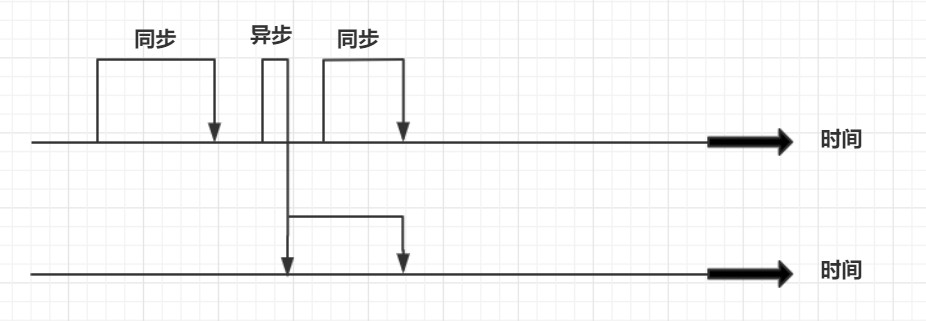
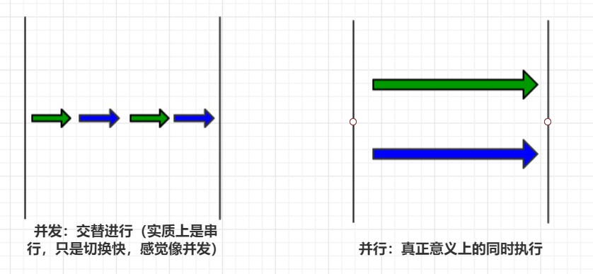

# 1. 并发的一些概念

## 一、并发优点

- 并发编程的形式可以将多核CPU的计算能力发挥到极致，性能得到提升。
- 面对复杂业务模型，并行程序会比串行程序更适应业务需求，而并发编程更能吻合这种业务拆分 。

**需要掌握**：

- 充分利用多核CPU的计算能力；
- 方便进行业务拆分，提升应用性能

## 二、并发缺点

- **频繁的上下文切换**
- **线程安全问题**

 

**频繁的上下文切换**：

时间片是CPU分配给各个线程的时间，因为时间非常短，所以CPU不断通过切换线程，让我们觉得多个线程是同时

执行的，时间片一般是几十毫秒。而每次切换时，需要保存当前的状态起来，以便能够进行恢复先前状态，而这个

切换时非常损耗性能，过于频繁反而无法发挥出多线程编程的优势。通常减少上下文切换可以采用**无锁并发编程，**

**CAS算法**，**使用最少的线程**和使用**协程**。

- 无锁并发编程：可以参照concurrentHashMap锁分段的思想，不同的线程处理不同段的数据，这样在多线程

  竞争的条件下，可以减少上下文切换的时间。

- CAS算法，利用Atomic下使用CAS算法来更新数据，使用了乐观锁，可以有效的减少一部分不必要的锁竞争带

  来的上下文切换

- 使用最少线程：避免创建不需要的线程，比如任务很少，但是创建了很多的线程，这样会造成大量的线程都处

  于等待状态

- 协程：在单线程里实现多任务的调度，并在单线程里维持多个任务间的切换

由于上下文切换也是个相对比较耗时的操作，所以在"java并发编程的艺术"一书中有过一个实验，并发累加未必会

比串行累加速度要快。 可以使用**Lmbench3测量上下文切换的时长** **vmstat测量上下文切换次数**

 

**线程安全**：

多线程编程中最难以把握的就是临界区线程安全问题，稍微不注意就会出现死锁的情况，一旦产生死锁就会造成系

统功能不可用。

那么，通常可以用如下方式避免死锁的情况：

1. **避免一个线程同时获得多个锁；**
2. **避免一个线程在锁内部占有多个资源，尽量保证每个锁只占用一个资源；**
3. **尝试使用定时锁，使用lock.tryLock(timeOut)，当超时等待时当前线程不会阻塞；**
4. **对于数据库锁，加锁和解锁必须在一个数据库连接里，否则会出现解锁失败的情况**

 

## 三、需要了解的概念

### 3.1 同步VS异步

同步和异步通常用来形容一次方法调用。同步方法调用一开始，调用者必须等待被调用的方法结束后，调用者后面

的代码才能执行。而异步调用，指的是，调用者不用管被调用方法是否完成，都会继续执行后面的代码，当被调用

的方法完成后会通知调用者。比如，在超时购物，如果一件物品没了，你得等仓库人员跟你调货，直到仓库人员跟

你把货物送过来，你才能继续去收银台付款，这就类似同步调用。而异步调用了，就像网购，你在网上付款下单

后，什么事就不用管了，该干嘛就干嘛去了，当货物到达后你收到通知去取就好。

 

### 3.2 并发（Concurrency）与并行(Parallelism)

并发和并行是十分容易混淆的概念。并发指的是多个任务交替进行，而并行则是指真正意义上的“同时进行”。实际

上，如果系统内只有一个CPU，而使用多线程时，那么真实系统环境下不能并行，只能通过切换时间片的方式交替

进行，而成为并发执行任务。真正的并行也只能出现在拥有多个CPU的系统中。

 

### 3.3 阻塞（Blocking） 和 非阻塞（Non-Blocking）

阻塞和非阻塞通常用来形容多线程间的相互影响，比如一个线程占有了临界区资源，那么其他线程需要这个资源就

必须进行等待该资源的释放，会导致等待的线程挂起，这种情况就是阻塞，而非阻塞就恰好相反，它强调没有一个

线程可以阻塞其他线程，所有的线程都会尝试地往前运行。

 

### 3.4 临界区

临界区用来表示一种公共资源或者说是共享数据，可以被多个线程使用。但是每个线程使用时，一旦临界区资源被

一个线程占有，那么其他线程必须等待。

 

### 3.5 死锁（DeadLock）、活锁、饥饿（Starvation）

**死锁：**是指两个或两个以上的进程（或线程）在执行过程中，因争夺资源而造成的一种互相等待的现象，若无外力

作用，它们都将无法推进下去。此时称系统处于死锁状态或系统产生了死锁，这些永远在互相等待的进程称为死锁

进程。

 

**活锁：**线程A和B都需要过桥(都需要使用进程),而都礼让不走(那到的系统优先级相同,都认为不是自己优先级高),就

这么僵持下去.（很绅士，**互相谦让**）

 

**饥饿: **是指某一个或者多个线程因为种种原因无法获得所需要的资源，导致一直无法执行。比如他的线程优先级可

能太低，而优先级的线程不断抢占它需要的资源，导致低优先级线程无法正常工作。

 

### 3.6 并发级别

由于临界区的存在在，多线程之间的并发必须受到控制。根据并发的策略，我们可以把并发的级别进行分类，大致

可以分为阻塞、无饥饿、无障碍、无锁、无等待几种。

  

## 参考：

- [并发编程的优缺点](https://github.com/CL0610/Java-concurrency/blob/master/01.%E5%B9%B6%E5%8F%91%E7%BC%96%E7%A8%8B%E7%9A%84%E4%BC%98%E7%BC%BA%E7%82%B9/%E5%B9%B6%E5%8F%91%E7%BC%96%E7%A8%8B%E7%9A%84%E4%BC%98%E7%BC%BA%E7%82%B9.md) 
- 《实战Java高并发程序设计》 