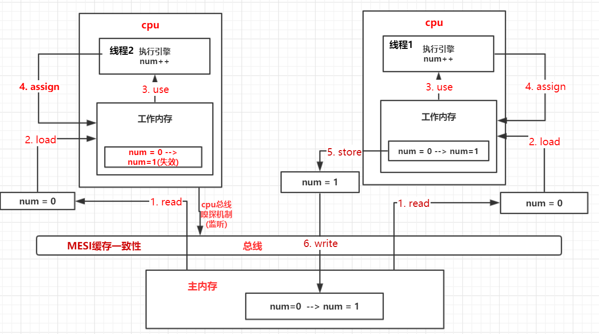
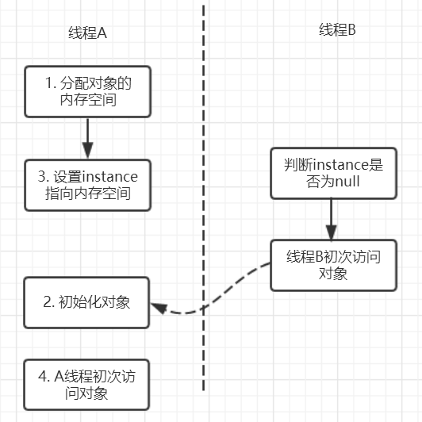

# 4.原子性、可见性，有序性


## 一、原子性

原子性是指：

**一个操作是不可中断的，要么全部执行成功要么全部执行失败，有着“同生共死”的感觉**。

<br>

**volatile可以保证可见性和有序性，但不能保证原子性。**

<br>


### 1. JMM 8个原子操作

在[《JMM内存模型和volatile缓存一致性》](JMM内存模型和volatile缓存一致性.md)中，我们分析了volatile的原理。

其中，JMM内存模型中的8个原子操作，就可以体现 **原子性**

<br>

**8个原子操作**：

- **lock（锁定）：** **作用于主内存**， 将主内存变量 **加锁**，标识为线程独占状态
- **read（读取）：** **作用于主内存**，从主内存读取变量值传送到线程工作内存中
- **load（载入）：** 作用于工作内存， 将read到的数据放入工作内存中的 **变量副本** 中
- **use（使用）：** 作用于工作内存，将工作内存中的值传递给 **执行引擎**（计算），每当虚拟机遇到一个需要使用这个变量的指令时，将会执行这个动作
- **assign（赋值）：** 作用于工作内存，将计算好的值重新赋值到工作内存中，每当虚拟机遇到一个需要使用这个变量的指令时，将会执行这个动作
- **store（存储）：** 作用于工作内存 ，将工作内存数据传送给主内存中，以备随后的write操作使用
- **write（写入）：** **作用于主内存**， 将store传递值赋值给主内存中的变量
- **unlock（解锁）：** **作用于主内存** ，将主内存变量解锁，解锁后其他线程可以锁定该变量，被其他线程锁定。

<br>

### 2. synchronized满足原子性

1. 由原子性变量操作 **read,load,use,assign,store,write**，可以**大致认为基本数据类型的访问读写具备原子性**（例外就是long和double的非原子性协定）
2. 另外两条原子操作，**lock**和**unlock**，jvm并没有开放给我们，但jvm以更高层级的指令：**monitorenter和monitorexit** 指令 开放给我们使用，反映到java代码就是 **synchronized**关键字。
3. 也就是说：**synchronized 满足原子性。**

<br>

### 3. volatile不满足原子性

我们通过代码来举例说明：

```java
public class AtomicTest {
    private static volatile int num = 0;//volatile修饰
    public static void increase(){
        num++;
    }

    public static void main(String[] args) throws InterruptedException {
        Thread[] threads = new Thread[10];
        for(int i = 0; i < threads.length; i++){
            threads[i] = new Thread(new Runnable() {
                @Override
                public void run() {
                    for(int i = 0; i < 1000; i++){
                        increase();
                    }
                }
            });
            threads[i].start();
        }

        for(Thread t: threads){
            t.join();//线程执行了join(),表示主线程得等待所有调用了join() 线程执行完。
        }
        System.out.println(num);
    }

}

```

<br>

**输出结果：**

```
总是小于等于 10000
```

<br>

**分析原因**：

为什么加了 volatile 修饰的num不能满足原子性：



<br>

**分析**：

1. 一开始，num = 0；
2. 可能存在这样的情况，线程1和线程2同时读取了num = 0  的值到各自的工作内存中
3. 线程1（右边的线程）经过read、load、use、assign、store、write操作后，回写主内存，num = 1。
4. 线程2（左边的线程）虽然num已经等于1了，但由于缓存一致性，cpu嗅探总线发现num值变化，会让线程1的num值失效，需要线程1重新读取主内存最新的num值。
5. 这时读到的num=1。在经过一系列操作后，num = 2。
6. 我们可以发现，经过了三次num++ 后，num = 2。
7. 可见，volatile不能保证原子性。

<br>

**保证原子性**：

可以通过 **AtomicInteger** 类保证原子性。以后再讲

<br>


## 二、 可见性

**可见性**： 是指当一个线程修改了共享变量后，其他线程能够立即得知这个修改。

在《JMM内存模型与volatile缓存一致性》中，我们分析了volatile底层原理，可以看到volatile是具有可见性的。

<br>

对于synchronized而言，当线程获取锁时会从主内存中获取共享变量的最新值，释放锁的时候会将共享变量同步到主内存中。从而，**synchronized具有可见性**

<br>


## 三、 有序性

**有序性：** 顾名思义，就是程序按照代码的先后顺序执行。

<br>

### 1. volatile 具有有序性

**代码分析**：

```java
public class SerialTest {

    private static int x = 0, y = 0;
    private static int a = 0, b = 0;
    public static void main(String[] args) throws InterruptedException {
        int i = 0;
        for (;;){
            i++;
            x = 0; y = 0;
            a = 0; b = 0;
            Thread t1 = new Thread(new Runnable() {
                @Override
                public void run() {
                    
                    a = 1;
                    x = b;
                }
            });

            Thread t2 = new Thread(new Runnable() {
                @Override
                public void run() {
                    b = 1;
                    y = a;
                }
            });

            t1.start();
            t2.start();
            t1.join();
            t2.join();

            String result = "第" + i + "次(" + x + "," + y + ")";
            if(x==0 && y==0){
                System.err.println(result);
                break; //(0,0) 停止循环
            }else {
                System.out.println(result);
            }
        }
    }
}

```

**输出结果**：(有四种可能的结果)

```
(1, 0)
(0, 1)
(1, 1)

(0, 0)
```

<br>

如果不发生指令重排，那么只有前面三种情况存在。而因为发生了指令重排，我们可以看到程序停止，输出了 **(0, 0)** 的情况。

依照 之前提到的 **重排序**， 我们知道，在单线程内，如果没有数据依赖性，是可以重排序的。

所以当 x = b 重排序到 a = 1 前，以及 y = a 重排序到 b = 1前面，所以出现了(0, 0) 的情况。

<br>

显然这种重排序在 **单线程** 不影响结果，

在线程 t1 内部： a = 1; x = b; 是互不影响的；同样的，

在线程 other内部： b = 1; y = a;是互不影响的。

但在多线程中，会影响我们预想的结果。所以这个程序是不具有有序性的。

**用volatile关键字修饰**：

我们用volatile关键字修饰 **变量 a 和变量 b：**

```java
private volatile static int a = 0, b = 0;
```

结果可以发现，并没有 （0，0） 的情况，程序也不会停止。

这说明程序并没有发生指令重排，所以 **volatile是具有有序性的。**

<br>

### 2. synchronized具有有序性

synchronized语义表示锁在同一时刻只能由一个线程进行获取，当锁被占用后，其他线程只能等待。因此，synchronized语义就要求线程在访问读写共享变量时只能“串行”执行，因此**synchronized具有有序性**。

<br>

### 3. volatile 结合synchronized分析


在java内存模型中说过，为了性能优化，编译器和处理器会进行指令重排序；也就是说java程序天然的有序性可以总结为：**如果在本线程内观察，所有的操作都是有序的；如果在一个线程观察另一个线程，所有的操作都是无序的**。在单例模式的实现上有一种双重检验锁定的方式（Double-checked Locking）。代码如下：

```java
public class Singleton {
    private Singleton() { }
    private volatile static Singleton instance;
    public Singleton getInstance(){
        if(instance==null){
            synchronized (Singleton.class){
                if(instance==null){
                    instance = new Singleton();
                }
            }
        }
        return instance;
    }
}
```

<br>

**分析不加volatile修饰的情况**:

> **instance = new Singleton();** 

重点分析这句代码

这条语句实际上包含了三个操作：

- **分配对象的内存空间；**
- **初始化对象；**
- **设置instance指向刚分配的内存地址。**

但由于存在重排序的问题，可能有以下的执行顺序：

<br>



<br>

如果2和3进行了重排序的话，线程B进行判断if(instance==null)时就会为true，而实际上这个instance并没有初始化成功，显而易见对线程B来说之后的操作就会是错得。

而**用volatile修饰**的话就可以禁止2和3操作重排序，从而避免这种情况。**volatile包含禁止指令重排序的语义，其具有有序性**。

<br>

volatile怎么做到禁止重排序，从而实现有序性的呢？

就是使用了 **内存屏障**。


<br>

## 总结一下

**synchronized: 具有原子性，有序性和可见性**；

 **volatile：具有有序性和可见性**

<br>

<br>


## 参考

[三大性质总结：原子性、可见性以及有序性.md](https://github.com/wenhuohuo/Java-concurrency/blob/master/07.%E4%B8%89%E5%A4%A7%E6%80%A7%E8%B4%A8%E6%80%BB%E7%BB%93%EF%BC%9A%E5%8E%9F%E5%AD%90%E6%80%A7%E3%80%81%E5%8F%AF%E8%A7%81%E6%80%A7%E4%BB%A5%E5%8F%8A%E6%9C%89%E5%BA%8F%E6%80%A7/%E4%B8%89%E5%A4%A7%E6%80%A7%E8%B4%A8%E6%80%BB%E7%BB%93%EF%BC%9A%E5%8E%9F%E5%AD%90%E6%80%A7%E3%80%81%E5%8F%AF%E8%A7%81%E6%80%A7%E4%BB%A5%E5%8F%8A%E6%9C%89%E5%BA%8F%E6%80%A7.md)<br>


  