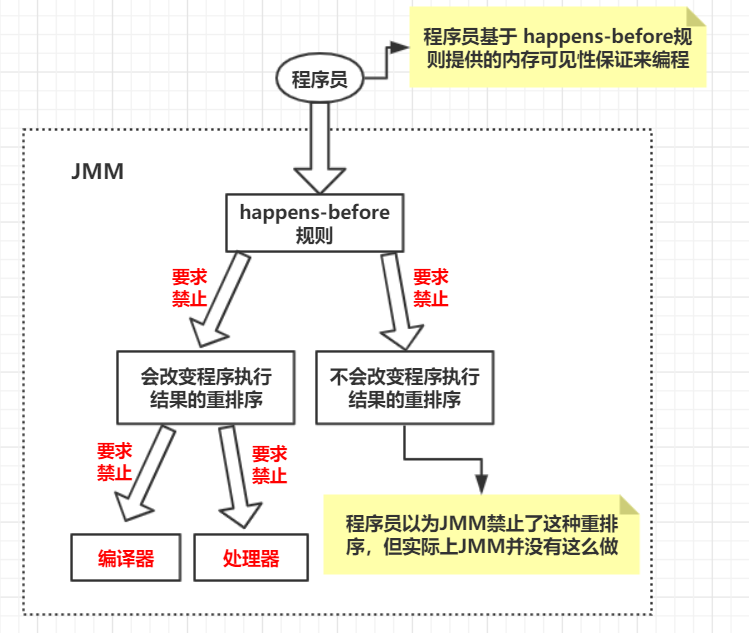

# 5.重排序、 happens-before

## 一、指令重排


### 指令重排序:

java语言规范规定JVM线程内部维持顺序化语义。即只要程序的最终结果与它顺序化情况的结果相等，那么指令的执行顺序可以与代码顺序不一致，此过程叫指令的重排序。

<br>**三种指令重排序**：


<br>

1. **编译器优化的重排序**：编译器在不改变单线程程序语义的前提下，可以重新安排语句的执行顺序
2. **指令级并行的重排序**：现代处理器采用了指令级并行技术将多条指令重叠执行。如果不存在 **数据依赖性**，处理器可以改变语句对应机器指令的执行顺序
3. **内存系统的重排序**：由于处理器使用缓存和读/写缓冲区，这使得加载和存储操作看上去可能是在乱序执行的

<br>

**举例**:

```java
double pi = 3.14;	//A
double r = 1.0;		//B
double area = pi * r*r;//C
```

A、 B之间没有任何关系，结果也不影响，所以可以 编译器优化重排序。

C 结果是由A、B影响的，所以C结果 **依赖于 A和B**，如果重排序会存在影响。

**所以编译器和处理器在重排序时会遵循数据依赖性，编译器和处理器不会改变数据依赖性关系的两个执行顺序。**

<br>

### 指令重排序的意义是什么:

JVM 能根据处理器的特性（CPU多级缓存系统、多核处理器等）适当的对机器指令进行重排序，使机器指令能更符合CPU的执行特性，最大限度的发挥机器性能。

<br>

### as-if-serial语义：

不管怎么重排序（编译器和处理器为了提高并行度），（**单线程**）程序的执行结果不能被改变。编译器、runtime和处理器都必须遵守 **as-if-serial** 语义。

as-if-serial 语义把单线程程序保护了起来，**遵守 as-if-serial语义** 的 **编译器，runtime和处理器** 共同为编写单线程程序的程序员创建一个幻觉，**单线程程序是按程序的顺序来执行的。**

像上面的计算圆面积，**单线程中**，感觉代码是一行一行顺序执行的。即使A、B重排，也不必担心重排的问题，也无需担心内存可见性问题。

<br>


## 二、 happens-before规则

### 定义

1. 如果一个操作 happens-before 另一个操作，那么第一个操作的执行结果将对第二个操作 **可见**，而且第一个操作的执行顺序排在第二个操作 **之前**。

2. 两个操作之间存在happens-before关系，并不意味着Java平台的具体实现必须要按照happens-before关系指定的顺序来执行。**如果重排序之后的执行结果，与按happens-before关系来执行的结果一致**，那么这种重排序并不非法（也就是说，JMM允许这种重排序）。

<br>

**规则**：

1. **程序顺序规则**：一个线程中的每个操作，happens-before于该线程中的任意后续操作。

2. **监视器锁规则**：对一个锁的解锁，happens-before于随后对这个锁的加锁。

3. **volatile变量规则**：对一个volatile域的写，happens-before于任意后续对这个volatile域的读。

4. **传递性**：如果A happens-before B，且B happens-before C，那么A happens-before C。

5. **start()规则**：如果线程A执行操作ThreadB.start()（启动线程B），那么A线程的ThreadB.start()操作happens-before于线程B中的任意操作。

6. **join()规则**：如果线程A执行操作ThreadB.join()并成功返回，那么线程B中的任意操作happens-before于线程A从ThreadB.join()操作成功返回。

7. **程序中断规则**：对线程interrupted()方法的调用先行于被中断线程的代码检测到中断时间的发生。

8. **对象finalize规则**：一个对象的初始化完成（构造函数执行结束）先行于发生它的finalize()方法的开始。

<br>

**举例**：

上面求圆面积的代码中，A happens-before B、B happens-before C、A happens-before C。利用 **传递性** 进行推论。

<br>

### 与as-if-serial 比较


1. as-if-serial语义：保证 **单线程** 内执行的结果不被改变；

   happens-before：保证正确同步的 **多线程** 程序的执行结果不被改变

2. as-if-serial：创建的环境，单线程程序是顺序执行的

   happens-before：正确同步的 **多线程** 程序是按happens-before指定的顺序来执行

3. 二者都是为了在不改变执行结果的前提下，提高程序的并行度。

<br>

## 三、 happens-before 与 JMM



<br>

JMM其实是在遵循一个基本原则：只要不改变程序的执行结果（指的是单线程程序和正确同步的多线程程序），编译器和处理器怎么优化都行。

<br>


<br>

## 参考

[Java内存模型以及happens-before.md](https://github.com/wenhuohuo/Java-concurrency/blob/master/03.java%E5%86%85%E5%AD%98%E6%A8%A1%E5%9E%8B%E4%BB%A5%E5%8F%8Ahappens-before%E8%A7%84%E5%88%99/Java%E5%86%85%E5%AD%98%E6%A8%A1%E5%9E%8B%E4%BB%A5%E5%8F%8Ahappens-before.md)<br>


