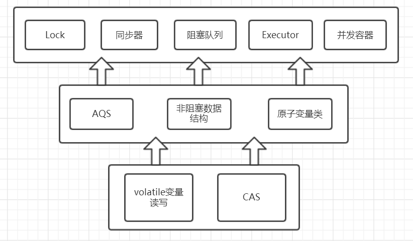

# AQS(AbstractQueuedSynchronized)


## 一、 简介

Concurrent包整体实现图：



<br>

**与synchronized锁比较：**

1. 不具备synchronized一样的**隐式加锁**的便捷性，需要自己加锁和解锁
2. 拥有锁**获取和释放**的可操作性
3. 可 **中断的获取锁**  和 **超时获取锁** 等synchronized不具备的同步特性。

<br>

**通常使用形式：**

```java
Lock lock = new ReentrantLock();
lock.lock();
try{
	.......
}finally{
	lock.unlock();
}
```

需要注意的是**synchronized同步块执行完成或者遇到异常是锁会自动释放，而lock必须调用unlock()方法释放**

**锁，因此在finally块中释放锁**。

<br>

## 二、 Lock接口的API

- **void lock();** //获取锁

- **void lockInterruptibly() throws InterruptedException；**//获取锁的过程能够响应中断 

- **boolean tryLock();**    //非阻塞式响应中断能立即返回，获取锁放回true反之返回fasle 

- **boolean tryLock(long time, TimeUnit unit) throws InterruptedException;**

  //超时获取锁，在超时内或者未中断的情况下能够获取锁 

- **Condition newCondition();**  //获取与lock绑定的等待通知组件，当前线程必须获得了锁才能进行等待，进行等待时会先释放锁，当再次获取锁时才能从等待中返回


