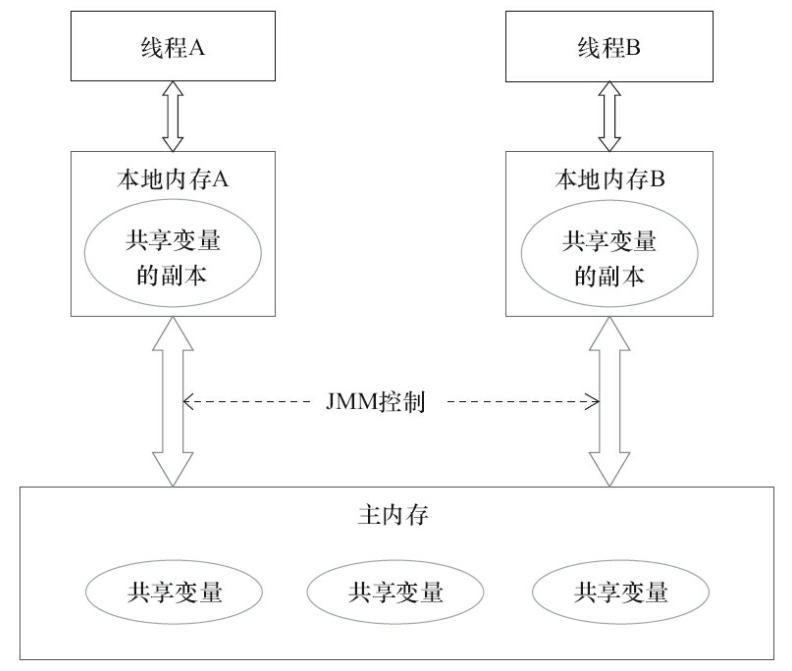

# 高并发面试题

## 1. 守护线程与用户线程


守护线程是一种特殊的线程，就和它的名字一样，它是系统的守护者，在后台默默地守护一些系统服务，比如**垃圾**

**回收线程，JIT线程**就可以理解守护线程。

与之对应的就是用户线程，用户线程就可以认为是**系统的工作线程**，它会完成整个**系统的业务操作**。用户线程完全

结束后就意味着整个系统的业务任务全部结束了，**因此系统就没有对象需要守护的了，守护线程自然而然就会退。**

**当一个Java应用，只有守护线程的时候，虚拟机就会自然退出。**

<br>

下面以一个简单的例子来表述Daemon线程的使用。

```java
public class DaemonDemo {
    public static void main(String[] args) {
        Thread daemonThread = new Thread(new Runnable() {
            @Override
            public void run() {
                while (true) {
                    try {
                        System.out.println("i am alive");
                        Thread.sleep(500);
                    } catch (InterruptedException e) {
                        e.printStackTrace();
                    } finally {
                        System.out.println("finally block");
                    }
                }
            }
        });
        //设置为守护线程
        daemonThread.setDaemon(true);
        daemonThread.start();
        //确保main线程结束前能给daemonThread能够分到时间片
        try {
            Thread.sleep(800);
        } catch (InterruptedException e) {
            e.printStackTrace();
        }
    }
}
```

输出结果为：

> i am alive finally block i am alive

上面的例子中daemodThread run方法中是一个while死循环，会一直打印,但是当main线程结束后

daemonThread就会退出所以不会出现死循环的情况。main线程先睡眠800ms保证daemonThread能够拥有一次

时间片的机会，也就是说可以正常执行一次打印“i am alive”操作和一次finally块中"finally block"操作。紧接着

main 线程结束后，daemonThread退出，这个时候只打印了"i am alive"并没有打印finnal块中的。因此，这里需

要注意的是**守护线程在退出的时候并不会执行finnaly块中的代码，所以将释放资源等操作不要放在finnaly块中执**

**行，这种操作是不安全的**


线程可以通过**`setDaemon(true)`**的方法将线程设置为守护线程。并且需要注意的是**设置守护线程要先于start()方法，否则会报**

> Exception in thread "main" java.lang.IllegalThreadStateException at 
>
> java.lang.Thread.setDaemon(Thread.java:1365) at learn.DaemonDemo.main(DaemonDemo.java:19)


这样的异常，但是该线程还是会执行，只不过会当做正常的用户线程执行。

<br>

**区别与联系：**

**联系：**

- 任何线程都可以设置为守护线程和用户线程。**`Thread.setDaemon(bool on);`** **true**则为守护线程，**false**为用户线程
- 守护线程是后台线程，用户线程是前台线程（main线程是前台线程）

**区别**：

唯一区别是判断JVM何时离开。**Daemon**是为其他线程提供服务，如果全部的**User Thread**已经撤离，Daemon 

没有可服务的线程，JVM撤离。

<br>

**扩展：前台线程和后台线程区别和联系**：

- 后台线程不会阻止进程的终止。属于某个进程的所有前台线程都终止后，该进程就会被终止。所有剩余的后台

  线程都会停止且不会完成。

- 不管是前台线程还是后台线程，如果线程内出现了异常，都会导致**进程**的终止。

- 托管线程池中的线程都是后台线程，使用 **new Thread** 方式创建的线程**默认都是前台线程**。


## 2. JMM 和 happens-before

线程安全问题的由来：一般是**主内存和工作内存数据不一致性**和**重排序**导致的。


- **线程如何通信**

  1. 共享内存：java内存模型是共享内存，通过读-写实现隐式通信

  2. 消息传递

**共享变量：**

​	实例域、静态域、数组元素----> 堆中





**happens-before**:

- 如果一个操作happens-before另一个操作，那么第一个操作的执行结果将对第二个操作可见，而且第一个操

  作的执行顺序排在第二个操作之前。

- 两个操作之间存在happens-before关系，并不意味着Java平台的具体实现必须要按照happens-before关系指

  定的顺序来执行。如果重排序之后的执行结果，与按happens-before关系来执行的结果一致，那么这种重排

  序并不非法（也就是说，JMM允许这种重排序）。


## 3. final

1. **使用场景：**

   成员变量和局部变量

   1. **成员变量：**
      1. **类变量**：必须要在**静态初始化块**中指定初始值或者**声明该类变量时**指定初始值，而且只能在这**两个地方**之一进行指定；
      2. **实例变量**：必要要在**非静态初始化块**，**声明该实例变量**或者在**构造器中**指定初始值，而且只能在这**三个地方**进行指定。
   2. **局部变量：**
      1. 仅有一次赋值，再次赋值会报错


2. **修饰 引用类型和基本数据类型**

   1. 修饰基本数据类型，不能在赋值，修饰引用类型可以
   2. 因为修饰引用类型，只是保证引用地址不能改变，但是属性的具体数据可以改变

   

3. **final修饰方法**

   1. **不能重写：**被final修饰的方法不能被子类重写（如Object类中的getClass() 就是被final修饰，hashCode() 没有被修饰，可以重写
   2. **可以重载：**被修饰的方法可以重载

   

4. **final修饰类：**

   1. 被final修饰的类不能被继承。

5. 不变类的意思是创建该类的实例后，该实例的实例变量是不可改变的。满足以下条件则可以成为不可变类：

   1. 使用private和final修饰符来修饰该类的成员变量
   2. 提供带参的构造器用于初始化类的成员变量；
   3. 仅为该类的成员变量提供getter方法，不提供setter方法，因为普通方法无法修改fina修饰的成员变量；
   4. 如果有必要就重写Object类 的hashCode()和equals()方法，应该保证用equals()判断相同的两个对象其Hashcode值也是相等的。

   JDK中提供的八个包装类和String类都是不可变类，我们来看看String的实现。

   ```java
   /** The value is used for character storage. */
    private final char value[];
   ```

6. 

