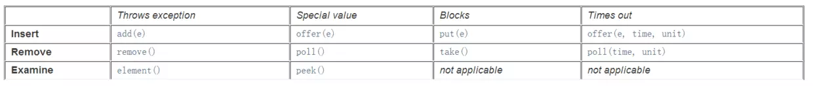

# 并发Queue概述

## 1. 概述

J.U.C中并发队列分为 阻塞队列 和 非阻塞队列。

阻塞队列在 **满时** 进行 **入列** 操作会被阻塞，**空时** 进行 **出列** 操作会被阻塞，很适合并发编程中最常见的 **生产者-消费者模式** 。（我们在后面讲解）

非阻塞队列使用 **CAS无锁算法** 避免锁竞争，相比同步方式实现的队列，提高了吞吐量。

 

## 2. 分类

**阻塞队列有哪些**：

- ArrayBlockingQueue：  基于 **数组** 实现的 **有界** 阻塞队列

- PriorityBlockingQueue：基于 **数组** 实现的，支持 **优先级排序的无界** 阻塞队列。

- LinkedBlockingQueue： 基于 链表 实现的 **有界** 阻塞队列。

- LinkedBlockingDeque：基于 **链表** 实现的 **双端** 阻塞队列。

- DelayQueue：带 **延迟时间** 的队列。

- SynchronousQueue： **不存储元素** 的阻塞队列。（没有缓冲的队列）

- LinkedTransferQueue：基于 **链表** 实现的 **无界** 队列。

 

**非阻塞队列**：

- ConcurrentLinkedQueue ：基于 **链表** 实现的 **无界** 非阻塞队列。
- ConcurrentLinkedDeque： 基于 **链表** 实现的 **无界** 非阻塞 **双端** 队列。

 

## 3. BlockingQueue

阻塞队列均 继承了**BlockingQueue** 接口。	

### 3.1 队列的入列、出列方法 及 处理方式

**阻塞和超时只适用于阻塞队列**

| 方法\处理方式 | 异常      | 特殊值   | 阻塞   | 超时                 |
| ------------- | --------- | -------- | ------ | -------------------- |
| 入列方法      | add(e)    | offer(e) | put(e) | offer(e, time, unit) |
| 出列方法      | remove()  | poll()   | take   | poll(time, unit)     |
| 查看方法      | element() | peek()   | 无     | 无                   |

对应 JAVA API 文档的内容为：

 

### 3.2 基本操作

而 BlockingQueue  继承了 **Queue接口** ，因此对元素的基本操作有：

**插入元素**

- add(E e) ：往队列插入数据，当队列满时，插入元素时会抛出 **IllegalStateException** 异常；
- offer(E e)：当往队列插入数据时，插入成功返回`true`，否则则返回`false`。当队列满时不会抛出异常；

 

**删除元素**

- remove(Object o)：从队列中删除数据，成功则返回`true`，否则为`false`
- poll：**删除**数据，当队列为空时，返回null；

 

**查看元素**

- element：获取**队头**元素，如果队列为空时则抛出NoSuchElementException异常；
- peek：获取**队头**元素，如果队列为空则抛出NoSuchElementException异常

 

**BlockingQueue具有的特殊操作：**

**插入数据：**

- put：当阻塞队列容量已经满时，往阻塞队列插入数据的线程会被阻塞，直至阻塞队列已经有空余的容量可供使用；
- offer(E e, long timeout, TimeUnit unit)：若阻塞队列已经满时，同样会阻塞插入数据的线程，直至阻塞队列已经有空余的地方，与put方法不同的是，该方法会有一个超时时间，若超过当前给定的超时时间，插入数据的线程会退出；

 

**删除数据**

- take()：当阻塞队列为空时，获取队头数据的线程会被阻塞；
- poll (long timeout, TimeUnit unit)：当阻塞队列为空时，获取数据的线程会被阻塞，另外，如果被阻塞的线程**超过了给定的时长**，该线程会退出

 
 

# 参考

[并发十三：并发容器Queue实现分析](https://www.jianshu.com/p/0120984dea81) 

[并发容器之BlockingQueue](https://juejin.im/post/5aeebd02518825672f19c546#heading-0)

 

  