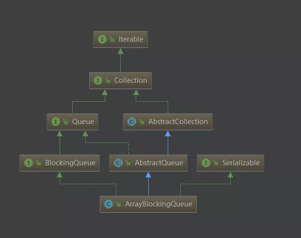

# ArrayBlockingQueue源码分析

## 一、 简介

多线程编程中，为了 **业务解耦和架构设计**， 经常会使用**并发容器**用于存储多线程间的 **共享数据** 。这样不仅能保证线程安全，还可以简化各个线程操作。 例如 **”生产--消费者“** 模式中，用BlockingQueue。

<br>

ArrayBlockingQueue：基于数组的阻塞队列实现，在它的内部，维护了一个 **定长数组** ， 以便缓存队列中的数组对象，**其内部没有实现读写分离**， 也就意味着生产和消费不能完全并行，**长度是需要定义的**，可以指定 **先进先出或先进后出**，也叫有界队列。

<br>

ArrayBlockingQueue: **数组 **实现的 **线程安全** 的 **有界阻塞** 队列：

- 线程安全说明是ArrayBlockingQueue内部通过 **ReentrantLock** 保护竞争资源，实现了多线程对竞争资源的 **互斥访问**
- 有界：对应数组有界限
- 阻塞队列，指多线程访问资源时，当竞争资源被某线程获取时，要获取该资源的线程需要阻塞等待。

<br>


## 二、 类定义


```java
public class ArrayBlockingQueue<E> extends AbstractQueue<E>
        implements BlockingQueue<E>, java.io.Serializable {
```



<br>

## 三、 变量/常量、构造方法、其他方法

### 3.1 变量/常量

```java
private static final long serialVersionUID = -817911632652898426L;

//内部实现使用数组
final Object[] items;

// 下一次从队列中获取的队列元素索引
int takeIndex;

//下一次插入队列的队列元素索引
int putIndex;

//队列实际长度
int count;

// 互斥锁（保证线程安全）
final ReentrantLock lock;

// 非空信号量（保证可阻塞式的删除）
private final Condition notEmpty;

// 非满信号量（保证可阻塞式的插入）
private final Condition notFull;

// 迭代器维护列表，每次队列更新操作需要更新迭代器保证正确性
transient Itrs itrs = null;
```

**说明**：

1. 内部采用数组进行数据存储的**（属性 items）**

2. **`final ReentrantLock lock;`** :保证线程安全

3. 非空、非满信号量，保证可阻塞式插入、删除数据利用的是 **Condition** ：

   - 当获取数据的 **消费者线程** 被阻塞时会将该线程放置到 **notEmpty** 等待队列中
   - 当插入数据的 **生产者线程** 被阻塞时会将该线程放置到 **notFull** 等待队列中。

   

<br>

### 3.2 构造方法


```java
public ArrayBlockingQueue(int capacity) {
    this(capacity, false);
}
```


```java
//capacity:指定队列的容量
//fair：公平锁或非公平锁。
public ArrayBlockingQueue(int capacity, boolean fair) {
    if (capacity <= 0)//队列长度不能小于0
        throw new IllegalArgumentException();
    //创建数组并赋值给内部数组
    this.items = new Object[capacity];
    //重入锁，出队和入队持有这一把锁
    lock = new ReentrantLock(fair);
    //初始化非空等待队列
    notEmpty = lock.newCondition();
    //初始化非满等待队列
    notFull =  lock.newCondition();
}
```

<br>

**将某个集合元素全部放入ArrayBlockingQueue中**

```java
public ArrayBlockingQueue(int capacity, boolean fair,
                          Collection<? extends E> c) {
    this(capacity, fair);

    final ReentrantLock lock = this.lock;
    
    // 使用锁操作确保可见性，因为item这里本身并不保证可见性，防止并发操作下线程内存中数组不一致的情况出现
    lock.lock(); // Lock only for visibility, not mutual exclusion
    try {
        int i = 0;
        try {//循环赋值过程
            for (E e : c) {
                checkNotNull(e);
                items[i++] = e;
            }
        } catch (ArrayIndexOutOfBoundsException ex) {
            throw new IllegalArgumentException();
        }
        //队列实际长度赋值
        count = i;
        //判断当前实际长度是否达到了容量
        //   是，下一次插入元素索引回到头部位置
        //   否，指向实际长度位置。
        putIndex = (i == capacity) ? 0 : i;
    } finally {
        //解锁
        lock.unlock();
    }
}
```

<br>

### 3.3 实现的其他方法

```java
//返回队列剩余容量
public int remainingCapacity()

// 判断队列中是否存在当前元素o
public boolean contains(Object o) 

// 返回一个按正确顺序，包含队列中所有元素的数组
public Object[] toArray()

// 返回一个按正确顺序，包含队列中所有元素的数组；数组的运行时类型是指定数组的运行时类型
@SuppressWarnings("unchecked")
public <T> T[] toArray(T[] a)


// 自动清空队列中的所有元素
public void clear()

// 移除队列中所有可用元素，并将他们加入到给定的 Collection 中    
public int drainTo(Collection<? super E> c)

// 从队列中最多移除指定数量的可用元素，并将他们加入到给定的 Collection 中    
public int drainTo(Collection<? super E> c, int maxElements)

// 返回此队列中按正确顺序进行迭代的，包含所有元素的迭代器
public Iterator<E> iterator()
```


<br>


## 四、 核心的入队和出队方法

### 4.1 入队 enqueue() 

添加元素到队列，当且仅当有 **lock** 的时候，每次添加完后通过 **`notEmpty.signal()`** 唤醒 **`notEmpty.await()`** 进入等待状态的线程

```java
//e：入队元素
private void enqueue(E x) {
    // assert lock.getHoldCount() == 1;
    // assert items[putIndex] == null;
    final Object[] items = this.items;
    //在插入元素索引位置添加 元素
    items[putIndex] = x;
    //putIndex索引++，判断是否到了末尾，是的话，putIndex回到头部位置
    if (++putIndex == items.length)
        putIndex = 0;
    //实际长度++
    count++;
    //唤醒之前的等待线程（队列不空，通知线程拿走元素）
    notEmpty.signal();
}
```

<br>


### 4.2 出队 dequeue()

```java
private E dequeue() {
    // assert lock.getHoldCount() == 1;
    // assert items[takeIndex] != null;
    final Object[] items = this.items;
    @SuppressWarnings("unchecked")
    
    // 从获取元素的索引 的位置 拿到元素
    E x = (E) items[takeIndex];
    //原位置置为空
    items[takeIndex] = null;
    //获取元素的索引 ++。判断是否到了末尾
    //  是，则回到开始位置
    if (++takeIndex == items.length)
        takeIndex = 0;
    //实际长度--
    count--;
    
	// 更新迭代器中的元素数据，保证在并发操作中迭代的正确性
    if (itrs != null)
        itrs.elementDequeued();
    //唤醒非满等待队列的线程（队列不满，通知线程新增元素）
    notFull.signal();
    return x;
}
```

<br>

关于 notEmpty 非空等待队列 和 notFull非满等待队列，其他很好理解。

- **当队列是空的**，要获取数据的 **消费者** 会进入 **notEmpty** 队列中等，等生产者添加元素，就 **唤醒 notEmpty** 中的线程就去消费。
- **当队列是满的，** 要生产数据的 **生产者** 会进入 **notFull**  队列中等，等消费者拿走数据，有空位了，就 **唤醒 notFull** 的线程去添加。

具体的图示，可以参考这篇里面的图  [《BlockingQueue-ArrayBlockingQueue 详细源码解析》](https://zhuanlan.zhihu.com/p/84647595)  

<br>


## 五、 入队

**add/offer/put**

### 5.1 add()

```java
public boolean add(E e) {
    // 调用offer获取结果 不成功则抛错
    return super.add(e);
}

public boolean add(E e) {
    //调用offer方法
    if (offer(e))
        return true;
    else
        throw new IllegalStateException("Queue full");
}
```

<br>


### 5.2 offer()

```java
public boolean offer(E e) {
    //判断元素是否为空
    checkNotNull(e);
    final ReentrantLock lock = this.lock;
    lock.lock();
    try {
        //队列已满，返回false
        if (count == items.length)
            return false;
        else {
            //入队
            enqueue(e);
            return true;
        }
    } finally {
        lock.unlock();
    }
}
```

<br>

**带超时时间的offer方法**：

```java
 // timeout：超时时间
 // unit：时间单位（颗粒度）TimeUnit.SECOND等
 public boolean offer(E e, long timeout, TimeUnit unit) 
 	throws InterruptedException {
 	    //判断元素是否为空
        checkNotNull(e);
     	// 阻塞等待时间 纳秒
        long nanos = unit.toNanos(timeout);
        final ReentrantLock lock = this.lock;
     
     	// lockInterruptibly方法可被中断
        lock.lockInterruptibly();
        try {
            while (count == items.length) {
                if (nanos <= 0)
                    //超时返回
                    return false;
                //队列已满，则阻塞等待nanos纳秒
                nanos = notFull.awaitNanos(nanos);
            }
            //入队
            enqueue(e);
            return true;
        } finally {
            lock.unlock();
        }
    }
```

### 5.2 put()

```java
public void put(E e) throws InterruptedException {
    checkNotNull(e);
    final ReentrantLock lock = this.lock;
    lock.lockInterruptibly();
    try {
        //判断是否满了，满了，就等待。
        while (count == items.length)
            notFull.await();
        //入队
        enqueue(e);
    } finally {
        lock.unlock();
    }
}
```

<br>

向队列中添加元素主要包含上述3个方法，不同之处如下：

| 方法名（含参数）                        | 说明                                                         |
| --------------------------------------- | ------------------------------------------------------------ |
| add(E e)                                | 实际调用offer，元素入队操作，成功则返回true,失败则抛错IllegalStateException |
| offer(E e)                              | 元素入队操作，成功返回true,失败返回false                     |
| put(E e)                                | 可中断，元素入队操作，队列已满则阻塞等待直到被通知可入队     |
| offer(E e, long timeout, TimeUnit unit) | 可中断，元素入队操作，设置阻塞等待超时时间，超时则返回false,成功入队则返回true |

<br>

## 六、 出队

**poll/take/peek/remove**

### 6.1 poll()

```java
public E poll() {
    final ReentrantLock lock = this.lock;
    lock.lock();
    try {
        //实际长度为空，则返回null；不为空，则出队。
        return (count == 0) ? null : dequeue();
    } finally {
        lock.unlock();
    }
}
```

<br>

**带超时时间的 poll() 方法**：

与超时时间的offer方法类似。

```java
public E poll(long timeout, TimeUnit unit) throws InterruptedException {
    long nanos = unit.toNanos(timeout);
    final ReentrantLock lock = this.lock;
    lock.lockInterruptibly();
    try {
        while (count == 0) { //为空，超时
            if (nanos <= 0)
                return null;
            //阻塞等待超时nanos纳秒
            nanos = notEmpty.awaitNanos(nanos);
        }
        return dequeue();
    } finally {
        lock.unlock();
    }
}
```

<br>


### 6.2 take()

```java
public E take() throws InterruptedException {
    final ReentrantLock lock = this.lock;
    //可中断
    lock.lockInterruptibly();
    try {
        //队列为空，阻塞着等待唤醒。
        while (count == 0)
            notEmpty.await();
        return dequeue();
    } finally {
        lock.unlock();
    }
}
```

<br>

### 6.3 peek()

peek() 方法，取队列元素但不移除

```java
public E peek() {
    final ReentrantLock lock = this.lock;
    lock.lock();
    try {
        //队列为空，返回null
        return itemAt(takeIndex); // null when queue is empty
    } finally {
        lock.unlock();
    }
}

final E itemAt(int i) {
    return (E) items[i];
}
```

<br>

### 6.4 remove(Object o)

```java
//指定元素删除
public boolean remove(Object o) {
    //指定元素为空，返回false
    if (o == null) return false;
    final Object[] items = this.items;
    final ReentrantLock lock = this.lock;
    lock.lock();
    try {
        //队列不为空
        if (count > 0) {
            final int putIndex = this.putIndex;
            int i = takeIndex;
            do {
                //循环判断是否相等
                if (o.equals(items[i])) {
                    //相等，移除
                    //移除i处的元素，同时队列进行整理，移除元素后的元素依次向前移动进行填补空缺
                    removeAt(i);
                    return true;
                }
                //获取元素的索引 到了末尾，重回头部
                if (++i == items.length)
                    i = 0;
            } while (i != putIndex);
        }
        return false;
    } finally {
        lock.unlock();
    }
}
```

<br>

从队列中获取元素主要包含上述4个方法，除peek不执行出队操作外，remove是删除之外，其余均需执行出队操作，不同之处如下：

| 方法名（含参数）                  | 说明                                                         |
| --------------------------------- | ------------------------------------------------------------ |
| poll()                            | 出队操作，队列为空返回null,不为空则返回对应元素              |
| take()                            | 可中断，出队操作，队列为空则阻塞等待直到被通知获取值返回     |
| poll(long timeout, TimeUnit unit) | 可中断，出队操作，设置阻塞等待超时时间，超时则返回null,成功则返回对应元素 |
| peek()                            | 仅仅返回队列元素的值，但是不执行出队操作                     |
| remove(Object o)                  | 删除队列中的对应元素（可处于队列任何位置），队列需进行整理   |

<br>


## 相关问题

**ArrayBlockingQueue总结：**

（1）ArrayBlockingQueue不需要扩容，因为是初始化时指定容量，并循环利用数组；

（2）ArrayBlockingQueue利用takeIndex和putIndex循环利用数组；

（3）入队和出队各定义了四组方法为满足不同的用途；

（4）利用重入锁和两个条件保证并发安全；

<br>

**ArrayBlockingQueue的缺点**：

（1）队列长度固定且必须在初始化时指定，所以使用之前一定要慎重考虑好容量；

（2）如果消费速度跟不上入队速度，则会导致提供者线程一直阻塞，且越阻塞越多，非常危险；

（3）只使用了一个锁来控制入队出队，效率较低。

<br>


# 参考

[JDK源码那些事儿之ArrayBlockingQueue](https://mp.weixin.qq.com/s/LJqWsu3rYbwl3eHyFEJZ1A)<br>

[并发容器之ArrayBlockingQueue和LinkedBlockingQueue实现原理详解.md](https://github.com/wenhuohuo/Java-concurrency/blob/master/20.%E5%B9%B6%E5%8F%91%E5%AE%B9%E5%99%A8%E4%B9%8BArrayBlockingQueue%E5%92%8CLinkedBlockingQueue%E5%AE%9E%E7%8E%B0%E5%8E%9F%E7%90%86%E8%AF%A6%E8%A7%A3/%E5%B9%B6%E5%8F%91%E5%AE%B9%E5%99%A8%E4%B9%8BArrayBlockingQueue%E5%92%8CLinkedBlockingQueue%E5%AE%9E%E7%8E%B0%E5%8E%9F%E7%90%86%E8%AF%A6%E8%A7%A3.md)<br>

 [BlockingQueue-ArrayBlockingQueue 详细源码解析](https://zhuanlan.zhihu.com/p/84647595)  <br>


