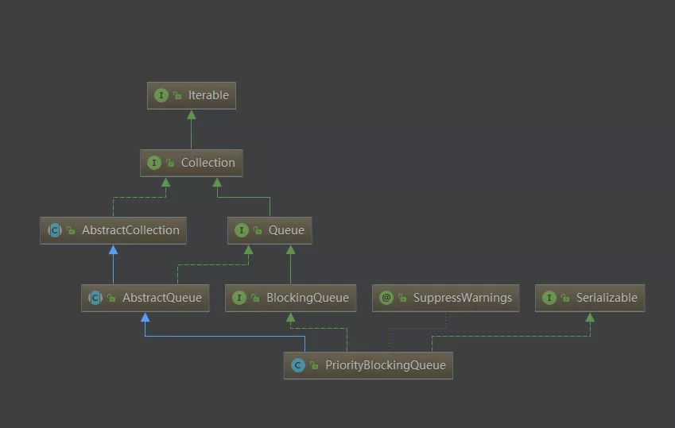

# PriorityBlockingQueue 源码分析

**版本： JDK 1.8**

<br>

## 一、 简介


PriorityBlockingQueue：**数组** 实现的 **优先级无界** 阻塞队列。

- 说是无界队列，最终还是会受 **内存** 限制，内部实现是数组，不停增长下去会导致 **OOM** 。
- 内存足够，就能入队，入队操作的线程需要 **争抢互斥锁。**
- 入队操作之后并不会立即进行排序调整，只有在 **出队操作** 或 **drainTo 转移队列** 时才是被优先级队列排序过的。
- 优先级的判断通过构造函数传入的 **Compator** 对象来决定，也就是说传入队列的对象必须实现 **Comparable 接口**，或者**传入一个 Comparator 实例对象**才可以。
- 在实现PriorityBlockingQueue时，**内部控制线程同步的锁采用的是公平锁。**
- 排序是通过 **最小堆** 实现的。（可以看我这篇文章[《堆排序》](https://github.com/wenhuohuo/java-summary/blob/master/docs/%E6%8E%92%E5%BA%8F%E7%AE%97%E6%B3%95/%E5%8D%81%E3%80%81%20%E5%A0%86%E6%8E%92%E5%BA%8F.md)）
- 优先级初始容量默认为 **11**， 当入队空间不足时进行 **扩容操作**，扩容大小根据扩容前的容量决定。

<br>



<br>


## 二、 类定义

```java
public class PriorityBlockingQueue<E> extends AbstractQueue<E>
    implements BlockingQueue<E>, java.io.Serializable {
```


<br>


## 三、 变量/常量、构造函数、其他方法


### 3.1 变量/常量

```java
private static final long serialVersionUID = 5595510919245408276L;
// 默认的队列容量
private static final int DEFAULT_INITIAL_CAPACITY = 11;

// 最大可达到的容量，减8是因为有可能部分虚拟机会用一部分空间来保存对象头信息
private static final int MAX_ARRAY_SIZE = Integer.MAX_VALUE - 8;


/*
 * 存储
 * 优先级队列通过平衡二叉堆实现，可类比堆排序算法
 * 那么queue[n]对应的左右子节点分别为queue[2*n+1]和[2*(n+1)]
 * 队列中的对象必须是可比较的，默认的自然排序或自行实现的的Comparator都可
 * 队列非空，则queue[0]为最小值，即以最小二叉堆排序
 */
private transient Object[] queue;

// 队列的实际元素个数
private transient int size;

// 比较器对象，在自然排序比较时为null
private transient Comparator<? super E> comparator;

// 互斥锁，只有一个ReentrantLock
private final ReentrantLock lock;

//非空信号量，队列为空时阻塞出队线程
//只需要判断队列为空的情况，队列没有满的情况，所以才是无限容量队列
private final Condition notEmpty;

// Spin锁，通过CAS操作实现
private transient volatile int allocationSpinLock;

// 在序列化中使用，为了兼容老版本
private PriorityQueue<E> q;
```

<br>


allocationSpinLock在对象中的 内存偏移量 获取在静态代码块中实现如下，后续使用CAS操作用到

```java
public Spliterator<E> spliterator() {
        return new PBQSpliterator<E>(this, null, 0, -1);
    }

    // Unsafe mechanics
    private static final sun.misc.Unsafe UNSAFE;
    private static final long allocationSpinLockOffset;
    static {
        try {
            UNSAFE = sun.misc.Unsafe.getUnsafe();
            Class<?> k = PriorityBlockingQueue.class;
            allocationSpinLockOffset = UNSAFE.objectFieldOffset
                (k.getDeclaredField("allocationSpinLock"));
        } catch (Exception e) {
            throw new Error(e);
        }
    }
```


<br>

### 3.2 构造函数

```java
public PriorityBlockingQueue() {
    //不传参数时，默认容量是11
    this(DEFAULT_INITIAL_CAPACITY, null);
}
```


```java
public PriorityBlockingQueue(int initialCapacity) {
    //传入初始化容量
    this(initialCapacity, null);
}
```

<br>

**传入集合参数**

```java
public PriorityBlockingQueue(int initialCapacity,
                             Comparator<? super E> comparator) {
    //判断非空
    if (initialCapacity < 1)
        throw new IllegalArgumentException();
    this.lock = new ReentrantLock();
    this.notEmpty = lock.newCondition();
    //初始化比较器
    this.comparator = comparator;
    this.queue = new Object[initialCapacity];
}
```

<br>

```java
public PriorityBlockingQueue(Collection<? extends E> c) {
    this.lock = new ReentrantLock();
    this.notEmpty = lock.newCondition();
    //是否需要重新排序的标识，即堆化标识。
    boolean heapify = true; // true if not known to be in heap order
    //控制检查标识
    boolean screen = true;  // true if must screen for nulls
    //如果集合SortedSet，则使用它的Comparator比较器即可，由于已经有序，直接复制，无需堆化。
    if (c instanceof SortedSet<?>) {
        SortedSet<? extends E> ss = (SortedSet<? extends E>) c;
        this.comparator = (Comparator<? super E>) ss.comparator();
        heapify = false;
    }
    //集合为PriorityBlockingQueue，使用它的Comparator排序
    else if (c instanceof PriorityBlockingQueue<?>) {
        PriorityBlockingQueue<? extends E> pq =
            (PriorityBlockingQueue<? extends E>) c;
        this.comparator = (Comparator<? super E>) pq.comparator();
        screen = false;
        //精确到PriorityBlockingQueue类，由于其已有序，直接复制，无需堆化。
        if (pq.getClass() == PriorityBlockingQueue.class) // exact match
            heapify = false;
    }
    
    Object[] a = c.toArray();
    int n = a.length;
    // If c.toArray incorrectly doesn't return Object[], copy it.
    //假如没有返回正确的Object[], 则复制 a
    if (a.getClass() != Object[].class)
        a = Arrays.copyOf(a, n, Object[].class);
    // this.comparator!=null 判断SortedSet类型的对象空值情况。
    
    if (screen && (n == 1 || this.comparator != null)) {
        for (int i = 0; i < n; ++i)
            if (a[i] == null)
                throw new NullPointerException();
    }
    this.queue = a;
    this.size = n;
    //堆化操作
    if (heapify)
        heapify();
}
```

<br>

## 四、 入队操作

**add()、 offer()**

### 4.1 add()

内部使用了 offer() 方法

```java
public boolean add(E e) {
    return offer(e);
}
```

<br>

### 4.2 offer()

```java
public boolean offer(E e) {
    //判断元素是否为空
    if (e == null)
        throw new NullPointerException();
    //获得锁
    final ReentrantLock lock = this.lock;
    lock.lock();
    int n, cap;
    Object[] array;
    //size:实际长度超过了队列的容量，进行扩容操作（tryGrow),在后面讲解
    while ((n = size) >= (cap = (array = queue).length))
        tryGrow(array, cap);
    try {
        Comparator<? super E> cmp = comparator;
        // 入队操作，将新节点放入最后，需要使用siftUpComparable()方法从下往上进行调整（后面讲解）
        if (cmp == null)
            siftUpComparable(n, e, array);
        else
            siftUpUsingComparator(n, e, array, cmp);
        //实际长度+1
        size = n + 1;
        //队列有数据则唤醒阻塞的出队线程（队列不空，通知线程拿走元素）
        notEmpty.signal();
    } finally {
        lock.unlock();
    }
    return true;
}
```

<br>

入队的整个操作跟PriorityQueue几乎一致：

- 加锁；
- 判断是否需要扩容；
- 添加元素并做自下而上的堆化；
- 元素个数加1并唤醒notEmpty条件，唤醒取元素的线程；
- 解锁；

<br>


## 五、 扩容方法

在入队中，有个扩容方法，我们在这里讲一下。

扩容操作发生在 offer的时候，因为offer获取了锁，所以需要在**扩容之前释放锁**，通过 **CAS** 操作将 **allocationSpinLock** 标识置为**1**， 表示当前正在扩容中，扩容完毕则重新获取锁，**allocationSpinLock**

标识置为**0**。

```java
private void tryGrow(Object[] array, int oldCap) {
    //先释放锁
    lock.unlock(); // must release and then re-acquire main lock
    //准备新数组
    Object[] newArray = null;
    
    // 其他线程未进行扩容操作时尝试使用CAS更新allocationSpinLock标识为1，
    // 成功则当前线程取得扩容操作权限
    if (allocationSpinLock == 0 &&
        UNSAFE.compareAndSwapInt(this, allocationSpinLockOffset,
                                 0, 1)) {
        try {
            // 原数组容量小于64，则每次增长oldCap + 2；
            // 原数组容量小大于等于64， 则每次增长oldCap的一半
            int newCap = oldCap + ((oldCap < 64) ?
                                   (oldCap + 2) : // grow faster if small
                                   (oldCap >> 1));
            // 新数组的容量 > 系统限定的最大容量
            if (newCap - MAX_ARRAY_SIZE > 0) {    // possible overflow
                // 原数组容量+1
                int minCap = oldCap + 1;
                // 容量+1之后就已经溢出或者超过了最大容量限制，直接抛出OOM异常。
                if (minCap < 0 || minCap > MAX_ARRAY_SIZE)
                    throw new OutOfMemoryError();
                //设置新数组容量为限制的最大值。
                newCap = MAX_ARRAY_SIZE;
            }
            // 扩容成功且当前数组没有被其他线程操作
            if (newCap > oldCap && queue == array)
                // 创建一个新数组。
                newArray = new Object[newCap];
        } finally {
            // 扩容标识置为0，表示当前没在扩容状态。
            allocationSpinLock = 0;
        }
    }
    // 其他线程已经扩容了
    if (newArray == null) // back off if another thread is allocating
        // 让出CPU
        Thread.yield();
    //重新获得锁。
    lock.lock();
    // 扩容成功且原数组没有被其他线程操作则赋值原数组到新数组中
    if (newArray != null && queue == array) {
        queue = newArray;
        System.arraycopy(array, 0, newArray, 0, oldCap);
    }
}
```


## 六、 向上调整

### 6.1 siftUpComparable

入队元素经历向上调整的过程

```java
//k:队列中的实际数量，
//x:入队的元素
//array：调整的数组
private static <T> void siftUpComparable(int k, T x, Object[] array) {
    Comparable<? super T> key = (Comparable<? super T>) x;
    while (k > 0) {
        //找到k位置处的父节点
        int parent = (k - 1) >>> 1;
        // 父节点对应的值
        Object e = array[parent];
        // 父子节点比较，k位置的节点大于等于其父节点，则退出，不需要对堆进行调整了。
        if (key.compareTo((T) e) >= 0)
            break;
        //否则，小于父节点的值，那么k位置的值改为父节点的值，
        //下面这两部相当于父子节点互换。
        array[k] = e;
        //k指向其父节点，相当于堆向上递进了一层，继续while判断其父节点是否需要调整
        k = parent;
    }
    //调整结束后，k位置即为插入x的值，即key。
    array[k] = key;
}
```

其实这就是小根堆的调整过程，跟大根堆类似。具体可看排序算法里《堆排序》的那篇。

<br>


### 6.2 siftUpUsingComparator

这个方法同上，区别在于这个使用了一个比较对象cmp，上边是自然排序

```java
private static <T> void siftUpUsingComparator(int k, T x, Object[] array,
                                   Comparator<? super T> cmp) {
    while (k > 0) {
        int parent = (k - 1) >>> 1;
        Object e = array[parent];
        if (cmp.compare(x, (T) e) >= 0)
            break;
        array[k] = e;
        k = parent;
    }
    array[k] = x;
}
```

<br>

## 七、出队操作

### 7.1 dequeue()

核心出队操作。

出队核心操作，需要**先获取互斥锁**才能执行，出队元素为 **array[0]** 节点，出队之后进行堆排序的操作，步骤如下：

- 保存 **array[n]** 值为**x**，清除数组中n处的值
- 通过**siftDownComparable**方法将 x 插入 0（即堆顶位置）处操作
- siftDownComparable自身向下依次去进行整个堆的平衡调整
- 堆（数组）长度-1

```java
private E dequeue() {
    //当前队列元素的长度-1.
    int n = size - 1;
    //减完后，如果长度<0,说明原来队列已经为空。无值，返回空
    if (n < 0)
        return null;
    else {
        Object[] array = queue;
        // 保存小根堆 堆顶的数据
        E result = (E) array[0];
        // 保存堆的最后一个元素
        E x = (E) array[n];
        // 最后的位置置为空
        array[n] = null;
        Comparator<? super E> cmp = comparator;
        if (cmp == null)
            // 通过自然排序使得整个堆保持堆顶最小
            siftDownComparable(0, x, array, n);
        else
            // 通过传入的比较累对象使得排序使得整个堆保持堆顶最小
            siftDownUsingComparator(0, x, array, n, cmp);
        // 实际数量变为n。
        size = n;
        // 出队保存的堆顶数据。
        return result;
    }
}
```

<br>

PriorityBlockingQueue：优先级队列的优先级在这里就体现出来了。上面讲了，**入队操作是建立小根堆的过程，根节点是最小值，也就是优先级最高。所以每次出队时，只弹出堆顶，也就能把优先级最高的出队。**

<br>

### 7.2 poll()

```java
public E poll() {
    final ReentrantLock lock = this.lock;
    lock.lock();
    try {
        return dequeue();
    } finally {
        lock.unlock();
    }
}
```

<br>

### 7.3 poll(long timeout, TimeUnit unit)

带超时时间的poll() 函数

```java
public E poll(long timeout, TimeUnit unit) throws InterruptedException {
    long nanos = unit.toNanos(timeout);
    final ReentrantLock lock = this.lock;
    lock.lockInterruptibly();
    E result;
    try {
        while ( (result = dequeue()) == null && nanos > 0)
            nanos = notEmpty.awaitNanos(nanos);
    } finally {
        lock.unlock();
    }
    return result;
}
```

<br>

### 7.4 take()

```java
public E take() throws InterruptedException {
    final ReentrantLock lock = this.lock;
    lock.lockInterruptibly();
    E result;
    try {
        while ( (result = dequeue()) == null)
            notEmpty.await();
    } finally {
        lock.unlock();
    }
    return result;
}
```

<br>

### 7.5 peek()

不移除的peek() 函数

```java
public E peek() {
    final ReentrantLock lock = this.lock;
    lock.lock();
    try {
        return (size == 0) ? null : (E) queue[0];
    } finally {
        lock.unlock();
    }
}
```

<br>


## 八、 向下调整

### 8.1 SiftDownComparable()

向下调整，其实就跟上面讲的反过来。

因为堆顶被弹出，空缺，要从上往下寻找**左右孩子的最小值**，**父节点和最小值的孩子节点比较**，**小，则调整完毕；大，则交换，**并接下向下调整，一直到调整完毕为止。

```java
//k: 堆顶位置
//x：出队过程中保存的堆最后一个的元素。
//array：要调整的数组
//n: 出队一个后的队列实际数量
private static <T> void siftDownComparable(int k, T x, Object[] array,
                                           int n) {
    if (n > 0) {
        Comparable<? super T> key = (Comparable<? super T>)x;
        // 最后的非叶子节点位置
        int half = n >>> 1; //（>>>:表示不带符号右移一位）  // loop while a non-leaf
        while (k < half) {
            // k的左子节点
            int child = (k << 1) + 1; // 左移一位找到左孩子节点
            Object c = array[child];
            // k的右孩子节点
            int right = child + 1;
            // 得到 左右孩子的最小值
            if (right < n &&
                ((Comparable<? super T>) c).compareTo((T) array[right]) > 0)
                c = array[child = right];
            // 其节点值小于等于其右孩子节点，表明堆调整完毕
            if (key.compareTo((T) c) <= 0)
                break;
            // 否则，k节点的值为其子节点的最大值
            array[k] = c;
            // k来到最大值的子节点的位置。
            k = child;
        }
        array[k] = key;
    }
}
```


<br>

### 8.2 SiftDownUsingComparator()

```java
private static <T> void siftDownUsingComparator(int k, T x, Object[] array,
                                                int n,
                                                Comparator<? super T> cmp) {
    if (n > 0) {
        int half = n >>> 1;
        while (k < half) {
            int child = (k << 1) + 1;
            Object c = array[child];
            int right = child + 1;
            if (right < n && cmp.compare((T) c, (T) array[right]) > 0)
                c = array[child = right];
            if (cmp.compare(x, (T) c) <= 0)
                break;
            array[k] = c;
            k = child;
        }
        array[k] = x;
    }
}
```

<br>


### heapify() ：堆化操作

堆化操作，从最后一个非叶子节点开始，循环对每个节点平衡，直到堆顶，完成堆的平衡操作。

其实就是从小到大排序过程

```java
private void heapify() {
    Object[] array = queue;
    int n = size;
    int half = (n >>> 1) - 1;
    Comparator<? super E> cmp = comparator;
    if (cmp == null) {
        for (int i = half; i >= 0; i--)
            siftDownComparable(i, (E) array[i], array, n);
    }
    else {
        for (int i = half; i >= 0; i--)
            siftDownUsingComparator(i, (E) array[i], array, n, cmp);
    }
}
```

<br>

## 九、 drainTo()

转移maxElements个元素到集合c中，从源码实现上可以看到转移之后的元素是有序的，而不是像PriorityBlockingQueue里的数组是无序的，每次转移，先直接添加堆顶元素，再出队操作，循环调用使得转移后的集合有序

```java
public int drainTo(Collection<? super E> c, int maxElements) {
    if (c == null)
        throw new NullPointerException();
    if (c == this)
        throw new IllegalArgumentException();
    if (maxElements <= 0)
        return 0;
    final ReentrantLock lock = this.lock;
    lock.lock();
    try {
        int n = Math.min(size, maxElements);
        for (int i = 0; i < n; i++) {
            c.add((E) queue[0]); // In this order, in case add() throws.
            dequeue();
        }
        return n;
    } finally {
        lock.unlock();
    }
}
```

<br>


## 十、 总结

- PriorityBlockingQueue是一个数组实现的无限制容量的优先级阻塞队列
- 默认初始容量为11，容量不够时可进行扩容操作
- 通过平衡二叉最小堆实现优先级排列
- **take、poll方法出队或drainTo转移的集合才是有序的**


<br>

<br>


# 参考

[JDK源码那些事儿之PriorityBlockingQueue](https://mp.weixin.qq.com/s/jAStqkHD0SJJxHjzsNUjxg)<br>

