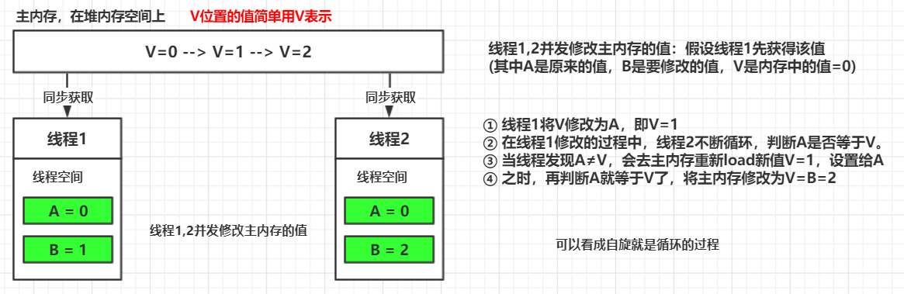

# CAS算法和悲观锁、乐观锁、自旋锁

结合我们之前提到悲观锁和乐观锁，自旋锁，来具体讲讲CAS算法。

## 悲观锁和乐观锁概述

 

在JDK1.5之前都是靠synchronized关键字保证同步的，这种通过一致的锁定协议来协调对共享状态的访问，可以确保无论哪个线程持有共享变量的锁，都采用独占的方式来访问这些变量。**独占锁就是一种悲观锁**。

**悲观锁机制存在以下问题：**

- 多线程竞争下，加锁、释放锁会导致比较多的上下文切换和调度延时（关于上下文切换的详细内容后面再讲），引起性能风险。
- 一个线程持有锁会导致其他所有需要此锁的线程挂起。
- 如果一个优先级高的线程等待一个优先级低的线程释放锁会导致优先级倒置，引起性能风险。

 

乐观锁是说，每次不加锁而是假设没有并发冲突而去完成某项操作，如果因为并发冲突失败就重试，直到成功。

**具体实现细节，主要有两个步骤**：

- **冲突检测**
- **数据更新**

其中一种比较典型的就是CAS。

 

## CAS

### 概述

**全名：Compare And Swap（比较与交换）**

**无锁算法**：基于硬件原语实现，在不使用锁（没有线程被阻塞）的情况下实现多线程之间的变量同步。

**JDK实现**：java.util.concurrent包中的原子类（AtomicInteger）就是通过CAS来实现乐观锁。

CAS算法涉及到三个操作数：

- **需要读写的内存位置的值V**
- **进行比较的预期原值A**
- **要写入的新值B**

**如果要读写的内存位置的值V 和 预期原值A 相匹配，那么处理器会将V位置更新为B**

否则处理器不做任何操作。

 

### 画图分析CAS

线程1,2并发修改主内存的值：假设线程1先获得该值 **(其中A是原来的值，B是要修改的值，V是内存中的值=0)** 

- ① 线程1将V修改为A，即V=1
- ② 在线程1修改的过程中，线程2不断循环，判断A是否等于V。
- ③ 当线程发现A≠V，会去主内存重新load新值V=1，设置给A
- ④ 之时，再判断A就等于V了，将主内存修改为V=B=2

 

### CAS存在的问题

- **ABA问题**
- **循环时间开销大**
- **只能保证一个共享变量的原子操作**

 

#### ABA问题

假设有三个线程1,2,3

- ① 线程1修改之后，线程3抢在线程2的前面，通过自旋判断
- ② 此时，线程3的A=主内存的V，那么将V修改为B=0
- ③ 换句话说，线程1修改的值被线程3修改回去了，而这个过程线程2并未感知到。

这个就是ABA问题。

 
**画图分析ABA问题：** 

 

**解决方法**：

可以通过加版本号的方式解决。比如 **`AtomicStampedReference`** 在变量前面添加版本号，每次变量更新的时候都把版本号加1。 **ABA问题已经由JVM帮我们解决。**

 

#### 循环时间开销大

自旋的过程就是循环的过程，如果一直空循环，会消耗CPU的资源，那么可以通过适应性自旋解决。

前面也提到了，JDK1.6之前通过

-  **`-XX:-UseSpinning`** 参数关闭自旋锁优化；
- **`-XX：PreBlockSpin`** 参数修改默认的自旋次数。

两个参数控制自旋次数和关闭自旋锁优化。

**JDK>=1.7** 自旋锁的参数被取消，**虚拟机不再支持由用户配置自旋锁**，自旋锁总是会执行，自旋锁次数也由虚拟机自动调整。

 

#### 只能保证一个共享变量的原子操作

当对一个共享变量执行操作时，我们可以使用循环CAS的方式来保证原子操作，但是对多个共享变量操作时，循环CAS就

无法保证操作的原子性，这个时候就可以用锁，或者有一个取巧的办法，就是 **把多个共享变量合并成一个共享变量来操**

**作**。比如有两个共享变量i＝2,j=a，合并一下ij=2a，然后用CAS来操作ij。从Java1.5开始JDK提供了**AtomicReference** 类

来保证引用对象之间的原子性，你可以把多个变量放在一个对象里来进行CAS操作。

 

## CAS与Synchronized的使用情景：　　　

- 对于资源竞争较少（线程冲突较轻）的情况，使用synchronized同步锁进行线程阻塞和唤醒切换以及用户态内核态间的切换操作额外浪费消耗cpu资源；而CAS基于硬件实现，不需要进入内核，不需要切换线程，操作自旋几率较少，因此可以获得更高的性能。
- 对于资源竞争严重（线程冲突严重）的情况，CAS自旋的概率会比较大，从而浪费更多的CPU资源，效率低于synchronized。

补充： synchronized在jdk1.6之后，已经改进优化。synchronized的底层实现主要依靠 **Lock-Free** 的队列，基本思路是自旋后阻塞，竞争切换后继续竞争锁，稍微牺牲了公平性，但获得了高吞吐量。在线程冲突较少的情况下，可以获得和CAS类似的性能；而线程冲突严重的情况下，性能远高于CAS。

  

### concurrent包的实现：

由于java的CAS同时具有 volatile 读和volatile写的内存语义，因此Java线程之间的通信现在有了下面四种方式：

- **A线程写volatile变量，随后B线程读这个volatile变量。**
- **A线程写volatile变量，随后B线程用CAS更新这个volatile变量。**
- **A线程用CAS更新一个volatile变量，随后B线程用CAS更新这个volatile变量。**
- **A线程用CAS更新一个volatile变量，随后B线程读这个volatile变量。**

 

Java的CAS会使用现代处理器上提供的高效机器级别原子指令，这些原子指令以原子方式对内存执行读-改-写操作，这是

在多处理器中实现同步的关键（从本质上来说，能够支持原子性读-改-写指令的计算机器，是顺序计算图灵机的异步等价

机器，因此任何现代的多处理器都会去支持某种能对内存执行原子性读-改-写操作的原子指令）。

同时，volatile变量的读/写和CAS可以实现线程之间的通信。把这些特性整合在一起，就形成了整个concurrent包得以实现

的基石。如果我们仔细分析concurrent包的源代码实现，会发现一个通用化的实现模式：

- **首先，声明共享变量为volatile；**　　
- **然后，使用CAS的原子条件更新来实现线程之间的同步；**
- **同时，配合以volatile的读/写和CAS所具有的volatile读和写的内存语义来实现线程之间的通信。**

 

AQS，非阻塞数据结构和原子变量类（java.util.concurrent.atomic包中的类），这些concurrent包中的基础类都是使用这

种模式来实现的，而concurrent包中的高层类又是依赖于这些基础类来实现的。从整体来看，concurrent包的实现示意图

如下：

　　　　　　

 

## 参考

[Java并发问题--乐观锁与悲观锁以及乐观锁的一种实现方式-CAS](https://www.cnblogs.com/qjjazry/p/6581568.html) 

