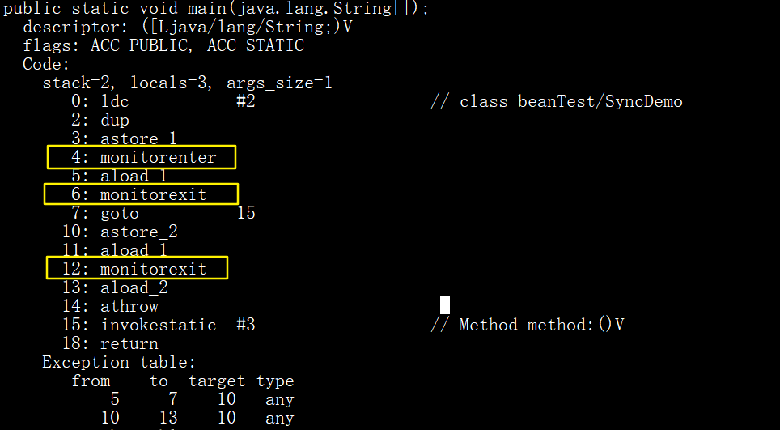
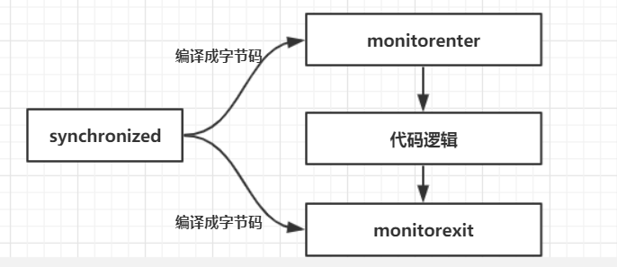

# Synchronized剖析

## 概述

Synchronized是Java中解决并发问题的一种最常用的方法，也是最简单的一种方法。

Synchronized的作用主要有三个：

- 确保线程互斥的访问同步代码
- 保证共享变量的修改能够及时可见
- 有效解决重排序问题。

<br>

**先上代码**：

```java
public class SynchronizedDemo implements Runnable {
    private static int count = 0;

    public static void main(String[] args) {
        for (int i = 0; i < 10; i++) {
            Thread thread = new Thread(new SynchronizedDemo());
            thread.start();
        }
        try {
            Thread.sleep(500);
        } catch (InterruptedException e) {
            e.printStackTrace();
        }
        System.out.println("result: " + count);
    }

    @Override
    public void run() {
        for (int i = 0; i < 1000000; i++)
            count++;
    }
}
```

<br>

很明显的，这代码在多并发的场景下，答案每次几乎都是不同的。这是主内存和工作内存导致的 **内存可见性问题** 以及 **重排序问题**。

读者可以先去看之前写的文章，了解一下JMM内存模型和happens-before，原子性，一致性，可见性等内容，方便理解。

[JMM内存模型和volatile缓存一致性](/java并发/JMM内存模型/3.JMM内存模型和volatile缓存一致性.md)、 [重排序和happens-before](java并发/JMM内存模型/5.重排序和happens-before.md)

<br>

## Synchronized实现原理

### synchronized的使用场景

| 分类   | 具体分类           | 被锁的对象        | 伪代码                                               |
| ------ | ------------------ | ----------------- | ---------------------------------------------------- |
| 方法   | 实例方法           | 类的 **实例对象** | public synchronized void method(){ ..... }           |
| 方法   | 静态方法           | **类对象**        | public static synchronized void menthod1(){ ...... } |
| 代码块 | 实例对象           | 类的实例对象      | synchronized(this){ ....... }                        |
| 代码块 | class对象          | 类对象            | synchronized(SynchronizedDemo.class){ ..... }        |
| 代码块 | 任意实例对象Object | 实例对象Object    | String lock =  "";    synchronized(lock){ ....... }  |

这里的需要注意的是：**如果锁的是类对象的话，尽管new多个实例对象，但他们仍然是属于同一个类依然会被锁住，即线程之间保证同步关系**。

简言之，加锁，锁的对象是：

1. 同步实例方法，锁当前实例对象
2. 同步类方法，锁当前类对象
3. 同步代码块，锁括号里的对象

<br>

### 监视器锁（monitor）机制

monitor 翻译为 **管程** 或 **监视器**。

每个对象都有自己的 Monitor，当这个对象有同步块或同步方法调用时，执行方法的线程必须先获得该对象的 monitor 才能进入同步块或同步方法。如果没有得到该monitor，就会被阻塞在 同步块或同步方法的入口处。进入 **BLOCKED** 状态。

<br>

我们先看一段代码

```java
package beanTest;

public class SyncDemo {
    public static void main(String[] args) {
        synchronized (SyncDemo.class) {
        }
        method();
    }

    private static void method() {
    }
}
```

<br>

用 **`javap -v SyncDemo.class`** 查看编译之后的class文件。内容如下：



<br>

可以看到黄色框中有的指令：**monitorenter和monitorexit** 。这是添加synchronized之后独有的指令。

线程执行通过 monitorenter 尝试获得 monitor的所有权，退出时候用 monitorexit 指令退出。

<br>

用synchronized进行同步，关键就是要对monitor进行获取，获取了才能继续往下执行，否则就只能等待。而这个获取过程是 **互斥** 的，即同一时刻只有一个线程能获得 monitor。等待的线程会在队列中等待。

上面的Demo中执行完同步代码块之后，紧接着执行了一个 **静态同步方法 method()** 。而锁的是类对象(SyncDemo.class) ，正在执行该线程无需再获得该锁，因为这是 **锁的重入性**。 后面只有一条 **monitorexit** 指令就可以看出。

<br>

在代码逻辑层面，逻辑图如下：



<br>

JVM 内置锁给synchronized使用，通过内部对象 Monitor（监视器锁） 实现，基于进入与退出Monitor对象实现方法与代码块同步，监视器锁的实现依赖底层系统的 **MutexLock**（互斥锁）实现，他是一个重量级锁。

我们来看下具体的 **JVM 加锁的过程**：


<br>

**monitorenter 和 monitorexit 具体过程**

**monitorenter**：

- 如果monitor的进入数为0，则该线程进入monitor，然后将进入数设置为1，该线程即为monitor的所有者。
- 如果线程已经占有该monitor，只是重新进入，则进入monitor的进入数加1.
- 如果其他线程已经占用了monitor，则该线程进入阻塞状态，直到monitor的进入数为0，再重新尝试获取monitor的所有权。

<br>

**monitorexit**:

- 执行monitorexit的线程必须是objectref所对应的monitor的所有者。
- 指令执行时，monitor的进入数减1，如果减1后进入数为0，那线程退出monitor，不再是这个monitor的所有者。其他被这个monitor阻塞的线程可以尝试去获取这个 monitor 的所有权。
- Synchronized的语义底层是通过一个monitor的对象来完成，其实wait/notify等方法也依赖于monitor对象，这就是为什么只有在同步的块或者方法中才能调用wait/notify等方法，否则会抛出java.lang.IllegalMonitorStateException的异常的原因。

<br>

## synchronized 和 happens-before关系


## synchronized优化（锁膨胀升级过程）

<br>


## 参考

[Java 中的 Monitor 机制](https://www.jianshu.com/p/7f8a873d479c)<br>[synchronized简介](https://github.com/wenhuohuo/Java-concurrency/blob/master/04.%E5%BD%BB%E5%BA%95%E7%90%86%E8%A7%A3synchronized/java%E5%85%B3%E9%94%AE%E5%AD%97---synchronized.md)<br>[java并发：Synchronized 原理](https://www.cnblogs.com/huangyin/p/6586469.html)<br>

