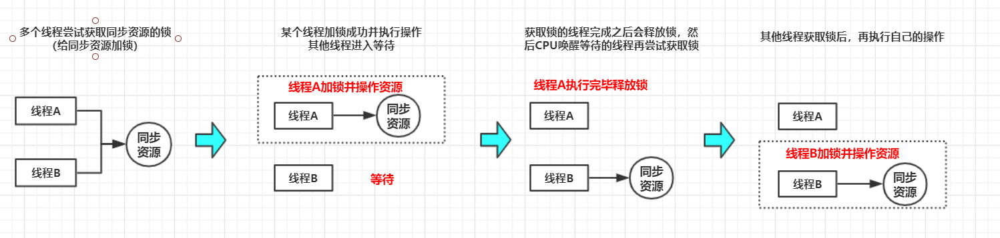

# java的各种锁

## 1.java锁的分类

1. 线程是否要锁住同步资源
   - 锁住：**悲观锁**
   - 不锁住：**乐观锁**
2. 锁住同步资源失败，线程是否要阻塞
   - 阻塞
   - **不阻塞**
     - **自旋锁**
     - **自适应自旋锁** 
3. 多个线程竞争同步资源的流程细节有没有区别
   - 不锁住资源，多个线程中只有一个能修改资源成功，其他线程会重试：**无锁**
   - 同一个线程执行同步资源时自动获取资源：**偏向锁**
   - 多个线程竞争同步资源时，没有获取资源的线程自旋等待锁的释放：**轻量级锁**
   - 多个线程竞争同步资源时，没有获取资源的线程阻塞等待唤醒：**重量级锁**
4. 多个线程竞争锁时是否要排队：
   - 排队：**公平锁**
   - 先尝试插队，插队失败再排队：**非公平锁**
5. 一个线程的多个流程能不能获取同一把锁：
   - 能：**可重入锁**
   - 不能：**非可重入锁**
6. 多个线程能不能共享一把锁
   - 能：**共享**
   - 不能：**排它锁**

 

## 2.悲观锁与乐观锁

> 悲观锁与乐观锁是一种广义概念，体现的是看待线程同步的不同角度

### 悲观锁

悲观锁认为自己在使用数据的时候一定有别的线程来修改数据，在获取数据的时候会先加锁，确保数据不会被别的线程修改。

- **锁实现**：关键字 **synchronized** 、**接口Lock的实现类** 
- **使用场景**：写操作较多，先加锁可以保证写操作时数据正确。

**执行过程**：

 

### 乐观锁

> 乐观锁认为自己在使用数据时不会有别的线程修改数据，所以不会添加锁，只是在更新数据的时候去判断之前有没有别的线程更新了这个数据

- **锁实现**： **CAS算法**，例如 **AtomicInteger** 类的原子自增是通过 **CAS** 自旋实现的。
- **使用场景**： 读操作较多，不加锁特点能够使其读操作的性能大幅提升。

 

## 3.自旋锁和自适应自旋锁

### 自旋锁

> 是指当一个线程在获取锁的时候，如果锁已经被其他线程获取，那么该线程将 **循环等待**，然后不断的判断是否能够被成功获取，**自旋直到获取锁才会退出循环**。
>
> 锁在原地循环的时候，会消耗CPU，相当于在执行一个啥也没有的for循环。

**自旋锁存在的意义**：

- 阻塞与唤醒线程需要操作系统切换CPU状态，需要消耗一定的时间
- 同步代码块逻辑简单，执行时间短。

 

当然，如果好几个线程都在竞争某个锁，那么有可能当前线程会获取不到锁，一直消耗CPU。这时，需要设置空循环次数，当线程超过这个次数，就认为使用自旋锁不合适了，此时锁会再次膨胀，升级为重量级锁。

 

### 自适应自旋锁

> 自适应自旋锁假定不同线程持有同一个锁对象的时间基本相当，竞争程度趋于稳定，因此，可以根据上一次自旋的 **时间和结果** 调整下一次自选的时间。

**JDK1.6** 通过

-  **`-XX:-UseSpinning`** 参数关闭自旋锁优化；
- **`-XX：PreBlockSpin`** 参数修改默认的自旋次数。

**JDK>=1.7** 自旋锁的参数被取消，**虚拟机不再支持由用户配置自旋锁**，自旋锁总是会执行，自旋锁次数也由虚拟机自动调整。

 

## 4.偏向锁、轻量级锁、重量级锁

我们知道synchronized是一个 **重量级锁** ，但是在 JDK1.6之后，synchronized被优化了很多。可以从偏向锁到重量级锁

锁是在加载对象上的，被加了锁的对象叫 **锁对象**。

那么，java对象在内存中的存储结构主要有三部分：

- **对象头**
- **实例数据**
- **填充数据**

这里强调一下，**对象头**里的数据主要是一些运行时的数据。

其简单的结构如下

| 长度     | 内容                   | 说明                        |
| -------- | ---------------------- | --------------------------- |
| 32/64bit | **Mark Work**          | hashCode,GC分代年龄，锁信息 |
| 32/64bit | Class Metadata Address | 指向对象类型数据的指针      |
| 32/64bit | Array Length           | 数组的长度(当对象为数组时)  |

偏向锁、轻量级锁、重量级锁对比

| 锁       | 优点                                                         | 缺点                                           | 适用场景                           |
| -------- | ------------------------------------------------------------ | ---------------------------------------------- | ---------------------------------- |
| 偏向锁   | 加锁和解锁不需要额外的消耗，和执行非同步方法相比仅存在纳秒级的差距 | 如果线程间存在锁竞争，会带来额外的锁撤销的消耗 | 适用于只有一个线程访问同步块场景   |
| 轻量级锁 | 竞争的线程不会阻塞，提高了程序的响应速度                     | 如果始终得不到索竞争的线程，使用自旋会消耗CPU  | 追求响应速度，同步块执行速度非常快 |
| 重量级锁 | 线程竞争不使用自旋，不会消耗CPU                              | 线程阻塞，响应时间缓慢                         | 追求吞吐量，同步块执行速度较慢     |

 

## 参考

彻底搞懂synchronized(从偏向锁到重量级锁) 

《java并发编程的艺术》 

  

