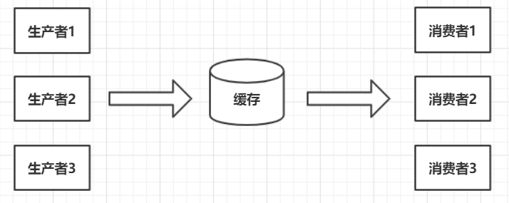

# 生产者-消费者模式

## 简介

生产者-消费者模式是一个经典的多线程设计模式，它为多线程间的协作提供了良好的解决方案。

在生产者-消费者模式中，通常有两类线程，即若干个生产者和若干个消费者线程。生产者线程负责提交用户请求，消费者线程则负责处理生产者提交的任务。生产者和消费者之间通过**共享内存缓冲区**进行通信。

<br>

## 生产者消费者分析图



<br>

## 举例

```
package provider_customer;

public final class Data {

	private String id;
	private String name;
	public Data(String id, String name){
		this.id = id;
		this.name = name;
	}
	public String getId() {
		return id;
	}
	public void setId(String id) {
		this.id = id;
	}
	public String getName() {
		return name;
	}
	public void setName(String name) {
		this.name = name;
	}
	@Override
	public String toString(){
		return "{id: " + id + ", name: " + name + "}";
	}	
}

```

```
package provider_customer;

import java.util.Random;
import java.util.concurrent.BlockingQueue;
import java.util.concurrent.TimeUnit;
import java.util.concurrent.atomic.AtomicInteger;

public class Provider implements Runnable{
	
	//共享缓存区
	private BlockingQueue<Data> queue;
	//多线程间是否启动变量，有强制从主内存中刷新的功能。即时返回线程的状态
	private volatile boolean isRunning = true;
	//id生成器
	private static AtomicInteger count = new AtomicInteger();
	//随机对象
	private static Random r = new Random(); 
	
	public Provider(BlockingQueue queue){
		this.queue = queue;
	}

	@Override
	public void run() {
		while(isRunning){
			try {
				//随机休眠0 - 1000 毫秒 表示获取数据(产生数据的耗时) 
				Thread.sleep(r.nextInt(1000));
				//获取的数据进行累计...
				int id = count.incrementAndGet();
				//比如通过一个getData方法获取了
				Data data = new Data(Integer.toString(id), "数据" + id);
				System.out.println("当前线程:" + Thread.currentThread().getName() + ", 获取了数据，id为:" + id + ", 进行装载到公共缓冲区中...");
				if(!this.queue.offer(data, 2, TimeUnit.SECONDS)){
					System.out.println("提交缓冲区数据失败....");
					//do something... 比如重新提交
				}
			} catch (InterruptedException e) {
				e.printStackTrace();
			}
		}
	}
	
	public void stop(){
		this.isRunning = false;
	}
	
}
```

```
package provider_customer;

import java.util.Random;
import java.util.concurrent.BlockingQueue;
import java.util.concurrent.TimeUnit;

public class Consumer implements Runnable{

	private BlockingQueue<Data> queue;
	
	public Consumer(BlockingQueue queue){
		this.queue = queue;
	}
	
	//随机对象
	private static Random r = new Random(); 

	@Override
	public void run() {
		while(true){
			try {
				//获取数据
				Data data = this.queue.take();
				//进行数据处理。休眠0 - 1000毫秒模拟耗时
				Thread.sleep(r.nextInt(1000));
				System.out.println("当前消费线程：" + Thread.currentThread().getName() + "， 消费成功，消费数据为id: " + data.getId());
			} catch (InterruptedException e) {
				e.printStackTrace();
			}
		}
	}
}

```

```
package provider_customer;

import java.util.concurrent.BlockingQueue;
import java.util.concurrent.ExecutorService;
import java.util.concurrent.Executors;
import java.util.concurrent.LinkedBlockingQueue;

public class Main {

	public static void main(String[] args) throws Exception {
		//内存缓冲区
		BlockingQueue<Data> queue = new LinkedBlockingQueue<Data>(10);
		//生产者
		Provider p1 = new Provider(queue);
		
		Provider p2 = new Provider(queue);
		Provider p3 = new Provider(queue);
		//消费者
		Consumer c1 = new Consumer(queue);
		Consumer c2 = new Consumer(queue);
		Consumer c3 = new Consumer(queue);
		//创建线程池运行,这是一个缓存的线程池，可以创建无穷大的线程，没有任务的时候不创建线程。空闲线程存活时间为60s（默认值）

		ExecutorService cachePool = Executors.newCachedThreadPool();
		cachePool.execute(p1);
		cachePool.execute(p2);
		cachePool.execute(p3);
		cachePool.execute(c1);
		cachePool.execute(c2);
		cachePool.execute(c3);

		try {
			Thread.sleep(3000);
		} catch (InterruptedException e) {
			e.printStackTrace();
		}
		p1.stop();
		p2.stop();
		p3.stop();
		try {
			Thread.sleep(2000);
		} catch (InterruptedException e) {
			e.printStackTrace();
		}		
//		cachePool.shutdown(); 
//		cachePool.shutdownNow();	

	}
}

```

```
当前线程:pool-1-thread-3, 获取了数据，id为:1, 进行装载到公共缓冲区中...
当前线程:pool-1-thread-1, 获取了数据，id为:2, 进行装载到公共缓冲区中...
当前线程:pool-1-thread-1, 获取了数据，id为:3, 进行装载到公共缓冲区中...
当前消费线程：pool-1-thread-5， 消费成功，消费数据为id: 2
当前消费线程：pool-1-thread-4， 消费成功，消费数据为id: 1
当前线程:pool-1-thread-2, 获取了数据，id为:4, 进行装载到公共缓冲区中...
当前线程:pool-1-thread-3, 获取了数据，id为:5, 进行装载到公共缓冲区中...
当前消费线程：pool-1-thread-6， 消费成功，消费数据为id: 3
当前消费线程：pool-1-thread-4， 消费成功，消费数据为id: 5
当前线程:pool-1-thread-3, 获取了数据，id为:6, 进行装载到公共缓冲区中...
当前消费线程：pool-1-thread-6， 消费成功，消费数据为id: 6
当前线程:pool-1-thread-1, 获取了数据，id为:7, 进行装载到公共缓冲区中...
当前线程:pool-1-thread-2, 获取了数据，id为:8, 进行装载到公共缓冲区中...
当前消费线程：pool-1-thread-4， 消费成功，消费数据为id: 7
当前消费线程：pool-1-thread-5， 消费成功，消费数据为id: 4
当前线程:pool-1-thread-3, 获取了数据，id为:9, 进行装载到公共缓冲区中...
当前消费线程：pool-1-thread-4， 消费成功，消费数据为id: 9
当前线程:pool-1-thread-1, 获取了数据，id为:10, 进行装载到公共缓冲区中...
当前线程:pool-1-thread-1, 获取了数据，id为:11, 进行装载到公共缓冲区中...
当前消费线程：pool-1-thread-4， 消费成功，消费数据为id: 11
当前消费线程：pool-1-thread-6， 消费成功，消费数据为id: 8
当前线程:pool-1-thread-2, 获取了数据，id为:12, 进行装载到公共缓冲区中...
当前线程:pool-1-thread-3, 获取了数据，id为:13, 进行装载到公共缓冲区中...
当前线程:pool-1-thread-2, 获取了数据，id为:14, 进行装载到公共缓冲区中...
当前线程:pool-1-thread-2, 获取了数据，id为:15, 进行装载到公共缓冲区中...
当前消费线程：pool-1-thread-5， 消费成功，消费数据为id: 10
当前线程:pool-1-thread-1, 获取了数据，id为:16, 进行装载到公共缓冲区中...
当前消费线程：pool-1-thread-5， 消费成功，消费数据为id: 14
当前消费线程：pool-1-thread-4， 消费成功，消费数据为id: 12
当前线程:pool-1-thread-3, 获取了数据，id为:17, 进行装载到公共缓冲区中...
当前消费线程：pool-1-thread-4， 消费成功，消费数据为id: 16
当前线程:pool-1-thread-2, 获取了数据，id为:18, 进行装载到公共缓冲区中...
当前消费线程：pool-1-thread-5， 消费成功，消费数据为id: 15
当前消费线程：pool-1-thread-6， 消费成功，消费数据为id: 13
当前线程:pool-1-thread-1, 获取了数据，id为:19, 进行装载到公共缓冲区中...
当前消费线程：pool-1-thread-5， 消费成功，消费数据为id: 18
当前消费线程：pool-1-thread-4， 消费成功，消费数据为id: 17
当前消费线程：pool-1-thread-6， 消费成功，消费数据为id: 19
```

