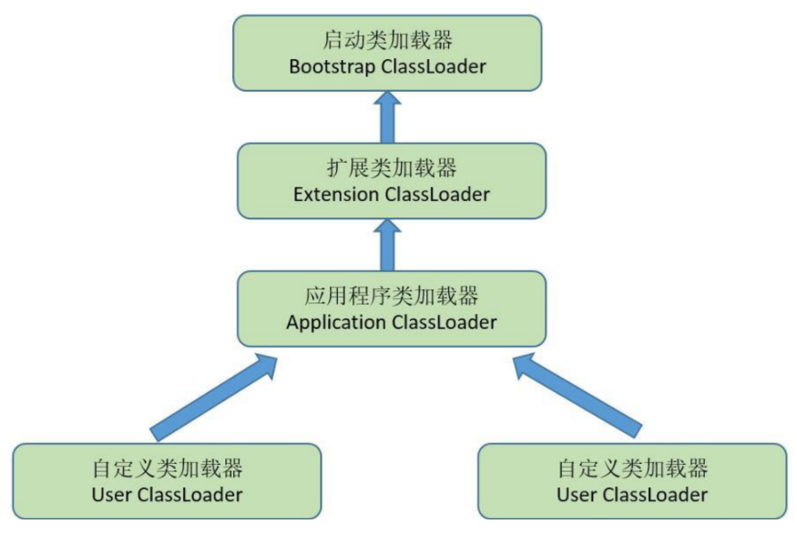

# 类加载器和双亲委派模型

## 一、 类加载器

类加载器只用于实现类的加载动作，但它在Java程序中起到的作用却远远不限于类加载阶段。

对于任意一个类，都需要由加载它的类加载器和这个类本身一同确立其在Java虚拟机中的唯一性，每个类加载器都有一个独立的类名称空间。

通俗说：两个各类是否“相等''， 只有在这两个类都是由同一个类加载器的前提下才有意义。

否则，即使两个类来自同一个Class文件，被同一个虚拟机加载，只要加载他们的类加载器不同，两个类就不同。

这里的“相等”，指 equals（）方法，isAssignableFrom() 方法， inInstance()方法的返回结果，instanceof判定的关系等。

 

## 二、 双亲委派模型

存在两种不同的类加载器：

**启动类加载器**（Bootstrap ClassLoader），使用C++实现，是虚拟机自身的一部分。

另一种是所有**其他的类加载器**，使用JAVA实现，独立于JVM，并且全部继承自抽象类 **`java.lang.ClassLoader。`**

 

1. **启动类加载器**（Bootstrap ClassLoader），负责将存放在<JAVA+HOME>\lib目录中的，或者被-Xbootclasspath 参数所制定的路径中的，并且是JVM识别的（仅按照文件名识别，如rt.jar，如果名字不符

合，即使放在lib目录中也不会被加载），加载到虚拟机内存中，启动类加载器无法被JAVA程序直接引用。

 

2. **扩展类加载器**，由sun.misc.Launcher$ExtClassLoader实现，负责加载<JAVA_HOME>\lib\ext目录中的，或

者被java.ext.dirs系统变量所指定的路径中的所有类库，开发者可以直接使用扩展类加载器。

 

3. **应用程序类加载器（**Application ClassLoader），由sun.misc.Launcher$AppClassLoader来实现。由于这个

类加载器是ClassLoader中的getSystemClassLoader()方法的返回值，所以一般称它为系统类加载器。负责加

载用户类路径（ClassPath）上所指定的类库，开发者可以直接使用这个类加载器，如果应用程序中没有自定

义过自己的类加载器，**一般情况下这个就是程序中默认的类加载器。**

 

 

　　这张图表示类加载器的 **双亲委派模型**（Parents Delegation model）。

**双亲委派模型要求除了顶层的启动加载类外，其余的类加载器都应当有自己的父类加载器。**

这里类加载器之间的父子关系一般不会以继承的关系来实现，而是使用**组合关系来复用**父类加载器的代码。

 

**双亲委派模型的工作过程**：

- 如果一个类加载器收到了类加载的请求，
- 它首先不会自己去尝试加载这个类，而是 **把这个请求委派给父类加载器去完成**，每一个层次的类加载器都是如此，
- 因此所有的加载请求最终都是应该传送到 **顶层的启动类加载器中**，**只有当父类加载器反馈自己无法完成这个加载请求**（它的搜索范围中没有找到所需的类）时，子加载器才会尝试自己去加载。

 

**这样做的好处**：（好处：加载同一类，避免混乱）

Java类随着它的类加载器一起具备了一种带有**优先级的层次关系**。

例如类 **java.lang.Object,**它存放在rt.jar中，无论哪一个类加载器要加载这个类，最终都是委派给处于模型最顶端的启动类加载器进行加载，**因此Object类在程序的各种类加载器环境中都是同一个类**。

相反，如果没有使用双亲委派模型，由各个类加载器自行去加载的话，如果用户自己编写了一个称为java.lang.object的类，并放在程序的ClassPath中，那系统中将会出现多个不同的Object类，Java类型体系中最基础的行为也就无法保证，应用程序也将会变得一片混乱。

 

就是保证某个范围的类一定是被某个类加载器所加载的，这就保证在程序中同一个类不会被不同的类加载器加载。

这样做的一个主要的考量，就是从安全层面上，杜绝通过使用和 JRE 相同的类名冒充现有JRE的类达到替换的攻击方式。

 

## 参考

《深入理解Java虚拟机》第二版 

[【Java面试宝典】深入理解JAVA虚拟机](https://cloud.tencent.com/developer/article/1352633) 