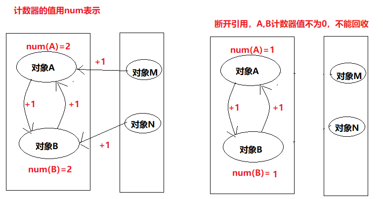
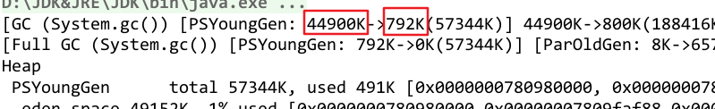
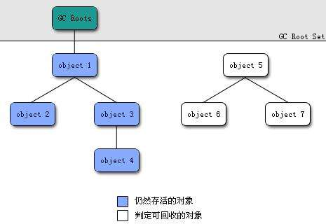
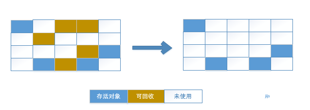
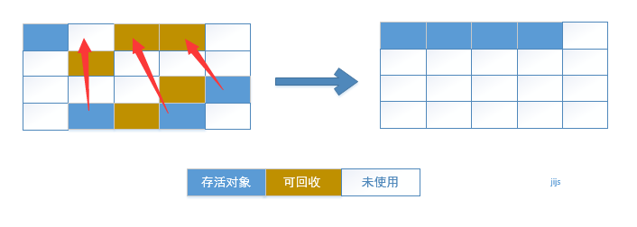
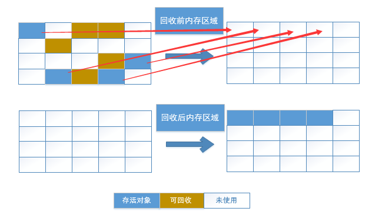
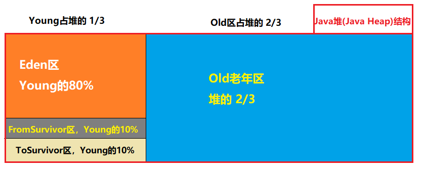
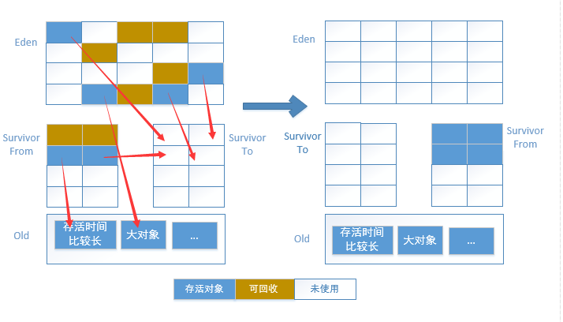

# 垃圾回收算法

## 一、 怎么判定对象为垃圾对象

### 1.1 引用计数法

- 每个对象有一个**引用计数器**，
- 当对象被**引用一次**则 **计数器加1，**
- 当对象引用 **失效一次**则 **计数器减1，**
- 对于 **计数器为0**的对象意味着是**垃圾对象**，可以被GC回收。

<br>


**但是，引用计数法并不能解决循环引用问题。**

<br>



<br>

事实上，已经没有虚拟机使用引用计数法了。

**验证现在用的不是引用计数法**：

```java
package jvm;

/**
 * @program: Multi_002
 * @description: 验证计数算法是否被使用
 * @author: wenyan
 * @create: 2019-10-18 15:52
 **/

public class VerifyCountingAlgorithm {
    byte[] m = new byte[20*1024*1024];  //20m
    Object instance;

    public static void main(String[] args) {
        VerifyCountingAlgorithm v1 = new VerifyCountingAlgorithm();
        VerifyCountingAlgorithm v2 = new VerifyCountingAlgorithm();

        v1.instance = v2;
        v2.instance = v1;

        v1 = null;
        v2 = null;

        System.gc();
    }
}

```

<br>

我们在 IDEA面板中 “**RUN 》 Edit Configurations 》 VM options**” 中输入参数信息 **`-XX:+PrintGCDetails`** , 来查看GC的具体情况

<br>



<br>

从图里可以看到，44900K 变成了 792K，反证法说明，不是用的引用计数法，才能被收集。

**也没有因为 v1 和 v2 相互引用，就没有收集。**

<br>


### 1.2 可达性分析算法

在主流的编程语言中，使用的算法是 可达性分析算法。思路如下：

通过一些“**GCRoots**”对象作为起点，从这些节点开始往下搜索，搜索通过的路径成为**引用链（ReferenceChain）**，当一个对象没有被 GCRoots 的引用链链接的时候，说明这个对象 **不可达** ，该对象是不可使用的，**垃圾收集器将收回其占用的内存**。 GCRoots对象包括：

**1.** **虚拟机栈（栈帧中的本地变量表）中的引用的对象。**

**2.** **方法区域中的类静态属性引用的对象。**

**3.** **方法区域中常量引用的对象。**

**4.** **本地方法栈中JNI（Native方法）的引用的对象。**

<br>



<br>

从图中可以看出，object5、object6、object7 对象是没有GC-Roots 引用（间接引用），因此，这三个对象可以被垃圾收集器回收。

<br>


## 二、 垃圾回收算法

### 2.1 标记清除算法

**标记-清除（Mark-Sweep）算法**

是现代垃圾回收算法的思想基础。

标记-清除算法将垃圾回收分为两个阶段：**标记阶段和清除阶段**。

- 一种可行的实现是，在标记阶段，首先通过根节点，标记所有从根节点开始的可达对象。因此，未被标记的对象就是未被引用的垃圾对象（好多资料说标记出要回收的对象，其实明白大概意思就可以了）。
- 然后，在清除阶段，清除所有未被标记的对象。 如图：

<br>



<br>

**缺点**： 

1、**效率**问题，标记和清除两个过程的 **效率都不高；** 

2、**空间**问题，标记清除之后会产生 **大量不连续的内存碎片**，空间碎片太多可能会导致以后在程序运行过程中需要分配较大的对象时，无法找到足够的连续内存而不得不提前触发另一次垃圾收集动作。

<br>


### 2.2 标记整理算法

标记整理算法类似与标记清除算法。

**不过它标记完对象后，不是直接对可回收对象进行清理，而是让所有存活的对象都向一端移动，然后直接清理掉边界以外的内存。**



<br>

**缺点**： 

**效率问题**，（同标记清除算法）标记和整理两个过程的效率都不高； 

<br>

**优点**： 

1、相对标记清除算法**，解决了内存碎片问题。** 

2、没有内存碎片后，对象创建内存分配也更快速了（可以使用**TLAB**进行分配）。 

<br>


### 2.3 复制算法

我们知道，标记清除算法,标记整理算法 的效率不高，为了解决效率问题，可以采用复制算法。思路如下：

- 将可用内存按容量划分为**大小相等的两块，**
- 每次只使用其中的一块，当这一块内存用完了，就**将还存活着的对象复制到另一块上面，**
- 然后再把**已经使用过的内存空间一次清理掉，**
- 这样使得每次都是对整个半区进行内存回收，内存分配时也就**不用考虑内存碎片**等复杂情况，只要移动堆顶指针，按顺序分配内存即可（还可使用TLAB进行高效分配内存）。

<br>



图的上半部分是**未回收前的内存区域**，图的下半部分是**回收后的内存区域**。通过图，我们发现不管回收前还是回收后都有一半的空间未被利用。

<br>

**优点** :

**效率高，没有内存碎片** 

<br>

**缺点**： 

1、浪费一半的内存空间 

2、复制收集算法在对象存活率较高时就要进行较多的复制操作，效率将会变低。 

<br>


### 2.4 分代收集算法

当前商业虚拟机都是采用分代收集算法。思路如下：

- 它根据对象存**活周期的不同**将内存划分为几块，一般是把Java堆分为**新生代**和**老年代**，然后根据各个年代的特点采用最适当的收集算法，
- 在新生代中，每次垃圾收集都发现有大批对象死去，只有少量存活，就选用**复制算法，**
- 而老年代因为对象存活率高，没有额外空间对它进行分配担保，就必须使用“**标记清理”或者“标记整理**”算法来进行回收。

<br>

- 堆分为新生代和老年代。
- 新生代占堆的1/3,老年代占堆的 2/3 
- 新生代分为：Eden(80%), FromSurvivor(10%), ToSurvivor(10%)。所以是 **8:1:1**
- 堆的大小可通过参数**–Xms（堆的初始容量）、-Xmx（堆的最大容量）** 来指定
- **JVM 每次只会使用 Eden 和其中的一块 Survivor 区域来为对象服务**，所以无论什么时候，**总是有一块 Survivor 区域是空闲着的。**
- 新生代实际可用的内存空间为新生代的 90%。

<br>



<br>

**收集过程图示：** 



<br>

**过程**：

- 对象会在Eden区和一块Survivor中创建，这里假设是FromSurvivor区。

- 在经过一次 **Minor GC(清理新生代)** 前，会标记不需要清除的对象，然后使用复制算法将标记的对象复制到另外一块 

  ToSurvivor 区 中，

- 然后清理所使用过的 Eden 以及 FromSurvivor 区，

- 并且将这些存活的对象的年龄设置为 1，然后再次同上，以后对象在 Survivor 区每熬过一次 Minor GC，就将

  对象的年龄 + 1，**当对象的年龄达到某个值时 ( 默认是 15 岁**，可以通过参数 **`-XX:MaxTenuringThreshold`** 

  来设定 )，这些对象就会成为老年代。

<br>

**补充**：

- 但这也不是绝对的，对于一些较大的对象 ( 即需要分配一块较大的连续内存空间 ) 则是直接进入到老年代。
- 还有  当代码中调用  **System.gc()**   对于**可达的对象会提前进入老年代**，并且 这个方法先**minor gc(清理老年代)** 然后在 **full  gc(清理整个堆)。** 


<br>


# 参考

《深入理解Java虚拟机》第二版<br>

[JVM垃圾回收算法](https://cloud.tencent.com/developer/article/1129496)<br>

[JVM 新生代 8：1：1 原因](https://blog.csdn.net/weixin_41955327/article/details/90784489)<br>