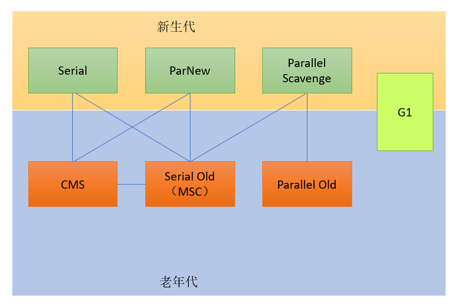
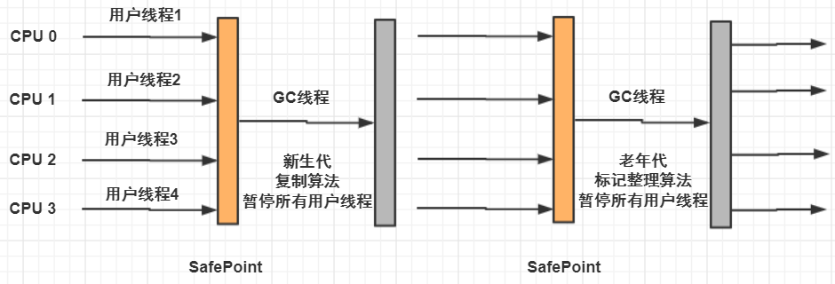
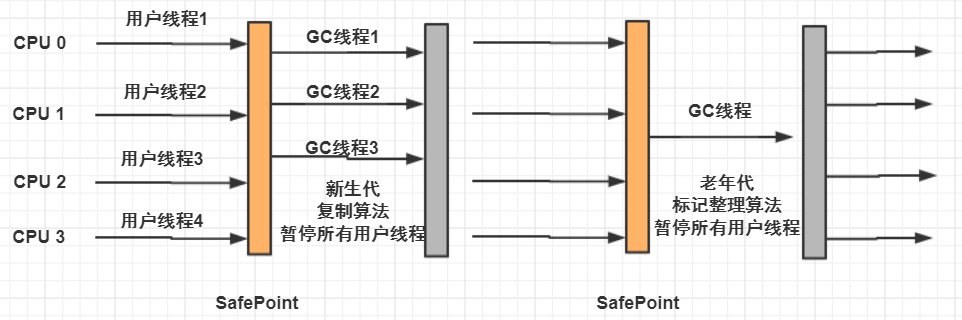
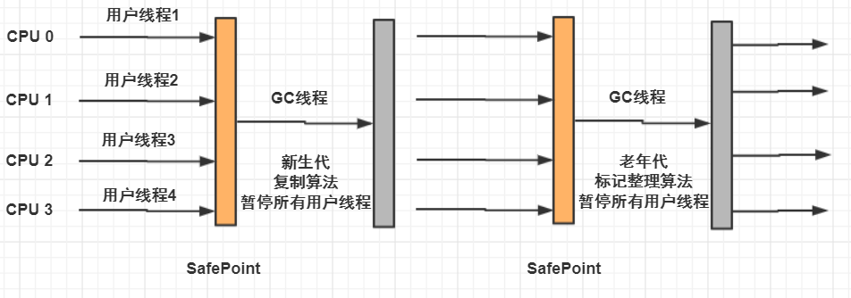
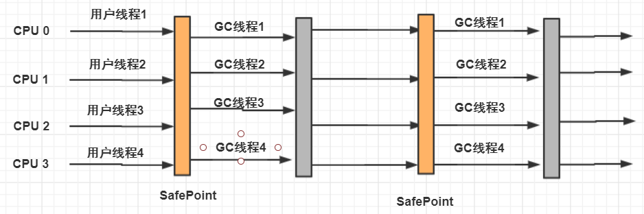
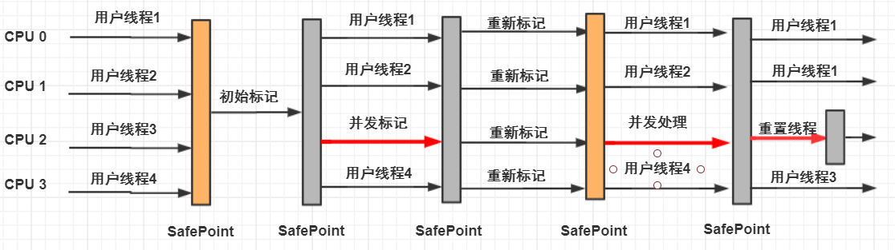
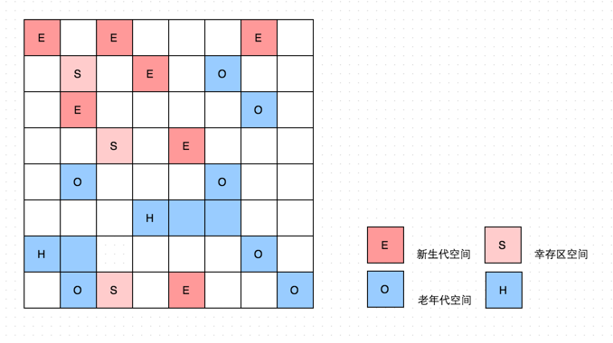
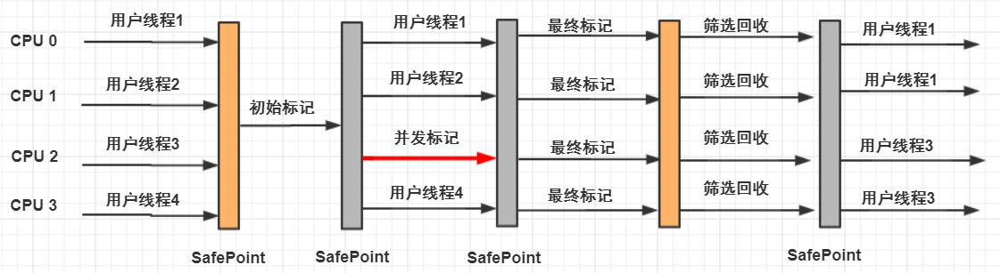

# 垃圾收集器

垃圾收集器

- Serial
- ParNew
- Parallel Scavenge
- Serial Old
- Parallel Old
- CMS
- G1

 

新生代和老年代的收集器如图：

 

## 一、 Serial 收集器

**单线程、串行收集器**。即在垃圾清理时，必须暂停其他所有工作线程。

它是采用**复制算法**的新生代收集器。

下图是 Serial 收集器运行过程。

 

在垃圾收集时必须暂停其他线程。

 

## 二、ParNew 收集器

**ParNew 收集器是 Serial 收集器的多线程版本**。可以减少垃圾回收时间。

除了使用多线程收集，其他与 Serial 收集相比并无太多创新之处。

默认开启的线程数量与 CPU 数量相同。

在单 CPU 的环境，ParNew 收集器不会比 Serial 收集器更优秀。

 

 

## 三、 Parallel Scavenge 收集器

Parallel Scavenge 收集器也是一个 **并行的多线程新生代收集器**，使用的是**复制算法。**

特点在于它的目标是达到一个**可控制的吞吐量**（Throughput）。

吞吐量就是 CPU 用于运行用户代码得时间与 CPU 消耗时间的比值。

**吞吐量 = 运行用户代码时间 / (运行用户代码时间 + 垃圾收集时间)**

高吞吐量可以高效率地利用 CPU 时间，尽快完成程序地运行任务，适合在后台运行不需要太多交互的任务。

**-XX:GCTimeRatio : 设置吞吐量大小。**

**-XX:MaxGCPauseMillis : 设置最大垃圾收集停顿时间。**

 

## 四、Serial Old 收集器

Serial 收集器的老年代产品。同样是**单线程**，使用标**记整理算法**。

 

## 五、 Parallel Old 收集器

Parallel Old 是 Parallel Scanvenge 的老年代版本，使用**多线程**和**标记整理算法**。

 

## 六、 CMS收集器

CMS（Concurrent Mark Sweep）收集器是一种 **以获取最短回收停顿时间为目标** 的收集器。

从名称是上看出 CMS 采用的是标记清除算法。整个过程有四个步骤：

- **初始标记**（CMS initial mark）：仅仅标记一下 GC Roots 能关联到的对象，速度很快。
- **并发标记**（CMS concurrent mark）：GC Roots Tracing 过程。
- **重新标记**（CMS remark）：修正并发标记期间引用变化那一部分对象
- **并发清除**（CMS concurrent sweep）

其中，初始标记、重新标记需要 **`“Stop The World”`**。并发标记和并发清除时收集器线程可以与用户线程一起工作。

 

 

**优势：**

**并发收集、低停顿。**

**缺陷**：

- 对 CPU 资源敏感。多线程导致占用一部分 CPU 资源而导致应用程序变慢。
- **无法处理浮动垃圾**。并发清理过程中用户线程还在运行，会产生新的垃圾，CMS 无法在当次收集中处理它们，只好等待下一次 GC 时再清理掉。这一部分垃圾称为浮动垃圾。
- CMS 采取的标记清除算法**会产生大量空间碎片**。往往出现老年代空间剩余，但无法找到足够大连续空间来分配当前对象，不得不提前触发一次 Full GC。

 

## 七、 G1收集器

上述的 GC 收集器将连续的内存空间划分为**新生代、老生代和永久代**（**JDK 8 去除了永久代，引入了元空间 Metaspace**），这种划分的特点是**各代的存储地址（逻辑地址）是连续的。**

 

**G1 (Garbage First) 的各代存储地址是不连续的**，每一代都使用了 n 个不连续的大小相同的 **region**， 每个 region 占有一块连续的虚拟内存地址。

 

G1 跟踪各个 Region 里面的**垃圾堆积的价值大小**（**回收所获得的空间大小以及回收所需时间的经验值**），在后台维护一个优先列表，**每次根据允许的收集时间，优先回收价值最大的 Region。**

 

**避免全堆扫描**

- 多个 Region 之前的对象可能会有引用关系，在做可达性分析时需要扫描整个堆才能保证准确性，这显然降低了 GC 效率。

- 为避免全堆扫描，虚拟机为 G1 中每个 Region 维护了一个与之对应的 **Remembered Set**。

- 虚拟机发现程序在对 **Reference** 类型的数据进行写操作时，会产生一个 **Write Barrier** 暂时中断写操作，检

  查 Reference 引用的对象是否处于不同的 Region 之中（在分代的例子中就是检查是否老年代中的对象引用了

  新生代中的对象）

- 如果是，便通过 CardTable **把相关引用信息记录到被引用对象所属的Region的 Remembered Set 之中**。当

  进行内存回收时，在GC根节点的枚举范围中加入 Remembered Set 即可保证不对全堆扫描也不会有遗漏。

  

**G1 的运作步骤：**

**初始标记（Initial Marking）**

**并发标记（Concurrent Marking）**

**最终标记（Final Marking）**

**筛选回收（Live Data Counting and Evacuation）**

 

 

## 总结

| 收集器            | 串行、并行or并发 | 新生代/老年代 | 算法                   | 目标         | 适用场景                                      |
| ----------------- | ---------------- | ------------- | ---------------------- | ------------ | --------------------------------------------- |
| Serial            | **串行**         | **新生代**    | **复制算法**           | 响应速度优先 | **单CPU环境下的Client模式**                   |
| Serial Old        | **串行**         | **老年代**    | **标记-整理**          | 响应速度优先 | **单CPU环境下的Client模式、CMS的后备预案**    |
| ParNew            | **并行**         | **新生代**    | **复制算法**           | 响应速度优先 | **多CPU环境时在Server模式下与CMS配合**        |
| Parallel Scavenge | **并行**         | **新生代**    | **复制算法**           | 吞吐量优先   | **在后台运算而不需要太多交互的任务**          |
| Parallel Old      | **并行**         | **老年代**    | **标记-整理**          | 吞吐量优先   | **在后台运算而不需要太多交互的任务**          |
| CMS               | **并发**         | **老年代**    | **标记-清除**          | 响应速度优先 | **集中在互联网站或B/S系统服务端上的Java应用** |
| G1                | **并发**         | **both**      | **标记-整理+复制算法** | 响应速度优先 | **面向服务端应用**                            |

 

# 参考

《深入理解Java虚拟机》第二版

[JVM 七种垃圾收集器](https://cloud.tencent.com/developer/article/1397438) 

