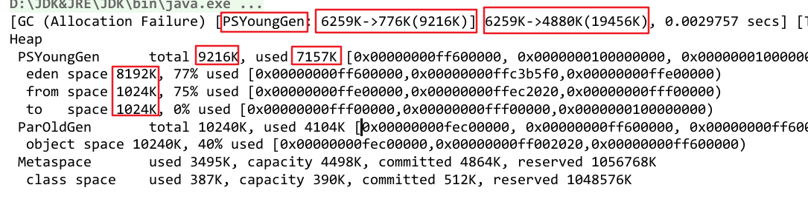

# 内存分配和回收策略


## 一、 对象优先在Eden分配

大多数情况下，对象在新生代的Eden区域分配。当Eden区没有足够空间时，虚拟机将发起一次**Minor GC**。

<br>


```java
package jvm.memory_allocation;

/**
 * @program: Multi_002
 * @description: 对象优先在Eden区分配
 * @author: wenyan
 * @create: 2019-10-19 14:55
 **/

/*
VM参数：-verbose:gc -Xms20M -Xmx20M -Xmn10M -XX:+PrintGCDetails -XX:SurvivorRatio=8
 */
public class TestAllocation {
    private static final int _1MB = 1024 * 1024;

    public static void testAllocation(){
        byte[] allocation1, allocation2, allocation3, allocation4;
        allocation1 = new byte[2 * _1MB];
        allocation2 = new byte[2 * _1MB];
        allocation3 = new byte[2 * _1MB];
        allocation4 = new byte[4 * _1MB];   //4mb
    }

    public static void main(String[] args) {
        testAllocation();
    }
}
```

**结果**：



<br>

在上面代码中我们设置这些参数。

**VM参数：-verbose:gc -Xms20M -Xmx20M -Xmn10M -XX:+PrintGCDetails -XX:SurvivorRatio=8**

- -XX：+PrintGCDetails  收集日志参数，告诉虚拟机在发生垃圾收集行为时打印内存回收日志，并在退出时输出当前的内存各区域分配情况。
- -Xms20M：设置初始堆大小为20M
- -Xmx20M：设置堆最大内存为20M
- -Xmn10M：10MB分配给新生代，剩下10M分配给老年代
- -XX：SurvivorRatio=8 新生代中Eden区域一个Survivor区的比例是8:1

<br>

- Minor GC（新生代GC）：指发生在新生代的垃圾收集动作，因为Java对象大多都具备朝生夕灭的特性，所以 Minor GC 非常频繁，一般回收速度比较快；
- Major GC（老年代GC）：发生在老年代的GC，出现了Major GC，经常会伴随至少一次的Minor GC。一般比Minor GC 慢10倍以上。

<br>


## 二、 大对象直接进入老年代

​    所谓大对象是指，需要大量连续内存空间的Java对象，最典型的大对象就是那种很长的字符串以及数组。大对象对虚拟机的内存分配来说就是一个坏消息，经常出现大对象容易导致内存还有不少空间时就提前触发垃圾收集以获得足够的连续空间来“安置”它们。

<br>

-**XX:PretenureSizeThreshold**：设置对象直接在老年代分配。

这样做的目的是避免在Eden以及两个Survivor区之间发生大量的内存复制（新生代采用复制算法）

<br>

-verbose:gc -Xms20M -Xmx20M -Xmn10M -XX:+PrintGCDetails -XX:SurvivorRatio=8

 **-XX:PretenureSizeThreshold=3145728** 设置老年代对象直接在老年代分配，大小为3M

```java
package jvm.memory_allocation;

/**
 * @program: Multi_002
 * @description: 大对象直接进入老年代
 * @author: wenyan
 * @create: 2019-10-19 15:36
 **/


public class TestPretenureSizeThreshold {
    private static final int _1MB = 1024 * 1024;

    public static void testPretenureSizeThreshold(){
        byte[] allocation;
        allocation = new byte[4 * _1MB];
    }

    public static void main(String[] args) {
        testPretenureSizeThreshold();
    }

}
```

<br>


## 三、 长期存活的对象将进入老年代

虚拟机为了识别哪些对象应该放在新生代，哪些在老年代，给每个对象定义了一个对象年龄（Age）计数器。

- 如果对象 Eden 出生并经过第一次 Minor GC，并且能被Survivor容纳，就移动到 Survivor中，并且Age=1。
- 对象在 Survivor 中每经过一次 Minor GC，Age+1
- 当Age 到 一定值（默认是15），就被移动到老年代中。
- 通过 -XX：MaxTenuringThreshold 设置 Age 的阈值。

<br>


## 四、 动态对象年龄判断

为了更好的适应不同的程序的内存状况，虚拟机并不是永远都要求对象的年龄必须达到 MaxTenuringThreshold才会移动到老年代。

如果 Survivor 中**相同年龄的所有对象，大小总和大于Survivor空间的一半**，**年龄大于或等于该年龄的对象直接进入老年代**，无需等待 MaxTenuringThreshold 要求的年龄。

<br>


## 五、 空间分配担保

​    在发生Minor GC之前，虚拟机会先检查**老年代最大可用的连续空间 **是否 大于 **新生代所有对象总空间，**

- 如果这个条件成立，那么Minor GC可以确保是安全的。

- 如果不成立，则虚拟机会查看 **HandlePromotionFailure** 设置值是否允许担保失败。

  - 如果允许，那么会继续检查老年代最大可用的连续空间是否大于**历次晋升到老年代对象的平均大小**，如果

    大于，将尝试着进行一次Minor GC，尽管这次Minor GC是有风险的；

  - 如果小于，或者 HandlePromotionFailure 设置不允许冒险，那这时也要改为进行一次 **Full GC。**

<br>

​    冒险是指新生代使用复制收集算法，但为了内存的利用率，只使用其中一个Survivor空间作为轮换备份，

因此当出现大量对象在Minor GC 后仍然存活的情况，就需要老年代进行分配担保，把 Survivor无法容纳的对象直接进入老年代。如果老年代剩余空间不足就需要进行Full GC。

<br>

​    取平均值进行比较其实仍然是一种动态概率的手段，也就是说，如果某次Minor GC存活后的对象突增，远远高于平均值的话，依然会导致担保失败（Handle Promotion Failure）。 如果出现了HandlePromotionFailure失败，那就只好在失败后重新发起一次Full GG。虽然担保失败时绕的圈子是最大的，但大部分情况下还是会将HandlePromotionFailure开关打开，避免Full GC过于频繁

 <br>


<br>


## 参考

《深入理解Java虚拟机》第二版