# 类文件结构

## 一、 概述

各种类型的编程语言，通过各自对应的编译器能编译成相同的字节码，在java虚拟机中，运行的结构是一样的。这体现了**java虚拟机的语言无关性。**

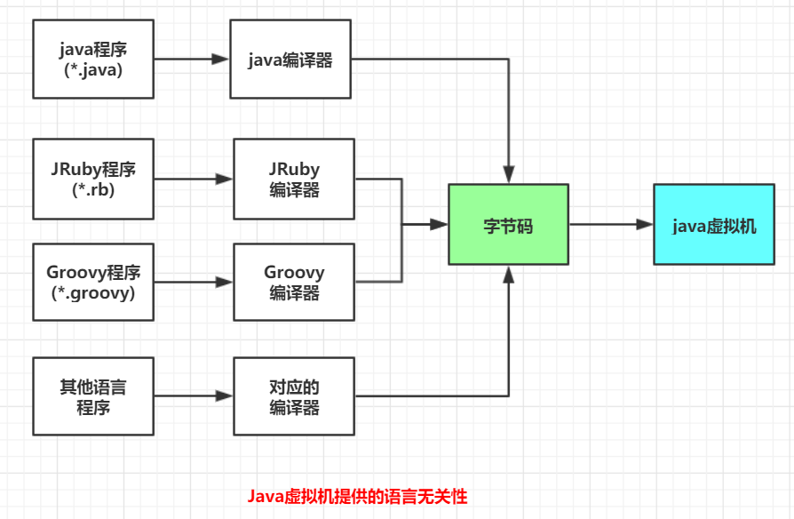

<br>


## 二、 class类文件结构

### 2.1 Class类文件结构概述


1. Class文件是一组以**8位**字节为基础单位的二进制流，各个数据项目严格按照顺序紧凑的排列在Class文件中，**中间没有添加任何分隔符**，整个class文件中存储的内容几乎全部是程序运行的必要数据，没有空隙存在。
2. 当遇到8**位字节以上**的空间的数据项时，则会按照**高位在前**的方式**分割成若干个8位字节**进行存储。
3. class文件中有两种**数据类型**，分别是**无符号数和表。**

<br>

class的类文件结构包括：

- **魔数**
- **class文件版本**
- **常量池**
- **访问标志**
- **类索引，父类索引，接口索引集合**
- **字段表集合**
- **方法表集合**
- **属性表集合**

<br>

1. **无符号数属于基本的数据类型**，用 **u1、u2、u4、u8** 来表示 1个字节、2个字节、4个字节、8个字节的无符号数。无符号数可以用来描述**数字**、**索引引用**、**数量值**或者**按照 UFT-8 编码构成字符串值。**

2. 表是又多个无符号数 或者其他表作为数据项构成的符合数据类型。所有表以**"_info"**结尾。

   整个Class文件本质是一张表。数据项构成如下：

| **类型**       | **名称**                              | **数量**                    |
| -------------- | ------------------------------------- | --------------------------- |
| u4             | magic  **（魔数）**                   | 1                           |
| u2             | minor_version  **（次版本号）**       | 1                           |
| u2             | major_version  **（主版本号）**       | 1                           |
| u2             | constant_pool_count **(常量池数量)**  | 1                           |
| cp_info        | constant_pool **（常量池表）**        | constant_pool_count **- 1** |
| u2             | access_flags  **（访问标志）**        | 1                           |
| u2             | this_class  **（类索引）**            | 1                           |
| u2             | super_class  **（父类索引）**         | 1                           |
| u2             | interfaces_count **(接口索引的数量)** | 1                           |
| u2             | interfaces  **（接口索引集合）**      | interfaces_count            |
| u2             | fields_count **（字段数量）**         | 1                           |
| field_info     | fields  **（字段表集合）**            | fields_count                |
| u2             | methods_count                         | 1                           |
| method_info    | methods **（方法表集合）**            | methods_count               |
| u2             | attribute_count                       | 1                           |
| attribute_info | attributes  **（领域表集合）**        | attributes_count            |

<br>


**查看字节码的工具：**

我们可以通过**Binary Viewer**这款工具查看字节码文件的详情， 也可以选择**支持16进制**的编译器打开，如**EditPlus**。

<br>

### 2.2 示例代码

我们写一个**HelloWorld**程序，并变成成字节码，方便学习。

**代码：**

```java
public class HelloWorld
{
	public static void main(String []args){
		System.out.println("Hello World");
	}
}
```

<br>

**它的字节码内容如下：**

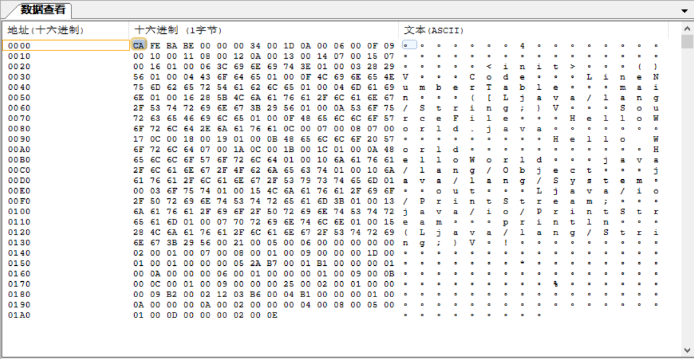

<br>


### 2.3 魔数

每个class文件的**头4个字节**称为魔数（Magic Number），它的唯一作用是**确定这个文件是否为一个能被虚拟机接收的class文件。**

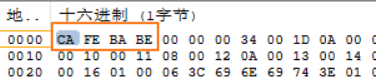

<br>

例如，将上述的**HelloWorld**程序，将 **HelloWorld.java**  后缀的 **java** 改为 **class**，再用**javac**执行，发现报错，如下：

```java
Error: A JNI error has occurred, please check your installation and try again
Exception in thread "main" java.lang.ClassFormatError: Incompatible magic value 1886741100 in class file HelloWorld
        at java.lang.ClassLoader.defineClass1(Native Method)
        at java.lang.ClassLoader.defineClass(ClassLoader.java:763)
        at java.security.SecureClassLoader.defineClass(SecureClassLoader.java:142)
        at java.net.URLClassLoader.defineClass(URLClassLoader.java:467)
        at java.net.URLClassLoader.access$100(URLClassLoader.java:73)
        at java.net.URLClassLoader$1.run(URLClassLoader.java:368)
        at java.net.URLClassLoader$1.run(URLClassLoader.java:362)
        at java.security.AccessController.doPrivileged(Native Method)
        at java.net.URLClassLoader.findClass(URLClassLoader.java:361)
        at java.lang.ClassLoader.loadClass(ClassLoader.java:424)
        at sun.misc.Launcher$AppClassLoader.loadClass(Launcher.java:331)
        at java.lang.ClassLoader.loadClass(ClassLoader.java:357)
        at sun.launcher.LauncherHelper.checkAndLoadMain(LauncherHelper.java:495)
```

<br>

注意其中，Incompatible **magic** value **1886741100** in class file HelloWorld。

我们用Binary Viewer 打开该文件（修改后缀的文件）。发现头4个字节为 **7075 6C62**。这是 **16进制的**，转为10进制，发现刚好就是 **1886741100** 。

而 **class**类型的文件在设计之初，头4个字节（即魔数）的就是 0x **CAFE BABE**（咖啡宝贝...）。换算成10进制，是‭**3405691582‬**。

所以，我们可以得出，改了后缀，并不能改变文件类型这个实质。而**魔数标识了一个文件的类型**，对应的数值不一样，就能检测出是不是class文件。上面两个数不相等，当然也就报关于魔数的错误。

<br>


### 2.4 class文件版本

紧接着魔术的 **4个字节**存储的是Class文件的版本号：第 **5** 和第 **6** 个字节是**次版本号**（Minor Version），第 **7** 和第 **8** 个字节是**主版本号**（Major Version）

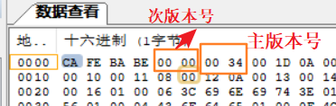

<br>

例如上图，次版本号为 **0x0000**，主版本号为 **0x0034**，16进制34，转换为10进制就是 **52**。

<br>

**JDK 与版本号**：

Java的版本号从**45**开始，高版本的JDK能向下兼容以前版本的 Class文件，但不能运行以后的版本的Class文件。

当前我运行的JDK版本是 **JDK 1.8**。支持的版本号为16进制34，即10进制 52.0

<br>


### 2.5 常量池

**常量池容量计数**：

紧接着主次版本号之后的是 **常量池入口**，常量池可以理解为**Class文件之中的资源仓库**。

- 是Class文件结构中与其他项目关联最多的数据类型
- 也是占用Class文件空间最大的数据项目之一
- 还是Class文件中第一个出现的表数据类型项目。

<br>

常量池数量不固定，所以在常量池的入口放置一项 **u2**类型的数据，代表**常量池容量计数值(constant_pool_count)**。该计数**从1开始而非从0开始。**

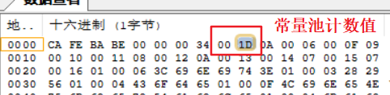

<br>

如上图，计数值为 **0x001D**，转换为10 进制是 **29**. 代表常量池中有**28个**常量（**1-28**）。

<br>

**常量池**：（cp_info)

**CP_info的结构：**

| type | descriptor             | remark |
| ---- | ---------------------- | ------ |
| u1   | tag   （标志项目类型） |        |
| u1   | info[]  （项目内容）   |        |


主要存放两大类常量：**字面量**（Literal）和**符号引用**（Symbolic References）。

1. 字面量类型Java语言中的常量概念，如：文本字符串，声明为final的常量值等。

2. 符号引用则属于编译原理方面的概念，包括：

- 类和接口的全限定名
- 字段的名称和描述符
- 方法的名称和描述符

<br>

**14中常量池项目类型：**

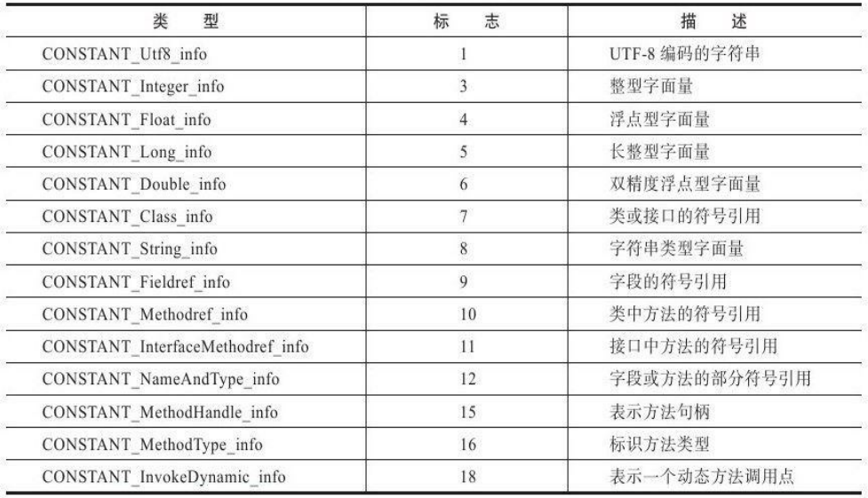

———————————————————— **图A**———————————————————————————

<br>

**每种类型都有各自的结构**：

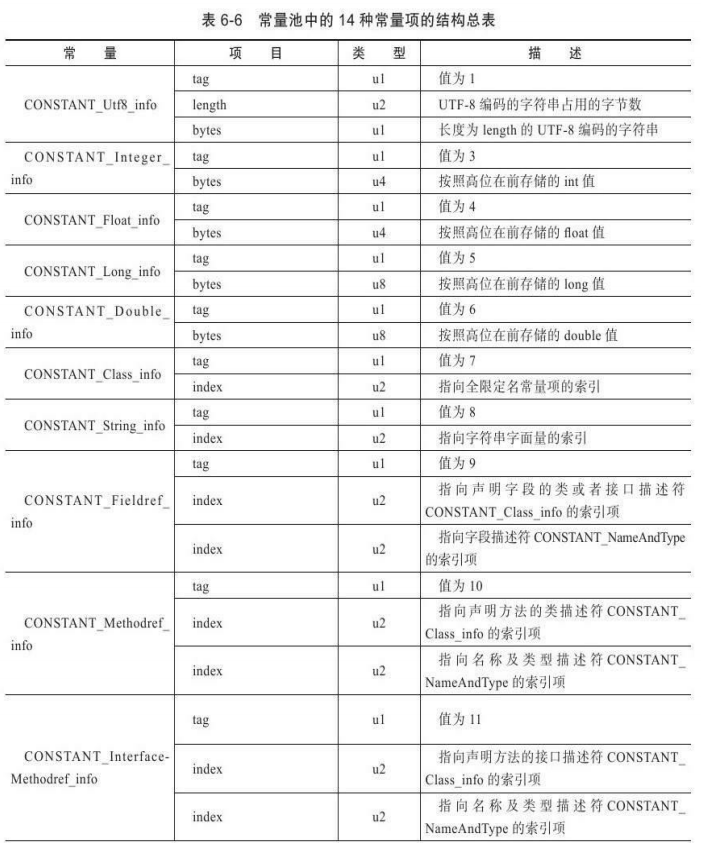

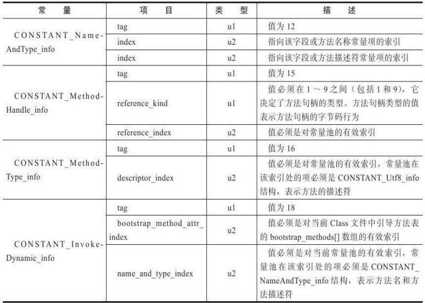

———————————————————— **图B**——————————————————————————

<br>

**分析**：

1. 首先，常量池计数值后面就是常量池的内容了。上面讲了，一共是**1-28**个常量。先读第一个 为 **0x0A**。即10进制的**10**。对应**图A**的**CONSTANT_Methodref_info，是类中方法的符号引用**。再在 **图B**中找到这个项目，知道结构为：

   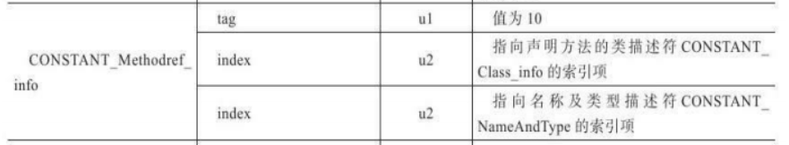

2. **tag**：标志位，区分常量类型，值为10，表示

   **第二项的index**：大小为u2，读两个字符，为**0x0006**，即10进制的6.表示引用**图A**第6个项目

   **第三项的index：**大小为u2，读两个字符，为0x000F，即10进制的16。表示引用**图A**第16个项目。

   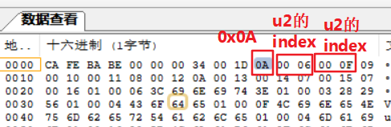

3. 这样，我们就读完了第一个项目，然后后面开始就是第二个项目了。后面的 **0x09**，10进制的9，指向**图A**的第9个，即**CONSTANT_Fieldref_info，字段的符号引用**，然后在查**图B** CONSTANT_Fieldref_info的结构，再按 **1,2点的方法读**，知道第二项结束。
4. 一直重复，直到一开始的**1-28个项目类型全部读完**。就是常量池的全部内容。

<br>

**使用`javap`命令查看**：

我们在**cmd**中用**javap**命令查看 Class文件常量池的内容。

```java
javap -verbose HelloWorld.class
```

`#` :表示项目，图中箭头给出了引用。与上面的分析方法得出的结果是一样的。

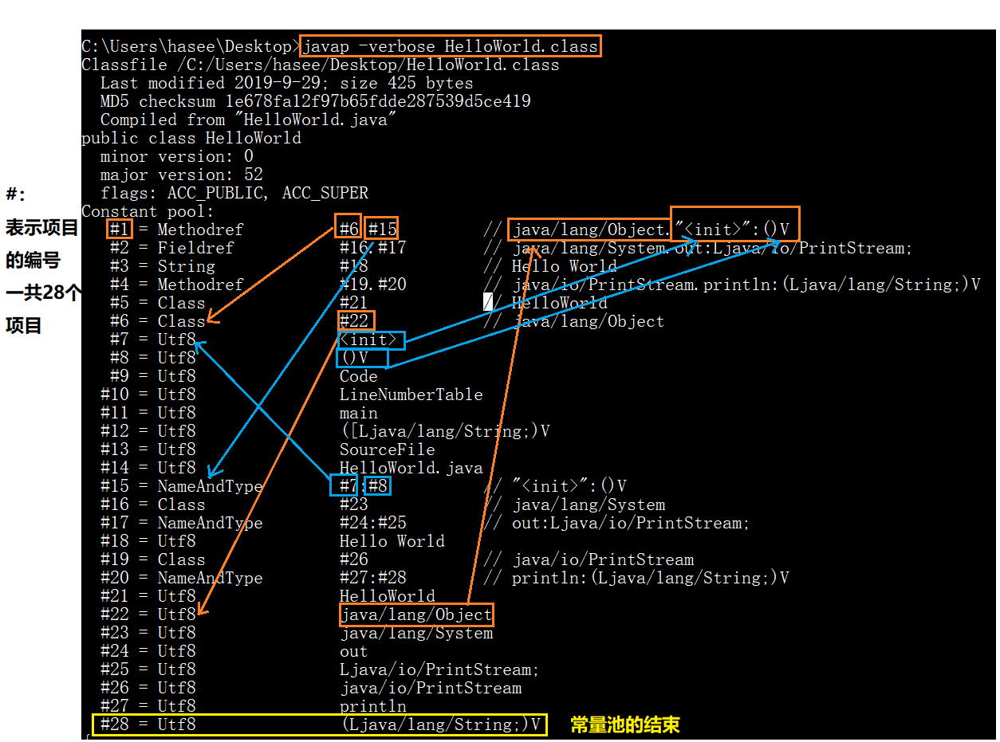

<br>


### 2.6 访问标志

在常量池结束之后，紧接着就是**两个字节代表访问标志（access_flags)**。用于识别一些类或者接口层次的访问信息，比如：

- 这个Class是**类还是接口**
- 是否定位为**public**类型
- 是否定位为**abstract**类型
- 是类的话，是否被声明为**final**等

<br>

那常量池结束之后是哪，上面的图中，我们可以看到 在 `#28`就是常量池的结束。**即那个V** 是结束。

在**binary viewer**中就是下图标出的位置。 

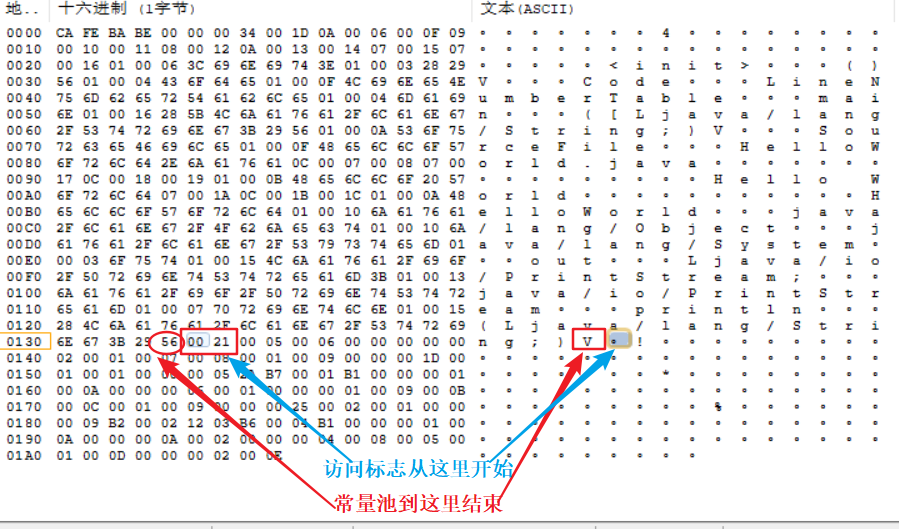

———————————————————— **图C**—————————————————————————


<br>

**访问标志含义图：**

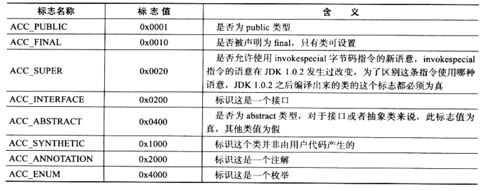

———————————————————— **图D**—————————————————————————

<br>

回到我们之前用javap查看常量池的图。可以查看访问标志有哪些。

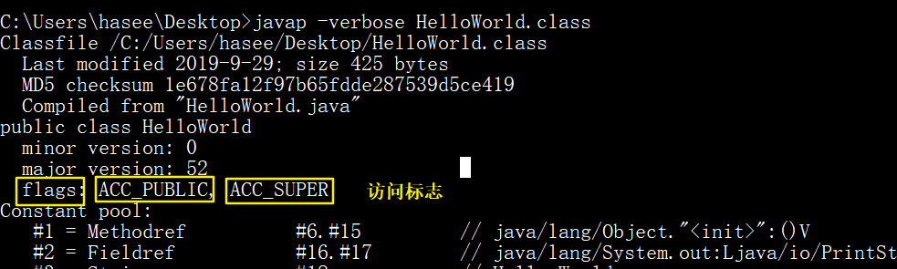

<br>

可以看到有两个：**ACC_PUBLIC ACC_SUPER**。对应访问标志含义图**（图D）**中的 **标志值**，分别是 **0x0001、0x0020**，相加得：**0x0021**。刚好等于**图C** 中的两个字符 **0021**。

而源代码确实也有 **public类型** 的访问标志。

```java
public class HelloWorld{}
```

HelloWorld 类只是普通类，由访问也可得知没被 abstract 或final修饰。

因为用了JDK1.2 之后的编译器，ACC_SUPER必须为真。ACC_PUBLIC当然也为真，其他都为假。

<br>

<br>


### 2.7 类索引、父类索引、接口索引集合

**在访问标志之后就是索引。**

类索引（this_class） 和 父类索引（super_class）都是一个 u2类型的数据，接口索引集合（interfaces）是一组u2类型的数据的集合。

Class文件由这三项数据来确定这个类的继承关系。

- 类索引用于确定这个类的全限定名
- 父类索引用于确定这个类的父类的全限定名，**java没有多继承**，父类索引之后一个，由因为所有类都是**java.lang.Object**的子类。所以除Object类外，**其他类索引都不为0，父类索引最多为2**。
- 接口索引集合用来描述这个实现了哪些接口。被实现的接口按**implements语句后的接口顺序**从左到右排列在接口索引集合中。

<br>

我们重新写几个类和接口，来分析一下这些索引，他们的关系图如下：


<br>

代码：

1. **Hello类：Hello.java**

```java
public class Hello extends World implements A,B{}
```

2. **World类：World.java**

```java
public class World{}
```

3. **A接口：A.java**

```java
public interface A{}
```

4. **B接口：B.java**

```java
public interface B{}
```

<br>

用javap查看class文件常量池，其中的类索引，如下：

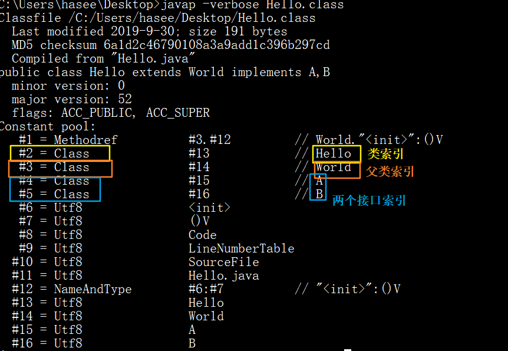

<br>

再对照 字节码文件中的索引，如下：

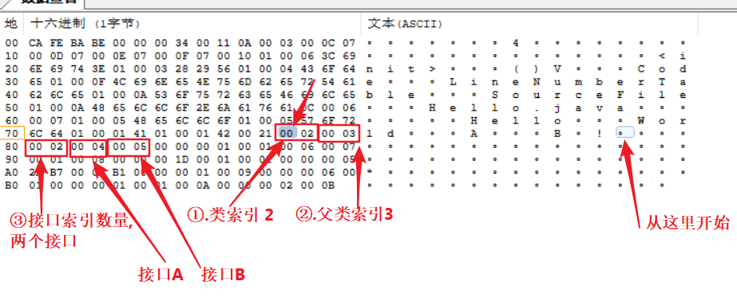

<br>

前后两张图对比，可以发现是一样的。


<br>


### 2.8 字段表集合


**字段表（field_info)** 用于描述接口或者类中声明的**变量**。 字段（field）包括**类级变量 和 实例级变量**，但不包括在方法内部声明的局部变量。

**字段包含的信息：**

- 字段的作用域（public、private、protected修饰符）
- 是实例变量还是类变量（static 修饰符）
- 可变性（final）
- 并发可见性（volatile修饰符，是否强制从主内存读写）
- 可否被序列化（transient修饰符）
- 字段数据类型（基本类型、对象、数组）
- 字段名称

上述修饰符都是**布尔值**，要么有修饰符，有么没有，适合使用标志位来表示。

字段叫什么、字段的数据类型，这些无法固定，只能引用常量池中的常量来描述。

<br>

**字段表结构**：

| 类型           | 名称             | 数量             |
| -------------- | ---------------- | ---------------- |
| u2             | access_flags     | 1                |
| u2             | name_index       | 1                |
| u2             | description      | 1                |
| u2             | attributes_count | 1                |
| attribute_info | attributes       | attributes_count |

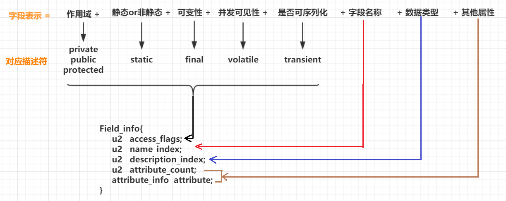

<br>

**字段访问标志**：

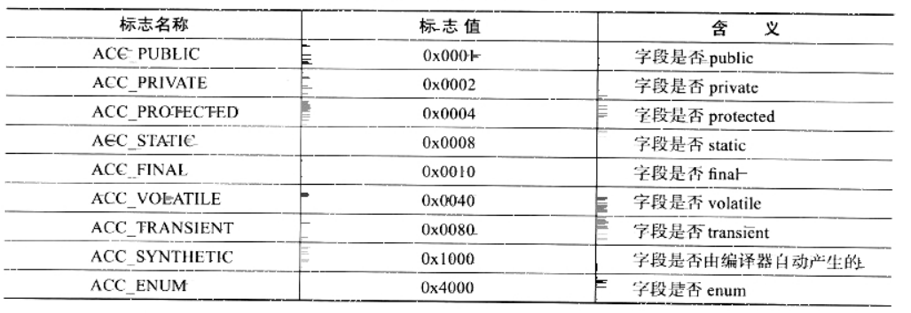

<br>

我们编写一段代码来分析：

**FieldDemo.java**

```java
public class FieldDemo{
	private int a;
	public byte b;
	public static Object obj;
	protected Object[] objs;
}
```

<br>

紧接着索引后面的是字段表。下图给出了分析，

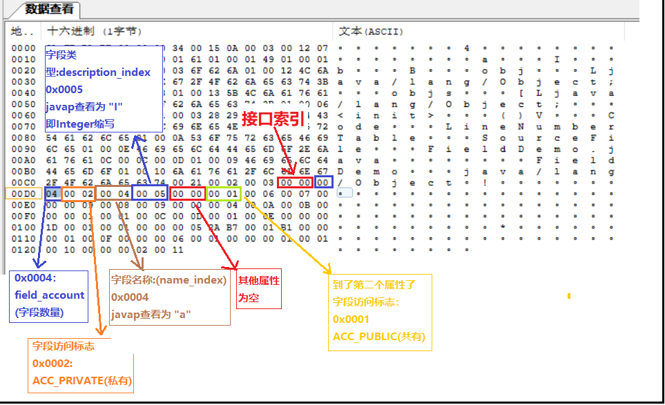

<br>

下图是javap查看字段表结构


<br>


### 2.9 方法表集合


### 2.10 属性表集合


<br>


<br>


## 参考

《深入理解Java虚拟机》

