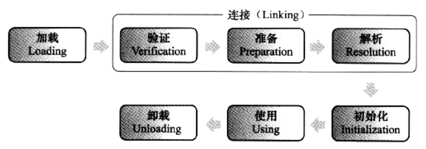
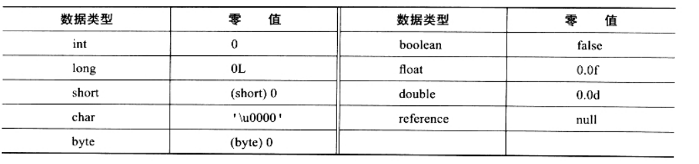

# 虚拟机类**加载机制**

## 一、 概述


**虚拟机的类加载机制：**虚拟机把描述类的数据从Class文件加载到内存，并对数据进行**校验、转换解析和初始化**，最终形成可以被虚拟机直接使用的**Java类型。**

<br>

与那些在编译时需要进行连接工作的语言不通，在Java语言里面，**类型的加载**、**连接** 和 **初始化**过程都是在程序运行期间完成的，这种策略虽然会令类加载时稍微增加一些性能开销，但是会被Java应用程序提供高度的灵活性。Java里天生可以动态扩展的语言特性就是依赖运行期动态加载和动态连接这个特点实现的。

<br>

## 二、 类加载的时机

### 2.1 类加载生命周期


类从加载到虚拟机内存中开始，到卸载出内存为止，整个生命周期包括：

- 加载（Loading）
- 验证（Verification）
- 准备（Perparation）
- 解析（Resolution）
- 初始化（Initialization）
- 使用（Using）
- 卸载（Unloading）

**验证、准备、解析 统称为连接**



<br>

### 2.2 5种情况对类立即进行初始化

1. 遇到 **new（实例化）、getstatic（读取）、putstatic（设置） 或 invokestatic（调用）** 这4条指令时，如果类没有进行过初始化，则需要先触发其初始化。生产这4条指令的最常见的 Java 代码场景是：使用new关键字**实例化对象的时候**、**读取**或**设置**一个类的**静态字段**（被final修饰、已在编译期把结果放入常量池的静态字段外）的时候，以及**调用**一个类的静态方法的时候。

2. 使用 **java.lang.reflect** 包的方法对类进行反射调用的时候，如果类没有进行过初始化，则需要先触发其初始化。
3. 当初始化一个类的时候，如果发现其父类还没有进行过初始化，则需要先触发其父类的初始化。
4. 当虚拟机启动时，用户需要指定一个要执行的主类（**包含main()方法的那个类**），虚拟机会先初始化这个主类。
5. 当使用JDK1.7 的动态语言支持时，如果一个 java.lang.invoke.MethodHandle 实例最后的解析结果 **REF_getStatic、REF_putStatic、REF_invokeStatic**的方法句柄，并且这个方法句柄所对应的类没有进行过初始化，则需要先触发其初始化。

<br>

以上**有且仅有这五种场景会触发类进行初始化**，这种行为被称为 **对一个类的主动引用。** 除此之外，所有引用类的方式都不会触发初始化，称为**被动引用。**

**以下3个被动引用的例子：**

1. 通过**子类引用父类**的**静态字段**，不会导致子类的初始化。
2. 通过**数组定义**来引用类，不会触发此类的初始化。
3. 常量在编译阶段会存入调用类的**常量池**中，本质上**并没有直接引用到定义常量的类**，因此不会触定义常量的类的初始化。

<br>

**举例说明**：

**情况1：**

父类A：SuperA.java

```java
public class SuperA {

    static{
        System.out.println("父类A....");
    }
    public static int value = 123;
}
```

子类B继承了父类A：SubB.java

```java
public class SubB extends SuperA{
    static {
        System.out.println("SubB init...");
    }
}
```

Main.java

```java
public class Main {

    public static void main(String[] args) {
        System.out.println(SubB.value);
    }
}
```

输出结果：

```java
父类A....
123
```

从上面可以看到，**子类B**继承**父类A**。当**子类B** 引用 **父类A**的静态字段 **value**时，并不会初始化 **子类A。**只会触发父类的初始化。

<br>

**情况2：**

父类A 和 子类B不变，只改动Main.java。

```java
public class Main {

    public static void main(String[] args) {
       SuperA[] sa = new SuperA[10];
       SubB[] sb = new SubB[10];
    }
}

```

输出结果：

```java
（啥都没有）
```

从输出结果什么都没有来看，说明，通过数组定义来引用类，并不会触发该类初始化。

<br>

**情况三**：

ConstC.java

```java
public class ConstC {
    static {
        System.out.println("ConstC init....");
    }
    public static final String HELLOWORLD = "hello world";
}
```

```java
public class Main {

    public static void main(String[] args) {
        System.out.println(ConstC.HELLOWORLD);
    }
}
```

输出结果：

```java
hello world
```

上面的 HELLOWORLD 是用final修饰的 常量，它是在**常量池**内，本质上没有直接引用到定义常量的类。所以不会触发定义这个常量的类。

<br>


## 三、 类加载过程

- 加载
- 验证
- 准备
- 解析
- 初始化


### 3.1 加载

加载 是“类加载” 的一个过程。在加载阶段，虚拟机完成以下三个部分：

1. 通过一个类的**全限定名**来获取此类的**二进制字节流**
2. 将这个字节流所代表的**静态存储结果转化为方法区的运行时数据结构**
3. 在内存中生成一个代表这个类的 **java.lang.Class** 对象，作为方法区这个类的各种数据的访问入口。

<br>

那么，二进制字节流从哪获取呢？

通过可以通过以下内存获取：

- 文件
  - Class 文件
  - 从ZIP包读取，Jar 、EAR、WAR等格式的文件包
- 网络
  - Applet
- 计算生成一个二进制流
  - $Proxy（动态代理技术，在 java.lang.reflect.Proxy中，用了 ProxyGenerator.generateProxyClass 来为特定接口生成形式为 “*$Proxy" 的代理类的二进制字节流）
- 其他文件生成
  - Jsp（由Jsp生成对应的Class文件）
- 数据库

<br>

第2,3点怎么理解呢？

举个例子，在Spring中，用了很多配置文件，规定很多静态的存储结构。我们读这些配置文件，比如Bean，

会生成对应的Bean类，对应的字段等。访问这些字段的入口，就是这个类。

<br>


### 3.2 验证

验证是连接阶段的第一步，这阶段的目的是：

**确保Class文件的字节流中包好的信息符合当前虚拟机的要求，并且不会危害虚拟机自身的安全。**

<br>

**验证阶段的四个检验动作：**

- 文件格式验证
- 元数据验证
- 字节码验证
- 符号引用验证

<br>

**文件格式验证**

验证字节流是否符合 Class文件格式的规范，并且能被当前版本的虚拟机处理。

**验证点：**

- 是否以魔数 0xCAFEBABE 开头
- 主次版本号是否在当前虚拟机处理范围之内
- 常量池的常量中是否有不被支持的常量类型（检查常量tag标志）
- 等等......

<br>


**元数据验证**

对字节码描述的信息进行语义分析，确保信息符合Java语言规范的要求

**验证点：**

- 这个类是否有父类（除了 java.lang.Object 外，所有类都有父类）
- 这个类是否继承了不允许被继承的类（被final修饰的类）
- 这个类如果不是抽象类，是否实现了其父类或接口之中要求实现的所有方法。
- 等等......

<br>


**字节码验证**

最复杂的阶段，目的是 通过数据流和控制流分析，确定程序语义是合法的、符合逻辑的。

**验证点**：

- 保证在任意时刻操**作数栈的数据类型与指令代码序列**都能配合工作，例如不会出现这样的情况：在操作栈放置一个**int**类型的数据，使用却按**long**类型挤在到本地变量表中。
- 保证跳转指令不会跳转到方法体外的字节码指令上
- 保证方法体中的类型转换是安全的
- 等等......

<br>


**符号引用验证**

这阶段发生在， **虚拟机将符号引用转换为直接引用**的时候，这个转换动作在解析阶段发生。

**符号引用验证**：是对类自身以外（常量池中的 各种符号引用）的信息进行匹配性校验。

**校验点**：

- 符号引用中通过字符串描述的全限定名是否能找到对应的类
- 在指定类中是否存在符合方法的字段描述符以及简单名称所描述的方法和字段
- 符号引用中的类、字段、方法的访问性（private、public、protected、default）是否可被当前类访问。

<br>


### 3.3 准备

准备阶段是**正式为类变量分配内存并设置类变量初始值**的阶段，这些变量所使用的内存都将在**方法区**中进行分配。

首先，进行内存分配仅包括**类变量**（**被static修饰的变量**），不包括实例变量。实例变量会在**对象实例化时**随着对象一起分配在Java堆中。

其次，初始值在”通常情况“下是**数据类型的零值。**

<br>

例如：

```java
public static int value = 123;	
```

value在准备阶段的初始值是 0 而不是 123。

因为这时候未开始执行任何 Java 方法，而把value赋值为 123 的 **putstatic**指令是在程序被编译后，存放于**类构造器`<clinit>()`方法中**，所以把 value 赋值为 123 的动作将在**初始化阶段**才会执行。

<br>

**基本数据类型的零值如下**：



<br>

**特殊情况**：

如果类字段属性表中存在 ConstantValue属性，那么在准备阶段变量value会被初始化为 ConstantValue属性所指定的值，比如：

public static **final** int value = 123; 

在准备阶段虚拟机会根据ConstantValue的设置value赋值为123.

<br>


### 3.4 解析

解析阶段是虚拟机将 **常量池** 内的 **符号引用** 替换成 **直接引用** 的过程。

**1. 类和接口的解析**

**2. 字段解析**

**3. 类方法解析**

**4. 接口方法解析**

<br>


### 3.5 初始化

　　类的初始化阶段是类加载过程的最后一步，前面的类加载过程中，除了在加载阶段用户应用程序可以通过自定义类加载器参与之外，其余动作完全由虚拟机主导和控制。

到了初始化阶段，才正真开始执行类中定义的Java程序代码(或者说是字节码)。


<br>

### 3.6 总结

- 加载：获取该类的二进制字节流，将字节流代表的静态存储结构转化为方法区的运行时数据结构，并在内存生成代表该类的 java.lang.Object 对象作为方法区该类的访问入口
- 验证：确保 Class 文件的字节流中包含的信息符号当前虚拟机的要求（文件格式验证、元数据验证、字节码验证、符号引用验证）
- 准备：为类变量分配内存并设置类变量初始值
- 解析：将常量池内的符号引用替换为直接引用
- 初始化：执行类构造器 () 方法


<br>

# 参考

《深入理解Java虚拟机》第二版<br>

[JVM类加载过程与双亲委派模型](https://cloud.tencent.com/developer/article/1522163)<br>

