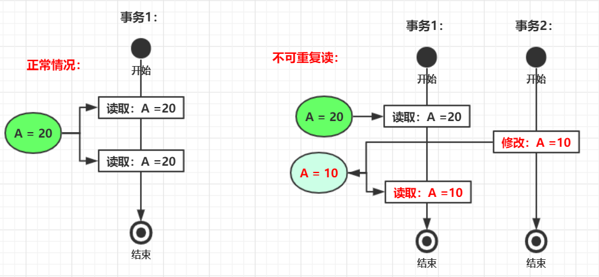

# MySQL事务相关


## 一、 什么是事务

**事务(Transaction)**是一个逻辑序列，该序列要么执行，要么不执行。

> **例如：转换业务**
>
> A 给 B 转账 1000 元，设计两个操作：
>
> 1. **A减少1000元**
> 2. **B增加1000元**

如果在这两个操作中间，发现了意料不到的事件，如断电，系统崩溃等。这样转账并没有完成。

事务就是让上述这组操作要么全部成功，要么全部不成功。即所有步骤完成，**提交事务(commit)**，完成转账；其中一个步骤失败，**回滚事务(rollback)**，撤销到事务开始时的所有操作。

<br>


## 二、 事务的四大特性(ACID)

事务具有四大特性，即：

- **原子性**(atomicity)
- **一致性**(consitstency)
- **隔离性**(isolation)
- **持久性**(durability)

<br>


### 1. 原子性

**原子性：终止出错的事务，并撤销该事务进行的所有变更。**

当一个事务在执行过程中发生错误，我们往往很难知道哪些更改已生效，哪些没有生效。如果进行重试可能造成数

据重复或数据错误。为了简化问题，**数据库丢弃或撤销迄今为止的所有写入，即安全的重试。**


事务是**最小执行单位，不可分割**。原子性保证操作**要么都完成，要么都不起作用。**

<br>

### 2. 一致性

**一致性：执行事务前后，数据保持一致，多个事务对同一个数据读取的结果是相同的。**

> 例如：A 转账给 B 1000 元。转账后，A账户必须减少1000，B账户必须增加1000.


这**并不是数据库能保证的**，而应该是**应用程序来保证**。

<br>


**原子性，隔离性、持久性都是数据库的属性，而一致性是应用程序的属性。**应用程序可以用**原子性和隔离性来实现**

**一致性**，所以ACID中的C就是用来凑缩写单词的。

<br>


### 3. 隔离性

**隔离性：并发访问数据库时，一个用户的事务不被其他事务干扰，各并发事务之间的数据库是独立的。**

> 例如：两个客户端同时增长一个计数器（当前值为10），每个客户端需要读取当前计数器的值，加 1后再回写新值。
>
> 如果两次增长，计数器应为 10 -->  12 ,当由于两个客户端同时取得10，加1 后回写，计数器最终值为11.数据错误。


隔离性与**并发编程原子性**的联系：从上面的例子可以看到，当采用并发编程中的原子性的自增操作，就不会发生错误。**多线程中的原子性，对应的就是事务的隔离性**。

<br>


### 4. 持久性

**持久性：一个事务被提交之后。它对数据库中数据的改变是持久的，及时数据库发生故障也不应该对其有任何影响。**

当发生硬盘故障或崩溃时，数据库的**预写日志**或分布式系统的**复制**都可以为持久性做出承诺。当并不能提供绝对的保证。

<br>


## 三、 并发事务带来的问题

在应用程序中，多个事务并发运行，经常会操作相同的数据完成各自的任务，而可能造成一些问题，如：

- **脏读(Dirty read)、脏写(Dirty wirte)**
- **丢失修改(Lost to modify)**
- **不可重复读(Unrepeatableread)**
- **幻读(Phantom read)**

<br>

### 1. 脏读、脏写

**脏读：**指一个事务已经将数据**写入数据库，但未提交**，另一个事务访问了这些数据，为**脏读**。这些数据是**脏数据。**

**脏写：**指两个事务更新数据库相同的数据，**先前事务已经写入，未提交**；**后面事务覆盖尚未提交的数据**，为**脏写。**(正常逻辑为：先前事务写入，提交；后面事务写入，覆盖)。<br>

使用  **`读已提交`**（读取已经提交的数据）这种隔离级别解决，只提供两个保证，**不脏读，不脏写。**


<br>

### 2. 丢失修改

丢失修改：一个事务访问某个数据，另一个数据也访问该数据。第一个事务修改数据后，第二个事务也修改该数据。**这样第一个事务修改的结果被丢失**。

> 例如：
>
> 事务1读取某表数据 A = 20 ，事务2也读取该数据为 A = 20
>
> 事务1：A = A - 1； 事务2： A = A - 1；
>
> 结果：A = 19。事务1结果被丢弃。（正常结果应为 A = 18）

<br>

**各种解决方案：**

#### ①原子写：

```mysql
UPDATE counter SET value = value + 1 WHERE id = 'whatever';
```

#### ②for update 显示锁定

```mysql
BEGIN TRANSACTION;
# for update就是为这行数据加了锁，提交或回滚后释放
SELECT * FROM users WHERE id = 'Eddie' FOR UPDATE;
# 拿到数据后，应用程序做校验，然后...
UPDATE users SET money = '99999999' WHERE id = 'Eddie';
COMMIT;
```

#### ③比较并设置（CAS，CompareAndSet）

```mysql
UPDATE wiki_pages SET content = '新内容' WHERE id = '007' AND content = '旧内容';
# 根据数据库的实现，这可能也不安全
# 如果数据库允许WHERE子句从旧快照中读取，则此语句也无法保证防止丢失更新
```

<br>


### 3. 不可重复读

指**一个事务内多次读取同一数据**，该事务还没结束时，另一个事务也访问该数据，并在第一个事务的**两次读取中间修改了该数据**，导致第一个事务**两次读到的数据不一致**的情况。



<br>


### 4. 幻读

与不可重复读类似，

指 **事务1读取了几行数据**，接着**另一个事务插入了一些数据**。在随后的查询中，事务1就会发现**多出了一些原本不存在的记录**，如幻觉，称为**幻读。** 

**即一个事务的写入改变了另一个事务查询结果的正确性，称为幻读。**

<br>

**不可重复读与幻读的区别：**

- 前者重点在于修改；
- 后者重点在于新增或删除。

<br>


## 四、 事务的隔离级别

SQL标准定义了4个隔离级别：

- **读未提交(READ-UNCOMMITTED)**
- **读已提交(READ-COMMITTED)**
- **可重复读(REPEATABLE-READ)**
- **可串行化(SERIALIZABLE)**

<br>

### 1. 读未提交

最低的隔离级别，允许读取尚未提交的数据变更，可能导致脏读、脏写、幻读、不可重复读。

<br>

### 2. 读已提交

允许读取并发事务已经提交的数据，可以**阻止脏读、脏写**。但**幻读，读已提交仍有可能发生**。

**总结读已提交：**

1. 从数据库读取时，只能看到已提交的数据（**不脏读**）。
2. 写入数据库时，只会覆盖已经提交的写入数据（**不脏写**）。

<br>

**为了防止脏读，**每次写入前，数据库都会记住旧值。 当前事务尚未提交时，其他事务的读取都会拿到旧值。当前

事务提交后，其他事务才能读取到新值。

**为了防止脏写，**数据库一般用**行锁。**当事务想要修改特定的行时，必须先获得该行的锁。一次只有一个事务可持有

任何给定行的锁。如果另一个事务要写入同一行，就必须等到第一个事务提交或回滚后。

<br>


### 3. 可重复读

对同一字段的多次读取结果都是一致的，除非数据是被本身事务自己所修改，可以**阻止脏读和不可重复读**，但幻读

仍有可能发生。

<br>


### 4. 可串行化

**最高的隔离级别**，完全服从ACID的隔离级别。所有的事务**依次逐个执行**。事务之间完全不可能产生干扰，可阻止 脏读脏写、幻读、不可重复读。


<br>

| 隔离级别 | 脏读 | 不可重复读 | 幻读 |
| -------- | ---- | ---------- | ---- |
| 读未提交 | ×    | ×          | ×    |
| 读已提交 | √    | ×          | ×    |
| 可重复读 | √    | √          | ×    |
| 可串行化 | √    | √          | √    |

<br>


## 五、 默认隔离级别

MySQL **InnoDB 存储引擎**的默认隔离级别为：**可重复读（REPEATABLE-READ）**。

通过  **`SELECT @@tx-isolation;`** 命令查看：

```mysql
mysql> SELECT @@tx_isolation;
+-----------------+
| @@tx_isolation  |
+-----------------+
| REPEATABLE-READ |
+-----------------+
```

<br>

这里需要注意的是：与 SQL 标准不同的地方在于InnoDB 存储引擎在 **REPEATABLE-READ（可重读）**事务隔离级

别下使用的是**Next-Key Lock 锁算法**，因此**可以避免幻读的产生**，这与其他数据库系统(如 SQL Server)是不同的。

所以说InnoDB 存储引擎的默认支持的隔离级别是 **REPEATABLE-READ（可重读）** 已经可以完全保证事务的隔离

性要求，即达到了 SQL标准的**SERIALIZABLE(可串行化)**隔离级别。

<br>

因为隔离级别越低，事务请求的锁越少，所以大部分数据库系统的隔离级别都是**READ-COMMITTED(读已提**

**交):**，但是要知道的是InnoDB 存储引擎默认使用 REPEATABLE-READ（可重读）并不会有任何性能损失。

<br>

InnoDB 存储引擎在 **分布式事务** 的情况下一般会用到**SERIALIZABLE(可串行化)**隔离级别。


<br>

<br>

## 参考

[通俗易懂 事务、ACID、脏读、脏写、幻读、读已提交、快照隔离、读写锁、两阶段锁定 的区别与联系](https://zhuanlan.zhihu.com/p/69380112)<br>

[可能是全网最好的MySQL重要知识点 | 面试必备](https://mp.weixin.qq.com/s/S9jiO_e-_CKRgNnzAU5Z0Q)

