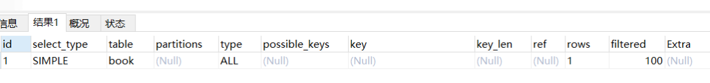
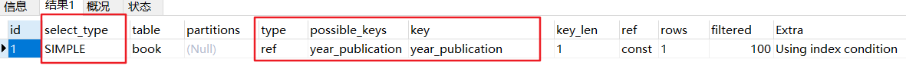

# MySQL索引

## 一、 索引简介

### 1.1 索引含义

索引是对数据库表中**一列或多列的值**进行排序的一种**结构**，使用索引**可提高数据库中特定数据的查询速度**。

<br>

索引的含义：是一个**单独的**、存储在**磁盘** 上的**数据结构**，它们包含着对数据表里所有记录的**引用指针**。

所有MySQL列类型都可以被索引。

<br>

### 1.2 索引和引擎

索引是在存储引擎中实现的，每种存储引擎的索引都 **不一定完全相同**，并且每种存储引擎**也不一定支持所有索引类型**。

根据存储引擎定义**每个表的最大索引数**和**最大索引长度**，所有存储引擎支持**每个表** **至少16个**索引，总索引长度至少为 **256**字节。大多数存储引擎有更高的限制。

MySQL 中索引的存储类型有两种：**BTree** 和 **Hash。**具体和表的存储引擎相关；

**MyISAM 和 InnoDB** 存储引擎**只支持BTree 索引**；

MEMORY/HEAP 存储引擎可以支持 **Hash和 **BTree** 索引。

<br>

**查看user表的索引详情**：

```mysql
show INDEX from user;
```


可以看到使用的索引类型是**BTree**。

<br>


### 1.3 索引的优点

1. 通过创建**唯一索引**，可以保证数据库表中每一行的数据唯一性。
2. 大大加快数据的查询速度，也是创建索引的最主要原因。
3. 在实现数据的参考完整性方面，可以加速表和表之间的链接。
4. 在使用 **分组** 和 **排序** 字句进行数据查询时，也可以显著减少查询中 分组和排序 的时间。

<br>

### 1.4 索引的缺点

1. **创建索引** 和 **维护索引** 耗费时间，并且随着数据量增加所耗费的时间也会增加。
2. 索引需要**占磁盘空间**，如果有大量索引，索引文件可能比数据文件**更快达到最大文件尺寸**。
3. 当对表中的数据进行 **增加、删除和修改** 的时候，索引也要**动态地维护**，降低了数据的维护速度。

<br>


## 二、 索引的分类

### 2.1 普通索引和唯一索引

**普通索引(Normal)**：MySQL 中的 **基本索引类型**，允许在定义索引的列中插入 **重复值** 和 **空值**；

**唯一索引(Unique)**：索引列中的值必须唯一，但**允许有空值**。如果是**组合索引**，则列值的组合必须唯一。

**主键索引**：一种**特殊的唯一索引**，不允许有空值。

<br>

### 2.2 单列索引和组合索引

**单列索引**：一个索引**只包含单个列**，一个表可以有多个单列索引。

**组合索引**：在表的**多个字段组合**上创建的索引，只有在查询条件中使用了这些字段的左边字段时，索引才会被使用。使用组合索引时遵循**最左前缀集合。**

<br>

### 2.3 全文索引

**全文索引(Full Text)**：在定义索引的列上支持值的**全文查找**，**允许**在这些索引列中插入**重复值**和**空值**。

全文索引可以在 **CHAR**、**VARCHAR** 或者 **TEXT** 类型的列上创建。

**MySQL 中只有 MyISAM 存储引擎支持全文索引。**

<br>

### 2.4 空间索引

**空间索引**：是对**空间数据类型**的字段建立的索引。

MySQL中的空间数据类型有四种：**GEOMETRY**、**POINT**、**LINESTRING** 和 **POLYGON**。

MySQL 使用 **SPATIAL** 关键字进行扩展，使得能够用于创建正规索引类似的语法创建空间索引。空间索引的列，必须声明为 **NOT NULL**，**空间索引只能在 MyISAM 的表中创建。**

<br>

### 2.5 索引的设计原则

**适合**：

1. 频繁作为 **where** 条件的字段
2. 关联字段可以建索引，比如外键。
3. 频繁进行**排序**或**分组**，(即 **group by** 或 **order by**)。排序列有多个，可以建立组合索引。

<br>

**不适合**：

1. 并非越多越好
2. where条件用不到的字段
3. 频繁更新的字段(**insert, delete, update**)
4. 数据值发布比较均匀的的字段。例如**男女**、**真假值**。
5. 表的数据可以确地行数的，且**数据量少**的。(遍历索引时间 可能大于 查询时间)

<br>


## 三、 创建索引

可以在创建表的时候创建索引，语法格式如下：

```mysql
CREATE TABLE table_name [col_name data_type]
[UNIQUE | FULLTEXT | SPATIAL] [INDEX | KEY] [index_name](col_name[legnth]) [ASC | DESC]
```

<br>

| 参数                      | 解释                                                         |
| ------------------------- | ------------------------------------------------------------ |
| UNIQUE、FULLTEXT、SPATIAL | 为可选参数，分别表示 **唯一索引**、**全文索引** 和 **空间索引**； |
| INDEX 与 KEY              | 为同义词，作用相同，用来**指定创建索引；**                   |
| col_name                  | 指定创建索引的**列**；                                       |
| index_name                | 指定索引名称，可选参数。不指定，**MySQL默认col_name为索引值**； |
| length                    | 可选参数，表示索引长度，**只有字符串类型**的字段才能指定索引长度； |
| ASC、DESC                 | 指定**升序或者降序**的索引值存储。                           |


<br>

### 3.1 创建普通索引

#### 3.1.1 创建表时创建索引

有 **book** 表，在**year_publication** 字段建立普通索引。**`INDEX(year_publication)`**(后面创建重复的创建语句不再给出)

```mysql
CREATE TABLE book(
    bookid				INT  			  NOT NULL,
    bookname			VARCHAR(255)      NOT NULL,
    authors	    		VARCHAR(255)      NULL,
    info				VARCHAR(255)      NULL,
    comment	    		VARCHAR(255)      NULL,
    year_publication  	YEAR              NOT NULL,
    INDEX(year_publication)
);
```

<br>

通过

```mysql
SHOW CREATE TABLE book;
```

查看创建语句，可以看到  

```mysql
KEY `year_publication` (`year_publication`)
```

其中索引名称 **year_publication** 由MySQL默认给出。

<br>

**查看是否使用了索引**：(EXPLAIN)

查询全表，

```mysql
EXPLAIN SELECT* FROM book;
```

**结果：**



<br>

**有条件的查询**

```mysql
EXPLAIN SELECT* FROM book where year_publication = 1990;
```

我们可以推测，查询全表的肯定是没有索引的，有条件的查询是否用了索引呢。

**结果**：



<br>

通过上面两张图，可以对比得出，year_publication 这个索引在被带条件的查询时，确实被使用到了。

<br>

来看参数表示的意思：

1. **select_type**:指定所使用的查询类型，**SIMPLE**，表示只是**普通的查询**。不是UNION或子查询。

   其他可能值：**PRIMARY、UNION、SUBQUERY**

2. **table**：表名。

3. **type**：指定了本数据表 与 其他数据表之间的关联关系。

   可能取值：**system**、**const**、**eq_ref**、**ref**、**range**、**index** 和 **ALL**。

4. **possible_keys**: MySQL在**搜索数据记录时**可选用的各个索引。

5. **key**：MySQL 实际选用的索引

6. **key_len** :索引按 **字节** 计算的长度， key_len 数值越小，表示越快

7. **ref**：给出了关联关系中另一个数据表里的数据列的名字，

8. **rows**：MySQL在执行这个查询时**预计**会从这个表里读出的**数据行的个数**。

9. **extra**：提供了与关联操作有关的信息。

<br>

#### 3.1.2 已存在表上创建索引

**ALTER**:

在 **`bookname`**字段创建索引

```mysql
ALTER TABLE book ADD INDEX BkNameIdx(bookname(30));
```

<br>

**CREATE**:

```mysql
CREATE INDEX BkNameIdx ON book(bookname);
```

<br>


### 3.2 创建唯一索引

#### 3.2.1 创建表时创建索引


创建一个表**t1**，唯一索引 **`UNIQUE INDEX  UniqIdx(id)`**;

```mysql
CREATE TABLE t1(
id    INT   		 NOT NULL,
name  CHAR(30)   NOT NULL,
UNIQUE INDEX  UniqIdx(id)
);
```

通过

```mysql
SHOW CREATE TABLE t1;
```

查看，可以看到索引信息。

```mysql
UNIQUE KEY `UniqIdx`  (`id`)
```

<br>

#### 3.2.2 已存在表上创建索引

**ALTER**:

**bookId**字段：

```mysql
ALTER TABLE book ADD UNIQUE INDEX UniqidIdx(bookId);
```

<br>

**CREATE**:

```mysql
CREATE UNIQUE INDEX UniqidIdx ON book(bookId);
```


<br>


### 3.3 创建单列索引

#### 3.3.1 创建表时创建索引

单列索引：在表的**某一个字段**创建的索引，一个表可以有**多个单列索引**。前面两个例子都是。

创建表**t2**，**`INDEX SingleIdx(name(20))`**。

```mysql
CREATE TABLE t2(
id    INT   		 NOT NULL,
name  CHAR(30)   NOT NULL,
INDEX SingleIdx(name(20))
);
```

通过

```mysql
SHOW CREATE TABLE t2;
```

查看，可以看到索引信息。

```mysql
KEY `SingleIdx` (`name`(20))
```

<br>

#### 3.3.2 已存在表上创建索引

**ALTER**:

**book**表字段上创建单列索引,**comment** 字段：

```mysql
ALTER TABLE book ADD INDEX BkcmtIdx(comment(50));
```

<br>

**CREATE**:

```mysql
CREATE INDEX BkcmtIdx ON book(comment(50));
```

<br>


### 3.4 创建组合索引

#### 3.4.1 创建表时创建索引


组合索引：在多个字段创建一个索引

创建表 **t3**： **`INDEX MutiIdx(id, name, age(100))`**

```mysql
CREATE TABLE t3(
id    INT   		 NOT NULL,
name  CHAR(30)   NOT NULL,
age   INT        NOT NULL,
info  VARCHAR(200),
INDEX MultiIdx(id,name,age(100))
);
```

同样可以查看索引，不在赘述。

<br>


#### 3.4.2 已存在表上创建索引


**ALTER**:

在 **book**表的 **authors** 和 **info **字段上建立组合索引

```mysql
ALTER TABLE book ADD INDEX BkAuAndInfoIdx(authors(30),info(50));
```

<br>

**CREATE**:

```mysql
CREATE INDEX BkAuAndInfoIdx ON book (authors(20), info(50));
```

<br>


### 3.5 创建全文索引

#### 3.5.1 创建表时创建索引


全文索引：FULLTEXT，可以用于全文搜索。

只有MyISAM 存储引擎支持FULLTEXT索引。并且只为CHAR、VARCHAR 和 TEXT列创建索引。

索引总是对整个列进行，不支持局部（前缀）索引。

创建表 **t4**；**`FULLTEXT INDEX FullTxtIdx(info)`**，需要指定引擎，**`ENGINE=MyISAM;`**

```mysql
CREATE TABLE t4(
id    INT   		 NOT NULL,
name  CHAR(30)   NOT NULL,
age   INT        NOT NULL,
info  VARCHAR(200),
FULLTEXT INDEX FullTxtIdx(info)
)ENGINE=MyISAM;
```

<br>

#### 3.5.2 已存在表上创建索引

**ALTER**:

```mysql
ALTER TABLE t4 ADD FULLTEXT INDEX inforFTIdx(info);
```

<br>

**CREATE**:

```mysql
CREATE FULLTEXT INDEX ON t4(info);
```

<br>


### 3.6 创建空间引擎

#### 3.6.1 创建表时创建索引


空间引擎必须在MyISAM类型的表中创建，且空间类型的字段必须为非空。

```mysql
CREATE TABLE t5(
g GEOMETRY NOT NULL,
SPATIAL INDEX spatIdx(g)
)ENGINE=MyISAM
```

<br>

#### 3.6.2 已存在表上创建索引

**ALTER**:

```mysql
ALTER TABLE t5 ADD SPATIAL spatIdx(g);
```

<br>

**CREATE**:

```mysql
CREATE SPATIAL INDEX spatIdx ON t5(g);
```

<br>


### 四、 删除索引

**ALTER TABLE**形式

```mysql
ALTER TABLE table_name DROP INDEX index_name;
```

<br>

**DROP INDEX**形式：

```mysql
DROP INDEX index_name ON table_name;
```

<br>


## 参考

《MySQL5.7从入门到精通》书籍


