# MySQL索引底层数据结构

索引是存储引擎快速找到记录的一种数据结构


## 一、 有索引与没索引的差距


先来看一张图：

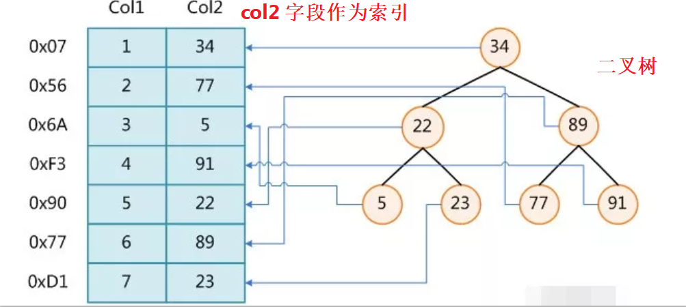

<br>

左边是没有索引的情况，右边是作为**col2字段** **二叉树**索引的情况。

假如执行查找(**假设表为 t**)

```mysql
select *from t where col2 = 89;
```

那么，左边的情况，需要比较**6次**才能找到，右边的情况，只需要比较**2次**就可以找到。当**数据量非常大**时，要查找的数据又非常靠后，那么二叉树结构的查询优势将非常明显。

<br>

**扩展**：

在右边二叉树的结构中，**每个节点**都是 **key-value** 键值对的形式。

**key**：就是**col2的值**； 

**value**：**col2所在行**在磁盘文件中的**指针**（比如 **34** 所在行，通过 **0x07** 这个指针就能找到是**第1行**）

二叉树的特点：

**左子节点值 < 节点值；**

**右子节点值 > 节点值；**

<br>


## 二、 二叉树索引存在的问题

虽然二叉树能提高查找速度，但不是最优的，存在很大的问题。

比如：

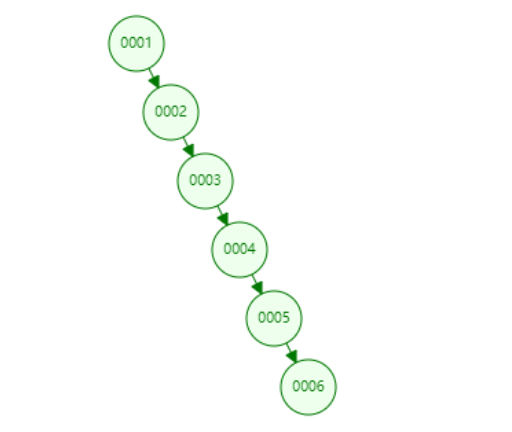

<br>

通过图，可以看出，二叉树出现**单边增长**时，二叉树变成了“链”，这样查找一个数的时候，速度并没有得到很大的优化。

<br>


## 三、 进一步优化，用红黑树

二叉树出现上述情况，显然不太好。那用红黑树怎样呢？

先来看红黑树的结构

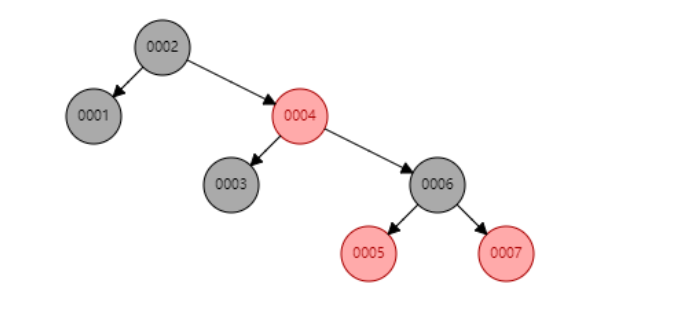

<br>

但红黑树最大问题是**高度**问题。

假设现在数据量有100万，那么红黑树的高度大概为 **100,0000 = 2^n**， n大概为 **20**。

那么，至少要**20次的磁盘IO**，这样，性能将很受影响。如果数据量更大，IO次数更多，性能损耗更大。

所以，如果能**降低IO次数**，将是一个非常好的解决方案。

<br>


## 四、 Hash表

**Hash**是MySQL中支持的两种索引结构中的一种。

**Hash的大致原理是：**

1. 事先将索引通过 **hash算法**后得到的**hash值**(**即磁盘文件指针**）存到**hash表**中。
2. 在进行查询时，将索引通过hash算法，得到hash值，与hash表中的hash值比对。通过磁盘文件指针，只要一次磁盘IO就能找到要的值。

**例如：**

在第一个表中，要查找**col=6的值**。hash(6) 得到值，比对hash表，就能得到89。性能非常高。

<br>

**Hash表存在的问题：**

但是hash表索引存在问题，如果要查询 **带范围**的条件时，hash索引就歇菜了。

例如：

```mysql
select *from t where col1>=6;
```

hash索引就无能为力了，工作中一般用BTree用的多。

<br>


## 五、 B-Tree

回到红黑树的问题，之所以不选中红黑树，最大的原因是没有解决高度问题。（尽管高度相对无索引或普通二叉树已经降低很多，但数据量大时，仍然要多次磁盘IO）

而**BTree索引**能很好解决**高度**问题。

<br>

B-Tree 是一种**平衡的多路查找（又称排序）树**，在**文件系统中**和数**据库系统**有所应用，主要用作文件的索引。其中的**B**就表示**平衡（Balance）。**

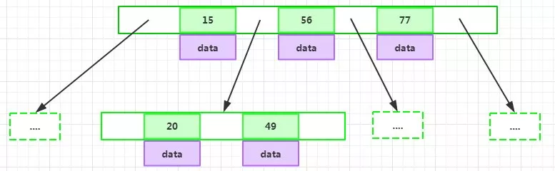

<br>

**BTree 的特性：**

为了描述BTree，首先定义一条数据记录为一个**二元组[key, data]**，key为记录的键值，对于不同数据记录，key是互不相同的；data为数据记录除以key外的数据。那么BTree是满足下列条件的数据结构：

1. d 为大于1的一个正整数，称为BTree的**度**；
2. h为一个正整数，称为BTree的**高度**；
3. key和指针互相间隔，节点两端是**指针**；

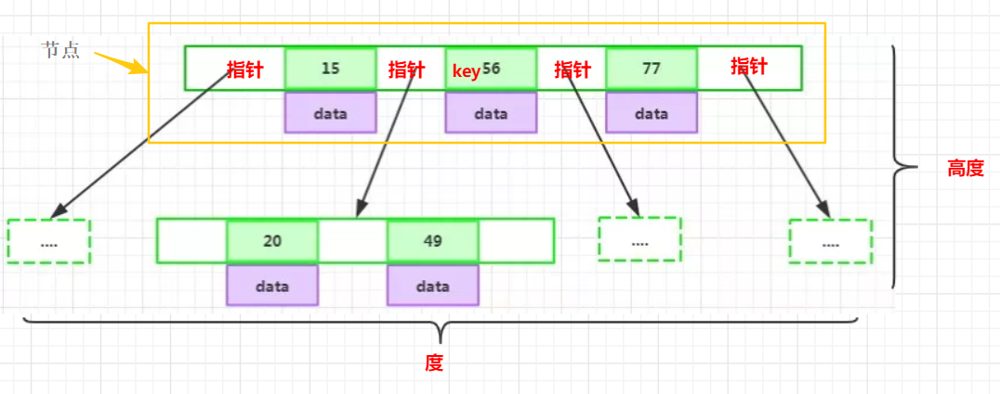

<br>

4. 一个节点中的key从左到右非递减排序

5. 每个指针要么为null，要么指向另外一个界定啊；每个非叶子节点由 **n-1 个key** 和 **n个指针**组成，其中

   **d <= n <= 2d**;

6. 每个叶子节点最少包含一个key和两个指针，最多包含 **2d-1个key** 和 **2d个指针**，叶节点的指针均为null

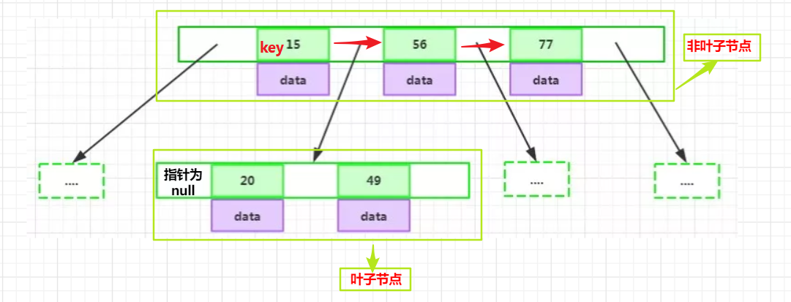

<br>

7. 如图

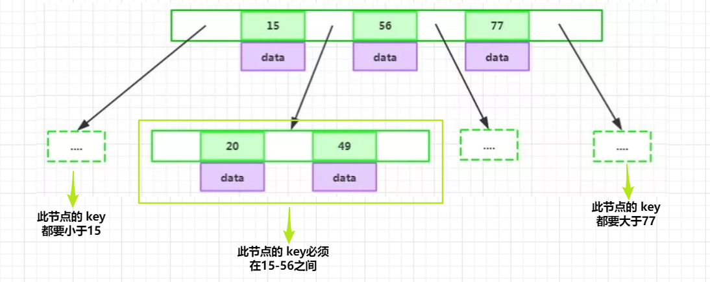

<br>

**总结**:

我们可以稍微总结一下，BTree具有：

- **叶节点具有相同的深度**
- **叶节点的指针为空**
- **节点的数据索引从左到右递增排列**

<br>

但是BTree仍然存在一些问题，比如执行下面的语句，查找**col1 > 20 的值**

```mysql
select *from t where col1 > 20;
```

那么不但需要**叶子节点>20的值**，也需要**非叶子节点**在右边节点的值。即下图圈的两部分：

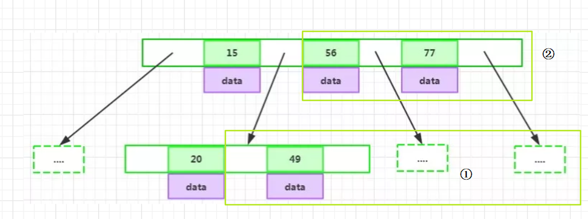

<br>

BTree似乎在范围查找没有更简便的方法，为了解决这一问题。我们可以用**B+Tree**。

<br>


## 六、 B+Tree

B+Tree树是B-Tree的变种，能更好的解决范围查找问题。

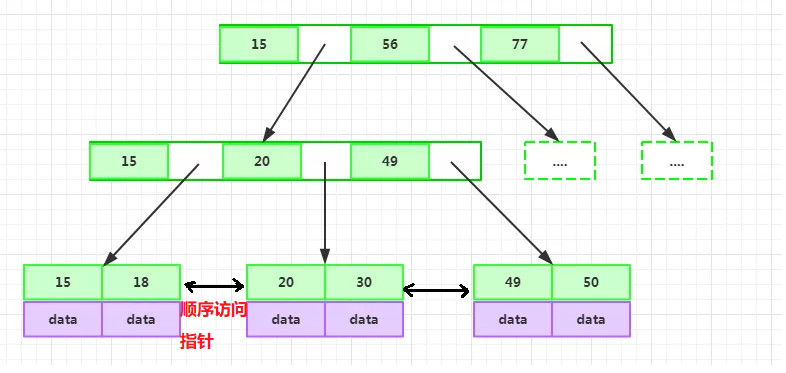

<br>


### 6.1 B+Tree的特性：

- **非叶子节点不存储data，只存储索引，可以存放更多索引**
- **叶子节点不存储指针**
- **顺序访问指针，提高区间访问性能**

<br>


### 6.2 B+Tree 索引为什么可以支持千万级别数据量的查找


**分析：**

MySQL 官方对非叶子节点(如最上层 **h = 1的节点，B+Tree高度为3**) 的大小是有限制的，通过执行

```mysql
SHOW GLOBAL STATUS like 'InnoDB_page_size';
```

可以得到大小为 **16384**，即 **16k**大小。

那么**第二层也是16k大小**。

<br>

假如：B+Tree的表都存满了。索引的节点的**类型为BigInt，大小为8B，指针为6B**。

最后一层，假如 **存放的数据data为1k** 大小，那么

1. 第一层最大节点数为： **16k / (8B + 6B) = 1170 (个)；**
2. 第二层最大节点数也应为：**1170个；**
3. 第三层最大节点数为：**16k / 1k = 16 (个)**。

则，一张B+Tree的表最多存放 **1170 * 1170 * 16 ≈ 2千万。**

所以，通过分析，我们可以得出，B+Tree结构的表可以容纳千万数据量的查询。

而且一般来说，MySQL会把 B+Tree **根节点放在内存中**，那只需要**两次磁盘IO**就行。

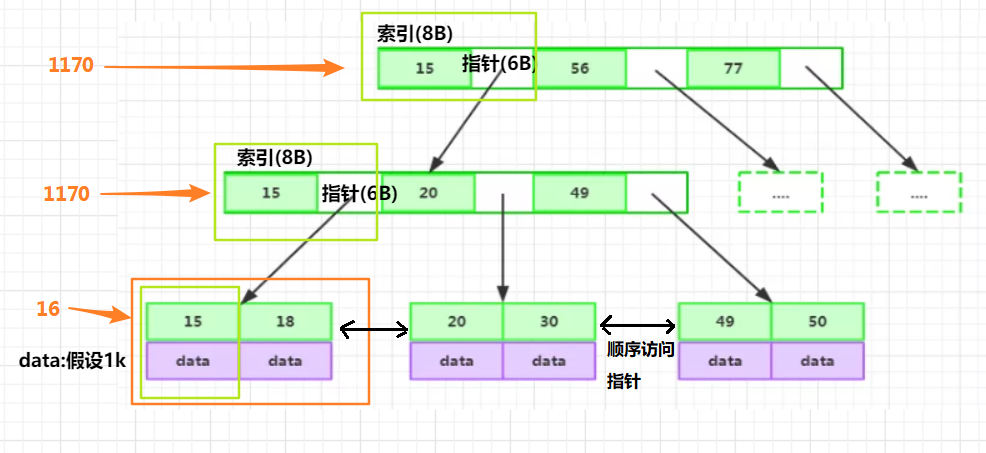

<br>

### 6.3 B+Tree解决范围查找

在上述的图中，我们可以看到B+Tree 还有一个顺序访问指针，这样一来，当我们会到上面的范围查找

```mysql
select *from t where col1 >= 20;
```

时，B+Tree可以通过该指针把20 后面的直接找到，非常方便。


<br>

## 七、 MyISAM和InnoDB存储引擎和索引

### 7.1 MyISAM


MyISAM存储引擎在前面讲过，上图（**主键索引**）

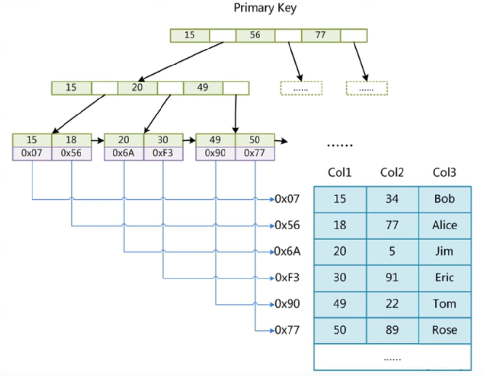

我们知道，MyISAM**索引文件和数据文件是分开的(非聚集)**，存储引擎在磁盘中文件有三个，

一个是 **.frm** 文件(数据表定义)，

一个是 **.MYI**(索引)，

一个是 **.MYD**(实际数据，存储的是一整行的数据，包括索引值)。

**MY文件**是B+Tree为底层组织的文件。

比如查找 **49**，那么再 **.MYI** 中找到 49对应的**磁盘指针 0x49**，根据 0x49 去 **.MYD**找到实际的数据内容 data。

<br>


### 7.2 InnoDB

#### 7.2.1 InnoDB结构


我们知道InnoDB存储引擎是**聚集索引**的。**它的表数据文件本身就是按 B+Tree 组织的一个索引文件。**

不同于MyISAM存储引擎是，**数据不分离**。

如下图，找到49的索引之后，数据就在该节点，不必像MyISAM存储引擎那样，需要根据磁盘指针到另一个文件中取数据。性能比MyISAM高。

.png)


<br>

#### 7.2.2 InnoDB必须要有主键，并且推荐使用整型自增主键

**要有主键：**每个表在磁盘上，是单独的一个文件。索引和数据都在其中，文件是按照主键索引组织的一个B+TREE结构。假如没有定义主键，MySQL会在挑选**能唯一标识的字段作为索引**；假如找不到，会生成一个**默认的隐藏列**作为主键列。

<br>

**整型主键**：假如使用类似 **UUID** 的字符串作为主键，那么在查找时，需要比较两个主键是否相同，这是一个**相比整型比较  非常耗时**的过程。需要一个字符，一个字符的比较，自然比较慢。

<br>

**自增主键**：自增的好处体现在，

1. **后面的主键索引总是大于前面的主键索引**，在做范围查询时，非常方便找到需要的数据。
2. 在添加的过程中，因为是自增的，每次添加都是在后面插入，树分裂的机会小；而UUID大小不确定，分裂机会大，性能损耗大。

<br>

#### 7.2.3 为什么非主键索引结构叶子节点存储的是主键值？


非主键的 **data**存储的是 **主键值**的好处：

1. 节省空间：指向主键的节点，不用再存储一份相同的数据；

2. 数据一致性：如果修改索引**15** 的数据，那只要修改**主键的 data**，

   而如果非主键的data也存一份的话，那得**修改两份。**

<br>

.png)

<br>


#### 7.2.4 联合索引的底层结构

就是排序，第一相同，排第二个，类推。

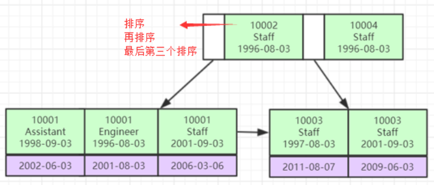


<br>

<br>

## 参考

[深入理解Mysql索引底层数据结构与算法](https://blog.csdn.net/caijunsen/article/details/83045985)<br>

[讲真，MySQL索引优化看这篇文章就够了](https://mp.weixin.qq.com/s/8CfrnEveWVaDcr_PxEQ-cA)<br>

[硬盘的读取原理](https://blog.csdn.net/hguisu/article/details/7408047)