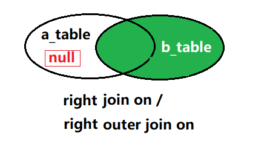
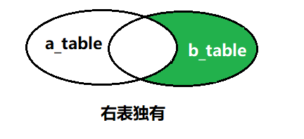
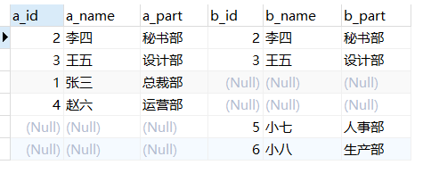
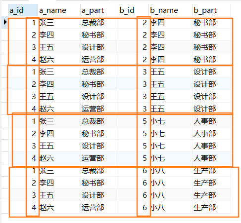
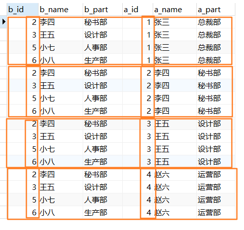

# mysql各种连接查询


## 一、 建表

**数据库表：**  **a_table, b_table**

**连接包括：内连接、左连接（左外连接）、右连接（右外连接）、全连接（全外连接）、左表独有、右表独有**

<br>

**建表语句：**

```mysql
CREATE TABLE `a_table` (
  `a_id` int(11) DEFAULT NULL,
  `a_name` varchar(10) DEFAULT NULL,
  `a_part` varchar(10) DEFAULT NULL
) ENGINE=InnoDB DEFAULT CHARSET=utf8

```

<br>

```mysql
CREATE TABLE `b_table` (
  `b_id` int(11) DEFAULT NULL,
  `b_name` varchar(10) DEFAULT NULL,
  `b_part` varchar(10) DEFAULT NULL
) ENGINE=InnoDB DEFAULT CHARSET=utf8
```

<br>

**填充测试数据**：

**a_table**:

| aid  | a_name | a_part |
| ---- | ------ | ------ |
| 1    | 张三   | 总裁部 |
| 2    | 李四   | 秘书部 |
| 3    | 王五   | 设计部 |
| 4    | 赵六   | 运营部 |

<br>

**b_table**:

| b_id | b_name | b_part |
| ---- | ------ | ------ |
| 2    | 李四   | 秘书部 |
| 3    | 王五   | 设计部 |
| 5    | 小七   | 人事部 |
| 6    | 小八   | 生产部 |

<br>


## 二、 内连接

关键字：**inner  join  on**

语句：

```mysql
select *from a_table a inner join b_table b on a.a_id = b.b_id;
```

**结果**：


<br>

**说明**： 内连接是两个表的交集部分。


<br>


## 三、 左（外）连接

关键字：**left  join on** 或 **left outer join on **

语句：

```mysql
select *from a_table a left outer join b_table b on a.a_id = b.b_id;
```

**结果**：


<br>

**说明：**

左连接=左外连接，**left join on = left outer join on**。右表记录不足的地方为**null**


<br>


## 四、 右（外）连接

关键字：**right join on** 或 **right outer join on **

语句：

```mysql
select *from a_table a right outer join b_table b on a.a_id = b.b_id;
```

**结果**：


<br>

**说明**：

右连接=右外连接，**right join on = right outer join on**。左表记录不足的地方为**null**



<br>


## 五、 左表独有

关键字：**left outer join on 、 is null**

语句：

```mysql
select *from a_table a left outer join b_table b on a.a_id = b.b_id where b.b_id is null;
```

**结果**：


<br>

**说明**：

两表关联，查询左表独有的数据。（注意：左表独有，**右表 id 为空**）


<br>

## 六、 右表独有

关键字：**right outer join on、 is null**

语句：

```mysql
select *from a_table a right outer join b_table b on a.a_id = b.b_id where a.a_id is null;
```

**结果**：


<br>

**说明**：

两表关联，查询右表独有的数据。（注意：右表独有，**左表 id 为空**）



<br>


## 七、 全连接

关键字：**left outer join on 、 union、 right outer join on**

语句：

```mysql
select *from a_table a left outer join b_table b on a.a_id = b.b_id
UNION
select *from a_table a right outer join b_table b on a.a_id = b.b_id;
```

**结果**：



<br>

**说明**:

在**oracle**中 有 **full join** 进行全连接，mysql中没有，所以可以用 **一个左连接**  **并上** **一个右连接**


<br>


## 八、 并集去交集

关键字：**left outer join on 、 — 、 union、 right outer join on**

语句：

```mysql
(select *from a_table a left join b_table b on a.a_id = b.b_id
UNION
select *from a_table a RIGHT JOIN b_table b on a.a_id = b.b_id)

-

select *from a_table a where a.a_id = b.b_id
```

**结果**：


<br>

**说明**：

​	**减号** 前面求并集，**减号** 后面求交集， 相减就是结果。

但是还可以有简便做法，逻辑上等价于

**左表独有 并上 右表独有**

那么语句就是

```mysql
select *from a_table a left outer join b_table b on a.a_id = b.b_id where b.b_id is null

UNION

select *from a_table a right outer join b_table b on a.a_id = b.b_id where a.a_id is null;
```


<br>

## 九、 笛卡尔积 

假设现在有两集合：

**A = {0,1}     B = {2,3,4}**

集合 **A×B** 和 **B×A**的结果集就可以分别表示为以下这种形式：

**A×B = {（0，2），（1，2），（0，3），（1，3），（0，4），（1，4）}；**

**B×A = {（2，0），（2，1），（3，0），（3，1），（4，0），（4，1）}；**

以上A×B和B×A的结果就可以叫做两个集合相乘的‘**笛卡尔积**’。

从以上的数据分析我们可以得出以下两点结论：

**1，两个集合相乘，不满足交换率，既 A×B ≠ B×A;**

**2，A集合和B集合相乘，包含了集合A中元素和集合B中元素相结合的所有的可能性。既两个集合相乘得到的新集合的元素个数是 A集合的元素个数 × B集合的元素个数;**

**（A × B ≠ B × A）**

<br>

先来看一下笛卡尔积的图示，


<br>

关键字：**join 或  cross join**

**A *  B 笛卡尔积**：

语句：

```mysql
select *from a_table a cross join b_table b;
```

**结果**：



<br>

**B * A 笛卡尔积**：

语句：

```mysql
select *from a_table a join b_table b;
```




<br>

<br>

## 参考

[图解MySQL 内连接、外连接、左连接、右连接、全连接……太多了](https://blog.csdn.net/plg17/article/details/78758593)<br>

[mysql几种连接方式区别](https://blog.csdn.net/weixin_41404773/article/details/85124467)<br>

[MYSQL之笛卡尔积](https://blog.csdn.net/csdn_hklm/article/details/78394412)<br>

[MySQL的多表查询(笛卡尔积原理)](https://www.cnblogs.com/Toolo/p/3634563.html)<br>


