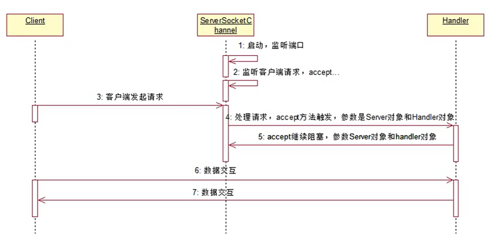

# AIO

## 概述

AIO编程，在NIO基础之上引入了 **异步通道** 的概念，并提供了 **异步文件和异步套接字通道 ** 的实现，从而真正意义上实现了异步非阻塞。

NIO只是非阻塞而非异步。

而AIO不需要通过多路复用器读注册的通道进行轮询操作即可实现异步读写，从而简化了NIO编程模型。也可以称之为NIO2.0

<br>

AIO编程时，当进行读写操作时，只需要调用API 的 **`read`** 或  **`write`** 方法即可。这两种方法均为异步的。

- 对于读操作，当有流可以读取时，操作系统会将可读的流传入read方法的缓冲区，并通知应用程序；
- 对于写操作，当操作系统将write方法传递的流写入完毕时，操作系统主动通知应用程序。

可以理解为，read，write为异步，完成后主动调用回调函数。

<br>

在 java.nio.channels 包下增加了四个异步通道：

- **AsynchronousSocketChannel**
- **AsynchronousServerSocketChannel**

<br>

## 示例代码

**Client:**

```java
package aio;

import java.io.IOException;
import java.io.UnsupportedEncodingException;
import java.net.InetSocketAddress;
import java.nio.ByteBuffer;
import java.nio.channels.AsynchronousSocketChannel;
import java.util.concurrent.ExecutionException;

public class Client implements Runnable{
    final static String ADDRESS = "127.0.0.1";
    final static int PORT = 8888;

    private AsynchronousSocketChannel asc;

    public Client() throws IOException {
        asc = AsynchronousSocketChannel.open();
    }

    public void connect(){
        asc.connect(new InetSocketAddress(ADDRESS,PORT));
    }

    public void read(){
        ByteBuffer buffer = ByteBuffer.allocate(1024);
        try {
            //读取
            asc.read(buffer).get();
            buffer.flip();
            byte[] respByte = new byte[buffer.remaining()];
            buffer.get(respByte);
            System.out.println(new String(respByte,"UTF-8"));

        }catch (InterruptedException e){
            e.printStackTrace();
        }catch (ExecutionException e){
            e.printStackTrace();
        }catch (UnsupportedEncodingException e){
            e.printStackTrace();
        }

    }

    public void write(String request){
        try {
            //写
            asc.write(ByteBuffer.wrap(request.getBytes())).get();
            read();
        }catch (Exception e){
            e.printStackTrace();
        }
    }

    @Override
    public void run() {
        while (true){

        }
    }

    public static void main(String[] args) throws Exception {
        Client c1 = new Client();
        c1.connect();

        Client c2 = new Client();
        c2.connect();

        Client c3 = new Client();
        c3.connect();

        new Thread(c1, "c1").start();
        new Thread(c2, "c2").start();
        new Thread(c3, "c3").start();

        Thread.sleep(1000);

        c1.write("c1 aaa");
        c2.write("c2 bbbb");
        c3.write("c3 ccccc");
    }
}

```

<br>

**Server:**

```java
package aio;

import java.net.InetSocketAddress;
import java.nio.channels.AsynchronousChannelGroup;
import java.nio.channels.AsynchronousServerSocketChannel;
import java.util.concurrent.ExecutorService;
import java.util.concurrent.Executors;

public class Server {
    //线程池,提高服务端效率
    private ExecutorService executorService;
    //线程组
    private AsynchronousChannelGroup threadGroup;
    //服务端通道
    public AsynchronousServerSocketChannel assc;

    public Server(int port){
        try {
            //创建一个缓存池
            executorService = Executors.newCachedThreadPool();
            //创建线程组
            threadGroup = AsynchronousChannelGroup.withCachedThreadPool(executorService,1);
            //创建服务器通道
            assc = AsynchronousServerSocketChannel.open(threadGroup);
            //进行绑定监听端口，但是未监听请求
            assc.bind(new InetSocketAddress(port));

            System.out.println("服务器端已启动...端口为:" + port);
            //进行阻塞
            /**
             * accept(T attachment, CompletionHandler<AsynchronousSocketChannel, ? super T>)
             * AIO开发中，监听是一个类似递归的监听操作。每次监听到客户端请求后，都需要处理逻辑开启下一次监听。
             * 下一次监听，需要服务器资源继续支持
             */
            assc.accept(this,new ServerCompletionHandler());

            //一直阻塞，不然服务器停止
            Thread.sleep(Integer.MAX_VALUE);

        }catch (Exception e){
            e.printStackTrace();
        }
    }

    public static void main(String[] args) {
        Server server = new Server(8888);
    }
}

```

<br>

**ServerCompletionHandler**

```java
package aio;

import java.nio.ByteBuffer;
import java.nio.channels.AsynchronousSocketChannel;
import java.nio.channels.CompletionHandler;
import java.util.concurrent.ExecutionException;

public class ServerCompletionHandler implements CompletionHandler<AsynchronousSocketChannel, Server> {

    // 业务处理逻辑，当请求成功后，监听成功，应该做什么的方法
    @Override
    public void completed(AsynchronousSocketChannel asc, Server attachment) {
        //当有下一个客户端接入的时候，直接调用Server的accept方法，这样反复执行下去，保证多个客户端都可以阻塞。
        //类似递归
        attachment.assc.accept(attachment,this);
        //读取客户端的请求
        read(asc);
    }

    //异常处理逻辑
    @Override
    public void failed(Throwable exc, Server attachment) {
        exc.printStackTrace();
    }

    /**
     * 业务处理逻辑，当请求到来后，监听成功，应该做什么
     * 一定要实现的逻辑：为下一次客户端请求开启监听。accept方法调用
     * 无论BIO、NIO、AIO中，一旦连接建立，两端是平等的。
     * @param asc
     */
    private void read(final AsynchronousSocketChannel asc) {
        //读取数据
        ByteBuffer buffer = ByteBuffer.allocate(1024);

        /**
         * 异步读操作，read(Buffer destination, A attachment, CompletionHandler<Integer, ? super A> handler)
         * destination：目的地，是处理客户端传递数据的中转缓存。
         * attachment：处理客户端传递数据的对象
         * handler：处理逻辑
         */
        asc.read(buffer, buffer, new CompletionHandler<Integer, ByteBuffer>() {
            /**
             * 业务逻辑，读取客户端传输数据。
             * @param resultSize
             * @param attachment
             */
            @Override
            public void completed(Integer resultSize, ByteBuffer attachment) {
                //进行读取之后，重置标识位
                attachment.flip();
                //获取读的字节数
                System.out.println("接受到客户端的数据长度为:" + resultSize);

                //获取读取的数据
                String resultData = new String(attachment.array()).trim();
                System.out.println("收到客户端的数据信息为: " + resultData);
                String response = "服务器响应：收到了你的信息了..";
                write(asc, response);
            }

            @Override
            public void failed(Throwable exc, ByteBuffer attachment) {
                exc.printStackTrace();
            }
        });
    }

    private void write(AsynchronousSocketChannel asc, String response) {
        try {
            ByteBuffer buffer = ByteBuffer.allocate(1024);
            buffer.put(response.getBytes());
            buffer.flip();
            asc.write(buffer).get();
        }catch (InterruptedException e){
            e.printStackTrace();
        }catch (ExecutionException e){
            e.printStackTrace();
        }
    }


}
```

<br>

**结果**：

```
Server:
    服务器端已启动...端口为:8888
    接受到客户端的数据长度为:6
    收到客户端的数据信息为: c1 aaa
    接受到客户端的数据长度为:7
    收到客户端的数据信息为: c2 bbbb
    接受到客户端的数据长度为:8
    收到客户端的数据信息为: c3 ccccc
Client:
	服务器响应：收到了你的信息了..
    服务器响应：收到了你的信息了..
    服务器响应：收到了你的信息了..
```

<br>

## AIO时序图



<br>

