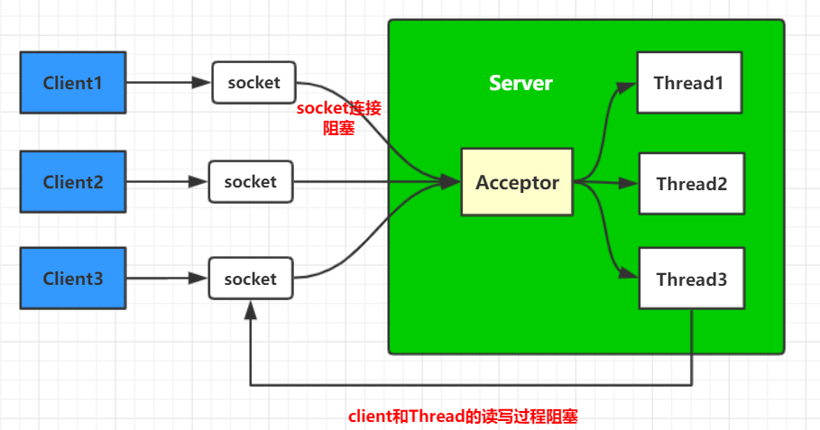

# BIO(同步阻塞IO)

IO：Input/Output

## 概述

**BIO ：** **Blocking IO**，顾名思义，就是阻塞IO。就是传统的 **java.io包**，它是基于流模型实现的，交互的方式是 **同步、阻塞** 方式。

也就是说在读入输入流或者输出流时，在读写动作完成之前，线程会一直阻塞在那里，它们之间的调用是可靠的线性顺序。

- 优点：代码比较简单、直观。
- 缺点：IO 的效率和扩展性很低，容易成为应用性能瓶颈。

<br>

## BIO通信模型



<br>

## 示例代码

**Client:**

```java
package bio;

import java.io.BufferedReader;
import java.io.IOException;
import java.io.InputStreamReader;
import java.io.PrintWriter;
import java.net.Socket;

/**
 * @program: network_programming
 * @description:
 * @author: wenyan
 * @create: 2019-11-24 01:05
 **/


public class Client {
    final static String ADDRESS = "127.0.0.1";
    final static int PORT = 8888;

    public static void main(String[] args) {
        Socket socket = null;
        BufferedReader in = null;
        PrintWriter out = null;
        try{
            //建立连接
            socket = new Socket(ADDRESS,PORT);
            in = new BufferedReader(new InputStreamReader(socket.getInputStream()));
            out = new PrintWriter(socket.getOutputStream(),true);

            //向服务端发送数据
            out.println("你好服务端，我是客户端...");
            out.println("我请求资源A...");

            //接收数据
            String response = in.readLine();
            System.out.println("Server：" + response);
        }catch (Exception e){
            e.printStackTrace();
        }finally {
            if(in != null){
                try {
                    in.close();
                }catch (IOException e){
                    e.printStackTrace();
                }
            }
            if(out != null){
                try{
                    out.close();
                }catch (Exception e){
                    e.printStackTrace();
                }
            }
            if(socket != null){
                try {
                    socket.close();
                }catch (IOException e){
                    e.printStackTrace();
                }
            }
            socket = null;
        }
    }
}

```

<br>

```java
package bio;

import java.io.IOException;
import java.net.ServerSocket;
import java.net.Socket;

/**
 * @program: network_programming
 * @description:
 * @author: wenyan
 * @create: 2019-11-24 00:40
 **/


public class Server {

    final static int PORT = 8888;

    public static void main(String[] args) {
        ServerSocket serverSocket = null;
        try{
            serverSocket = new ServerSocket(PORT);
            System.out.println("服务端启动...");

            //进行阻塞
            Socket socket = serverSocket.accept();

            //新建一个线程执行客户端的任务
            new Thread(new ServerHandler(socket)).start();
        }catch (Exception e){
            e.printStackTrace();
        }finally {
            if(serverSocket != null){
                try {
                    serverSocket.close();
                }catch (IOException e){
                    e.printStackTrace();
                }
            }
            serverSocket = null;
        }
    }

}

```

<br>

**ServerHandle:**

```java
package bio;

import java.io.*;
import java.net.Socket;

/**
 * @program: network_programming
 * @description:
 * @author: wenyan
 * @create: 2019-11-24 00:57
 **/


public class ServerHandler implements Runnable{

    private Socket socket;
    //从服务端传入socket
    public ServerHandler(Socket socket){
        this.socket = socket;
    }

    @Override
    public void run() {
        BufferedReader in = null;
        PrintWriter out = null;
        try{
            in = new BufferedReader(new InputStreamReader(this.socket.getInputStream()));
            out = new PrintWriter(this.socket.getOutputStream(),true);
            String body = null;
            while (true){
                //接收客户端发送的请求
                body = in.readLine();
                if(body == null){
                    break;
                }
                System.out.println("Client:" + body);
                //响应数据
                out.println("你要的资源A给你了");
            }
        }catch (Exception e){
            e.printStackTrace();
        }finally {
            //关闭资源
            if(in != null){
                try {
                    in.close();
                }catch (IOException e){
                    e.printStackTrace();
                }
            }
            if(out != null){
                try{
                    out.close();
                }catch (Exception e){
                    e.printStackTrace();
                }
            }
            if(socket != null){
                try{
                    socket.close();
                }catch (IOException e){
                    e.printStackTrace();
                }
            }
            socket = null;
        }
    }
}

```

<br>

```
Server:
    服务端启动...
    Client:你好服务端，我是客户端...
    Client:我请求资源A...

Client:
    Server：你要的资源A给你了
```

<br>

 从以上代码，很容易看出，BIO主要的问题在于每当有一个新的客户端请求接入时，服务端必须创建一个新的线程来处理这条链路，在需要满足高性能、高并发的场景是没法应用的（大量创建新的线程会严重影响服务器性能，甚至罢工）。


<br>


## 参考

[Java核心（五）深入理解BIO、NIO、AIO](http://www.imooc.com/article/265871)<br>

[Java 网络IO编程总结（BIO、NIO、AIO均含完整实例代码）](https://blog.csdn.net/anxpp/article/details/51512200)<br>


  


  