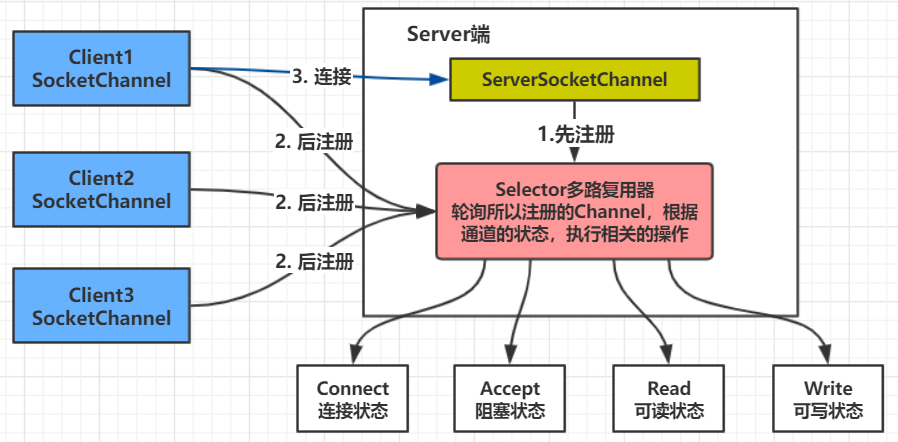

# NIO

[TOC]

<br>

## 概述

**NIO (New I/O):** NIO是一种 **同步非阻塞** 的I/O模型，在Java 1.4 中引入了NIO框架，对应 java.nio 包，提供了 **Channel , Selector，Buffer** 等抽象。

NIO中的N可以理解为Non-blocking，不单纯是New。它支持面向缓冲的，基于**通道的I/O操作方法**。

NIO提供了与传统BIO模型中的 `Socket` 和 `ServerSocket` 相对应的  **`SocketChannel`** 和 **`ServerSocketChannel`** 两种不同的套接字通道实现，**两种通道都支持阻塞和非阻塞两种模式**。

阻塞模式使用就像传统中的支持一样，比较简单，但是性能和可靠性都不好；非阻塞模式正好与之相反。

对于低负载、低并发的应用程序，可以使用同步阻塞I/O来提升开发速率和更好的维护性；

**对于高负载、高并发的（网络）应用，应使用 NIO 的非阻塞模式来开发**。

常用我们更乐意叫做 Non-Blocking IO。

<br>


## 几个概念

### Buffer（缓冲区）

Buffer 是一个对象，它包含了一些要写入或者要读取的数据，在NIO类库中加入Buffer对象，体现了新库与原IO的一个重要区别。在面向流的IO中，可以将数据直接写入或者读取到Stream对象中。

而在NIO库中，所有数据都是用 **缓冲区处理的（读写）**。缓冲区实质上是一个 **数组**，通常它是一个字节数组**（ByteBuffer）**，也可以使用其他类型的数组。这个数组为缓冲区提供了数据的访问读写等操作属性，如位置、容量、上限等概念，参考api文档。

**最常用的是 ByteBuffer，实际上每一种java基本类型都对应了一种缓冲区（除了Boolean类型）。**

- ByteBuffer
- CharBuffer
- ShortBuffer
- IntBuffer
- LongBuffer
- FloatBuffer
- FloatBuffer
- DoubleBuffer

<br>

关于Buffer，可以看我的另一篇专门讲Buffer的文章。[《NIO中的Buffer》](network_programming/NIO中的Buffer.md)

Buffer 比较难用，建议先看Buffer，再来看NIO会更好理解。

<br>

### Channel（管道、通道）

通道，就像自来水管道一样，网络数据通过Channel读取和写入。

通道与流不同之处在于 **通道是双向的**，而流只是一个方向上移动（一个流必须是InputStream或者OutputStream的子类），而通道可以用于读、写或者二者同时进行，最关键的是可以与**多路复用器**结合起来，**有多种的状态位，方便多路复用器去识别**。

事实上，通道分为两大类，一类是 **网络读写的（SelectableChannel）**，一类是用于 **文件操作的（FileChannel）**，我们使用的  **SocketChannel** 和 **ServerSocketChannel **都是SelectableChannel 的子类。

**SocketChannel 和 ServerSocketChannel 这两种通道都支持阻塞和非阻塞两种模式。**

<br>


### Selector（选择器、多路复用器）

多路复用器，是NIO编程的基础，非常重要。多路复用器提供 **选择已经就绪的任务** 的能力。

简单说，就是Selector会 **不断的轮询注册在它上面的Channel**，如果某个通道发生了读写操作，这个通道就处于**就绪**状态，会被Selector轮询出来，然后通过 **SelectionKey** 可以得到就绪的 **Channel集合**，从而进行后续的IO操作。

一个多路复用器可以负责成千上万的Channel通道，没有上限，这也是JDK使用了**`epoll()`**代替了传统select实现，没有最大连接句柄1024/2048的限制，这也就意味着我们只要一个线程负责Selector的轮询，就可以接入成千上万个客户端，这是JDK NIO库的巨大进步。

<br>

Selector线程就类似一个管理者（Master），管理了成千上万个管道，然后轮询那个管道的数据已经准备好，通知cpu执行IO的读取或写入操作。

Selector模式：当IO事件（Channel）注册到Selector后，Selector会分配给每个Channel一个 **key** 值，相当于标签。Selector是以轮询的方式进行查找注册的所有Channel，当Channel准备就绪后，Selector就会识别，通过key找到相应的Channel，进行相关的数据处理操作。(从管道读或写数据，写到数据缓冲区Buffer中)

<br>

每个Channel都会对Selector进行注册不同的 **事件状态**， 以便Selector查找：

- **SelectionKey.OP_CONNECT**
- **SelectionKey.OP_ACCEPT**
- **SelectionKey.OP_READ**
- **SelectionKey.OP_WRITE**

<br>

## NIO模型



<br>

## 示例代码

**Client:**

```java
package nio;

import java.net.InetSocketAddress;
import java.nio.ByteBuffer;
import java.nio.channels.SocketChannel;

public class Client {
    final static String ADDRESS = "127.0.0.1";
    final static int PORT = 8888;
    public static void main(String[] args) {
        //创建连接的地址
        InetSocketAddress address = new InetSocketAddress(ADDRESS,PORT);

        //声明连接通道
        SocketChannel sc = null;

        //建立缓冲区
        ByteBuffer buffer = ByteBuffer.allocate(1024);

        try {
            //打开通道
            sc = SocketChannel.open();
            //进行连接
            sc.connect(address);

            while (true){
                //定义一个字节数组，然后使用系统录入功能
                byte[] bytes = new byte[1024];
                //系统录入
                System.in.read(bytes);

                //把数据放到缓冲区
                buffer.put(bytes);
                //对缓冲区进行复位
                buffer.flip();
                //写出数据
                sc.write(buffer);
                //清空缓冲区
                buffer.clear();
            }
        }catch (Exception e){
            e.printStackTrace();
        }finally {
            if(sc != null){
                try {
                    sc.close();
                }catch (Exception e){
                    e.printStackTrace();
                }
            }
        }
    }
}

```

<br>

**Server:**

```java
package nio;

import java.io.IOException;
import java.net.InetSocketAddress;
import java.net.ServerSocket;
import java.nio.ByteBuffer;
import java.nio.channels.SelectionKey;
import java.nio.channels.Selector;
import java.nio.channels.ServerSocketChannel;
import java.nio.channels.SocketChannel;
import java.util.Iterator;

public class Server implements Runnable{
    //1. 多路复用器Selector（管理所有的Channel）
    private Selector selector;
    //2. 建立读取缓冲区
    private ByteBuffer readBuffer = ByteBuffer.allocate(1024);
    //3. 建立写缓冲区
    //private ByteBuffer writeBuffer = ByteBuffer.allocate(1024);
    public Server(int port){
        try {
            //1. 打开多路复用器(调用自身静态方法)
            this.selector = Selector.open();
            //2. 打开服务器通道
            ServerSocketChannel ssc = ServerSocketChannel.open();
            //3. 设置服务器通道为非阻塞模式
            ssc.configureBlocking(false);
            //4. 绑定地址
            ssc.bind(new InetSocketAddress(port));
            //5. 把服务器通道注册到多路复用器上，并且监听阻塞事件
            ssc.register(this.selector,SelectionKey.OP_ACCEPT);

            System.out.println("服务器已启动，端口是:" + port + ",等待客户端连接...");
        }catch (IOException e){
            e.printStackTrace();
        }
    }

    public static void main(String[] args) {
        //将服务端作为一个线程启动。会执行run方法。
        new Thread(new Server(8888)).start();
    }

    @Override
    public void run() {
        while (true){
            try {
                //1. 必须要让多路复用器开始监听
                this.selector.select();
                //2. 返回多路复用器已经选择的结果集
                //当客户端的Channel注册到多路复用器上时，会有key注册在上面。
                Iterator<SelectionKey> keys = this.selector.selectedKeys().iterator();
                //3. 进行遍历（遍历Channel的所有key）
                while (keys.hasNext()){
                    //4. 获取一个选择的元素
                    SelectionKey key = keys.next();
                    //5. 直接从容器中移除就可以了
                    keys.remove();

                    //6. 如果是有效的key
                    if(key.isValid()){
                        //7. 如果是阻塞状态
                        //一开始只有服务端的ServerSocketChannel是阻塞的，那么会执行accept方法
                        if(key.isAcceptable()){
                            this.accept(key);
                        }
                        //8. 如果为可读状态
                        if(key.isReadable()){
                            this.read(key);
                        }
                        //9. 写数据
                        /*if(key.isWritable()){
                            this.write(key);
                        }*/
                    }
                }
            }catch (IOException e){
                e.printStackTrace();
            }
        }
    }

    //阻塞状态
    private void accept(SelectionKey key) {
        try {
            //1. 获取服务通道
            ServerSocketChannel ssc = (ServerSocketChannel) key.channel();
            //2. 执行阻塞方法
            //阻塞着，如果有客户端Channel连上，就被监听到，获得一个客户端的SocketChannel了。
            SocketChannel sc = ssc.accept();
            //3. 设置阻塞模式
            sc.configureBlocking(false);
            //4. 注册到多路复用器上，并设置读取标识。下一次轮询时就是可读状态了。
            sc.register(this.selector, SelectionKey.OP_READ);
        }catch (IOException e){
            e.printStackTrace();
        }
    }

    private void read(SelectionKey key) {
        try {
            //1. 清空缓冲区旧的数据
            this.readBuffer.clear();
            //2. 获取之前注册的SocketChannel对象(通过多路复用器上的key来获取）
            SocketChannel sc = (SocketChannel)key.channel();
            //3. 读取数据
            int count = sc.read(this.readBuffer);
            //4. 如果没有数据
            if(count == -1){
                key.channel().close();
                key.cancel();
                return;
            }

            //5. 有数据，则进行读取，读取之前进行复位方法（把position和limit进行复位）
            this.readBuffer.flip();
            //6. 根据缓冲区的数据长度创建相应大小的byte数组，接收缓冲区的数据
            byte[] bytes = new byte[this.readBuffer.remaining()];
            //7. 接收缓冲区的数据
            this.readBuffer.get(bytes);
            //8. 打印结果
            String body = new String(bytes).trim();
            System.out.println("客户端：" + body);

            //9. 回写给客户端数据，就是write
            //这是双向通信。
        }catch (IOException e){
            e.printStackTrace();
        }
    }
}
```

<br>

从上面我们可以总结出服务端的流程：

1. 创建多路复用器**(Selector)**，并打开，用来管理所有的Channel
2. 创建ServerSocketChannel，并打开，设置为非阻塞模式
3. ServerSocketChannel绑定地址，注册到多路复用器上，并监听阻塞**(ACCEPT)**事件
4. Selector轮询准备就绪的key（第一次只有ServerSocketChannel的key注册了，而且设置为ACCEPT状态）
5. 那么调用accept方法，accept方法是ServerSocketChannel阻塞着监听新的客户端Channel
6. 将客户端Channel设置为非阻塞状态，并且注册到多路复用器上，设置为可读状态
7. 那么，下一次Selector轮询时，就是客户端Channel了，都是READ状态，就执行read操作。
8. read操作是通过Selector的key获得Channel，读取Channel中的数据放到Buffer缓冲区，并解码Buffer。
9. 加入要应答客户端，那么就将应答消息编码后放入Buffer，调用SocketChannel的write将消息发给客户端。

<br>

### 双向通信

可以对上面代码进行改进，变成双向通信的方式。

<br>


## 参考

[Java 中 IO 流分为几种?BIO,NIO,AIO 有什么区别?](https://www.jianshu.com/p/91f43c73a760)<br>


