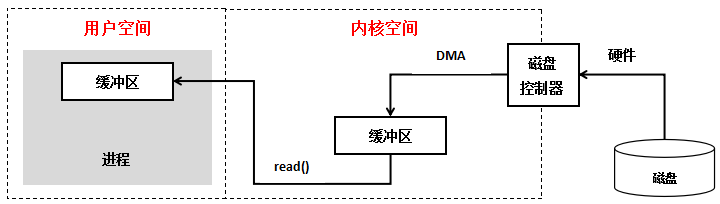

# 网络IO模型

[TOC]

 

## 同步与异步，阻塞与非阻塞

**同步和异步通常用来形容一次方法调用**。

**同步：** 就是在发出一个 **调用** 时，在没有得到结果之前，该 **调用** 就不返回。但是一旦调用返回，就得到返回值了.

换句话说，就是由 **调用者** 主动等待这个 **调用** 的结果。

**异步**： **调用在发出之后，这个调用就直接返回了，所以没有返回结果**。换句话说，当一个异步过程调用发出后，调用者不会立刻得到结果。而是在 **调用** 发出后，**被调用者** 通过 **`状态、通知`** 来通知调用者，或通过 **`回调函数`** 处理这个调用。

 

**阻塞：** 是指调用结果返回之前，当前线程会被挂起。调用线程只有在得到结果之后才会返回。

**非阻塞**：在不能立刻得到结果之前，该调用不会阻塞当前线程。

 

**怎么理解**：

要分开看：**（比如，打电话问书店老板有没有某本书）**

- **同步、异步关心的是“消息通知机制”。**
  - 同步：老板说等一下，让他找找（可以几秒，几小时），然后告诉你结果**（返回结果）**。这时整个通信在**一次通话**中完成。
  - 异步：老板说他找找，迟点回复，直接挂电话**（不返回结果）**。查好了，打电话给你。老板通过 **回调** 的方式告诉你结果。
- **阻塞、非阻塞关心的是“程序在等待调用结果（消息、返回值）时的状态**
  - 阻塞：打电话问老板之后，一直拿着电话等老板回复，等待期间什么都不能做。
  - 非阻塞：先放下电话，可以先自己做其他事情，或者偶尔过几分钟问一下老板当前情况。

 

## 组合概念

还是以上面打电话为例，理解一下下面四个组合概念：

**同步阻塞**： 老板没挂电话，你也不能做其他事，只能干等。

**同步非阻塞**：老板没挂电话，你不在电话前等，去干自己的事了。

**异步阻塞：** 老板直接挂电话了，但是你仍在电话前等，其他什么都不能做。直到老板回你电话。

**异步非阻塞**： 老板和你都不在电话前等了。

 

## 5种IO模型

5中IO模型分别是：阻塞IO模型、非阻塞IO模型、IO多路复用模型、信号驱动的IO模型、异步IO模型。

其中，前四种都是同步IO操作，异步IO模型是异步操作。

 

### IO交互

先来理解IO的交互

通常用户进程中的一个完整IO分为两个阶段：

- 用户空间 <-----> 内核空间
- 内核空间<------>设备空间

 

**IO交互模型**

 

内核空间存放的是 **内核代码和数据**，而进程的用户空间存放的是 **用户程序的代码和数据。**

不管是内核空间还是用户空间，他们都处于虚拟空间中。

Linux使用两级保护机制：0级供内核使用，3级供用户程序使用。

 

**操作系统和驱动程序运行在内核空间，应用程序运行在用户空间。**

两者不能简单地使用指针传递数据，因为linux使用的虚拟内存机制，其必须通过系统调用请求kernel来协助完成IO动作。

内核会为每个IO设备维护一个缓冲区，用户空间的数据可能被换出，当内核空间使用用户空间指针时，对应的数据可能不在内存中。

 

对于一个输入操作来说，进程IO系统调用后，内核会先看缓冲区有没有相应的缓存数据，没有的话再到设备中读取。因为IO设备一般速度较慢，需要等待，内核缓冲区有数据则直接复制到进程空间。

**所以，对于一个网络输入操作通常包括两个不同阶段：**

- **等待网络数据到达网卡  ---> 读取到内核缓冲区**
- **从内核缓冲区复制数据  ---> 用户空间**

 

### 阻塞IO

### 非阻塞IO

### IO多路复用

### 异步IO

### 信号驱动IO

## 参考

<https://www.zhihu.com/question/19732473> 

[IO的概念和5中IO模型](http://www.360doc.com/content/18/0624/05/56167096_764796454.shtml) 

